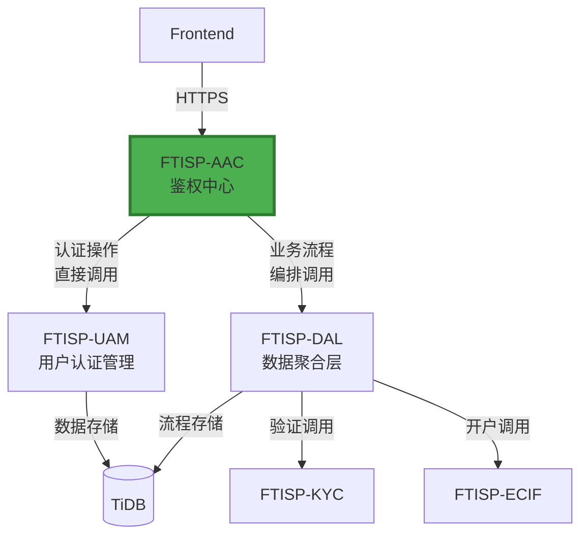
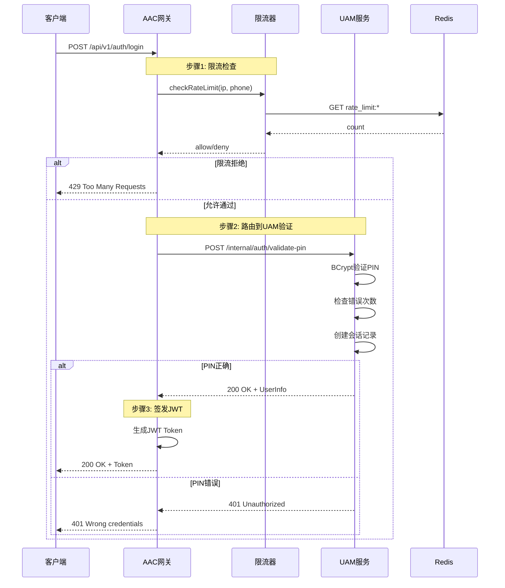
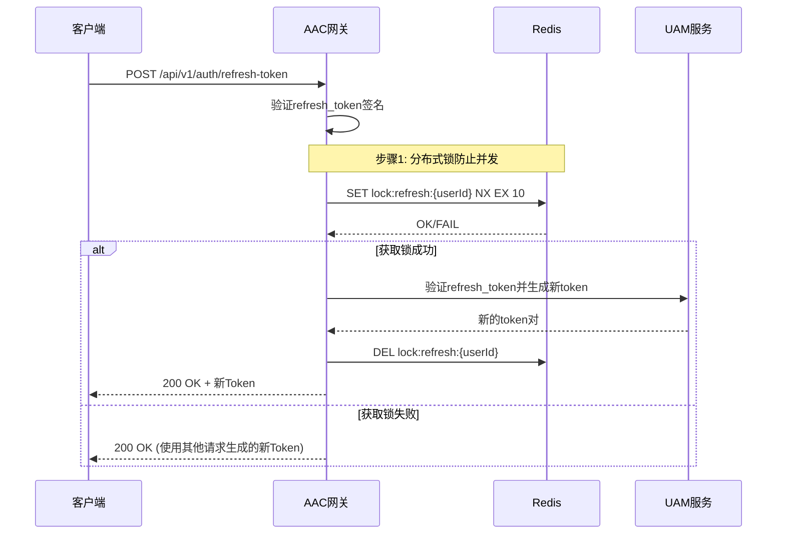
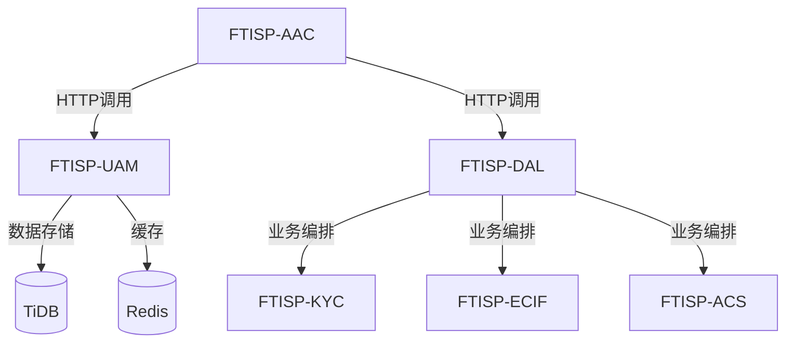
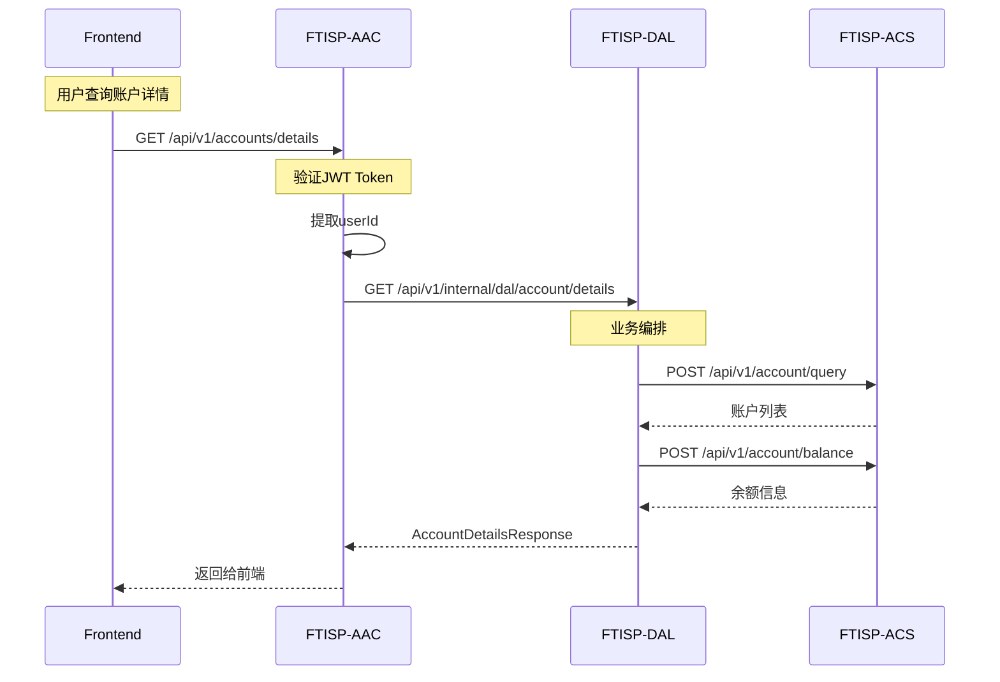
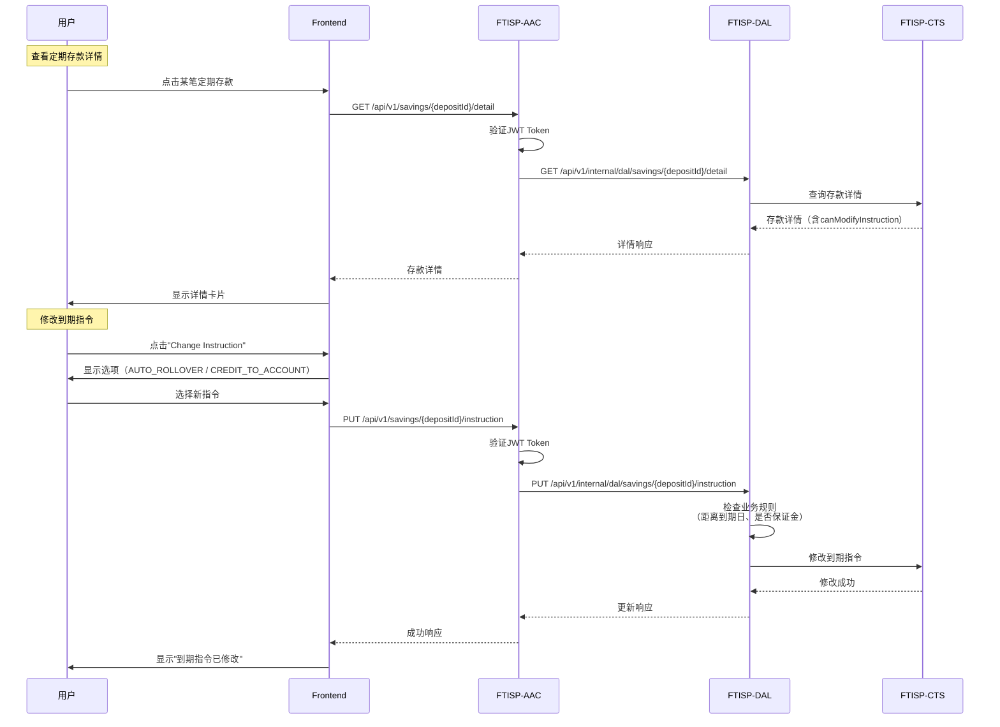
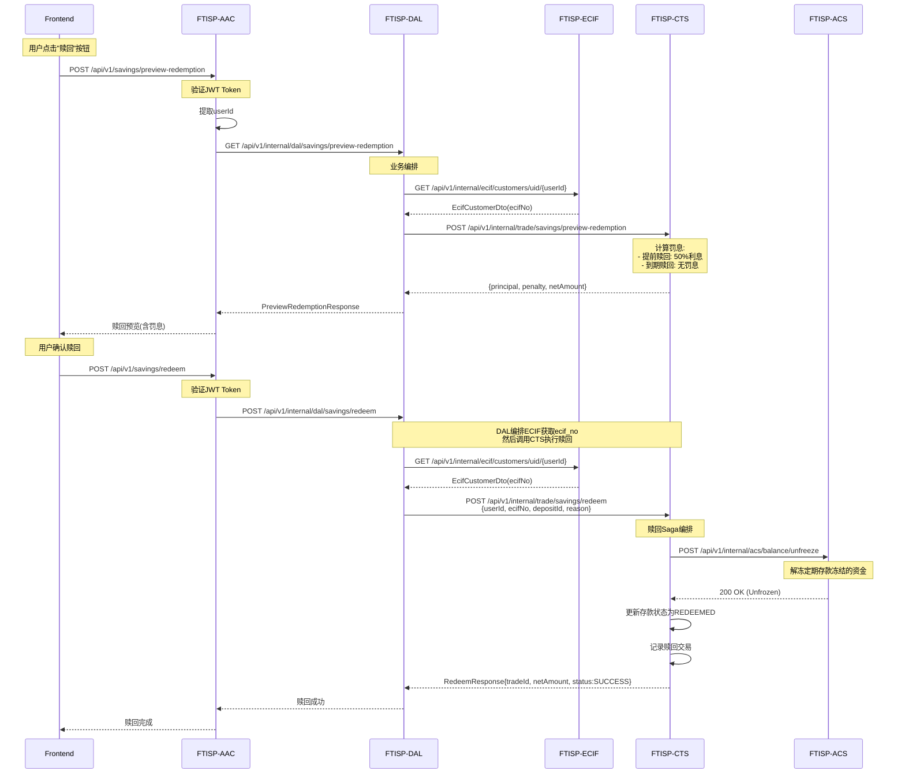

# FTISP-AAC 系统设计文档 (V3 - Java/TiDB 专用版)

> **子系统编号**: FTISP-AAC
> **子系统名称**: Access Authorization Center (鉴权中心)
> **版本**: V1.0
> **设计日期**: 2026-02-11

---

## 0. AI 编码元指令 (System Prompts)

- **角色**: 资深 Java 后端架构师
- **语言标准**: Java 21 (使用 `record`, `var`, `switch expression`, Virtual Threads)
- **构建工具**: Gradle 8.14.4 (Kotlin DSL `build.gradle.kts`)
- **框架规范**: Spring Boot 3.3.8
  - 使用 Spring WebMVC
  - 使用 Jakarta EE 注解 (非 Javax)
  - **API 文档**: 使用 Swagger (SpringDoc) 注解
  - **对象映射**: 使用 MapStruct 处理 Entity <-> DTO 转换
- **数据库规范**:
  - 目标数据库: **TiDB** (兼容 MySQL 5.7+ 协议)
  - **禁止使用物理外键** (使用逻辑外键)
  - 主键策略: 优先使用 `AUTO_RANDOM` 或 `Snowflake ID`，避免单调递增导致的写热点
- **代码风格**: Google Java Style

---

## 1. 概述

### 1.1 目的

FTISP-AAC (Access Authorization Center) 是系统的统一鉴权入口，负责所有外部请求的路由分发、认证验证、权限控制，**不存储任何业务数据**。

### 1.2 范围

| 包含 (In Scope) | 不包含 (Out of Scope) |
|-----------------|-----------------------|
| 统一API路由网关 | 用户数据存储 (由UAM负责) |
| JWT Token签发与验证 | 业务逻辑处理 (由各业务系统负责) |
| 请求认证与授权 | 持久化会话存储 (由UAM负责) |
| 接口版本管理 | OTP生成 (由UAM负责) |
| 统一错误处理与响应格式 | SMS发送 (由MSG负责) |
| 请求日志与审计追踪 | KYC验证流程 (由KYC负责) |

### 1.3 架构定位



**AAC设计原则**:
- **无状态**: 不存储任何用户数据或会话状态
- **快速路由**: 仅做认证验证和路由转发
- **安全边界**: 所有外部请求必须经过AAC

---

## 2. 功能需求

### 2.1 用户故事

| ID | 故事描述 | 优先级 |
|----|----------|--------|
| AAC-US-001 | 作为前端应用，我需要通过统一的入口访问所有后端API | P0 |
| AAC-US-002 | 作为用户，我需要使用手机号+PIN登录系统 | P0 |
| AAC-US-003 | 作为用户，我需要使用手机号+OTP登录系统 | P0 |
| AAC-US-004 | 作为用户，我需要使用生物识别(Face ID)快速登录 | P1 |
| AAC-US-005 | 作为系统，我需要对所有API请求进行JWT认证验证 | P0 |
| AAC-US-006 | 作为系统，我需要在Token过期时支持刷新Token | P0 |
| AAC-US-007 | 作为用户，我需要查看和管理所有活跃会话 | P1 |
| AAC-US-008 | 作为系统，我需要记录所有认证请求的审计日志 | P0 |

---

## 3. API 接口定义 (Spring MVC)

### 3.1 接口清单

| 方法 | 路径 | 描述 | 鉴权 |
|------|------|------|------|
| POST | `/api/v1/auth/send-otp` | 发送OTP验证码 | None |
| POST | `/api/v1/auth/verify-otp` | 验证OTP并创建会话 | None |
| POST | `/api/v1/auth/login` | 手机号+PIN登录 | None |
| POST | `/api/v1/auth/refresh-token` | 刷新访问令牌 | None |
| POST | `/api/v1/auth/logout` | 用户登出 | Bearer |
| GET | `/api/v1/auth/sessions` | 获取活跃会话列表 | Bearer |
| DELETE | `/api/v1/auth/sessions/{sessionId}` | 注销指定会话 | Bearer |
| GET | `/api/v1/auth/me` | 获取当前用户信息 | Bearer |
| POST | `/api/v1/auth/send-reset-otp` | 发送重置验证码 | None |
| POST | `/api/v1/auth/verify-reset-otp` | 验证重置验证码 | None |
| POST | `/api/v1/auth/reset-pin` | 重置 PIN | None |
| POST | `/api/v1/auth/set-pin` | 设置PIN | Bearer |
| POST | `/api/v1/auth/verify-pin` | 验证PIN | Bearer |
| | | | |
| POST | `/api/v1/kyc/upload-documents` | OCR识别身份证 | Bearer |
| POST | `/api/v1/registration/kyc/submit-profile` | 提交KYC资料 | Bearer |
| POST | `/api/v1/kyc/biometric-verify` | 生物识别验证 | Bearer |
| POST | `/api/v1/kyc/submit` | 提交KYC申请 | Bearer |
| GET | `/api/v1/kyc/application-status` | 查询KYC审核状态 | Bearer |

### 3.3 忘记PIN流程 (Forgot PIN Flow)

### 3.2 接口详情

#### 3.2.0 发送OTP接口
**接口**: `POST /api/v1/auth/send-otp`

> **说明**: 用于注册、登录验证、以及PIN重置验证码

**Request (Java Record)**:
```java
@Schema(description = "发送OTP请求")
public record SendOtpRequest(
    @Schema(description = "手机号 (+255格式)", example = "+255712345678")
    @NotBlank
    @Pattern(regexp = "^(\\+255)?[67]\\d{8}$")
    String phone,

    @Schema(description = "OTP类型", example = "REGISTER")
    @NotNull
    OtpType type
)
```

**Request (Java Record)**:
```java
@Schema(description = "发送OTP请求")
public record SendOtpRequest(
    @Schema(description = "手机号 (+255格式)", example = "+255712345678")
    @NotBlank
    @Pattern(regexp = "^(\\+255)?[67]\\d{8}$")
    String phone,

    @Schema(description = "OTP类型", example = "REGISTER")
    @NotBlank
    OtpType type,

    @Schema(description = "是否同意平台协议", example = "true")
    @NotNull
    Boolean agreedToTerms
) {}

public enum OtpType {
    REGISTER,   // 注册
    LOGIN,      // 登录
    RESET_PIN   // 重置PIN
}
```

**Response**:
```java
@Schema(description = "发送OTP响应")
public record SendOtpResponse(
    @Schema(description = "提示消息")
    String message,

    @Schema(description = "OTP有效期(秒)", example = "60")
    Long expiresInSeconds,

    @Schema(description = "可重发倒计时(秒)", example = "60")
    Long canResendInSeconds
) {}
```

**错误响应**:
```java
// 400 - 参数错误
{
    "code": "INVALID_PHONE",
    "message": "请输入有效的手机号",
    "requestId": "req_123"
}

// 429 - 发送限制
{
    "code": "OTP_LIMIT_EXCEEDED",
    "message": "今日验证码发送次数已达上限",
    "requestId": "req_123"
}
```

#### 3.2.0a 发送重置OTP接口

> **说明**: "忘记PIN"流程中发送重置验证码

**接口**: `POST /api/v1/auth/send-reset-otp`

> **实现说明**: 此接口复用 `POST /api/v1/auth/send-otp`，传入 `OtpType.RESET_PIN`

**Request (Java Record)**:
```java
@Schema(description = "发送重置OTP请求")
public record SendResetOtpRequest(
    @Schema(description = "手机号 (+255格式)", example = "+255712345678")
    @NotBlank
    @Pattern(regexp = "^(\\+255)?[67]\\d{8}$")
    String phone
) {}
```

**内部调用**:
```java
// AAC内部处理逻辑
@PostMapping("/send-reset-otp")
public ResponseEntity<SendOtpResponse> sendResetOtp(@RequestBody SendResetOtpRequest request) {
    // 调用通用发送OTP接口，type=RESET_PIN
    return sendOtp(new SendOtpRequest(request.phone(), OtpType.RESET_PIN, null));
}
```

**Response**: 与 `POST /api/v1/auth/send-otp` 相同

**业务规则**:
- 同一手机号每日最多发送 3 次重置OTP
- 重置OTP有效期为 10 分钟
- 发送前需要验证用户存在

---

#### 3.2.2 验证OTP接口

**Request (Java Record)**:
```java
@Schema(description = "验证OTP请求")
public record VerifyOtpRequest(
    @Schema(description = "手机号")
    @NotBlank
    String phone,

    @Schema(description = "4位验证码", example = "1234")
    @NotBlank
    @Pattern(regexp = "^\\d{4}$")
    String otp,

    @Schema(description = "OTP类型")
    @NotNull
    OtpType type
) {}
```

---

#### 3.2.1a 验证重置OTP接口

> **说明**: 用户输入重置验证码后进行验证

**接口**: `POST /api/v1/auth/verify-reset-otp`

**Request Headers**:
```yaml
Content-Type: application/json
X-Request-ID: Unique request identifier
```

**Request (Java Record)**:
```java
@Schema(description = "验证重置OTP请求")
public record VerifyResetOtpRequest(
    @Schema(description = "手机号 (+255格式)", example = "+255712345678")
    @NotBlank
    @Pattern(regexp = "^(\\+255)?[67]\\d{8}$")
    String phone,

    @Schema(description = "重置验证码 (6位)", example = "123456")
    @NotBlank
    @Size(min = 6, max = 6)
    String resetOtp
) {}
```

**Response**:
```java
@Schema(description = "验证重置OTP响应")
public record VerifyResetOtpResponse(
    @Schema(description = "是否验证通过")
    Boolean verified,

    @Schema(description = "提示消息")
    String message
) {}
```

**错误响应**:
```java
// 400 - 验证码错误或已过期
{
    "code": "RESET_OTP_INVALID",
    "message": "验证码错误或已过期",
    "requestId": "req_123"
}
```

---

#### 3.2.1b 生物识别登录接口

> **说明**: 可选功能，用户已启用生物识别时，直接通过生物识别验证并重置PIN

**接口**: `POST /api/v1/auth/biometric-login`

**Request Headers**:
```yaml
Content-Type: application/json
Authorization: Bearer {access_token}
X-Biometric-Type: FACE_ID
```

**Request (Java Record)**:
```java
@Schema(description = "生物识别登录请求")
public record BiometricLoginRequest(
    @Schema(description = "手机号 (+255格式)")
    String phone,

    @Schema(description = "生物识别数据")
    String biometricData,

    @Schema(description = "设备唯一标识")
    String deviceId
) {}
```

**Response**:
```java
@Schema(description = "生物识别登录响应")
public record BiometricLoginResponse(
    @Schema(description = "JWT访问令牌")
    String accessToken,

    @Schema(description = "生物识别结果")
    Boolean biometricVerified
) {}
```

**错误响应**:
```java
// 400 - 生物识别未配置或失败
{
    "code": "BIOMETRIC_NOT_CONFIGURED",
    "message": "生物识别功能未启用或验证失败",
    "requestId": "req_123"
}
```

---

#### 3.2.1c 重置PIN接口

> **说明**: 验证通过后设置新PIN

**接口**: `POST /api/v1/auth/reset-pin`

**Request Headers**:
```yaml
Content-Type: application/json
Authorization: Bearer {access_token}
X-Request-ID: Unique request identifier
```

**Request (Java Record)**:
```java
@Schema(description = "重置PIN请求")
public record ResetPinRequest(
    @Schema(description = "手机号 (+255格式)", example = "+255712345678")
    @NotBlank
    @Pattern(regexp = "^(\\+255)?[67]\\d{8}$")
    String phone,

    @Schema(description = "6位新PIN码", example = "123456")
    @NotBlank
    @Size(min = 6, max = 6)
    String newPin,

    @Schema(description = "确认新PIN码", example = "123456")
    @NotBlank
    @Size(min = 6, max = 6)
    String confirmNewPin
) {}
```

**Response**:
```java
@Schema(description = "重置PIN响应")
public record ResetPinResponse(
    @Schema(description = "提示消息")
    String message
) {}
```

**说明**:
- 支持两种重置场景：
  1. **正常场景**: 用户已登录，主动修改PIN → 调用此接口
  2. **忘记PIN场景**: 用户未登录，通过"忘记PIN"流程重置 → 调用此接口

**错误响应**:
```java
// 400 - 新PIN格式错误
{
    "code": "INVALID_NEW_PIN",
    "message": "PIN必须为6位数字",
    "requestId": "req_123"
}

// 400 - 两次PIN不一致
{
    "code": "PIN_MISMATCH",
    "message": "两次输入的PIN不一致",
    "requestId": "req_123"
}

// 403 - 账户锁定
{
    "code": "ACCOUNT_LOCKED",
    "message": "账户已锁定，请明日再试或使用重置功能",
    "requestId": "req_123"
}
```

---

#### 3.2.2 业务规则

| 规则ID | 规则描述 |
|----------|----------|
| **BR-AAC-FP-001** | 手机号格式必须符合 `^(\+255)?[67]\d{8}$` |
| **BR-AAC-FP-002** | 重置OTP有效期10分钟 | 验证码超时需重新获取 |
| **BR-AAC-FP-003** | 生物识别成功则跳过新PIN输入 | 直接使用生物识别验证 |
| **BR-AAC-FP-004** | 重置PIN需清除账户锁定 | 成功重置后自动解锁 |
| **BR-AAC-FP-005** | 单日重置次数限制3次 | 防止滥用重置功能 |

---

#### 3.2.3 PIN登录接口

**接口**: `POST /api/v1/auth/login`

> **说明**: 用户使用6位PIN码登录系统

**Request (Java Record)**:
```java
@Schema(description = "PIN登录请求")
public record PinLoginRequest(
    @Schema(description = "手机号 (+255格式)")
    String phone,

    @Schema(description = "6位PIN码", example = "123456")
    @NotBlank
    @Size(min = 6, max = 6)
    String pin,

    @Schema(description = "设备唯一标识")
    String deviceId
) {}
```
    @Schema(description = "提示消息")
    String message
) {}

public record UserInfo(
    Long userId,
    String phone,
    UserType userType,
    KycStatus kycStatus
) {}

public enum UserType {
    NEW, STARTER, TYPE_A, TYPE_B, TYPE_C
}

public enum KycStatus {
    PENDING, APPROVED, REJECTED
}
```

#### 3.2.3 PIN登录接口

**Request (Java Record)**:
```java
@Schema(description = "PIN登录请求")
public record PinLoginRequest(
    @Schema(description = "手机号")
    @NotBlank
    String identifier,

    @Schema(description = "6位PIN码", example = "123456")
    @NotBlank
    @Size(min = 6, max = 6)
    String pin,

    @Schema(description = "设备唯一标识")
    String deviceId,

    @Schema(description = "设备类型")
    DeviceType deviceType
) {}

public enum DeviceType {
    ANDROID, IOS, WEB
}
```

**Response**:
```java
@Schema(description = "PIN登录响应")
public record LoginResponse(
    String accessToken,
    String refreshToken,
    Long expiresIn,
    UserInfo user,
    String message
) {}
```

**错误响应**:
```java
// 401 - PIN错误
{
    "code": "WRONG_CREDENTIALS",
    "message": "手机号或PIN错误",
    "details": {
        "remainingAttempts": 2
    },
    "requestId": "req_123"
}

// 423 - 账户锁定
{
    "code": "ACCOUNT_LOCKED",
    "message": "PIN错误次数过多，请明日再试或重置PIN",
    "requestId": "req_123"
}
```

#### 3.2.4 刷新Token接口

**Request (Java Record)**:
```java
@Schema(description = "刷新Token请求")
public record RefreshTokenRequest(
    @Schema(description = "刷新令牌")
    @NotBlank
    String refreshToken
) {}
```

**Response**:
```java
@Schema(description = "刷新Token响应")
public record RefreshTokenResponse(
    String accessToken,
    String refreshToken,
    Long expiresIn,
    String message
) {}
```

**刷新策略**:
- refresh_token 有效期为30天
- 每次刷新后生成新的 refresh_token（轮转机制）
- 同一用户多设备刷新时，后者覆盖前者（乐观锁）
- 刷新成功后旧 refresh_token 立即失效

#### 3.2.5 获取用户信息接口

**接口**: `GET /api/v1/auth/me`

**Response**:
```java
@Schema(description = "用户信息响应")
public record UserMeResponse(
    Long userId,
    String phone,
    String nidaNumber,
    UserType userType,
    KycStatus kycStatus,
    String platformEcifId,
    String allocatedCountryCode,
    String allocatedBankCode,
    Profile profile
) {}

public record Profile(
    String fullName,
    LocalDate dateOfBirth,
    String address
) {}
```

---

#### 3.2.6 OCR识别身份证接口

**接口**: `POST /api/v1/kyc/upload-documents`

> **说明**: 前端调用摄像头拍摄身份证正反面后，自动调用此接口进行OCR识别

**路由**: Frontend → AAC → DAL → KYC

**Request (Java Record)**:
```java
@Schema(description = "OCR识别请求")
public record UploadDocumentsRequest(
    @Schema(description = "用户ID", example = "123")
    @NotNull
    String userId,

    @Schema(description = "正面照片Base64", example = "data:image/jpeg;base64,/9j/4AAQ...")
    @NotNull
    @Size(min = 1, max = 5 * 1024 * 1024)  // 最大5MB
    String frontImagePath,

    @Schema(description = "反面照片Base64", example = "data:image/jpeg;base64,/9j/4AAQ...")
    @Size(min = 1, max = 5 * 1024 * 1024)
    String backImagePath
) {}
```

**Response (Java Record)**:
```java
@Schema(description = "OCR识别响应")
public record UploadDocumentsResponse(
    @Schema(description = "是否成功")
    Boolean success,

    @Schema(description = "OCR识别结果")
    OcrResult data,

    @Schema(description = "错误消息")
    String message
) {}

@Schema(description = "OCR识别结果")
public record OcrResult(
    @Schema(description = "姓名", example = "JUMA HAMISI JUMA")
    String fullName,

    @Schema(description = "身份证号", example = "19900101-12345-12345-01")
    String idNumber,

    @Schema(description = "出生日期", example = "1990-01-01")
    String dob,

    @Schema(description = "性别", example = "M")
    String gender,

    @Schema(description = "地址")
    String address
) {}
```

---

#### 3.2.7 提交KYC资料接口

**接口**: `POST /api/v1/registration/kyc/submit-profile`

> **说明**: 用户确认OCR结果并勾选授权协议后点击Continue调用

**路由**: Frontend → AAC → DAL → UAM/KYC

**Request (Java Record)**:
```java
@Schema(description = "提交KYC资料请求")
public record SubmitProfileRequest(
    @Schema(description = "用户ID", example = "123")
    @NotNull
    String userId,

    @Schema(description = "KYC资料数据")
    @NotNull
    ProfileData profileData
) {}

@Schema(description = "KYC资料数据")
public record ProfileData(
    @Schema(description = "姓名", example = "JUMA HAMISI JUMA")
    String fullName,

    @Schema(description = "身份证号", example = "19900101-12345-12345-01")
    String idNumber,

    @Schema(description = "出生日期", example = "1990-01-01")
    String dob,

    @Schema(description = "性别")
    String gender,

    @Schema(description = "地址")
    String address,

    @Schema(description = "身份证正面照片Base64")
    String idCardFrontImage,

    @Schema(description = "身份证反面照片Base64")
    String idCardBackImage,

    @Schema(description = "位置权限已授予")
    Boolean locationPermissionGranted,

    @Schema(description = "征信局授权")
    @NotNull
    Boolean creditBureauConsent,

    @Schema(description = "储蓄账户协议授权")
    @NotNull
    Boolean savingsAgreementConsent
) {}
```

**Response (Java Record)**:
```java
@Schema(description = "提交KYC资料响应")
public record SubmitProfileResponse(
    @Schema(description = "是否成功")
    Boolean success,

    @Schema(description = "消息")
    String message,

    @Schema(description = "NIDA是否验证通过")
    Boolean nidaVerified,

    @Schema(description = "KYC状态")
    String status
) {}
```

---

#### 3.2.8 生物识别验证接口

**接口**: `POST /api/v1/kyc/biometric-verify`

> **说明**: 活体检测和人脸比对（前端模拟）

**路由**: Frontend → AAC → DAL → KYC

**Request (Java Record)**:
```java
@Schema(description = "生物识别验证请求")
public record BiometricVerifyRequest(
    @Schema(description = "用户ID", example = "123")
    @NotNull
    String userId,

    @Schema(description = "自拍照片Base64")
    @NotNull
    String selfieImagePath,

    @Schema(description = "身份证照片Base64（用于人脸比对）")
    String idCardImagePath
) {}
```

**Response (Java Record)**:
```java
@Schema(description = "生物识别验证响应")
public record BiometricVerifyResponse(
    @Schema(description = "是否成功")
    Boolean success,

    @Schema(description = "消息")
    String message,

    @Schema(description = "活体检测通过")
    Boolean data,

    @Schema(description = "活体检测通过")
    Boolean livenessPassed,

    @Schema(description = "人脸匹配通过")
    Boolean faceMatched,

    @Schema(description = "匹配置信度")
    Double matchScore
) {}
```

---

#### 3.2.9 提交KYC申请接口

**接口**: `POST /api/v1/kyc/submit`

> **说明**: 提交KYC申请到风控审核

**路由**: Frontend → AAC → DAL → 风控系统

**Request (Java Record)**:
```java
@Schema(description = "提交KYC申请请求")
public record SubmitKycRequest(
    @Schema(description = "用户ID", example = "123")
    @NotNull
    String userId,

    @Schema(description = "申请数据（可选）")
    Map<String, Object> applicationData
) {}
```

**Response (Java Record)**:
```java
@Schema(description = "提交KYC申请响应")
public record SubmitKycResponse(
    @Schema(description = "是否成功")
    Boolean success,

    @Schema(description = "消息")
    String message,

    @Schema(description = "申请ID")
    String applicationId,

    @Schema(description = "状态", example = "PENDING")
    String status
) {}
```

---

#### 3.2.10 查询KYC审核状态接口

**接口**: `GET /api/v1/kyc/application-status`

> **说明**: 查询KYC申请的审核状态

**路由**: Frontend → AAC → DAL → KYC

**Request Parameters**:
```java
@Schema(description = "查询参数")
public record ApplicationStatusRequest(
    @Schema(description = "用户ID", example = "123")
    @NotNull
    String userId
) {}
```

**Response (Java Record)**:
```java
@Schema(description = "KYC审核状态响应")
public record ApplicationStatusResponse(
    @Schema(description = "状态", example = "PENDING")
    String status,

    @Schema(description = "提交时间")
    Instant submittedAt,

    @Schema(description = "审核时间")
    Instant reviewedAt,

    @Schema(description = "拒绝原因")
    String rejectionReason
) {}
```

---

#### 3.2.11 设置PIN接口

**接口**: `POST /api/v1/auth/set-pin`

> **说明**: 用户设置6位PIN码

**Request (Java Record)**:
```java
@Schema(description = "设置PIN请求")
public record SetPinRequest(
    @Schema(description = "PIN码（6位数字）", example = "123456")
    @NotNull
    @Pattern(regexp = "^\\d{6}$")
    String pin
) {}
```

**Response (Java Record)**:
```java
@Schema(description = "设置PIN响应")
public record SetPinResponse(
    @Schema(description = "是否成功")
    Boolean success,

    @Schema(description = "消息")
    String message
) {}
```

---

#### 3.2.12 验证PIN接口

**接口**: `POST /api/v1/auth/verify-pin`

> **说明**: 验证PIN码（用于交易前验证）

**Request (Java Record)**:
```java
@Schema(description = "验证PIN请求")
public record VerifyPinRequest(
    @Schema(description = "PIN码（6位数字）", example = "123456")
    @NotNull
    @Pattern(regexp = "^\\d{6}$")
    String pin
) {}
```

**Response (Java Record)**:
```java
@Schema(description = "验证PIN响应")
public record VerifyPinResponse(
    @Schema(description = "是否成功")
    Boolean success,

    @Schema(description = "验证令牌，用于后续交易")
    String verificationToken,

    @Schema(description = "消息")
    String message
) {}
```

---

## 4. 数据模型 (TiDB 适配)

### 4.1 数据归属说明

> **重要**: AAC不存储任何业务数据，所有数据存储在对应的业务子系统中。

| 数据类型 | 存储位置 | 说明 |
|----------|----------|------|
| 用户主数据 | FTISP-UAM.t_users | AAC仅调用，不存储 |
| OTP记录 | FTISP-UAM.t_otp_records + Redis | AAC通过UAM操作 |
| 会话数据 | FTISP-UAM.t_user_sessions | AAC通过UAM操作 |
| 登录日志 | FTISP-UAM.t_login_logs | AAC通过UAM操作 |
| 请求审计日志 | AAC本地日志 | 仅用于审计追踪 |

### 4.2 审计日志设计

AAC不持久化存储数据，但需要记录审计日志用于问题追踪：

```java
@Component
@RequiredArgsConstructor
public class AuditLogger {
    private final MeterRegistry meterRegistry;

    public void logAuthRequest(String operation, String phone, String requestId) {
        // 记录到应用日志
        log.info("AUTH_REQUEST | operation={} | phone={} | requestId={}",
            operation, maskPhone(phone), requestId);

        // 记录指标
        Counter.builder("auth.request.count")
            .tag("operation", operation)
            .tag("success", "true")
            .register(meterRegistry)
            .increment();
    }

    public void logAuthFailure(String operation, String errorCode, String requestId) {
        log.warn("AUTH_FAILURE | operation={} | code={} | requestId={}",
            operation, errorCode, requestId);

        Counter.builder("auth.request.count")
            .tag("operation", operation)
            .tag("success", "false")
            .tag("error_code", errorCode)
            .register(meterRegistry)
            .increment();
    }

    private String maskPhone(String phone) {
        if (phone == null || phone.length() < 8) return "***";
        return phone.substring(0, 3) + "****" + phone.substring(phone.length() - 4);
    }
}
```

---

## 5. 存储选型分析

### 5.1 Redis 引入决策

- [x] **需要**: AAC需要使用Redis进行以下操作
    - [x] **请求限流**: IP级别、用户级别的API调用限制
    - [x] **分布式锁**: 刷新Token时的并发控制
    - [x] **验证码缓存**: OTP尝试次数缓存

### 5.2 缓存策略

| Key Pattern | 数据结构 | TTL | 更新策略 |
|-------------|----------|-----|----------|
| `rate_limit:ip:{ip}:{minute}` | String (计数) | 60秒 | 滑动窗口 |
| `rate_limit:user:{phone}:{minute}` | String (计数) | 60秒 | 滑动窗口 |
| `lock:refresh:{userId}` | String (锁标记) | 10秒 | 自动过期 |
| `otp:attempt:{phone}` | String (次数) | 300秒 | 递增 |

```java
@Component
@RequiredArgsConstructor
public class RateLimiterService {
    private final RedisTemplate<String, String> redisTemplate;

    private static final String RATE_LIMIT_IP_KEY = "rate_limit:ip:%s:%s";
    private static final String RATE_LIMIT_USER_KEY = "rate_limit:user:%s:%s";
    private static final int MAX_REQUESTS_PER_MINUTE = 60;
    private static final int MAX_OTP_PER_HOUR = 10;

    public boolean checkIpRateLimit(String ip) {
        String key = String.format(RATE_LIMIT_IP_KEY, ip, getCurrentMinute());
        Long count = redisTemplate.opsForValue().increment(key);

        if (count == 1) {
            redisTemplate.expire(key, Duration.ofMinutes(1));
        }

        return count <= MAX_REQUESTS_PER_MINUTE;
    }

    public boolean checkOtpRateLimit(String phone) {
        String key = "otp:hourly:" + phone + ":" + getCurrentHour();
        Long count = redisTemplate.opsForValue().increment(key);

        if (count == 1) {
            redisTemplate.expire(key, Duration.ofHours(1));
        }

        return count <= MAX_OTP_PER_HOUR;
    }
}
```

---

## 6. 业务流程

### 6.1 认证流程



### 6.2 Token刷新流程



---

## 7. 子系统间交互

### 7.1 依赖关系图



### 7.2 AAC → 调用其他子系统 (HTTP 同步)

| 本地方法 | 目标子系统 | 目标接口 | 调用时机 | 说明 |
|----------|------------|----------|----------|------|
| `sendOtp()` | UAM | `POST /api/v1/internal/uam/send-otp` | 用户请求发送OTP | 委托UAM生成和发送 |
| `verifyOtp()` | UAM | `POST /api/v1/internal/uam/verify-otp` | 用户提交OTP | 委托UAM验证并创建会话 |
| `validatePin()` | UAM | `POST /api/v1/internal/uam/validate-pin` | PIN登录 | 委托UAM验证PIN |
| `refreshToken()` | UAM | `POST /api/v1/internal/uam/refresh-token` | Token刷新 | 委托UAM生成新token |
| `createSession()` | UAM | `POST /api/v1/internal/uam/sessions` | 认证成功后 | 创建会话记录 |
| `getUserInfo()` | UAM | `GET /api/v1/internal/uam/users/{id}` | 获取用户信息 | 获取完整用户资料 |

**HTTP 客户端配置**:
```java
@Configuration
public class UamClientConfig {

    @Bean
    @LoadBalanced
    public WebClient uamWebClient() {
        return WebClient.builder()
            .codecs(configurer -> configurer
                .defaultCodecs()
                .maxInMemorySize(2 * 1024 * 1024))
            .clientConnector(new ReactorClientHttpConnector(
                HttpClient.create()
                    .option(ChannelOption.CONNECT_TIMEOUT_MILLIS, 5000)
                    .responseTimeout(Duration.ofSeconds(10))
            ))
            .build();
    }
}
```

### 7.3 其他子系统 → 调用 AAC (对外暴露)

AAC作为统一入口，所有需要认证的API都需要经过AAC：

| 接口 | 调用方 | 说明 |
|------|--------|------|
| `GET /api/v1/transactions` | 前端 | 查询交易列表 |
| `POST /api/v1/loans/apply` | 前端 | 申请贷款 |
| `GET /api/v1/accounts` | 前端 | 查询账户信息 |
| `GET /api/v1/accounts/details` | 前端 | **查询账户详情** |
| `GET /api/v1/savings/plans` | 前端 | 查询定期存款列表 |
| `POST /api/v1/savings/plans` | 前端 | 创建定期存款 |
| `POST /api/v1/savings/preview-redemption` | 前端 | **赎回预览(算费)** |
| `POST /api/v1/savings/redeem` | 前端 | **执行赎回** |

#### 7.3.1 账户查询路由配置



**路由规则**:
```java
// AAC路由配置
@Configuration
public class RouteConfig {

    @Bean
    public RouterFunction<ServerResponse> savingsRoutes() {
        return RouterFunctions.route()
            // 账户相关
            .GET("/api/v1/accounts/details", this::getAccountDetails)
            // 定期存款相关
            .GET("/api/v1/savings/plans", this::getSavingsPlans)
            .POST("/api/v1/savings/plans", this::createSavingsPlan)
            .POST("/api/v1/savings/preview-redemption", this::previewRedemption)
            .POST("/api/v1/savings/redeem", this::redeemSavingsPlan)
            .POST("/api/v1/savings/security-deposit", this::createSecurityDeposit)
            // 交易历史相关
            .GET("/api/v1/transactions", this::getTransactions)
            .GET("/api/v1/transactions/{transactionId}", this::getTransactionDetail)
            .GET("/api/v1/transactions/download", this::downloadTransactions)
            .build();
    }

    private ServerResponse getAccountDetails(ServerRequest request) {
        // 1. 验证JWT
        String token = extractToken(request);
        Long userId = jwtService.validateToken(token);

        // 2. 调用DAL获取账户详情
        AccountDetails response = dalClient.getAccountDetails(userId);

        return ServerResponse.ok().body(response);
    }

    private ServerResponse getSavingsPlans(ServerRequest request) {
        String token = extractToken(request);
        Long userId = jwtService.validateToken(token);
        SavingsPlansResponse response = dalClient.getSavingsPlans(userId);
        return ServerResponse.ok().body(response);
    }

    /**
     * 查询交易历史 (SV-08)
     */
    private ServerResponse getTransactions(ServerRequest request) {
        // 1. 验证JWT
        String token = extractToken(request);
        Long userId = jwtService.validateToken(token);

        // 2. 提取查询参数
        int page = Integer.parseInt(request.queryParam("page").orElse("0"));
        int size = Integer.parseInt(request.queryParam("size").orElse("20"));
        String category = request.queryParam("category").orElse("ALL");
        String startDate = request.queryParam("startDate").orElse(null);
        String endDate = request.queryParam("endDate").orElse(null);

        // 3. 调用DAL查询交易历史
        TransactionHistoryResponse response = dalClient.getTransactions(userId, page, size, category, startDate, endDate);

        return ServerResponse.ok().body(response);
    }

    /**
     * 查询交易详情 (SV-08)
     */
    private ServerResponse getTransactionDetail(ServerRequest request) {
        // 1. 验证JWT
        String token = extractToken(request);
        Long userId = jwtService.validateToken(token);

        // 2. 提取交易ID
        String transactionId = request.pathVariable("transactionId");

        // 3. 调用DAL查询交易详情
        TransactionDetailResponse response = dalClient.getTransactionDetail(transactionId, userId);

        return ServerResponse.ok().body(response);
    }

    /**
     * 下载交易历史 (SV-08)
     */
    private ServerResponse downloadTransactions(ServerRequest request) {
        // 1. 验证JWT
        String token = extractToken(request);
        Long userId = jwtService.validateToken(token);

        // 2. 提取查询参数
        String format = request.queryParam("format").orElse("PDF");
        String category = request.queryParam("category").orElse(null);
        String startDate = request.queryParam("startDate").orElse(null);
        String endDate = request.queryParam("endDate").orElse(null);

        // 3. 调用DAL下载交易历史
        byte[] fileData = dalClient.downloadTransactions(userId, format, category, startDate, endDate);

        // 4. 设置响应头
        return ServerResponse.ok()
            .header("Content-Type", "PDF".equals(format) ? "application/pdf" : "text/csv")
            .header("Content-Disposition", "attachment; filename=\"transactions_" + userId + "_" + LocalDate.now() + "." + format.toLowerCase() + "\"")
            .body(fileData);
    }

    private ServerResponse createSavingsPlan(ServerRequest request) {
        String token = extractToken(request);
        Long userId = jwtService.validateToken(token);
        CreateSavingsPlanRequest planRequest = extractBody(request, CreateSavingsPlanRequest.class);
        CreateSavingsResponse response = dalClient.createSavingsPlan(userId, planRequest);
        return ServerResponse.ok().body(response);
    }

    private ServerResponse previewRedemption(ServerRequest request) {
        // 1. 验证JWT
        String token = extractToken(request);
        Long userId = jwtService.validateToken(token);

        // 2. 提取请求体
        PreviewRedemptionRequest previewRequest = extractBody(request, PreviewRedemptionRequest.class);

        // 3. 调用DAL预览赎回(含罚息计算)
        PreviewRedemptionResponse response = dalClient.previewRedemption(userId, previewRequest);

        return ServerResponse.ok().body(response);
    }

    private ServerResponse redeemSavingsPlan(ServerRequest request) {
        // 1. 验证JWT
        String token = extractToken(request);
        Long userId = jwtService.validateToken(token);

        // 2. 提取请求体
        RedeemSavingsRequest redeemRequest = extractBody(request, RedeemSavingsRequest.class);

        // 3. 调用DAL执行赎回
        RedeemResponse response = dalClient.redeemSavings(userId, redeemRequest);

        return ServerResponse.ok().body(response);
    }

    /**
     * 查看定期存款详情 (SV-10)
     */
    private ServerResponse getSavingsPlanDetail(ServerRequest request) {
        // 1. 验证JWT
        String token = extractToken(request);
        Long userId = jwtService.validateToken(token);

        // 2. 提取存款ID
        String depositId = request.pathVariable("depositId");

        // 3. 调用DAL查询存款详情
        SavingsPlanDetailResponse response = dalClient.getSavingsPlanDetail(depositId, userId.toString());

        return ServerResponse.ok().body(response);
    }

    /**
     * 修改到期指令 (SV-10)
     */
    private ServerResponse updateMaturityInstruction(ServerRequest request) {
        // 1. 验证JWT
        String token = extractToken(request);
        Long userId = jwtService.validateToken(token);

        // 2. 提取存款ID和请求体
        String depositId = request.pathVariable("depositId");
        UpdateInstructionRequest instructionRequest = extractBody(request, UpdateInstructionRequest.class);

        // 3. 补充用户ID
        Map<String, Object> requestMap = Map.of(
            "userId", userId.toString(),
            "instruction", instructionRequest.instruction()
        );

        // 4. 调用DAL修改到期指令
        UpdateInstructionResponse response = dalClient.updateMaturityInstruction(depositId, requestMap);

        return ServerResponse.ok().body(response);
    }
}
```

#### 7.3.3 活跃定期存款管理路由配置



**业务规则**:
- BR-SV-037: 距离开到期日>1天可修改
- BR-SV-038: 到期日当天及提前1天不可修改
- BR-SV-039: Security Deposit 不可修改

**记录定义**:
```java
/**
 * 修改到期指令请求
 */
public record UpdateInstructionRequest(
    @Schema(description = "到期指令") @NotBlank String instruction
) {}

/**
 * 定期存款详情响应
 */
public record SavingsPlanDetailResponse(
    String id,
    String planName,
    Long amount,
    Double interestRate,
    Integer durationMonths,
    String maturityDate,
    Integer daysToMaturity,
    String maturityInstruction,
    Boolean canModifyInstruction,
    Long accruedEarnings,
    Long taxWithheld,
    Long maturityAmount,
    String status,
    Boolean isSecurityDeposit,
    String createdAt
) {}

/**
 * 修改到期指令响应
 */
public record UpdateInstructionResponse(
    Boolean success,
    String message,
    String previousInstruction,
    String newInstruction
) {}
```

#### 7.3.4 定期存款赎回路由配置



### 7.4 通信依赖配置

**依赖服务地址 (环境变量)**:
| 变量名 | 示例值 | 说明 |
|--------|--------|------|
| `UAM_SERVICE_URL` | `http://ftisp-uam:8080` | UAM服务地址 |
| `DAL_SERVICE_URL` | `http://ftisp-dal:8080` | DAL服务地址 |
| `REDIS_HOST` | `redis:6379` | Redis地址 |

**Gradle 依赖**:
```kotlin
dependencies {
    // Spring Boot Web
    implementation("org.springframework.boot:spring-boot-starter-web")

    // Spring Boot Validation
    implementation("org.springframework.boot:spring-boot-starter-validation")

    // Spring Boot Redis
    implementation("org.springframework.boot:spring-boot-starter-data-redis")

    // Spring Boot Actuator (健康检查)
    implementation("org.springframework.boot:spring-boot-starter-actuator")

    // API 文档
    implementation("org.springdoc:springdoc-openapi-starter-webmvc-ui:2.3.0")

    // WebFlux (HTTP客户端)
    implementation("org.springframework.boot:spring-boot-starter-webflux")

    // JWT
    implementation("io.jsonwebtoken:jjwt-api:0.12.3")
    runtimeOnly("io.jsonwebtoken:jjwt-impl:0.12.3")
    runtimeOnly("org.bouncycastle:bcprov-jdk18on:1.76")

    // 工具库
    compileOnly("org.projectlombok:lombok")
    annotationProcessor("org.projectlombok:lombok")

    // 监控
    implementation("io.micrometer:micrometer-registry-prometheus")
}
```

---

## 8. 技术选型 (已锁定)

### 8.1 核心栈

| 组件 | 版本/选型 | 备注 |
|------|-----------|------|
| JDK | **OpenJDK 21** | LTS, 使用 Virtual Threads |
| Framework | **Spring Boot 3.3.8** | 核心框架 |
| Build | **Gradle 8.14.4** | Kotlin DSL |
| 缓存 | **Redis 7.x** | 限流和分布式锁 |
| 无DB | - | AAC不直接使用数据库 |

### 8.2 项目结构 (Gradle Standard)

```text
ftisp-aac/
├── build.gradle.kts
├── settings.gradle.kts
└── src/
    └── main/
        ├── java/
        │   └── com/
        │       └── ftisp/
        │           └── aac/
        │               ├── AacApplication.java
        │               ├── config/
        │               │   ├── JwtConfig.java
        │               │   ├── RedisConfig.java
        │               │   └── WebClientConfig.java
        │               ├── controller/
        │               │   ├── AuthController.java
        │               │   └── SessionController.java
        │               ├── service/
        │               │   ├── AuthService.java
        │               │   ├── JwtService.java
        │               │   └── RateLimiterService.java
        │               ├── client/
        │               │   ├── UamClient.java
        │               │   └── DalClient.java
        │               ├── model/
        │               │   ├── dto/
        │               │   │   ├── request/
        │               │   │   └── response/
        │               │   └── enums/
        │               ├── filter/
        │               │   ├── JwtAuthenticationFilter.java
        │               │   └── RateLimitFilter.java
        │               └── exception/
        │                   ├── GlobalExceptionHandler.java
        │                   └── AuthException.java
        └── resources/
            ├── application.yml
            ├── logback-spring.xml
            └── META-INF/
                └── application.yaml
```

---

## 9. 配置与环境

### 9.1 `application.yml` 关键配置

```yaml
spring:
  application:
    name: ftisp-aac

  # Redis配置
  data:
    redis:
      host: ${REDIS_HOST:localhost}
      port: ${REDIS_PORT:6379}
      password: ${REDIS_PASSWORD:}
      lettuce:
        pool:
          max-active: 20
          max-idle: 10
          min-idle: 5

# JWT配置
jwt:
  secret: ${JWT_SECRET:default-secret-key-change-in-production}
  access-token-expiration: 3600000      # 1小时 (毫秒)
  refresh-token-expiration: 2592000000   # 30天 (毫秒)
  issuer: ftisp-aac

# 服务配置
server:
  port: ${SERVER_PORT:8080}
  shutdown: graceful

# 限流配置
rate-limit:
  ip-max-per-minute: 60
  user-max-per-hour: 100
  otp-max-per-day: 10

# 子系统地址
services:
  uam:
    base-url: ${UAM_SERVICE_URL:http://ftisp-uam:8080}
    timeout: 10000  # 10秒
  dal:
    base-url: ${DAL_SERVICE_URL:http://ftisp-dal:8080}
    timeout: 30000  # 30秒

# 监控配置
management:
  endpoints:
    web:
      exposure:
        include: health,info,metrics,prometheus
  metrics:
    export:
      prometheus:
        enabled: true
```

---

## 10. 安全与权限

### 10.1 JWT Token 设计

**认证方式**: JWT (JSON Web Token)

| 配置项 | 值 | 说明 |
|--------|-----|------|
| Token Header | `Authorization: Bearer {token}` | 请求头格式 |
| Token 算法 | RS256 | 非对称加密 |
| Access Token 有效期 | 1 小时 | API访问令牌 |
| Refresh Token 有效期 | 30 天 | 刷新令牌 |

**JWT Service 实现**:
```java
@Service
@RequiredArgsConstructor
public class JwtService {

    private final JwtProperties jwtProperties;
    private final RSAKeyProperties rsaKeyProperties;

    public String generateAccessToken(UserInfo userInfo) {
        RSAKey publicKey = rsaKeyProperties.publicKey();

        return Jwts.builder()
            .subject(userInfo.userId().toString())
            .claim("phone", userInfo.phone())
            .claim("userType", userInfo.userType().name())
            .claim("kycStatus", userInfo.kycStatus().name())
            .issuedAt(Instant.now())
            .expiration(Date.from(Instant.now().plus(
                Duration.ofMillis(jwtProperties.getAccessTokenExpiration()))))
            .signWith(publicKey, Jwts.SIG.RS256)
            .compact();
    }

    public String generateRefreshToken(UserInfo userInfo) {
        RSAKey publicKey = rsaKeyProperties.publicKey();

        return Jwts.builder()
            .subject(userInfo.userId().toString())
            .claim("type", "refresh")
            .issuedAt(Instant.now())
            .expiration(Date.from(Instant.now().plus(
                Duration.ofMillis(jwtProperties.getRefreshTokenExpiration()))))
            .signWith(publicKey, Jwts.SIG.RS256)
            .compact();
    }

    public Claims validateToken(String token) {
        RSAKey privateKey = rsaKeyProperties.privateKey();

        return Jwts.parser()
            .verifyWith(privateKey, Jwts.SIG.RS256)
            .build()
            .parseSignedClaims(token)
            .getPayload();
    }

    public Long getUserIdFromToken(String token) {
        Claims claims = validateToken(token);
        return Long.parseLong(claims.getSubject());
    }
}
```

### 10.2 认证过滤器

```java
@Component
@RequiredArgsConstructor
public class JwtAuthenticationFilter extends OncePerRequestFilter {

    private final JwtService jwtService;
    private final UamClient uamClient;

    @Override
    protected void doFilterInternal(HttpServletRequest request,
                                HttpServletResponse response,
                                FilterChain filterChain) {
        // 跳过公开接口
        if (isPublicEndpoint(request.getRequestURI())) {
            filterChain.doFilter(request, response);
            return;
        }

        // 提取Token
        String token = extractToken(request);

        if (token == null) {
            sendUnauthorized(response, "Missing authorization token");
            return;
        }

        try {
            // 验证Token
            Claims claims = jwtService.validateToken(token);
            Long userId = jwtService.getUserIdFromToken(token);

            // 验证会话是否有效
            UserSession session = uamClient.getSession(token)
                .block(Duration.ofSeconds(3));

            if (session == null || !session.status().equals("ACTIVE")) {
                sendUnauthorized(response, "Invalid or expired session");
                return;
            }

            // 将用户信息存入请求上下文
            SecurityContextHolder.getContext().setAuthentication(
                new JwtAuthentication(userId, claims));

            filterChain.doFilter(request, response);

        } catch (JwtException e) {
            sendUnauthorized(response, "Invalid token: " + e.getMessage());
        }
    }

    private String extractToken(HttpServletRequest request) {
        String bearerToken = request.getHeader("Authorization");
        if (bearerToken != null && bearerToken.startsWith("Bearer ")) {
            return bearerToken.substring(7);
        }
        return null;
    }

    private boolean isPublicEndpoint(String uri) {
        return uri.contains("/api/v1/auth/send-otp")
            || uri.contains("/api/v1/auth/verify-otp")
            || uri.contains("/api/v1/auth/login")
            || uri.contains("/api/v1/auth/refresh-token")
            || uri.contains("/actuator/health");
    }
}
```

### 10.3 账户锁定机制 (Account Lockout)

> **安全目标**: 防止暴力破解PIN码，保护用户账户安全。

#### 10.3.1 锁定规则

| 场景 | 阈值 | 锁定时长 | 解锁条件 |
|------|------|----------|----------|
| PIN登录失败 | 连续5次 | 30分钟 | 等待过期或管理员解锁 |
| OTP验证失败 | 连续10次 | 1小时 | 等待过期 |
| 发送OTP频率限制 | - | - | 1次/分钟/IP |

#### 10.3.2 Redis 数据结构

```java
/**
 * PIN失败计数器
 * Key: aac:pin:fail:{phone}
 * TTL: 1800 seconds (30分钟)
 * Value: 失败次数
 */
String PIN_FAIL_KEY = "aac:pin:fail:%s";

/**
 * OTP失败计数器
 * Key: aac:otp:fail:{phone}
 * TTL: 3600 seconds (1小时)
 * Value: 失败次数
 */
String OTP_FAIL_KEY = "aac:otp:fail:%s";

/**
 * 账户锁定标记
 * Key: aac:lock:{phone}
 * TTL: 1800 seconds (30分钟)
 * Value: 锁定原因 {"reason":"PIN_FAILED","lockedAt":"..."}
 */
String ACCOUNT_LOCK_KEY = "aac:lock:%s";
```

#### 10.3.3 账户锁定服务实现

```java
@Service
@RequiredArgsConstructor
public class AccountLockoutService {

    private final RedisTemplate<String, String> redisTemplate;
    private final ObjectMapper objectMapper;

    private static final int PIN_MAX_ATTEMPTS = 5;
    private static final int PIN_LOCK_MINUTES = 30;
    private static final int OTP_MAX_ATTEMPTS = 10;
    private static final int OTP_LOCK_MINUTES = 60;

    /**
     * 检查账户是否被锁定
     */
    public boolean isAccountLocked(String phone) {
        String lockKey = String.format("aac:lock:%s", phone);
        String lockData = redisTemplate.opsForValue().get(lockKey);
        return lockData != null;
    }

    /**
     * 记录PIN失败并检查是否需要锁定
     * @return 是否触发锁定
     */
    public boolean recordPinFailureAndCheckLock(String phone) {
        String failKey = String.format("aac:pin:fail:%s", phone);
        Long attempts = redisTemplate.opsForValue().increment(failKey);

        if (attempts == 1) {
            // 第一次失败，设置30分钟过期
            redisTemplate.expire(failKey, Duration.ofMinutes(PIN_LOCK_MINUTES));
        }

        if (attempts >= PIN_MAX_ATTEMPTS) {
            // 达到阈值，锁定账户
            lockAccount(phone, "PIN_FAILED", PIN_LOCK_MINUTES);
            return true;
        }

        return false;
    }

    /**
     * 记录OTP失败并检查是否需要锁定
     */
    public boolean recordOtpFailureAndCheckLock(String phone) {
        String failKey = String.format("aac:otp:fail:%s", phone);
        Long attempts = redisTemplate.opsForValue().increment(failKey);

        if (attempts == 1) {
            redisTemplate.expire(failKey, Duration.ofMinutes(OTP_LOCK_MINUTES));
        }

        if (attempts >= OTP_MAX_ATTEMPTS) {
            lockAccount(phone, "OTP_FAILED", OTP_LOCK_MINUTES);
            return true;
        }

        return false;
    }

    /**
     * 清除失败计数（登录成功时调用）
     */
    public void clearFailureCount(String phone) {
        redisTemplate.delete(String.format("aac:pin:fail:%s", phone));
        redisTemplate.delete(String.format("aac:otp:fail:%s", phone));
    }

    /**
     * 锁定账户
     */
    private void lockAccount(String phone, String reason, int minutes) {
        String lockKey = String.format("aac:lock:%s", phone);

        try {
            Map<String, Object> lockInfo = Map.of(
                "reason", reason,
                "lockedAt", Instant.now().toString(),
                "unlockAt", Instant.now().plus(minutes, ChronoUnit.MINUTES).toString()
            );

            String lockData = objectMapper.writeValueAsString(lockInfo);
            redisTemplate.opsForValue().set(lockKey, lockData, Duration.ofMinutes(minutes));

            log.warn("Account locked: phone={}, reason={}", phone, reason);
        } catch (JsonProcessingException e) {
            log.error("Failed to serialize lock info", e);
        }
    }

    /**
     * 获取剩余锁定时间（秒）
     */
    public Long getRemainingLockTime(String phone) {
        String lockKey = String.format("aac:lock:%s", phone);
        return redisTemplate.getExpire(lockKey, TimeUnit.SECONDS);
    }
}
```

#### 10.3.4 登录流程集成

```java
@Service
@RequiredArgsConstructor
public class AuthService {

    private final AccountLockoutService lockoutService;
    private final UamClient uamClient;

    public LoginResponse pinLogin(PinLoginRequest request) {
        String phone = formatPhone(request.identifier());

        // 1. 检查账户是否被锁定
        if (lockoutService.isAccountLocked(phone)) {
            Long remainingSeconds = lockoutService.getRemainingLockTime(phone);
            throw new AuthException("ACCOUNT_LOCKED",
                String.format("账户已锁定，请%d分钟后再试", remainingSeconds / 60 + 1));
        }

        // 2. 调用UAM验证PIN
        try {
            UserInfo user = uamClient.verifyPin(phone, request.pin());

            // 登录成功，清除失败计数
            lockoutService.clearFailureCount(phone);

            return generateTokens(user);

        } catch (InvalidCredentialsException e) {
            // PIN错误，记录失败并检查是否锁定
            boolean shouldLock = lockoutService.recordPinFailureAndCheckLock(phone);

            if (shouldLock) {
                throw new AuthException("ACCOUNT_LOCKED", "PIN错误次数过多，账户已锁定30分钟");
            }

            // 获取剩余尝试次数
            int remainingAttempts = 5 - getFailCount(phone);
            throw new AuthException("WRONG_CREDENTIALS",
                String.format("手机号或PIN错误，剩余尝试次数：%d", remainingAttempts));
        }
    }
}
```

---

### 10.4 限流防护清单

| 威胁 | 防护措施 | 实现方式 | 限制阈值 |
|------|----------|----------|----------|
| 暴力破解PIN | 限流 + 锁定 | Redis计数器 | 5次失败=锁定30分钟 |
| 暴力破解OTP | 限流 | Redis计数器 | 10次失败=锁定1小时 |
| 短信轰炸攻击 | 严格限流 | Redis滑动窗口 | **1次/分钟/IP** |
| OTP发送频率 | 用户限流 | Redis计数器 | 10次/天/用户 |
| 刷新Token并发攻击 | 分布式锁 | Redis SET NX | 原子性保证 |
| DDoS攻击 | IP限流 | Redis滑动窗口 | 60次/分钟/IP |

**限流过滤器**:
```java
@Component
@RequiredArgsConstructor
public class RateLimitFilter extends OncePerRequestFilter {

    private final RateLimiterService rateLimiterService;
    private final AccountLockoutService lockoutService;

    @Override
    protected void doFilterInternal(HttpServletRequest request,
                                HttpServletResponse response,
                                FilterChain filterChain) throws IOException {
        String ip = getClientIp(request);
        String phone = request.getParameter("phone");
        String uri = request.getRequestURI();

        // IP级别限流（通用）
        if (!rateLimiterService.checkIpRateLimit(ip)) {
            sendRateLimitResponse(response, "RATE_LIMIT_EXCEEDED", "请求过于频繁，请稍后再试");
            return;
        }

        // send-otp 接口严格限流：1次/分钟/IP
        if (uri.contains("/send-otp")) {
            if (!rateLimiterService.checkOtpSendRate(ip)) {
                sendRateLimitResponse(response, "OTP_SEND_LIMIT",
                    "发送验证码过于频繁，请1分钟后再试");
                return;
            }
        }

        // 用户级别OTP限流：10次/天
        if (phone != null && uri.contains("/send-otp")) {
            if (!rateLimiterService.checkOtpDailyLimit(phone)) {
                sendRateLimitResponse(response, "OTP_LIMIT_EXCEEDED",
                    "今日验证码发送次数已达上限");
                return;
            }
        }

        filterChain.doFilter(request, response);
    }

    private void sendRateLimitResponse(HttpServletResponse response,
                                     String code, String message) throws IOException {
        response.setStatus(429);
        response.setContentType("application/json");
        response.getWriter().write(
            String.format("{\"code\":\"%s\",\"message\":\"%s\",\"requestId\":\"%s\"}",
                code, message, MDC.get("requestId"))
        );
    }

    private String getClientIp(HttpServletRequest request) {
        String xForwardedFor = request.getHeader("X-Forwarded-For");
        if (xForwardedFor != null) {
            return xForwardedFor.split(",")[0].trim();
        }
        return request.getRemoteAddr();
    }
}
```

**限流服务实现**:
```java
@Service
@RequiredArgsConstructor
public class RateLimiterService {

    private final RedisTemplate<String, String> redisTemplate;

    private static final int IP_RATE_LIMIT = 60;  // 60次/分钟
    private static final int OTP_SEND_LIMIT = 1;  // 1次/分钟（严格）
    private static final int OTP_DAILY_LIMIT = 10;  // 10次/天

    /**
     * 检查IP通用限流
     */
    public boolean checkIpRateLimit(String ip) {
        String key = String.format("rate_limit:ip:%s:%d", ip, Instant.now().getEpochSecond() / 60);
        Long count = redisTemplate.opsForValue().increment(key);
        if (count == 1) {
            redisTemplate.expire(key, Duration.ofMinutes(1));
        }
        return count <= IP_RATE_LIMIT;
    }

    /**
     * 检查OTP发送限流（严格：1次/分钟/IP）
     */
    public boolean checkOtpSendRate(String ip) {
        String key = String.format("rate_limit:otp:send:%s:%d",
            ip, Instant.now().getEpochSecond() / 60);

        Boolean success = redisTemplate.opsForValue()
            .setIfAbsent(key, "1", Duration.ofMinutes(1));
        return Boolean.TRUE.equals(success);
    }

    /**
     * 检查用户每日OTP限流
     */
    public boolean checkOtpDailyLimit(String phone) {
        String key = String.format("rate_limit:otp:daily:%s:%s",
            phone, LocalDate.now());
        Long count = redisTemplate.opsForValue().increment(key);
        if (count == 1) {
            redisTemplate.expire(key, Duration.ofDays(1));
        }
        return count <= OTP_DAILY_LIMIT;
    }
}
```

---

## 11. 错误处理

### 11.1 统一错误码定义

| 错误码 | HTTP状态 | 场景 | 用户消息 |
|--------|----------|------|----------|
| `INVALID_PHONE` | 400 | 手机号格式错误 | 请输入有效的手机号 |
| `INVALID_PIN` | 400 | PIN格式错误 | PIN必须为6位数字 |
| `WRONG_CREDENTIALS` | 401 | PIN/OTP错误 | 手机号或PIN/OTP错误 |
| `ACCOUNT_LOCKED` | 423 | 账户已锁定 | PIN错误次数过多，请明日再试 |
| `INVALID_TOKEN` | 401 | Token无效或过期 | 请重新登录 |
| `RATE_LIMIT_EXCEEDED` | 429 | 超出限流 | 请求过于频繁，请稍后再试 |
| `OTP_LIMIT_EXCEEDED` | 429 | OTP发送限制 | 今日验证码发送次数已达上限 |

### 11.2 全局异常处理

```java
@RestControllerAdvice
@Slf4j
@RequiredArgsConstructor
public class GlobalExceptionHandler {

    private final AuditLogger auditLogger;

    @ExceptionHandler(MethodArgumentNotValidException.class)
    public ResponseEntity<ErrorResponse> handleValidation(MethodArgumentNotValidException ex) {
        Map<String, String> details = ex.getBindingResult()
            .getFieldErrors()
            .stream()
            .collect(Collectors.toMap(
                FieldError::getField,
                error -> error.getDefaultMessage() != null ? error.getDefaultMessage() : "无效值"
            ));

        ErrorResponse response = new ErrorResponse(
            "INVALID_INPUT",
            "请求参数不正确",
            details,
            MDC.get("requestId"),
            Instant.now()
        );

        log.warn("Validation failed: {}", details);
        return ResponseEntity.badRequest().body(response);
    }

    @ExceptionHandler(AuthException.class)
    public ResponseEntity<ErrorResponse> handleAuthException(AuthException ex) {
        ErrorResponse response = new ErrorResponse(
            ex.getErrorCode(),
            ex.getMessage(),
            null,
            MDC.get("requestId"),
            Instant.now()
        );

        auditLogger.logAuthFailure("login", ex.getErrorCode(), MDC.get("requestId"));
        return ResponseEntity.status(HttpStatus.UNAUTHORIZED).body(response);
    }

    @ExceptionHandler(RateLimitExceededException.class)
    public ResponseEntity<ErrorResponse> handleRateLimit(RateLimitExceededException ex) {
        ErrorResponse response = new ErrorResponse(
            "RATE_LIMIT_EXCEEDED",
            "请求过于频繁，请稍后再试",
            null,
            MDC.get("requestId"),
            Instant.now()
        );

        return ResponseEntity.status(429).body(response);
    }

    @ExceptionHandler(Exception.class)
    public ResponseEntity<ErrorResponse> handleUnexpected(Exception ex) {
        log.error("Unexpected error", ex);

        ErrorResponse response = new ErrorResponse(
            "INTERNAL_ERROR",
            "服务暂时不可用",
            null,
            MDC.get("requestId"),
            Instant.now()
        );

        return ResponseEntity.status(500).body(response);
    }
}
```

### 11.3 业务异常定义

```java
public abstract class BaseException extends RuntimeException {
    private final String errorCode;

    protected BaseException(String errorCode, String message) {
        super(message);
        this.errorCode = errorCode;
    }

    public String getErrorCode() {
        return errorCode;
    }
}

public class AuthException extends BaseException {
    private final int httpStatus;

    public AuthException(String errorCode, String message) {
        this(errorCode, message, 401);
    }

    public AuthException(String errorCode, String message, int httpStatus) {
        super(errorCode, message);
        this.httpStatus = httpStatus;
    }

    public int getHttpStatus() {
        return httpStatus;
    }
}

public class RateLimitExceededException extends BaseException {
    public RateLimitExceededException() {
        super("RATE_LIMIT_EXCEEDED", "请求过于频繁");
    }
}
```

---

## 12. 限流与熔断

### 12.1 限流策略

| 限流类型 | 阈值 | 算法 |
|----------|------|------|
| IP级别限流 | 60 req/min | 滑动窗口 (Redis) |
| 用户OTP请求 | 10 req/day | 固定窗口 (Redis) |
| Token刷新 | 6 req/min/user | 固定窗口 (Redis) |

### 12.2 限流实现

```java
@Component
@RequiredArgsConstructor
public class RedisRateLimiter {
    private final RedisTemplate<String, String> redisTemplate;
    private static final String SCRIPT_PATH = "scripts/rate_limit.lua";

    public boolean checkRateLimit(String key, int maxRequests, Duration window) {
        DefaultRedisScript<Long> script = new DefaultRedisScript<>(
            new ClassPathResource(SCRIPT_PATH), Long.class);

        Long current = redisTemplate.execute(
            script,
            Collections.singletonList(key),
            String.valueOf(window.getSeconds()),
            String.valueOf(maxRequests)
        );

        return current != null && current <= maxRequests;
    }
}
```

**Lua脚本 (rate_limit.lua)**:
```lua
local key = KEYS[1]
local window = tonumber(ARGV[1])
local max = tonumber(ARGV[2])
local now = redis.call('TIME')[1]

-- 清理过期的记录
redis.call('ZREMRANGEBYSCORE', key, '-inf', now - window)

-- 添加当前请求
redis.call('ZADD', key, now, now)

-- 获取窗口内的请求数
local count = redis.call('ZCARD', key)

-- 设置过期时间
redis.call('EXPIRE', key, window)

return count
```

---

## 13. 日志与监控

### 13.1 日志规范

| 日志级别 | 使用场景 | 示例 |
|----------|----------|------|
| ERROR | 认证失败、Token生成失败 | JWT生成失败, userId=123 |
| WARN | Token验证失败、限流触发 | Token已过期, requestId=abc |
| INFO | 成功认证、会话创建 | 用户[123]登录成功, type=PIN |

### 13.2 关键日志点

```java
@Slf4j
@Component
@RequiredArgsConstructor
public class AuthService {
    private final AuditLogger auditLogger;

    public LoginResponse loginWithPin(PinLoginRequest request, String requestId) {
        log.info("LOGIN_START | phone={} | requestId={}",
            maskPhone(request.identifier()), requestId);

        try {
            // 调用UAM验证PIN
            LoginResponse response = uamClient.validatePin(request).block();

            if (response != null) {
                auditLogger.logAuthRequest("PIN_LOGIN", request.identifier(), requestId);
                log.info("LOGIN_SUCCESS | userId={} | phone={} | requestId={}",
                    response.user().userId(), maskPhone(request.identifier()), requestId);
            }

            return response;
        } catch (Exception e) {
            log.error("LOGIN_FAILED | phone={} | error={} | requestId={}",
                maskPhone(request.identifier()), e.getMessage(), requestId, e);
            throw e;
        }
    }

    private String maskPhone(String phone) {
        if (phone == null || phone.length() < 8) return "***";
        return phone.substring(0, 3) + "****" + phone.substring(phone.length() - 4);
    }
}
```

### 13.3 监控指标

| 指标名称 | 类型 | 标签 | 说明 |
|----------|------|------|------|
| `auth_request_total` | Counter | method, type, status | 认证请求总数 |
| `auth_request_duration` | Histogram | method, type | 认证请求耗时 |
| `jwt_issued_total` | Counter | type | JWT签发总数 |
| `rate_limit_blocked_total` | Counter | type | 限流拦截次数 |
| `uam_client_requests` | Counter | service, status | UAM调用次数 |

### 13.4 分布式追踪

```yaml
# application.yml
otel:
  exporter:
    otlp:
      endpoint: http://jaeger:4317
  traces:
    exporter: otlp
  service:
    name: ftisp-aac
```

---

## 14. 部署与监控

### 14.1 Dockerfile (生产级)

```dockerfile
# 第一阶段：构建层
FROM gradle:8.5-jdk21-alpine AS builder
WORKDIR /app
COPY . .
RUN gradle build -x test --no-daemon

# 第二阶段：运行层
FROM eclipse-temurin:21-jre-alpine
WORKDIR /app

# 创建非 root 用户
RUN addgroup -S spring && adduser -S spring -G spring
USER spring:spring

# 复制构建产物
COPY --from=builder /app/build/libs/*.jar app.jar

# JVM 参数配置
ENV JAVA_OPTS="-Xms512m -Xmx512m -XX:+UseZGC -XX:+ZGenerational"

# 暴露端口
EXPOSE 8080

# 健康检查
HEALTHCHECK --interval=30s --timeout=3s --start-period=60s --retries=3 \
    CMD curl -f http://localhost:8080/actuator/health || exit 1

# 启动命令
ENTRYPOINT ["sh", "-c", "java $JAVA_OPTS -jar app.jar"]
```

### 14.2 运行优化

- **JVM 参数**: `-Xms512m -Xmx512m -XX:+UseZGC` (JDK 21 推荐 ZGC)
- **Virtual Threads**: Spring Boot 3.3+ 启用虚拟线程支持

---

## 15. 测试策略

### 15.1 测试金字塔

| 测试类型 | 占比 | 工具 | 覆盖率目标 |
|----------|------|------|------------|
| 单元测试 | 70% | JUnit 5 + Mockito | 80%+ |
| 集成测试 | 20% | Testcontainers | 核心流程 |
| E2E 测试 | 10% | RestAssured | 关键业务 |

### 15.2 单元测试

```java
@ExtendWith(MockitoExtension.class)
class AuthServiceTest {

    @Mock
    private UamClient uamClient;

    @Mock
    private JwtService jwtService;

    @Mock
    private RateLimiterService rateLimiterService;

    @InjectMocks
    private AuthService authService;

    @Test
    @DisplayName("PIN登录成功应返回Token")
    void shouldLoginSuccessfully() {
        // Given
        PinLoginRequest request = new PinLoginRequest("+255712345678", "123456");
        when(uamClient.validatePin(any())).thenReturn(
            Mono.just(mockLoginResponse()));
        when(jwtService.generateAccessToken(any())).thenReturn("mock-access-token");

        // When
        LoginResponse response = authService.loginWithPin(request, "req-123");

        // Then
        assertThat(response).isNotNull();
        assertThat(response.accessToken()).isEqualTo("mock-access-token");
    }

    @Test
    @DisplayName("限流应拒绝请求")
    void shouldBlockWhenRateLimited() {
        // Given
        PinLoginRequest request = new PinLoginRequest("+255712345678", "123456");
        when(rateLimiterService.checkIpRateLimit(any())).thenReturn(false);

        // When & Then
        assertThatThrownBy(() -> authService.loginWithPin(request, "req-123"))
            .isInstanceOf(RateLimitExceededException.class);
    }
}
```

---

## 16. 附录

### A. 相关文档

- [FTISP-UAM系统设计文档](../FTISP-UAM/FTISP-UAM-系统设计文档.md)
- [FTISP-DAL系统设计文档](../FTISP-DAL/FTISP-DAL-系统设计文档.md)
- [JWT最佳实践](https://datatracker.ietf.org/doc/html/rfc8725)

### B. 变更历史

| 版本 | 日期 | 变更内容 | 作者 |
|------|------|----------|------|
| 1.0 | 2026-02-11 | 初始版本 | Claude |

### C. 待定事项 (TBD)

| ID | 待定项 | 负责人 | 状态 |
|----|--------|--------|------|
| TBD-AAC-001 | RSA密钥对生成机制 | - | 待确认 |
| TBD-AAC-002 | 分布式Session共享策略 | - | 待确认 |
