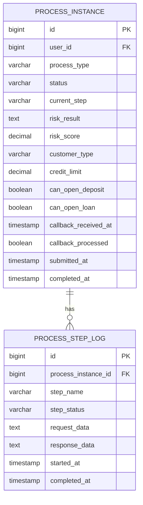
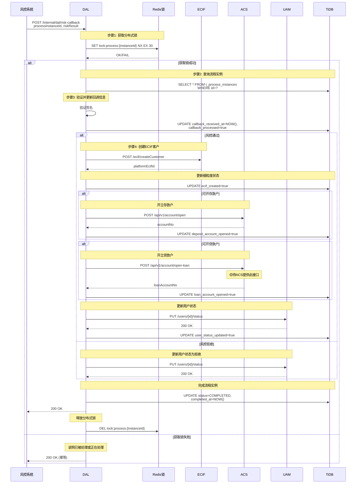
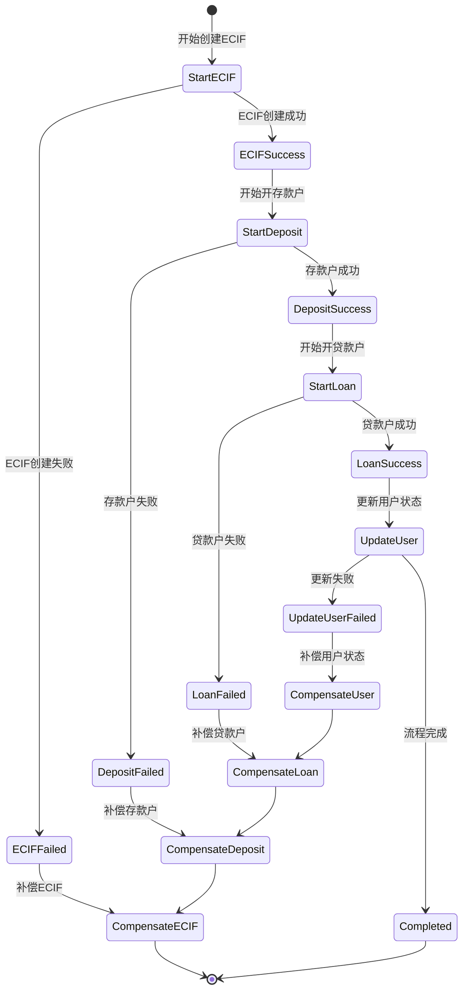
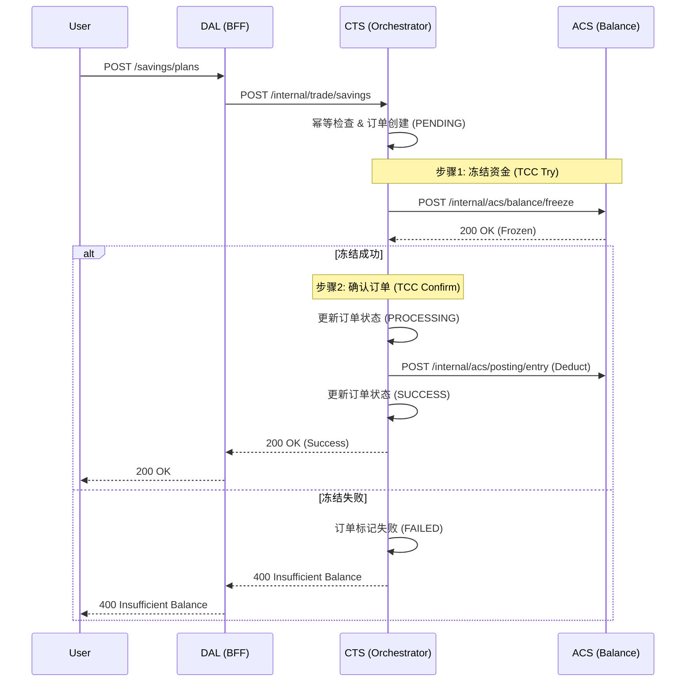
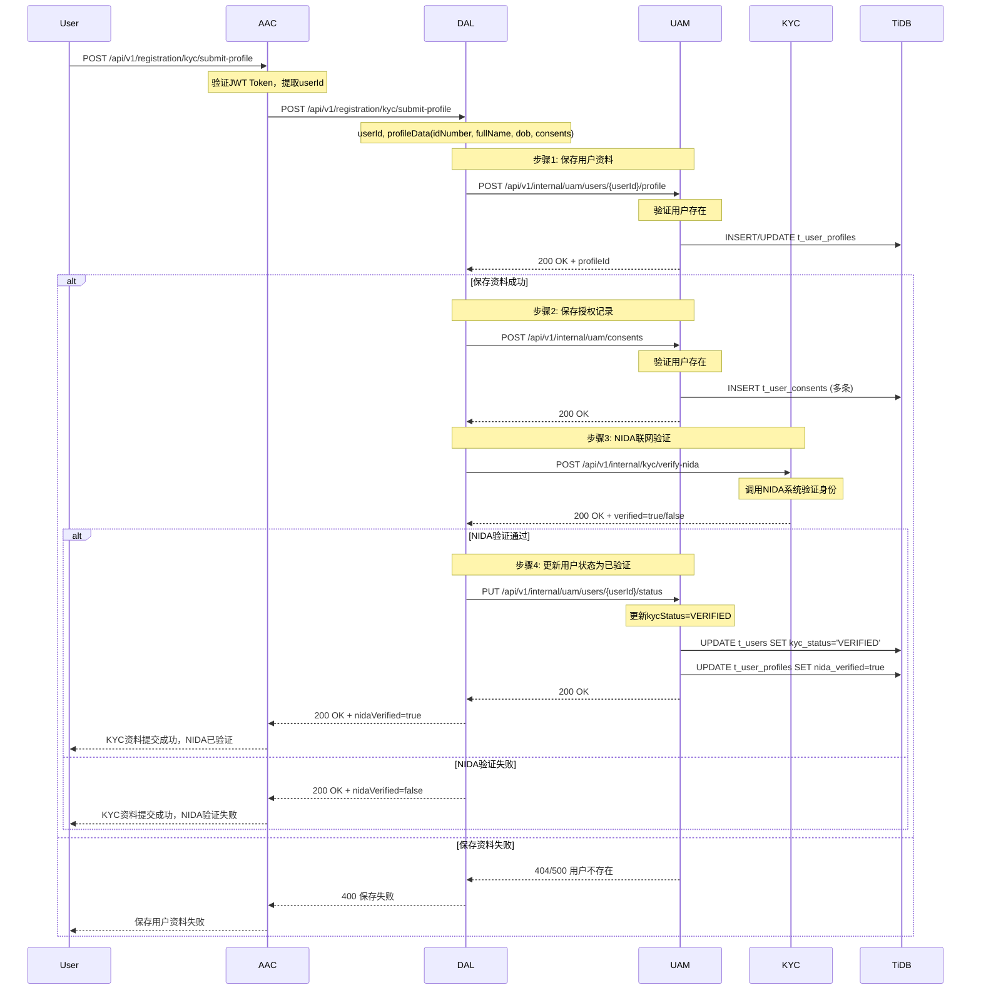
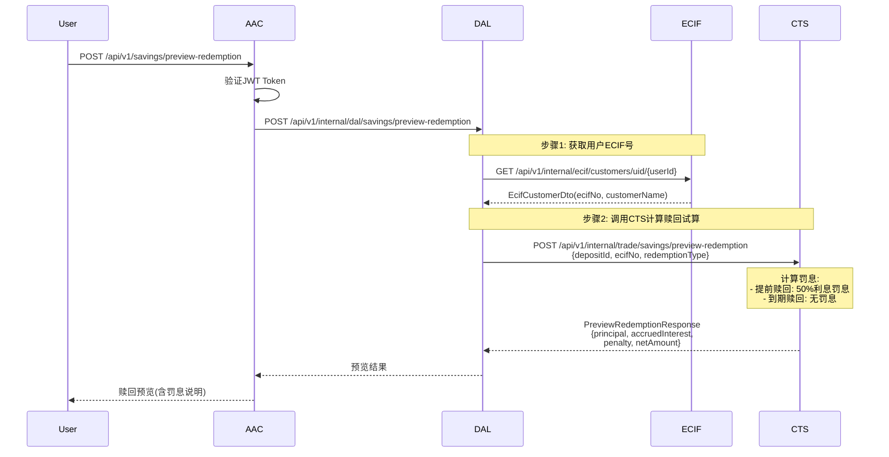
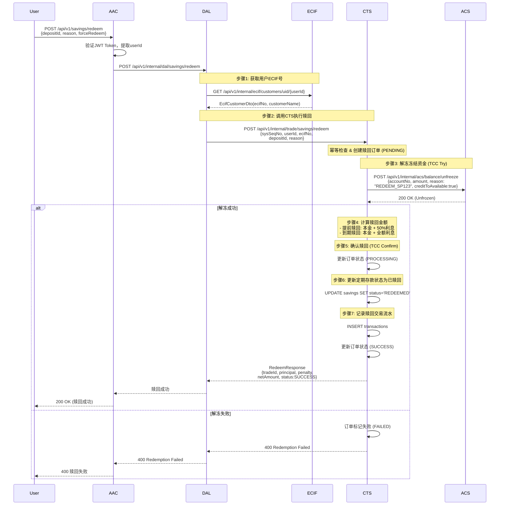
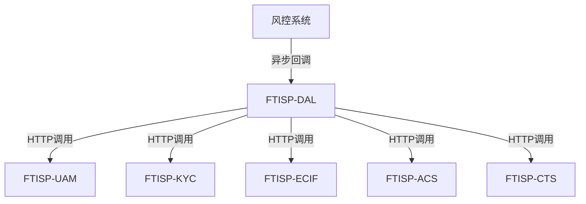
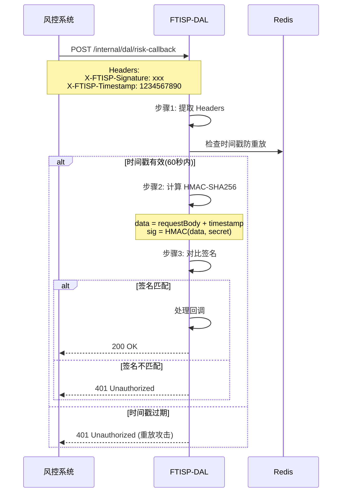

# FTISP-DAL 系统设计文档 (V3 - Java/TiDB 专用版)

> **子系统编号**: FTISP-DAL
> **子系统名称**: Data Aggregation Layer (数据聚合层/业务编排中心)
> **版本**: V1.0
> **设计日期**: 2026-02-11

---

## 0. AI 编码元指令 (System Prompts)

- **角色**: 资深 Java 后端架构师
- **语言标准**: Java 21 (使用 `record`, `var`, `switch expression`, Virtual Threads)
- **构建工具**: Gradle 8.14.4 (Kotlin DSL `build.gradle.kts`)
- **框架规范**: Spring Boot 3.3.8
  - 使用 Spring WebMVC
  - 使用 Jakarta EE 注解 (非 Javax)
  - **API 文档**: 使用 Swagger (SpringDoc) 注解
  - **对象映射**: 使用 MapStruct 处理 Entity <-> DTO 转换
- **数据库规范**:
  - 目标数据库: **TiDB** (兼容 MySQL 5.7+ 协议)
  - **禁止使用物理外键** (使用逻辑外键)
  - 主键策略: 优先使用 `AUTO_RANDOM` 或 `Snowflake ID`，避免单调递增导致的写热点
- **代码风格**: Google Java Style

---

## 1. 概述

### 1.1 目的

FTISP-DAL (Data Aggregation Layer) 是业务编排中心，负责跨系统的业务流程编排、流程实例管理、数据聚合等功能。**有独立的流程实例数据库**，用于管理跨系统业务流程的状态。

### 1.2 范围

| 包含 (In Scope) | 不包含 (Out of Scope) |
|-----------------|-----------------------|
| KYC业务流程编排 | 用户认证 (由UAM负责) |
| ECIF开户流程编排 | OCR识别 (由KYC负责) |
| 风控回调处理 | NIDA校验 (由KYC负责) |
| 流程实例状态管理 | 会话管理 (由UAM负责) |
| 跨系统数据聚合 | 银行账户开户 (由ACS负责) |

### 1.3 架构定位

```mermaid
graph TD
    AAC[FTISP-AAC<br/>鉴权中心] -->|业务流程| DAL[FTISP-DAL<br/>数据聚合层]

    DAL -->|编排调用| UAM[FTISP-UAM]
    DAL -->|编排调用| KYC[FTISP-KYC]
    DAL -->|编排调用| ECIF[FTISP-ECIF]
    DAL -->|编排调用| ACS[FTISP-ACS]
    DAL -->|发送通知| MSG[FTISP-MSG]

    DAL -->|流程存储| DB[(TiDB)]
    DAL -->|风控提交| RISK[风控系统]
    RISK -->|异步回调| DAL

    DB -->|流程表|
        DB1[t_process_instances]
        DB2[t_process_step_logs]

    style DAL fill:#4CAF50,stroke:#2E7D32,stroke-width:3px
```

**DAL设计原则**:
- **流程编排**: 负责跨系统的业务流程编排
- **状态管理**: 维护流程实例状态和步骤日志
- **不存用户数据**: 用户主数据由各业务系统管理
- **异步回调**: 处理风控等外部系统的异步回调

---

## 2. 功能需求

### 2.1 用户故事

| ID | 故事描述 | 优先级 |
|----|----------|--------|
| DAL-US-001 | 系统能够创建和管理KYC流程实例 | P0 |
| DAL-US-002 | 系统能够编排用户资料保存流程 | P0 |
| DAL-US-003 | 系统能够提交风控审核 | P0 |
| DAL-US-004 | 系统能够处理风控回调并编排后续流程 | P0 |
| DAL-US-005 | 系统能够编排ECIF开户流程 | P0 |
| DAL-US-006 | 系统能够编排银行账户开户 | P0 |
| DAL-US-007 | 系统能够记录流程步骤日志 | P0 |
| DAL-US-008 | 系统能够支持流程回滚和补偿 | P1 |

---

## 3. API 接口定义 (Spring MVC)

### 3.1 内部接口清单

> **说明**: 以下接口为AAC或其他授权系统调用

| 方法 | 路径 | 描述 | 调用方 |
|------|------|------|--------|
| POST | `/api/v1/kyc/upload-documents` | OCR识别身份证 | AAC |
| POST | `/api/v1/registration/kyc/submit-profile` | 提交用户资料 | AAC |
| POST | `/api/v1/kyc/biometric-verify` | 生物识别验证 | AAC |
| POST | `/api/v1/kyc/submit` | 提交KYC申请 | AAC |
| GET | `/api/v1/kyc/application-status` | 查询审核进度 | AAC |
| POST | `/api/v1/deposits/initiate` | 发起充值(入金) | AAC |
| GET | `/api/v1/dictionaries/payment-channels` | 查询充值渠道 | AAC |
| POST | `/api/v1/savings/plans` | 创建定期存款 | AAC |
| POST | `/api/v1/savings/plans/redeem` | 赎回定期存款 | AAC |
| GET | `/api/v1/savings/plans` | 查询存款列表 | AAC |
| POST | `/internal/dal/risk-callback` | 风控回调 | 风控系统 |

### 3.2 接口详情

#### 3.2.0 OCR识别身份证接口

**接口**: `POST /api/v1/kyc/upload-documents`

> **说明**: 前端调用摄像头拍摄身份证正反面后，自动调用此接口进行OCR识别
> **路由**: AAC → DAL → KYC → 第三方OCR服务
> **调用时机**: 身份证正反面都拍摄完成后自动触发

**Request (Java Record)**:
```java
@Schema(description = "OCR识别请求")
public record UploadDocumentsRequest(
    @Schema(description = "用户ID", example = "123")
    @NotNull
    String userId,

    @Schema(description = "正面照片Base64")
    @NotNull
    @Size(min = 1, max = 5 * 1024 * 1024)
    String frontImagePath,

    @Schema(description = "反面照片Base64")
    @NotNull
    @Size(min = 1, max = 5 * 1024 * 1024)
    String backImagePath
) {}
```

**Response (Java Record)**:
```java
@Schema(description = "OCR识别响应")
public record UploadDocumentsResponse(
    @Schema(description = "是否成功")
    Boolean success,

    @Schema(description = "OCR识别结果")
    OcrResultData data,

    @Schema(description = "错误消息")
    String message
) {}

@Schema(description = "OCR识别结果")
public record OcrResultData(
    @Schema(description = "姓名")
    String fullName,

    @Schema(description = "身份证号")
    String idNumber,

    @Schema(description = "出生日期")
    String dob,

    @Schema(description = "性别")
    String gender,

    @Schema(description = "地址")
    String address
) {}
```

**业务规则**:
- 两张图片必须同时提供
- 图片大小不超过5MB
- OCR识别结果供用户确认，用户可编辑
- 识别失败时可降级到手动输入

---

#### 3.2.1 提交用户资料接口

**接口**: `POST /api/v1/registration/kyc/submit-profile`

**Request (Java Record)**:
```java
@Schema(description = "提交用户资料请求")
public record SubmitKycProfileRequest(
    @Schema(description = "用户ID", example = "123")
    @NotNull
    Long userId,

    @Schema(description = "OCR记录ID")
    @NotNull
    Long ocrDocumentId,

    @Schema(description = "用户确认的信息")
    @NotNull
    UserProfileData profile,

    @Schema(description = "授权列表")
    @NotEmpty
    List<ConsentRecord> consents
) {}

@Schema(description = "用户资料数据")
public record UserProfileData(
    @Schema(description = "姓名")
    @NotBlank
    String fullName,

    @Schema(description = "NIDA号")
    @NotBlank
    String nidaNumber,

    @Schema(description = "出生日期", example = "1990-01-01")
    @NotNull
    LocalDate dateOfBirth,

    @Schema(description = "性别")
    @NotNull
    Gender gender,

    @Schema(description = "地址")
    String addressLine1,

    @Schema(description = "城市")
    String city,

    @Schema(description = "地区")
    String region
) {}

@Schema(description = "授权记录")
public record ConsentRecord(
    @Schema(description = "授权类型")
    @NotNull
    ConsentType consentType,

    @Schema(description = "授权名称")
    String consentName,

    @Schema(description = "是否必需")
    @NotNull
    Boolean isRequired,

    @Schema(description = "操作类型")
    ConsentAction action
) {}
```

**Response**:
```java
@Schema(description = "提交资料响应")
public record SubmitProfileResponse(
    @Schema(description = "基础信息ID")
    Long profileId,

    @Schema(description = "授权ID列表")
    List<Long> consentIds,

    @Schema(description = "NIDA是否验证通过")
    Boolean nidaVerified,

    @Schema(description = "下一步")
    String nextStep,

    @Schema(description = "提示消息")
    String message
) {}
```

#### 3.2.2 提交KYC申请接口

**接口**: `POST /api/v1/kyc/submit`

**Request (Java Record)**:
```java
@Schema(description = "提交KYC申请请求")
public record SubmitKycRequest(
    @Schema(description = "用户ID")
    @NotNull
    Long userId
) {}
```

**Response**:
```java
@Schema(description = "提交KYC申请响应")
public record SubmitKycResponse(
    @Schema(description = "申请ID")
    Long applicationId,

    @Schema(description = "申请状态")
    String status,

    @Schema(description = "预计审核时间")
    String estimatedReviewTime,

    @Schema(description = "提示消息")
    String message
) {}
```

#### 3.2.3 查询审核进度接口

**接口**: `GET /api/v1/kyc/application-status`

**Response**:
```java
@Schema(description = "审核进度响应")
public record ApplicationStatusResponse(
    @Schema(description = "申请ID")
    Long applicationId,

    @Schema(description = "申请状态")
    String status,

    @Schema(description = "当前审核步骤")
    String currentStep,

    @Schema(description = "预计完成时间")
    String estimatedTime,

    @Schema(description = "提交时间")
    Instant submittedAt,

    @Schema(description = "拒绝原因(如果状态为REJECTED)")
    String rejectReason
) {}
```

#### 3.2.4 风控回调接口

**接口**: `POST /internal/dal/risk-callback`

> **说明**: 风控系统异步回调，DAL根据结果编排后续流程

> **🔒 安全增强**: 符合标准 Webhook 规范，签名放在 HTTP Header 而非 Body 中。

**Request Headers**:
```yaml
X-FTISP-Signature: HMAC-SHA256(requestBody + timestamp, secret)
X-FTISP-Timestamp: Unix timestamp (seconds)
X-FTISP-Request-ID: Unique request identifier
Content-Type: application/json
```

**Request (Java Record)**:
```java
@Schema(description = "风控回调请求")
public record RiskCallbackRequest(
    @Schema(description = "流程实例ID")
    @NotNull
    String processInstanceId,

    @Schema(description = "风控结果")
    @NotNull
    RiskResult riskResult,

    @Schema(description = "风险评分 (0-100)")
    @NotNull
    @DecimalMin("0")
    @DecimalMax("100")
    Integer riskScore,

    @Schema(description = "用户等级")
    @NotNull
    UserType customerType,

    @Schema(description = "贷款额度")
    BigDecimal creditLimit,

    @Schema(description = "能否开存款户")
    @NotNull
    Boolean canOpenDepositAccount,

    @Schema(description = "能否开贷款户")
    @NotNull
    Boolean canOpenLoanAccount
) {}

public enum RiskResult {
    APPROVED,     // 通过
    REJECTED,      // 拒绝
    MANUAL_REVIEW // 人工审核
}
```

**Response**:
```java
@Schema(description = "回调响应")
public record RiskCallbackResponse(
    @Schema(description = "提示消息")
    String message
) {}
```

#### 3.2.5 查询充值渠道接口

**接口**: `GET /api/v1/dictionaries/payment-channels`

**Response**:
```java
@Schema(description = "充值渠道响应")
public record PaymentChannelResponse(
    @Schema(description = "渠道列表")
    List<PaymentChannel> channels
) {}

@Schema(description = "支付渠道信息")
public record PaymentChannel(
    @Schema(description = "渠道代码", example = "MPESA")
    String code,

    @Schema(description = "渠道名称", example = "M-Pesa")
    String name,

    @Schema(description = "渠道类型", example = "MOBILE_MONEY")
    String type,

    @Schema(description = "图标URL")
    String iconUrl,

    @Schema(description = "最小充值金额")
    Long minAmount,

    @Schema(description = "最大充值金额")
    Long maxAmount,
    
    @Schema(description = "费率(%)")
    BigDecimal feeRate
) {}
```

#### 3.2.6 发起充值(入金)接口

**接口**: `POST /api/v1/deposits/initiate`

**Request**:
```java
@Schema(description = "发起充值请求")
public record InitiateDepositRequest(
    @Schema(description = "充值金额(分)", example = "50000")
    @NotNull
    @Min(100)
    Long amount,

    @Schema(description = "币种", example = "TZS")
    @NotBlank
    String currency,

    @Schema(description = "渠道代码", example = "MPESA")
    @NotBlank
    String channelCode,

    @Schema(description = "手机号(Mobile Money时必填)", example = "255754000000")
    String phoneNumber
) {}
```

**Response**:
```java
@Schema(description = "发起充值响应")
public record InitiateDepositResponse(
    @Schema(description = "交易ID")
    String transactionId,

    @Schema(description = "交易状态", example = "PENDING")
    String status,

    @Schema(description = "提示消息")
    String message
) {}
```

#### 3.2.7 创建定期存款接口 (Forward)

> **路由**: AAC → DAL → CTS
> **逻辑**: DAL 透传请求至 CTS，由 CTS 负责交易编排

**接口**: `POST /api/v1/savings/plans`

**Request**:
```java
@Schema(description = "创建定期存款请求")
public record CreateSavingsPlanRequest(
    @Schema(description = "用户ID") @NotNull Long userId,
    @Schema(description = "付款账号") @NotBlank String accountNo,
    @Schema(description = "产品代码") @NotBlank String productCode,
    @Schema(description = "金额(分)") @NotNull @Min(1000) Long amount,
    @Schema(description = "是否保证金") Boolean isSecurityDeposit,
    @Schema(description = "到期指令") String maturityInstruction
) {}
```

**Response**:
```java
public record CreateSavingsResponse(
    String tradeId,
    String status, // PROCESSING/SUCCESS
    String message
) {}
```

#### 3.2.7.1 创建保证金定期存款接口 (Security Deposit)

> **路由**: AAC → DAL → (ECIF) → CTS → DRE
> **特殊**:
> - `isSecurityDeposit` 必须为 `true`
> - `maturityInstruction` 强制为 `AUTO_ROLLOVER`，用户不可选
> - 需要调用 DRE 授信系统更新授信额度

**接口**: `POST /api/v1/savings/security-deposit`

**Request**:
```java
@Schema(description = "保证金定期存款请求")
public record SecurityDepositRequest(
    @Schema(description = "冻结金额(分)", example = "50000")
    @NotNull @Min(1000) Long amount,

    @Schema(description = "期限(月)", example = "12")
    @NotNull Integer durationMonths,

    @Schema(description = "年利率", example = "0.115")
    @NotNull BigDecimal interestRate,

    @Schema(description = "付款来源", example = "WALLET")
    @NotBlank String source  // WALLET | EXTERNAL
) {}
```

**Response**:
```java
@Schema(description = "保证金定期存款响应")
public record SecurityDepositResponse(
    @Schema(description = "保证金定期存款ID")
    String depositId,

    @Schema(description = "原授信额度(分)")
    Long oldCreditLimit,

    @Schema(description = "新授信额度(分)")
    Long newCreditLimit,

    @Schema(description = "额度增量(分)")
    Long limitIncrease,

    @Schema(description = "到期金额(本金+税后利息)")
    Long maturityAmount,

    @Schema(description = "到期日期")
    Instant maturityDate,

    @Schema(description = "用户类型")
    String newUserType  // TYPE_C_WITH_CREDIT
) {}
```

**错误码**:
| 错误码 | HTTP状态 | 场景 | 用户消息 |
|--------|----------|------|----------|
| `USER_TYPE_MISMATCH` | 403 | 用户类型不符 | "仅TYPE_C用户可通过保证金提额" |
| `INVALID_DURATION` | 400 | 无效期限 | "保证金存款仅支持3/6/12个月期限" |
| `INSUFFICIENT_BALANCE` | 400 | 余额不足 | "可用余额不足" |
| `CREDIT_UPDATE_FAILED` | 500 | 额度更新失败 | "授信额度更新失败，请稍后重试" |

**DAL 实现逻辑**:
```java
@Service
@RequiredArgsConstructor
@Slf4j
public class SecurityDepositService {

    private final CtsClient ctsClient;
    private final EcifClient ecifClient;
    private final DreClient dreClient;  // 授信系统客户端

    /**
     * 创建保证金定期存款并提升授信额度
     */
    public SecurityDepositResponse createSecurityDeposit(
            SecurityDepositRequest request, Long userId) {

        log.info("Creating security deposit: userId={}, amount={}",
            userId, request.amount());

        // 1. 获取ECIF客户号
        EcifCustomerDto customer = ecifClient.getCustomerByUserId(userId.toString())
            .switchIfEmpty(Mono.error(new CustomerNotFoundException()))
            .block();

        // 2. 构造CTS保证金存款请求
        CtsFixedDepositRequest ctsRequest = CtsFixedDepositRequest.builder()
            .sysSeqNo(generateSysSeqNo())
            .sourceSystem("FTISP-DAL")
            .requestTime(getCurrentTimestamp())
            .userId(userId.toString())
            .bankCode("CRDB")
            .ecifNo(customer.customerNo())
            .productId(null)  // 保证金产品无需指定
            .amount(new BigDecimal(request.amount()))
            .build();

        // 3. 调用CTS创建保证金存款
        Map<String, Object> ctsResponse = ctsClient.createSecurityDeposit(
            ctsRequest.withSecurityDeposit(true)
        ).block();

        String depositId = (String) ctsResponse.get("depositId");

        // 4. 调用DRE更新授信额度
        dreClient.increaseCreditLimit(
            userId,
            request.amount(),
            "SECURITY_DEPOSIT",
            depositId
        ).block();

        // 5. 查询更新后的授信额度
        Long newCreditLimit = dreClient.getCreditLimit(userId).block();

        return SecurityDepositResponse.builder()
            .depositId(depositId)
            .oldCreditLimit(newCreditLimit - request.amount())
            .newCreditLimit(newCreditLimit)
            .limitIncrease(request.amount())
            .maturityAmount(calculateMaturityAmount(request))
            .build();
    }
}
```

#### 3.2.8 赎回定期存款预览接口 (Forward)

> **路由**: AAC → DAL → CTS
> **逻辑**: DAL 透传请求至 CTS，由 CTS 负责赎回试算（含罚息计算）

**接口**: `POST /api/v1/savings/preview-redemption`

**Request**:
```java
@Schema(description = "赎回预览请求")
public record PreviewRedemptionRequest(
    @Schema(description = "用户ID") @NotNull Long userId,
    @Schema(description = "定期存款ID") @NotBlank String depositId,
    @Schema(description = "赎回类型") @NotNull RedemptionType redemptionType
) {}

public enum RedemptionType {
    NORMAL,      // 正常到期赎回
    EARLY        // 提前赎回
}
```

**Response**:
```java
@Schema(description = "赎回预览响应")
public record PreviewRedemptionResponse(
    @Schema(description = "本金(分)") @NotNull Long principal,
    @Schema(description = "应付利息(分)") @NotNull Long accruedInterest,
    @Schema(description = "罚息(50%利息)") @NotNull Long penalty,
    @Schema(description = "实际到账金额") @NotNull Long netAmount,
    @Schema(description = "预计到账时间") @NotNull Instant estimatedArrivalTime,
    @Schema(description = "赎回说明") String message
) {}
```

#### 3.2.9 赎回定期存款执行接口 (Forward)

> **路由**: AAC → DAL → (ECIF) → CTS → ACS
> **逻辑**: DAL 先调用 ECIF 获取 ecif_no，然后调用 CTS 执行赎回，CTS 编排 ACS 进行资金解冻和过账

**接口**: `POST /api/v1/savings/redeem`

**Request**:
```java
@Schema(description = "赎回定期存款请求")
public record RedeemSavingsRequest(
    @Schema(description = "用户ID") @NotNull Long userId,
    @Schema(description = "定期存款ID") @NotBlank String depositId,
    @Schema(description = "赎回原因") String reason,
    @Schema(description = "强制赎回(保证金场景)") @NotNull Boolean forceRedeem
) {}
```

**Response**:
```java
@Schema(description = "赎回响应")
public record RedeemResponse(
    @Schema(description = "交易ID") @NotNull String tradeId,
    @Schema(description = "本金(分)") @NotNull Long principal,
    @Schema(description = "罚息(分)") @NotNull Long penalty,
    @Schema(description = "实际到账金额(分)") @NotNull Long netAmount,
    @Schema(description = "交易状态") @NotNull String status, // PROCESSING/SUCCESS/FAILED
    @Schema(description = "提示消息") String message
) {}
```

**错误码**:
| 错误码 | HTTP状态 | 场景 | 用户消息 |
|--------|----------|------|----------|
| `DEPOSIT_NOT_FOUND` | 404 | 定期存款不存在 | 定期存款不存在 |
| `DEPOSIT_ALREADY_REDEEMED` | 400 | 存款已赎回 | 该定期存款已赎回 |
| `SECURITY_DEPOSIT_HAS_LOAN` | 400 | 保证金有未结清贷款 | 存在未结清贷款，无法赎回保证金 |
| `REDEMPTION_FAILED` | 500 | 赎回失败 | 赎回处理失败，请稍后重试 |

---

#### 3.2.10 查看定期存款详情接口

> **对应功能**: SV-10 活跃定期存款管理
> **调用链**: Frontend → AAC → DAL → CTS
> **接口类型**: 查询接口

**接口**: `GET /api/v1/internal/dal/savings/{depositId}/detail`

**请求参数**:
| 参数 | 类型 | 必填 | 说明 |
|------|------|------|------|
| depositId | String | Y | 定期存款ID（路径参数） |
| userId | String | Y | 用户ID（查询参数） |

**Response**:
```java
@Schema(description = "定期存款详情响应")
public record SavingsPlanDetailResponse(
    @Schema(description = "存款ID") String id,
    @Schema(description = "计划名称") String planName,
    @Schema(description = "本金金额(分)") Long amount,
    @Schema(description = "年利率(%)") BigDecimal interestRate,
    @Schema(description = "期限(月)") Integer durationMonths,
    @Schema(description = "到期日期") String maturityDate,
    @Schema(description = "距离到期天数") Integer daysToMaturity,
    @Schema(description = "到期指令") String maturityInstruction,
    @Schema(description = "是否可修改指令") Boolean canModifyInstruction,
    @Schema(description = "累计收益(分)") Long accruedEarnings,
    @Schema(description = "预扣税额(分)") Long taxWithheld,
    @Schema(description = "到期金额(分)") Long maturityAmount,
    @Schema(description = "存款状态") String status,
    @Schema(description = "是否保证金") Boolean isSecurityDeposit,
    @Schema(description = "创建时间") String createdAt
) {}
```

**业务规则**:
| 规则ID | 规则描述 | 实现逻辑 |
|--------|----------|----------|
| **BR-SV-037** | 到期前可修改 | 距离开到期日>1天时 canModifyInstruction=true |
| **BR-SV-038** | 到期日锁定 | 到期日当天及提前1天 canModifyInstruction=false |
| **BR-SV-039** | 保证金限制 | isSecurityDeposit=true 时 canModifyInstruction=false |

**错误码**:
| 错误码 | HTTP状态 | 场景 | 用户提示 |
|--------|----------|------|----------|
| `DEPOSIT_NOT_FOUND` | 404 | 定期存款不存在 | 定期存款不存在 |
| `USER_NOT_OWNER` | 403 | 用户无权访问 | 无权访问该定期存款 |

---

#### 3.2.11 修改到期指令接口

> **对应功能**: SV-10 修改到期指令
> **调用链**: Frontend → AAC → DAL → CTS
> **接口类型**: 更新接口

**接口**: `PUT /api/v1/internal/dal/savings/{depositId}/instruction`

**Request**:
```java
@Schema(description = "修改到期指令请求")
public record UpdateMaturityInstructionRequest(
    @Schema(description = "用户ID") @NotNull String userId,
    @Schema(description = "新到期指令") @NotBlank String instruction
) {}
```

**instruction 允许值**:
| 值 | 说明 |
|-----|------|
| `AUTO_ROLLOVER` | 自动续存（本金+利息转入新定期存款） |
| `CREDIT_TO_ACCOUNT` | 转入账户（本金+利息转回活期账户） |

**Response**:
```java
@Schema(description = "修改到期指令响应")
public record UpdateMaturityInstructionResponse(
    @Schema(description = "是否成功") Boolean success,
    @Schema(description = "提示消息") String message,
    @Schema(description = "原指令") String previousInstruction,
    @Schema(description = "新指令") String newInstruction
) {}
```

**业务规则**:
| 规则ID | 规则描述 | 实现逻辑 |
|--------|----------|----------|
| **BR-SV-037** | 到期前可修改 | 距离开到期日>1天可修改 |
| **BR-SV-038** | 到期日锁定 | 到期日当天及提前1天不可修改 |
| **BR-SV-039** | 保证金限制 | Security Deposit 不可修改 |
| **BR-SV-040** | 修改记录 | 记录修改历史到审计日志 |

**错误码**:
| 错误码 | HTTP状态 | 场景 | 用户提示 |
|--------|----------|------|----------|
| `DEPOSIT_NOT_FOUND` | 404 | 定期存款不存在 | 定期存款不存在 |
| `TOO_CLOSE_TO_MATURITY` | 400 | 距离到期日太近 | 到期前1天不可修改到期指令 |
| `SECURITY_DEPOSIT_FIXED` | 403 | 保证金不可修改 | 保证金存款的到期指令不可修改 |
| `INVALID_INSTRUCTION` | 400 | 无效的指令值 | 到期指令必须是 AUTO_ROLLOVER 或 CREDIT_TO_ACCOUNT |

---

#### 3.2.12 查询定期存款列表接口

> **对应功能**: SV-10 活跃定期存款管理
> **调用链**: Frontend → AAC → DAL → CTS
> **接口类型**: 查询接口

**接口**: `GET /api/v1/internal/dal/savings/list`

**请求参数**:
| 参数 | 类型 | 必填 | 说明 |
|------|------|------|------|
| userId | String | Y | 用户ID |
| status | String | N | 状态过滤（ACTIVE/MATURED/REDEEMED） |

**Response**:
```java
@Schema(description = "定期存款列表响应")
public record SavingsPlansListResponse(
    @Schema(description = "定期存款列表") List<SavingsPlanItem> plans,
    @Schema(description = "总本金") Long totalPrincipal,
    @Schema(description = "总利息") Long totalInterest,
    @Schema(description = "总价值") Long totalValue
) {}
```

---

#### 3.2.13 查询交易历史接口

> **对应功能**: SV-08 交易历史查询
> **调用链**: Frontend → AAC → DAL → CTS
> **接口类型**: 分页查询接口

**请求定义**:

```java
package com.ftisp.dal.dto.request;

import io.swagger.v3.oas.annotations.media.Schema;
import jakarta.validation.constraints.Min;
import lombok.Builder;
import lombok.Data;

@Data
@Builder
@Schema(description = "交易历史查询请求")
public class TransactionHistoryRequest {

    @Schema(description = "用户ID", required = true)
    private Long userId;

    @Schema(description = "页码（从0开始）", defaultValue = "0")
    @Min(value = 0, message = "页码不能小于0")
    private Integer page;

    @Schema(description = "每页大小", defaultValue = "20")
    @Min(value = 1, message = "每页大小不能小于1")
    private Integer size;

    @Schema(description = "交易类型筛选", allowableValues = {"ALL", "SAVINGS", "LOANS", "TRANSFERS"})
    private String category;

    @Schema(description = "开始日期 (yyyy-MM-dd)")
    private String startDate;

    @Schema(description = "结束日期 (yyyy-MM-dd)")
    private String endDate;
}
```

**响应定义**:

```java
package com.ftisp.dal.dto.record;

import io.swagger.v3.oas.annotations.media.Schema;
import java.time.LocalDateTime;
import java.util.List;

@Schema(description = "交易历史响应")
public record TransactionHistoryResponse(
    List<TransactionItem> transactions,
    int currentPage,
    int totalPages,
    long totalElements,
    boolean hasNext
) {
    @Schema(description = "交易项")
    public record TransactionItem(
        String id,                    // 交易流水号
        String type,                  // CREDIT/DEBIT
        String category,              // SAVINGS/LOANS/TRANSFERS
        String title,                 // 交易标题
        String description,           // 交易描述
        Long amount,                  // 金额（分）
        Long fee,                     // 手续费（分）
        Long balance,                 // 交易后余额（分）
        LocalDateTime date,           // 交易时间
        String status,                // PENDING/COMPLETED/FAILED
        String reference,             // 参考号
        CounterpartyInfo counterparty // 对方信息
    ) {}

    @Schema(description = "对方信息")
    public record CounterpartyInfo(
        String name,        // 对方名称
        String account,     // 对方账号
        String bank         // 对方银行
    ) {}
}
```

**Controller 实现**:

```java
@RestController
@RequestMapping("/api/v1/internal/dal")
public class DalTransactionController {

    private final CtsClient ctsClient;

    @GetMapping("/transactions")
    @Operation(summary = "查询交易历史", description = "支持分页、按类型筛选、日期范围查询")
    public Mono<TransactionHistoryResponse> getTransactions(
            @RequestParam Long userId,
            @RequestParam(defaultValue = "0") Integer page,
            @RequestParam(defaultValue = "20") Integer size,
            @RequestParam(required = false) String category,
            @RequestParam(required = false) String startDate,
            @RequestParam(required = false) String endDate) {

        log.info("Query transaction history: userId={}, page={}, size={}, category={}",
            userId, page, size, category);

        return ctsClient.queryTransactions(userId, page, size, category, startDate, endDate);
    }

    @GetMapping("/transactions/{transactionId}")
    @Operation(summary = "查询交易详情", description = "根据交易ID查询详细信息")
    public Mono<TransactionDetailResponse> getTransactionDetail(
            @PathVariable String transactionId,
            @RequestParam Long userId) {

        log.info("Query transaction detail: transactionId={}, userId={}", transactionId, userId);

        return ctsClient.getTransactionDetail(transactionId, userId);
    }
}
```

**CTS Client 调用**:

```java
public class CtsClient {

    public Mono<TransactionHistoryResponse> queryTransactions(
            Long userId, Integer page, Integer size,
            String category, String startDate, String endDate) {

        return webClientBuilder.baseUrl(ctsBaseUrl).build()
            .get()
            .uri(uriBuilder -> uriBuilder
                .path("/api/v1/internal/cts/transactions")
                .queryParam("userId", userId)
                .queryParam("page", page)
                .queryParam("size", size)
                .queryParam("category", category != null ? category : "ALL")
                .queryParam("startDate", startDate)
                .queryParam("endDate", endDate)
                .build())
            .retrieve()
            .bodyToMono(TransactionHistoryResponse.class)
            .timeout(Duration.ofSeconds(10));
    }
}
```

**业务规则**:

| 规则ID | 规则描述 | 实现逻辑 |
|--------|----------|----------|
| **BR-SV-025** | 默认按时间倒序排列 | ORDER BY created_at DESC |
| **BR-SV-026** | 分页最大100条 | size 限制 max=100 |
| **BR-SV-027** | 筛选类型映射 | ALL→全部, SAVINGS→WALLET+SAVINGS, LOANS→LOAN+REPAYMENT |
| **BR-SV-028** | 深度链接支持 | SAVINGS→depositId, LOANS→loanId |

**错误码**:

| 错误码 | HTTP状态 | 场景 | 用户提示 |
|--------|----------|------|----------|
| `INVALID_PAGE` | 400 | 页码无效 | "页码必须大于等于0" |
| `INVALID_SIZE` | 400 | 每页大小无效 | "每页大小必须在1-100之间" |
| `INVALID_CATEGORY` | 400 | 筛选类型无效 | "无效的筛选类型" |

---

#### 3.2.11 下载交易历史接口

> **对应功能**: SV-08 交易历史下载
> **调用链**: Frontend → AAC → DAL → CTS
> **接口类型**: 文件下载接口

**请求定义**:

```java
@Data
@Builder
@Schema(description = "交易历史下载请求")
public class TransactionDownloadRequest {

    @Schema(description = "用户ID", required = true)
    private Long userId;

    @Schema(description = "文件格式", allowableValues = {"PDF", "CSV"})
    private String format;

    @Schema(description = "交易类型筛选")
    private String category;

    @Schema(description = "开始日期")
    private String startDate;

    @Schema(description = "结束日期")
    private String endDate;
}
```

**Controller 实现**:

```java
@GetMapping("/transactions/download")
@Operation(summary = "下载交易历史", description = "生成PDF或CSV文件")
public Mono<byte[]> downloadTransactions(
        @RequestParam Long userId,
        @RequestParam(defaultValue = "PDF") String format,
        @RequestParam(required = false) String category,
        @RequestParam(required = false) String startDate,
        @RequestParam(required = false) String endDate) {

    log.info("Download transaction history: userId={}, format={}, category={}",
        userId, format, category);

    return ctsClient.downloadTransactions(userId, format, category, startDate, endDate)
        .map(data -> {
            HttpHeaders headers = new HttpHeaders();
            if ("PDF".equals(format)) {
                headers.setContentType(MediaType.APPLICATION_PDF);
                headers.setContentDispositionFormData("attachment",
                    "transactions_" + userId + "_" + LocalDate.now() + ".pdf");
            } else {
                headers.setContentType(new MediaType("text", "csv"));
                headers.setContentDispositionFormData("attachment",
                    "transactions_" + userId + "_" + LocalDate.now() + ".csv");
            }
            return data;
        });
}
```

**业务规则**:

| 规则ID | 规则描述 | 实现逻辑 |
|--------|----------|----------|
| **BR-SV-029** | 默认下载最近3个月 | 未指定日期时默认90天 |
| **BR-SV-030** | 最多下载1000条记录 | 限制下载量 |
| **BR-SV-031** | PDF格式包含签名 | 包含电子签章信息 |

---

### 3.3 定期存款业务规则

| 规则ID | 规则描述 | 例外处理 |
|--------|----------|----------|
| **BR-SV-019** | 提前赎回收取50%应付利息作为罚息 | 到期赎回无罚息 |
| **BR-SV-020** | 罚息仅从利息中扣除，本金不受影响 | 本金全额返还 |
| **BR-SV-021** | 保证金赎回需检查是否有未结清贷款 | 有未结清贷款时不可赎回 |
| **BR-SV-022** | 正常到期赎回全额支付本金+利息 | 无罚息 |

---

## 4. 数据模型 (TiDB 适配)

### 4.1 实体关系图



### 4.2 表结构定义

#### 4.2.1 流程实例表 (t_process_instances)

> **必要性分析**: 存储跨系统业务流程的状态，确保分布式一致性

| 字段名 | 类型 (TiDB) | 必填 | 索引 | 说明 | **必要性辩护** |
|--------|-------------|------|------|------|--------------|
| `id` | `BIGINT` | Y | PK | 主键 | 使用 `AUTO_RANDOM` 避免热点 |
| `user_id` | `BIGINT` | Y | IDX | 用户ID | 关联t_users |
| `process_type` | `VARCHAR(50)` | Y | IDX | 流程类型 | KYC/ECIF/LOAN等 |
| `status` | `VARCHAR(20)` | Y | IDX | 流程状态 | PENDING/IN_PROGRESS/COMPLETED/FAILED |
| `current_step` | `VARCHAR(50)` | N | - | 当前步骤 | 当前执行到的步骤 |
| `risk_result` | `VARCHAR(20)` | N | - | 风控结果 | APPROVED/REJECTED/MANUAL_REVIEW |
| `risk_score` | `DECIMAL(5,2)` | N | - | 风险评分 | 0-100 |
| `customer_type` | `VARCHAR(20)` | N | - | 用户等级 | TYPE_A/B/C |
| `credit_limit` | `DECIMAL(15,2)` | N | - | 贷款额度 | 风控分配 |
| `can_open_deposit` | `BOOLEAN` | N | - | 可开存款户 | 开户权限 |
| `can_open_loan` | `BOOLEAN` | N | - | 可开贷款户 | 开户权限 |
| `ecif_created` | `BOOLEAN` | N | - | ECIF已创建 | 细粒度状态 |
| `deposit_account_opened` | `BOOLEAN` | N | - | 存款户已开 | 细粒度状态 |
| `loan_account_opened` | `BOOLEAN` | N | - | 贷款户已开 | 细粒度状态 |
| `user_status_updated` | `BOOLEAN` | N | - | 用户状态已更新 | 细粒度状态 |
| `callback_received_at` | `TIMESTAMP` | N | - | 回调接收时间 | 风控回调时间 |
| `callback_processed` | `BOOLEAN` | N | - | 回调已处理 | 幂等性标记 |
| `submitted_at` | `TIMESTAMP` | Y | - | 提交时间 | 审计必需 |
| `completed_at` | `TIMESTAMP` | N | - | 完成时间 | 流程结束时间 |
| `created_at` | `TIMESTAMP` | Y | - | 创建时间 | 审计必需 |
| `updated_at` | `TIMESTAMP` | Y | - | 更新时间 | 审计必需 |

**DDL 示例 (TiDB)**:
```sql
CREATE TABLE t_process_instances (
    id BIGINT PRIMARY KEY /*T![auto_rand] AUTO_RANDOM(5) */,
    user_id BIGINT NOT NULL,
    process_type VARCHAR(50) NOT NULL,
    status VARCHAR(20) NOT NULL DEFAULT 'PENDING',
    current_step VARCHAR(50),
    risk_result VARCHAR(20),
    risk_score DECIMAL(5,2),
    customer_type VARCHAR(20),
    credit_limit DECIMAL(15,2),
    can_open_deposit BOOLEAN,
    can_open_loan BOOLEAN,
    ecif_created BOOLEAN DEFAULT FALSE,
    deposit_account_opened BOOLEAN DEFAULT FALSE,
    loan_account_opened BOOLEAN DEFAULT FALSE,
    user_status_updated BOOLEAN DEFAULT FALSE,
    callback_received_at TIMESTAMP NULL,
    callback_processed BOOLEAN DEFAULT FALSE,
    submitted_at TIMESTAMP DEFAULT CURRENT_TIMESTAMP,
    completed_at TIMESTAMP NULL,
    created_at TIMESTAMP DEFAULT CURRENT_TIMESTAMP,
    updated_at TIMESTAMP DEFAULT CURRENT_TIMESTAMP ON UPDATE CURRENT_TIMESTAMP,
    INDEX idx_user_id (user_id),
    INDEX idx_status (status),
    INDEX idx_process_type (process_type),
    INDEX idx_callback_processed (callback_processed)
) COMMENT='流程实例表';
```

**细粒度状态字段说明**：
- `ecif_created`: ECIF客户创建完成后设为true，重入时跳过
- `deposit_account_opened`: 存款户开立完成后设为true，重入时跳过
- `loan_account_opened`: 贷款户开立完成后设为true，重入时跳过
- `user_status_updated`: UAM用户状态更新完成后设为true，重入时跳过

**Entity 定义**:
```java
@Entity
@Table(name = "t_process_instances")
public class ProcessInstance {
    @Id
    @GeneratedValue(strategy = GenerationType.IDENTITY)
    private Long id;

    @Column(name = "user_id", nullable = false)
    private Long userId;

    @Column(name = "process_type", nullable = false, length = 50)
    private String processType;

    @Column(name = "status", nullable = false, length = 20)
    @Enumerated(EnumType.STRING)
    private ProcessStatus status = ProcessStatus.PENDING;

    @Column(name = "current_step", length = 50)
    private String currentStep;

    @Column(name = "risk_result", length = 20)
    @Enumerated(EnumType.STRING)
    private RiskResult riskResult;

    @Column(name = "risk_score", precision = 5, scale = 2)
    private BigDecimal riskScore;

    @Column(name = "customer_type", length = 20)
    @Enumerated(EnumType.STRING)
    private UserType customerType;

    @Column(name = "credit_limit", precision = 15, scale = 2)
    private BigDecimal creditLimit;

    @Column(name = "can_open_deposit")
    private Boolean canOpenDepositAccount;

    @Column(name = "can_open_loan")
    private Boolean canOpenLoanAccount;

    // 细粒度状态标记（确保分布式重入幂等性）
    @Column(name = "ecif_created")
    private Boolean ecifCreated = false;

    @Column(name = "deposit_account_opened")
    private Boolean depositAccountOpened = false;

    @Column(name = "loan_account_opened")
    private Boolean loanAccountOpened = false;

    @Column(name = "user_status_updated")
    private Boolean userStatusUpdated = false;

    @Column(name = "callback_received_at")
    private Instant callbackReceivedAt;

    @Column(name = "callback_processed")
    private Boolean callbackProcessed = false;

    @Column(name = "submitted_at", nullable = false, updatable = false)
    private Instant submittedAt;

    @Column(name = "completed_at")
    private Instant completedAt;

    @Column(name = "created_at", updatable = false)
    private Instant createdAt;

    @Column(name = "updated_at")
    private Instant updatedAt;
}

public enum ProcessStatus {
    PENDING, IN_PROGRESS, COMPLETED, FAILED
}
```

#### 4.2.2 流程步骤日志表 (t_process_step_logs)

> **必要性分析**: 记录流程中每个步骤的执行日志，用于问题追踪和审计

| 字段名 | 类型 (TiDB) | 必填 | 索引 | 说明 | **必要性辩护** |
|--------|-------------|------|------|------|--------------|
| `id` | `BIGINT` | Y | PK | 主键 | 使用 `AUTO_RANDOM` |
| `process_instance_id` | `BIGINT` | Y | IDX | 流程实例ID | 关联流程实例 |
| `step_name` | `VARCHAR(50)` | Y | IDX | 步骤名称 | SAVE_PROFILE/NIDA_VERIFY等 |
| `step_status` | `VARCHAR(20)` | Y | IDX | 步骤状态 | STARTED/SUCCESS/FAILED |
| `request_data` | `TEXT` | N | - | 请求JSON | 审计数据 |
| `response_data` | `TEXT` | N | - | 响应JSON | 审计数据 |
| `error_code` | `VARCHAR(50)` | N | - | 错误码 | 失败分析 |
| `started_at` | `TIMESTAMP` | Y | - | 开始时间 | 步骤开始 |
| `completed_at` | `TIMESTAMP` | N | - | 完成时间 | 步骤完成 |
| `created_at` | `TIMESTAMP` | Y | - | 创建时间 | 日志时间 |

**DDL 示例**:
```sql
CREATE TABLE t_process_step_logs (
    id BIGINT PRIMARY KEY /*T![auto_rand] AUTO_RANDOM(5) */,
    process_instance_id BIGINT NOT NULL,
    step_name VARCHAR(50) NOT NULL,
    step_status VARCHAR(20) NOT NULL,
    request_data TEXT,
    response_data TEXT,
    error_code VARCHAR(50),
    started_at TIMESTAMP DEFAULT CURRENT_TIMESTAMP,
    completed_at TIMESTAMP NULL,
    created_at TIMESTAMP DEFAULT CURRENT_TIMESTAMP,
    INDEX idx_process_instance_id (process_instance_id),
    INDEX idx_step_name (step_name),
    INDEX idx_created_at (created_at)
) COMMENT='流程步骤日志表';
```

---

## 5. 存储选型分析

### 5.1 Redis 引入决策

- [x] **需要**: DAL需要使用Redis进行以下操作
    - [x] **分布式锁**: 风控回调并发处理
    - [x] **幂等性标记**: 防止重复处理

### 5.2 缓存策略

| Key Pattern | 数据结构 | TTL | 更新策略 |
|-------------|----------|-----|----------|
| `lock:process:{instanceId}` | String (锁标记) | 30秒 | 自动过期 |
| `idempotent:{callbackKey}` | String (结果) | 300秒 | 处理后删除 |

```java
@Component
@RequiredArgsConstructor
public class DistributedLockService {
    private final RedisTemplate<String, String> redisTemplate;

    public boolean tryLock(String processInstanceId, Duration timeout) {
        String key = "lock:process:" + processInstanceId;
        Boolean acquired = redisTemplate.opsForValue()
            .setIfAbsent(key, "1", timeout);

        return Boolean.TRUE.equals(acquired);
    }

    public void unlock(String processInstanceId) {
        String key = "lock:process:" + processInstanceId;
        redisTemplate.delete(key);
    }
}
```

---

## 6. 业务流程

### 6.1 风控回调处理流程



### 6.2 Saga 模式分布式事务补偿

> **架构目标**: 开户流程涉及多个子系统（ECIF、ACS、UAM），需要确保最终一致性，支持失败补偿。

> **实施优先级**: **P0** - 生产环境必备，建议接入 RocketMQ 实现事件驱动 Saga。

#### 6.2.1 Saga 协调器定义

| 步骤 | 操作 | 补偿操作 | 说明 |
|------|------|----------|------|
| 1 | 创建ECIF客户 | 删除ECIF客户 | ECIF创建失败时回滚 |
| 2 | 开立存款户 | 注销存款户 | ACS开户失败时回滚 |
| 3 | 开立贷款户 | 注销贷款户 | ACS开户失败时回滚 |
| 4 | 更新用户状态 | 恢复原状态 | UAM更新失败时回滚 |

#### 6.2.2 Saga 执行流程



#### 6.2.3 Saga 状态机实现

```java
public enum SagaStep {
    CREATE_ECIF,
    OPEN_DEPOSIT_ACCOUNT,
    OPEN_LOAN_ACCOUNT,
    UPDATE_USER_STATUS,
    COMPLETED
}

public enum SagaStatus {
    PENDING,      // 待执行
    IN_PROGRESS,  // 执行中
    SUCCEEDED,    // 已成功
    FAILED,       // 已失败
    COMPENSATING  // 补偿中
}

@Entity
@Table(name = "t_saga_instances")
public class SagaInstance {
    @Id
    @GeneratedValue(strategy = GenerationType.IDENTITY)
    private Long id;

    @Column(name = "process_instance_id", unique = true)
    private String processInstanceId;

    @Enumerated(EnumType.STRING)
    @Column(name = "current_step")
    private SagaStep currentStep = SagaStep.CREATE_ECIF;

    @Enumerated(EnumType.STRING)
    @Column(name = "saga_status")
    private SagaStatus sagaStatus = SagaStatus.PENDING;

    @Column(name = "completed_steps", columnDefinition = "JSON")
    private List<SagaStep> completedSteps = new ArrayList<>();

    @Column(name = "failed_step")
    private SagaStep failedStep;

    @Column(name = "compensation_required")
    private Boolean compensationRequired = false;

    @Column(name = "created_at")
    private Instant createdAt;

    @Column(name = "updated_at")
    private Instant updatedAt;
}
```

#### 6.2.4 Saga 编排服务

```java
@Service
@RequiredArgsConstructor
public class SagaOrchestrationService {

    private final SagaInstanceRepository sagaRepository;
    private final EcifClient ecifClient;
    private final AcsClient acsClient;
    private final UamClient uamClient;

    /**
     * 执行 Saga 流程
     */
    public SagaResult executeSaga(String processInstanceId,
                              RiskCallbackRequest riskRequest) {

        // 1. 创建或获取 Saga 实例
        SagaInstance saga = sagaRepository
            .findByProcessInstanceId(processInstanceId)
            .orElseGet(() -> createNewSaga(processInstanceId));

        // 2. 执行或继续执行
        return executeStepByStep(saga, riskRequest);
    }

    private SagaResult executeStepByStep(SagaInstance saga,
                                       RiskCallbackRequest riskRequest) {
        return switch (saga.getCurrentStep()) {
            case CREATE_ECIF -> executeCreateEcif(saga, riskRequest);
            case OPEN_DEPOSIT_ACCOUNT -> executeOpenDeposit(saga);
            case OPEN_LOAN_ACCOUNT -> executeOpenLoan(saga);
            case UPDATE_USER_STATUS -> executeUpdateUser(saga);
            case COMPLETED -> SagaResult.success(saga);
        };
    }

    /**
     * 步骤1: 创建ECIF
     */
    private SagaResult executeCreateEcif(SagaInstance saga,
                                       RiskCallbackRequest riskRequest) {
        updateSagaStatus(saga, SagaStatus.IN_PROGRESS);

        try {
            String ecifId = ecifClient.createCustomer(/* ... */);

            // 记录完成
            saga.addCompletedStep(SagaStep.CREATE_ECIF);
            saga.setCurrentStep(SagaStep.OPEN_DEPOSIT_ACCOUNT);
            sagaRepository.save(saga);

            // 继续下一步
            return executeOpenDeposit(saga);

        } catch (Exception e) {
            return handleStepFailure(saga, e);
        }
    }

    /**
     * 步骤2: 开立存款户
     */
    private SagaResult executeOpenDeposit(SagaInstance saga) {
        if (!saga.isStepExecutable(SagaStep.OPEN_DEPOSIT_ACCOUNT)) {
            return SagaResult.skipped();
        }

        updateSagaStatus(saga, SagaStatus.IN_PROGRESS);

        try {
            String depositAccountNo = acsClient.openDepositAccount(/* ... */);

            saga.addCompletedStep(SagaStep.OPEN_DEPOSIT_ACCOUNT);
            saga.setCurrentStep(determineNextStep(saga));
            sagaRepository.save(saga);

            // 继续下一步
            return executeStepByStep(saga, null);

        } catch (Exception e) {
            return handleStepFailure(saga, e);
        }
    }

    /**
     * 处理步骤失败 - 触发补偿
     */
    private SagaResult handleStepFailure(SagaInstance saga, Exception e) {
        log.error("Saga step failed: step={}, error={}", saga.getCurrentStep(), e.getMessage());

        saga.setFailedStep(saga.getCurrentStep());
        saga.setCompensationRequired(true);
        saga.setSagaStatus(SagaStatus.COMPENSATING);
        sagaRepository.save(saga);

        // 触发补偿
        return compensate(saga);
    }

    /**
     * 补偿流程
     */
    private SagaResult compensate(SagaInstance saga) {
        List<SagaStep> completedSteps = saga.getCompletedSteps();
        ListIterator<SagaStep> iterator = completedSteps.listIterator(completedSteps.size());

        // 逆序补偿
        while (iterator.hasPrevious()) {
            SagaStep step = iterator.previous();

            try {
                switch (step) {
                    case OPEN_LOAN_ACCOUNT -> compensateLoanAccount(saga);
                    case OPEN_DEPOSIT_ACCOUNT -> compensateDepositAccount(saga);
                    case CREATE_ECIF -> compensateEcifCustomer(saga);
                    case UPDATE_USER_STATUS -> compensateUserStatus(saga);
                }

                saga.removeCompletedStep(step);
                sagaRepository.save(saga);

            } catch (Exception e) {
                log.error("Compensation failed for step: {}", step, e);
                // 补偿失败需要人工介入
                saga.setSagaStatus(SagaStatus.FAILED);
                sagaRepository.save(saga);
                return SagaResult.failed("Compensation failed", saga);
            }
        }

        // 补偿完成
        saga.setSagaStatus(SagaStatus.FAILED);
        sagaRepository.save(saga);
        return SagaResult.compensated(saga);
    }

    /**
     * 补偿：删除ECIF客户
     */
    private void compensateEcifCustomer(SagaInstance saga) {
        String ecifId = saga.getEcifId();
        if (ecifId != null) {
            ecifClient.deleteCustomer(ecifId);
            log.info("Compensated: ECIF customer deleted: {}", ecifId);
        }
    }

    /**
     * 补偿：注销存款户
     */
    private void compensateDepositAccount(SagaInstance saga) {
        String accountNo = saga.getDepositAccountNo();
        if (accountNo != null) {
            acsClient.closeAccount(accountNo);
            log.info("Compensated: Deposit account closed: {}", accountNo);
        }
    }

    /**
     * 补偿：注销贷款户
     */
    private void compensateLoanAccount(SagaInstance saga) {
        String accountNo = saga.getLoanAccountNo();
        if (accountNo != null) {
            acsClient.closeAccount(accountNo);
            log.info("Compensated: Loan account closed: {}", accountNo);
        }
    }

    /**
     * 补偿：恢复用户状态
     */
    private void compensateUserStatus(SagaInstance saga) {
        Long userId = saga.getUserId();
        if (userId != null) {
            uamClient.revertUserStatus(userId);
            log.info("Compensated: User status reverted: userId={}", userId);
        }
    }
}
```

#### 6.2.5 Saga 表结构（可选，配合 RocketMQ 使用）

> **说明**: 如使用 RocketMQ 事件驱动模式，此表用于存储 Saga 状态。

```sql
CREATE TABLE t_saga_instances (
    id BIGINT AUTO_RANDOM PRIMARY KEY,
    process_instance_id VARCHAR(64) NOT NULL UNIQUE COMMENT '流程实例ID',
    current_step VARCHAR(50) NOT NULL COMMENT '当前步骤',
    saga_status VARCHAR(20) NOT NULL DEFAULT 'PENDING' COMMENT 'Saga状态',
    completed_steps JSON COMMENT '已完成步骤列表',
    failed_step VARCHAR(50) COMMENT '失败的步骤',
    compensation_required BOOLEAN DEFAULT FALSE COMMENT '是否需要补偿',
    ecif_id VARCHAR(32) COMMENT 'ECIF ID',
    deposit_account_no VARCHAR(32) COMMENT '存款账号',
    loan_account_no VARCHAR(32) COMMENT '贷款账号',
    user_id BIGINT COMMENT '用户ID',
    created_at TIMESTAMP DEFAULT CURRENT_TIMESTAMP,
    updated_at TIMESTAMP DEFAULT CURRENT_TIMESTAMP ON UPDATE CURRENT_TIMESTAMP,

    INDEX idx_process_instance (process_instance_id),
    INDEX idx_saga_status (saga_status)
) COMMENT='Saga分布式事务实例表';
```

### 6.3 储蓄业务 Saga 流程 (CTS Orchestration)

> **场景**: 用户创建定期存款，CTS 负责编排 ACS 进行资金冻结。



**DAL 实现逻辑 (Pass-through)**:

```java
@Service
@RequiredArgsConstructor
public class SavingsService {

    private final CtsClient ctsClient;

    public CreateSavingsResponse createPlan(CreateSavingsPlanRequest request) {
        // DAL 仅负责透传请求，不再处理 Saga 逻辑
        return ctsClient.createSavingsTrade(request);
    }
}
```

### 6.3.5 KYC资料提交流程 (Profile Submission Flow)

> **场景**: 用户完成OCR识别后，提交个人资料和授权协议，DAL编排UAM保存资料并调用KYC进行NIDA验证。
> **业务规则**: 必须先保存用户资料和授权记录，再进行NIDA验证，验证通过后更新用户状态。



**接口说明**:

| 接口 | 方法 | 调用方 | 说明 |
|------|------|--------|------|
| `/api/v1/registration/kyc/submit-profile` | POST | AAC | 提交KYC资料入口 |
| `/api/v1/internal/uam/users/{id}/profile` | POST | DAL | 保存用户资料到UAM |
| `/api/v1/internal/uam/consents` | POST | DAL | 保存授权记录到UAM |
| `/api/v1/internal/uam/users/{id}/status` | PUT | DAL | 更新用户KYC状态 |
| `/api/v1/internal/kyc/verify-nida` | POST | DAL | NIDA联网验证 |

**状态流转**:

```
NOT_STARTED → IN_PROGRESS(资料提交) → VERIFIED(NIDA通过) → APPROVED(风控通过)
                                                    ↓
                                               REJECTED(风控拒绝)
```

---

### 6.4 定期存款赎回流程 (Redemption Flow)

> **场景**: 用户提前或到期赎回定期存款，DAL 编排 ECIF 获取客户号后调用 CTS，CTS 编排 ACS 进行资金解冻和过账。
> **业务规则**: 提前赎回收取 50% 应付利息作为罚息（BR-SV-019）。

#### 6.4.1 赎回预览流程（算费）



#### 6.4.2 赎回执行流程



#### 6.4.3 DAL 赎回实现逻辑

```java
@Service
@RequiredArgsConstructor
@Slf4j
public class SavingsService {

    private final CtsClient ctsClient;
    private final EcifClient ecifClient;

    /**
     * 赎回预览 - 计算罚息
     */
    public PreviewRedemptionResponse previewRedemption(
            PreviewRedemptionRequest request) {

        log.info("Previewing redemption: userId={}, depositId={}",
            request.userId(), request.depositId());

        // 1. 获取ECIF信息
        EcifCustomerDto customer = ecifClient.getCustomerByUserId(
            request.userId().toString())
            .block();

        if (customer == null) {
            throw new CustomerNotFoundException("Customer not found");
        }

        // 2. 调用CTS计算赎回试算
        return ctsClient.previewRedemption(
            CtsPreviewRequest.builder()
                .depositId(request.depositId())
                .ecifNo(customer.customerNo())
                .redemptionType(request.redemptionType())
                .build()
        ).block();
    }

    /**
     * 执行赎回 - ECIF编排 + CTS交易
     */
    public RedeemResponse redeem(RedeemSavingsRequest request) {

        log.info("Processing redemption: userId={}, depositId={}",
            request.userId(), request.depositId());

        // 1. 获取ECIF客户号
        EcifCustomerDto customer = ecifClient.getCustomerByUserId(
            request.userId().toString())
            .switchIfEmpty(Mono.error(
                new CustomerNotFoundException("Customer not found")))
            .block();

        String ecifNo = customer.customerNo();
        log.info("Found ECIF: {} for userId: {}", ecifNo, request.userId());

        // 2. 构造CTS赎回请求
        CtsRedeemRequest ctsRequest = CtsRedeemRequest.builder()
            .sysSeqNo(generateSysSeqNo())
            .sourceSystem("FTISP-DAL")
            .requestTime(LocalDateTime.now().format(
                DateTimeFormatter.ofPattern("yyyy-MM-dd HH:mm:ss")))
            .userId(request.userId().toString())
            .ecifNo(ecifNo)
            .depositId(request.depositId())
            .reason(request.reason())
            .build();

        // 3. 调用CTS执行赎回
        return ctsClient.redeemFixedDeposit(ctsRequest).block();
    }

    private String generateSysSeqNo() {
        return "DAL" + System.currentTimeMillis();
    }
}
```

#### 6.4.4 罚息计算规则

| 赎回类型 | 罚息规则 | 计算公式 | 示例 |
|----------|----------|----------|------|
| **提前赎回** | 50%利息罚息 | `netAmount = principal + accruedInterest * 50%` | 本金10000 + 利息200 × 50% = 10100 |
| **到期赎回** | 无罚息 | `netAmount = principal + accruedInterest` | 本金10000 + 利息200 = 10200 |

> **业务规则引用**: BR-SV-019, BR-SV-020

---

## 7. 子系统间交互

### 7.1 依赖关系图



### 7.2 DAL → 调用其他子系统 (HTTP 同步)

| 本地方法 | 目标子系统 | 目标接口 | 调用时机 | 说明 |
|----------|------------|----------|----------|------|
| `saveUserProfile()` | UAM | `PUT /api/v1/internal/uam/users/{id}/profile` | 保存用户资料 | 调用UAM保存 |
| `saveUserConsents()` | UAM | `POST /api/v1/internal/uam/consents` | 保存授权记录 | 调用UAM保存 |
| `updateUserStatus()` | UAM | `PUT /api/v1/internal/uam/users/{id}/status` | 更新用户状态 | 调用UAM更新 |
| `ocrIdCard()` | KYC | `POST /api/v1/internal/kyc/ocr-id-card` | OCR识别 | 调用KYC识别 |
| `verifyNida()` | KYC | `POST /api/v1/internal/kyc/verify-nida` | NIDA校验 | 调用KYC校验 |
| `livenessCheck()` | KYC | `POST /api/v1/internal/kyc/liveness-check` | 活体检测 | 调用KYC检测 |
| `createEcifCustomer()` | ECIF | `POST /api/v1/ecif/createCustomer` | 创建ECIF客户 | 调用ECIF开户 |
| `openDepositAccount()` | ACS | `POST /api/v1/account/open` | 开立存款户 | 调用ACS开户 |
| `openLoanAccount()` | ACS | `POST /api/v1/account/open-loan` | 开立贷款户 | 调用ACS开户（🟡待提供） |
| `queryAccountInfo()` | ACS | `POST /api/v1/account/query` | 查询账户信息 | 调用ACS查询 |
| `queryAccountBalance()` | ACS | `POST /api/v1/account/balance` | 查询账户余额 | 调用ACS查询 |
| `getPaymentChannels()` | CTS | `GET /api/v1/internal/config/channels` | 查询充值渠道 | 调用CTS配置 |
| `initiateDeposit()` | CTS | `POST /api/v1/internal/trade/deposits` | 发起充值交易 | 调用CTS交易 |
| `createSavingsPlan()` | CTS | `POST /api/v1/internal/trade/savings` | 创建定期存款 | 调用CTS交易 |
| `getCustomerByUserId()` | ECIF | `GET /api/v1/internal/ecif/customers/uid/{userId}` | 获取用户ECIF号 | 赎回前获取ecif_no |
| `previewRedemption()` | CTS | `POST /api/v1/internal/trade/savings/preview-redemption` | 赎回预览(算费) | 计算罚息 |
| `redeemSavingsPlan()` | CTS | `POST /api/v1/internal/trade/savings/redeem` | 赎回定期存款 | 调用CTS交易 |
| `getSavingsProducts()` | CTS | `GET /api/v1/internal/products/savings` | 获取存款产品 | 调用CTS查询 |
| **授信系统调用 (Security Deposit)** |
| `createSecurityDeposit()` | CTS | `POST /api/v1/deposit/security-deposit` | **创建保证金定期存款** | **Security Deposit专用** |
| `increaseCreditLimit()` | DRE | `POST /api/v1/internal/credit/limit/increase` | **增加授信额度** | **CB额度=冻结金额** |
| `decreaseCreditLimit()` | DRE | `POST /api/v1/internal/credit/limit/decrease` | **减少授信额度** | **保证金赎回减额** |
| `getCreditLimit()` | DRE | `GET /api/v1/internal/credit/limit/{userId}` | 查询授信额度 | Security Deposit查询 |
| `getActiveLoans()` | DRE | `GET /api/v1/internal/credit/loans/active` | **查询活跃贷款** | **保证金赎回前检查** |
| `updateUserType()` | DRE | `PUT /api/v1/internal/credit/user-type` | **更新用户类型** | **TYPE_C ↔ TYPE_C_WITH_CREDIT** |

### 7.3 通信依赖配置

**依赖服务地址 (环境变量)**:
| 变量名 | 示例值 | 说明 |
|--------|--------|------|
| `UAM_SERVICE_URL` | `http://ftisp-uam:8080` | UAM服务地址 |
| `KYC_SERVICE_URL` | `http://ftisp-kyc:8080` | KYC服务地址 |
| `ECIF_SERVICE_URL` | `http://ftisp-ecif:8080` | ECIF服务地址 |
| `ACS_SERVICE_URL` | `http://ftisp-acs:8080` | ACS服务地址 |
| `CTS_SERVICE_URL` | `http://ftisp-cts:8080` | CTS服务地址 |
| `DRE_SERVICE_URL` | `http://ftisp-dre:8080` | **授信系统地址** | **Security Deposit专用** |

---

## 8. 技术选型 (已锁定)

### 8.1 核心栈

| 组件 | 版本/选型 | 备注 |
|------|-----------|------|
| JDK | **OpenJDK 21** | LTS, 使用 Virtual Threads |
| Framework | **Spring Boot 3.3.8** | 核心框架 |
| Build | **Gradle 8.14.4** | Kotlin DSL |
| DB | **TiDB** | 分布式关系型数据库 |
| ORM | Spring Data JPA | 数据访问 |

### 8.2 项目结构 (Gradle Standard)

```text
ftisp-dal/
├── build.gradle.kts
├── settings.gradle.kts
└── src/
    └── main/
        ├── java/
        │   └── com/
        │       └── ftisp/
        │           └── dal/
        │               ├── DalApplication.java
        │               ├── config/
        │               │   ├── JpaConfig.java
        │               │   ├── RedisConfig.java
        │               │   └── ServiceConfig.java
        │               ├── controller/
        │               │   ├── RegistrationController.java
        │               │   ├── KycController.java
        │               │   └── RiskCallbackController.java
        │               ├── service/
        │               │   ├── ProcessService.java
        │               │   ├── KycOrchestrationService.java
        │               │   ├── RiskCallbackService.java
        │               │   ├── EcifOrchestrationService.java
        │               │   └── DistributedLockService.java
        │               ├── client/
        │               │   ├── UamClient.java
        │               │   ├── KycClient.java
        │               │   ├── EcifClient.java
        │               │   └── AcsClient.java
        │               ├── repository/
        │               │   ├── ProcessInstanceRepository.java
        │               │   └── ProcessStepLogRepository.java
        │               ├── model/
        │               │   ├── entity/
        │               │   │   ├── ProcessInstance.java
        │               │   │   └── ProcessStepLog.java
        │               │   └── dto/
        │               │       ├── request/
        │               │       └── response/
        │               └── enums/
        └── resources/
            ├── application.yml
            └── logback-spring.xml
```

---

## 9. 配置与环境

### 9.1 application.yml 关键配置

```yaml
spring:
  application:
    name: ftisp-dal

  # 数据源配置
  datasource:
    url: jdbc:mysql://${TIDB_HOST:localhost}:4000/${DB_NAME:ftisp_dal}?useSSL=false&useServerPrepStmts=true&prepStmtCacheSqlLimit=2048&prepStmtCacheSize=250
    username: ${DB_USER:root}
    password: ${DB_PASSWORD:}
    driver-class-name: com.mysql.cj.jdbc.Driver
    hikari:
      maximum-pool-size: 20
      minimum-idle: 5
      connection-timeout: 30000

  # JPA配置
  jpa:
    hibernate:
      ddl-auto: none
    show-sql: false
    database-platform: org.hibernate.dialect.TiDBDialect

  # Redis配置
  data:
    redis:
      host: ${REDIS_HOST:localhost}
      port: ${REDIS_PORT:6379}
      password: ${REDIS_PASSWORD:}
      lettuce:
        pool:
          max-active: 20
          max-idle: 10
          min-idle: 5

# 服务配置
server:
  port: ${SERVER_PORT:8080}
  shutdown: graceful

# 子系统地址
services:
  uam:
    base-url: ${UAM_SERVICE_URL:http://ftisp-uam:8080}
    timeout: 10000
  kyc:
    base-url: ${KYC_SERVICE_URL:http://ftisp-kyc:8080}
    timeout: 30000
  ecif:
    base-url: ${ECIF_SERVICE_URL:http://ftisp-ecif:8080}
    timeout: 30000
  acs:
    base-url: ${ACS_SERVICE_URL:http://ftisp-acs:8080}
    timeout: 30000

# 风控回调配置
risk:
  callback:
    signature:
      secret: ${RISK_SIGNATURE_SECRET}
      algorithm: HMAC-SHA256
      max-timestamp-delta: 60  # 时间戳最大差异(秒)

# 监控配置
management:
  endpoints:
    web:
      exposure:
        include: health,info,metrics,prometheus
  metrics:
    export:
      prometheus:
        enabled: true
```

---

## 10. 安全与权限

### 10.1 风控回调签名验证 (Header-based)

> **标准 Webhook 安全实践**: 签名放在 HTTP Header 而非 Body 中，符合 RFC 3231 "WebSub" 规范。

#### 10.1.1 签名验证流程



#### 10.1.2 签名验证实现

```java
@Component
@RequiredArgsConstructor
public class RiskSignatureValidator {

    @Value("${risk.callback.signature.secret}")
    private final String signatureSecret;

    private static final String SIGNATURE_HEADER = "X-FTISP-Signature";
    private static final String TIMESTAMP_HEADER = "X-FTISP-Timestamp";
    private static final long TIMESTAMP_TOLERANCE_SECONDS = 60;  // 允许60秒时钟偏差

    /**
     * 从 HTTP Headers 验证签名
     */
    public SignatureValidationResult validate(HttpServletRequest request, String requestBody) {
        // 1. 提取 Headers
        String signature = request.getHeader(SIGNATURE_HEADER);
        String timestampStr = request.getHeader(TIMESTAMP_HEADER);

        if (signature == null || timestampStr == null) {
            return SignatureValidationResult.failed("Missing signature headers");
        }

        // 2. 时间戳验证（防重放攻击）
        long requestTime;
        try {
            requestTime = Long.parseLong(timestampStr);
        } catch (NumberFormatException e) {
            return SignatureValidationResult.failed("Invalid timestamp format");
        }

        long currentTime = Instant.now().getEpochSecond();
        if (Math.abs(currentTime - requestTime) > TIMESTAMP_TOLERANCE_SECONDS) {
            log.warn("Timestamp expired: requestTime={}, currentTime={}", requestTime, currentTime);
            return SignatureValidationResult.failed("Timestamp expired");
        }

        // 3. HMAC-SHA256签名验证
        String data = requestBody + timestampStr;
        String expectedSignature = HmacUtils.hmacSha256Hex(data, signatureSecret);

        boolean isValid = MessageDigest.isEqual(
            expectedSignature.getBytes(StandardCharsets.UTF_8),
            signature.getBytes(StandardCharsets.UTF_8)
        );

        if (isValid) {
            return SignatureValidationResult.success();
        } else {
            log.warn("Signature validation failed: expected={}, actual={}",
                expectedSignature, signature);
            return SignatureValidationResult.failed("Invalid signature");
        }
    }
}

@Value
public class SignatureValidationResult {
    private final boolean valid;
    private final String errorMessage;

    public static SignatureValidationResult success() {
        return new SignatureValidationResult(true, null);
    }

    public static SignatureValidationResult failed(String errorMessage) {
        return new SignatureValidationResult(false, errorMessage);
    }
}
```

#### 10.1.3 回调控制器集成

```java
@RestController
@RequestMapping("/internal/dal")
@RequiredArgsConstructor
public class RiskCallbackController {

    private final RiskSignatureValidator signatureValidator;
    private final RiskCallbackService riskCallbackService;

    @PostMapping("/risk-callback")
    public ResponseEntity<RiskCallbackResponse> handleRiskCallback(
            HttpServletRequest request,
            @Valid @RequestBody RiskCallbackRequest callbackRequest) {

        // 🔒 步骤1: 验证签名
        try {
            String requestBody = new ObjectMapper().writeValueAsString(callbackRequest);
            SignatureValidationResult validationResult = signatureValidator.validate(request, requestBody);

            if (!validationResult.valid()) {
                log.warn("Risk callback signature validation failed: {}",
                    validationResult.errorMessage());
                return ResponseEntity.status(401)
                    .body(new RiskCallbackResponse("SIGNATURE_VALIDATION_FAILED"));
            }
        } catch (JsonProcessingException e) {
            log.error("Failed to serialize request body", e);
            return ResponseEntity.status(500).build();
        }

        // 步骤2: 处理回调（带分布式锁）
        RiskCallbackResponse response = riskCallbackService.processCallback(callbackRequest);

        return ResponseEntity.ok(response);
    }
}
```

#### 10.1.4 防重放攻击 (Redis)

```java
@Service
@RequiredArgsConstructor
public class ReplayAttackProtectionService {

    private final RedisTemplate<String, String> redisTemplate;

    /**
     * 检查请求是否被重放
     * @return true=首次请求，false=重复请求
     */
    public boolean isFirstTimeRequest(String requestId) {
        if (requestId == null) {
            return false;  // 拒绝无 requestId 的请求
        }

        String key = "dal:rplay:" + requestId;
        Boolean isFirstTime = redisTemplate.opsForValue()
            .setIfAbsent(key, "1", Duration.ofMinutes(5));

        if (Boolean.TRUE.equals(isFirstTime)) {
            log.info("First time request: requestId={}", requestId);
        } else {
            log.warn("Replay attack detected: requestId={}", requestId);
        }

        return Boolean.TRUE.equals(isFirstTime);
    }
}
```

### 10.2 内部接口鉴权

```java
@Configuration
public class InternalApiSecurityConfig {

    @Value("${risk.callback.signature.secret}")
    private String signatureSecret;

    @Bean
    public SecurityFilterChain riskCallbackFilterChain(HttpSecurity http) throws Exception {
        return http
            .securityMatcher("/internal/dal/risk-callback")
            .authorizeHttpRequests(auth -> auth
                .anyRequest().authenticated())
            .addFilterBefore(new RiskSignatureFilter(signatureSecret), SecurityContextHolderFilter.class)
            .csrf(csrf -> csrf.disable())
            .sessionManagement(session -> session
                .sessionCreationPolicy(SessionCreationPolicy.STATELESS))
            .build();
    }
}
```

---

## 11. 错误处理

### 11.1 统一错误码定义

| 错误码 | HTTP状态 | 场景 | 用户消息 |
|--------|----------|------|----------|
| `PROCESS_NOT_FOUND` | 404 | 流程实例不存在 | 流程实例不存在，可能已被处理 |
| `INVALID_CALLBACK_SIGNATURE` | 401 | 签名验证失败 | 回调签名验证失败 |
| `DUPLICATE_CALLBACK` | 409 | 重复回调 | 回调已被处理 |
| `ECIF_CREATE_FAILED` | 500 | ECIF开户失败 | ECIF客户创建失败 |
| `ACCOUNT_OPEN_FAILED` | 500 | 账户开户失败 | 银行账户开立失败 |
| `USER_UPDATE_FAILED` | 500 | 用户状态更新失败 | 无法更新用户状态 |

### 11.2 风控回调处理Service

```java
@Service
@RequiredArgsConstructor
@Slf4j
public class RiskCallbackService {

    private final ProcessInstanceRepository processInstanceRepository;
    private final DistributedLockService lockService;
    private final UamClient uamClient;
    private final EcifClient ecifClient;
    private final AcsClient acsClient;

    @Transactional
    public RiskCallbackResponse handleCallback(RiskCallbackRequest request, String signature, String timestamp) {
        String lockKey = request.processInstanceId();

        // 获取分布式锁（防止并发）
        if (!lockService.tryLock(lockKey, Duration.ofSeconds(30))) {
            log.warn("Failed to acquire lock for process instance: {}", lockKey);
            return new RiskCallbackResponse("Request already being processed");
        }

        try {
            // 查询流程实例
            ProcessInstance process = processInstanceRepository.findById(Long.parseLong(request.processInstanceId()))
                .orElseThrow(() -> new ProcessNotFoundException(request.processInstanceId()));

            // 幂等性检查
            if (process.getCallbackProcessed()) {
                log.info("Callback already processed for instance: {}", request.processInstanceId());
                return new RiskCallbackResponse("Already processed");
            }

            // 更新回调信息
            process.setRiskResult(request.riskResult().name());
            process.setRiskScore(BigDecimal.valueOf(request.riskScore()));
            process.setCustomerType(request.customerType().name());
            process.setCreditLimit(request.creditLimit());
            process.setCanOpenDepositAccount(request.canOpenDepositAccount());
            process.setCanOpenLoanAccount(request.canOpenLoanAccount());
            process.setCallbackReceivedAt(Instant.now());
            process.setCallbackProcessed(true);

            // 根据结果处理
            switch (request.riskResult()) {
                case APPROVED -> handleApproved(process);
                case REJECTED -> handleRejected(process);
                case MANUAL_REVIEW -> handleManualReview(process);
            }

            process.setStatus(ProcessStatus.COMPLETED);
            process.setCompletedAt(Instant.now());
            processInstanceRepository.save(process);

            return new RiskCallbackResponse("Callback processed successfully");

        } finally {
            lockService.unlock(lockKey);
        }
    }

    private void handleApproved(ProcessInstance process) {
        // 创建ECIF客户（如果未创建）
        if (!process.getEcifCreated()) {
            EcifCustomerResponse ecif = ecifClient.createCustomer(...).block();
            process.setEcifCreated(true);
        }

        // 开立存款户（如果需要且未开立）
        if (process.getCanOpenDepositAccount() && !process.getDepositAccountOpened()) {
            acsClient.openDepositAccount(...).block();
            process.setDepositAccountOpened(true);
        }

        // 开立贷款户（如果需要且未开立）
        if (process.getCanOpenLoanAccount() && !process.getLoanAccountOpened()) {
            acsClient.openLoanAccount(...).block();
            process.setLoanAccountOpened(true);
        }

        // 更新用户状态
        if (!process.getUserStatusUpdated()) {
            uamClient.updateUserStatus(process.getUserId(), ...);
            process.setUserStatusUpdated(true);
        }
    }
}
```

---

## 16. 附录

### A. 相关文档

- [FTISP-AAC系统设计文档](./FTISP-AAC-系统设计文档.md)
- [FTISP-UAM系统设计文档](./FTISP-UAM-系统设计文档.md)
- [FTISP-KYC系统设计文档](./FTISP-KYC-系统设计文档.md)
- [FTISP-ECIF系统设计文档](./FTISP-ECIF-系统设计文档.md)
- [FTISP-ACS系统设计文档](./FTISP-ACS-系统设计文档.md)

### B. 变更历史

| 版本 | 日期 | 变更内容 | 作者 |
|------|------|----------|------|
| 1.0 | 2026-02-11 | 初始版本 | Claude |

### C. 待定事项 (TBD)

| ID | 待定项 | 负责人 | 状态 |
|----|--------|--------|------|
| TBD-DAL-001 | RocketMQ消息队列集成 | - | 待确认 |
| TBD-DAL-002 | Saga分布式事务模式 | - | 待确认 |
