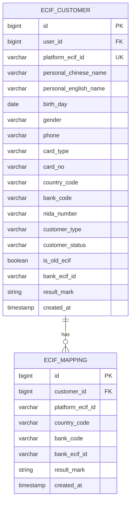
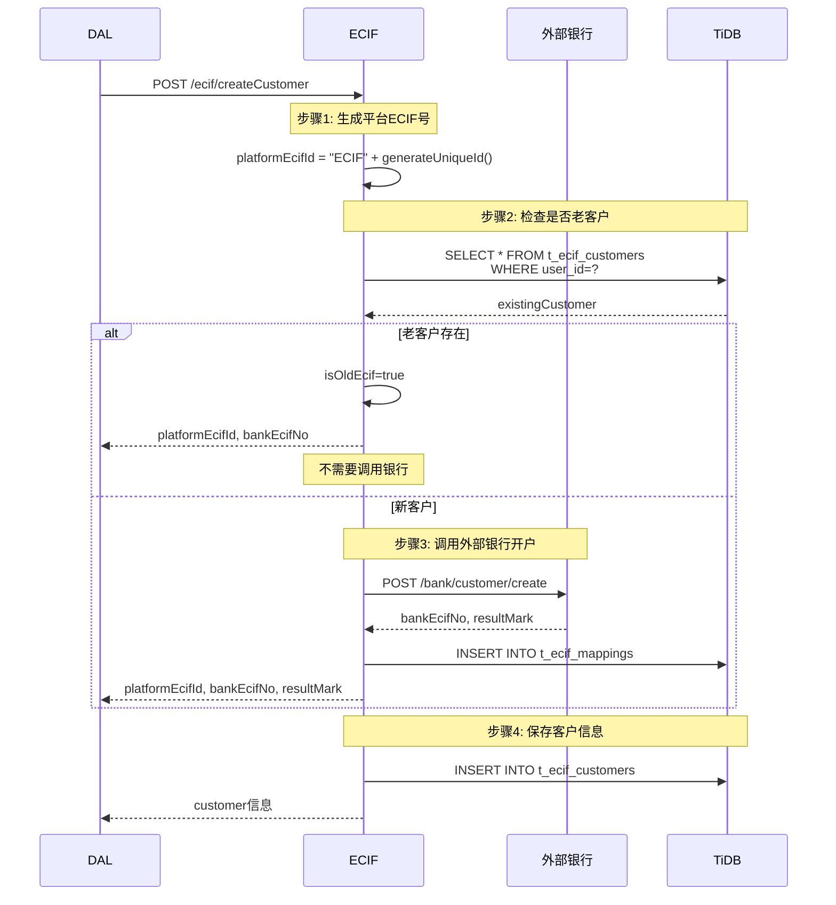
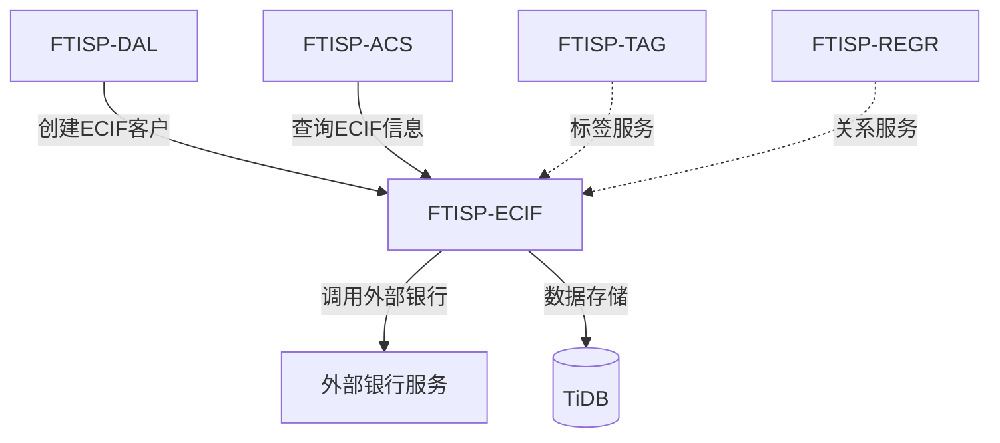

# FTISP-ECIF 系统设计文档 (V3 - Java/TiDB 专用版)

> **子系统编号**: FTISP-ECIF
> **子系统名称**: ECIF Center (ECIF中心)
> **版本**: V1.0
> **设计日期**: 2026-02-11

---

## 0. AI 编码元指令 (System Prompts)

- **角色**: 资深 Java 后端架构师
- **语言标准**: Java 21 (使用 `record`, `var`, `switch expression`, Virtual Threads)
- **构建工具**: Gradle 8.14.4 (Kotlin DSL `build.gradle.kts`)
- **框架规范**: Spring Boot 3.3.8
  - 使用 Spring WebMVC
  - 使用 Jakarta EE 注解 (非 Javax)
  - **API 文档**: 使用 Swagger (SpringDoc) 注解
  - **对象映射**: 使用 MapStruct 处理 Entity <-> DTO 转换
- **数据库规范**:
  - 目标数据库: **TiDB** (兼容 MySQL 5.7+ 协议)
  - **禁止使用物理外键** (使用逻辑外键)
  - 主键策略: 优先使用 `AUTO_RANDOM` 或 `Snowflake ID`，避免单调递增导致的写热点
- **代码风格**: Google Java Style

---

## 1. 概述

### 1.1 目的

FTISP-ECIF (ECIF Center) 是ECIF客户管理中心，负责生成平台ECIF号、调用外部银行开户、存储银行ECIF号映射关系等身份映射管理功能。

### 1.2 范围

| 包含 (In Scope) | 不包含 (Out of Scope) |
|-----------------|-----------------------|
| 平台ECIF号生成 | 客户标签管理 (由TAG系统) |
| 外部银行开户 | 关系图谱 (由REGR系统) |
| 银行ECIF号映射存储 | 银行账户直接管理 (由ACS负责) |
| ECIF客户数据管理 | 存款户/贷款户直接开立 (由ACS负责) |

### 1.3 架构定位

```mermaid
graph TD
    DAL[FTISP-DAL] -->|开户请求| ECIF[FTISP-ECIF<br/>ECIF中心]

    ECIF -->|生成平台ECIF号| INTERNAL[内部生成]
    ECIF -->|调用外部银行| BANK[外部银行服务]

    BANK -->|返回银行ECIF号| ECIF

    ECIF -->|存储映射关系| DB[(TiDB)]

    DB -->|数据表|
        DB1[t_ecif_customers]
        DB2[t_ecif_mappings]

    TAG[FTISP-TAG<br/>标签服务] -->|标签服务| ECIF
    REGR[FTISP-REGR<br/>关系图谱] -->|关系服务| ECIF

    style ECIF fill:#4CAF50,stroke:#2E7D32,stroke-width:3px
```

**ECIF设计原则**：
- **身份映射**: 管理平台ECIF号与银行ECIF号的映射关系
- **多国家多银行**: 支持扩展到不同国家和银行
- **独立演进**: 标签和关系图谱由独立系统演进
- **数据最小化**: 只存储身份映射相关数据

---

## 2. 功能需求

### 2.1 用户故事

| ID | 故事描述 | 优先级 |
|----|----------|--------|
| ECIF-US-001 | 系统能够生成唯一的平台ECIF号 | P0 |
| ECIF-US-002 | 系统能够调用外部银行API开立客户 | P0 |
| ECIF-US-003 | 系统能够存储银行ECIF号与平台ECIF号的映射关系 | P0 |
| ECIF-US-004 | 系统能够根据平台ECIF号查询银行ECIF号 | P0 |
| ECIF-US-005 | 系统能够支持多国家多银行的扩展 | P1 |
| ECIF-US-006 | 系统能够记录所有开户操作的审计日志 | P0 |

---

## 3. API 接口定义 (Spring MVC)

### 3.1 接口清单

> **说明**: 以下接口均为内部接口，仅供DAL或其他授权系统调用

| 方法 | 路径 | 描述 | 调用方 |
|------|------|------|--------|
| POST | `/api/v1/ecif/createCustomer` | 创建ECIF客户 | DAL |
| GET | `/api/v1/internal/ecif/customers/uid/{userId}` | 查询ECIF客户 | DAL |
| GET | `/api/v1/internal/ecif/customers/uid/{userId}/banks` | 查询银行映射列表 | DAL |

### 3.2 接口详情

#### 3.2.1 创建ECIF客户接口

**接口**: `POST /api/v1/ecif/createCustomer`

> **说明**: 组合接口，一次性完成开户和信息绑定

**Request (Java Record)**:
```java
@Schema(description = "创建ECIF客户请求")
public record CreateEcifCustomerRequest(
    // ========== 开户三要素 ==========
    @Schema(description = "姓名", example = "JUMA HAMISI JUMA")
    @NotBlank
    String personalName,

    @Schema(description = "证件号码", example = "19900101123456789012")
    @NotBlank
    String personalIdentificationNumber,

    @Schema(description = "证件类型", example = "2")
    @NotNull
    String personalIdentificationType,

    @Schema(description = "业务类型")
    @NotNull
    String businessType,

    // ========== 客户详细资料（绑定用） ==========
    @Schema(description = "中文姓名")
    String personalChineseName,

    @Schema(description = "英文姓名")
    String personalEnglishName,

    @Schema(description = "出生日期", example = "1990-01-01")
    @NotNull
    String birthDay,

    @Schema(description = "出生国家")
    String birthCountry,

    @Schema(description = "性别", example = "1")
    @NotNull
    String gender,

    @Schema(description = "客户类型", example = "1")
    String customerType,

    @Schema(description = "特殊标识", example = "0")
    String specialInd,

    @Schema(description = "客户使用状态", example = "1")
    String customerUseStatus,

    @Schema(description = "备注")
    String remarks,

    // ========== 联系方式 ==========
    @Schema(description = "电话号码", example = "+255712345678")
    @NotEmpty
    String phone,

    @Schema(description = "国际区号")
    String iddCode,

    @Schema(description = "邮箱")
    String email,

    // ========== 证件信息 ==========
    @Schema(description = "证件类型", example = "2")
    String cardType,

    @Schema(description = "证件号")
    String cardNo,

    // ========== 系统字段 ==========
    @Schema(description = "国家代码")
    String countryCode,

    @Schema(description = "银行代码")
    String bankCode,

    @Schema(description = "NIDA号")
    String nidaNumber
) {}
```

**Response**:
```java
@Schema(description = "创建ECIF客户响应")
public record CreateEcifCustomerResponse(
    @Schema(description = "平台ECIF号")
    String platformEcifId,

    @Schema(description = "银行ECIF号")
    String bankEcifNo,

    @Schema(description = "是否已存在")
    Boolean isOldEcif,

    @Schema(description = "绑定结果标识")
    String resultMark,

    @Schema(description = "客户信息")
    EcifCustomerInfo customer
) {}

@Schema(description = "ECIF客户信息")
public record EcifCustomerInfo(
    Long customerId,
    String platformEcifId,
    String bankEcifNo,
    String personalName,
    String personalIdentificationNumber,
    String customerType,
    String customerStatus
) {}
```

**错误响应**:
```java
// 400 - 参数错误
{
    "code": "INVALID_PARAMETER",
    "message": "参数错误",
    "requestId": "req_123"
}

// 500 - 开户失败
{
    "code": "ECIF_OPEN_FAILED",
    "message": "ECIF开户失败",
    "requestId": "req_123"
}
```

#### 3.2.2 查询ECIF客户接口

**接口**: `GET /api/v1/internal/ecif/customers/uid/{userId}`

**说明**: 根据用户ID查询ECIF客户信息及银行映射列表

**Response**:
```java
@Schema(description = "ECIF客户响应")
public record EcifCustomerResponse(
    @Schema(description = "用户ID（平台ECIF号）")
    Long userId,

    @Schema(description = "手机号")
    String phone,

    @Schema(description = "客户姓名")
    String customerName,

    @Schema(description = "性别")
    String gender,

    @Schema(description = "证件类型")
    String idType,

    @Schema(description = "证件号码")
    String idNumber,

    @Schema(description = "邮箱")
    String email,

    @Schema(description = "客户类型")
    String customerType,

    @Schema(description = "状态")
    String status,

    @Schema(description = "KYC状态")
    String kycStatus,

    @Schema(description = "风险等级")
    String riskLevel,

    @Schema(description = "银行ECIF号列表")
    List<BankMappingDto> bankMappings,

    @Schema(description = "创建时间")
    Instant createdAt,

    @Schema(description = "更新时间")
    Instant updatedAt
) {}

@Schema(description = "银行映射信息")
public record BankMappingDto(
    @Schema(description = "主键ID")
    Long id,

    @Schema(description = "用户ID")
    Long userId,

    @Schema(description = "银行代码")
    String bankCode,

    @Schema(description = "银行ECIF号")
    String bankEcifNo,

    @Schema(description = "银行账户号")
    String bankAccountNo,

    @Schema(description = "账户类型")
    String accountType,

    @Schema(description = "关系类型")
    String relationshipType,

    @Schema(description = "状态")
    String status,

    @Schema(description = "开户时间")
    Instant openedAt,

    @Schema(description = "创建时间")
    Instant createdAt
) {}
```

---

## 4. 数据模型 (TiDB 适配)

### 4.1 实体关系图



### 4.2 表结构定义

#### 4.2.1 ECIF客户表 (t_ecif_customers)

> **设计原则**: ECIF是UAM用户在客户领域的扩展信息，user_id 即为传众ECIF号

| 字段名 | 类型 (TiDB) | 必填 | 索引 | 说明 | **必要性辩护** |
|--------|-------------|------|------|------|--------------|
| `user_id` | `BIGINT` | Y | PK | **用户ID（=传众ECIF号）** | 主键，直接使用UAM的user_id |
| `phone` | `VARCHAR(20)` | Y | IDX | 手机号 | 联系方式 |
| `customer_name` | `VARCHAR(100)` | N | - | 客户姓名 | 客户姓名 |
| `gender` | `VARCHAR(1)` | N | - | 性别 | 1=男, 2=女, 9=其他 |
| `id_type` | `VARCHAR(20)` | N | - | 证件类型 | 证件类型 |
| `id_number` | `VARCHAR(50)` | N | - | 证件号码 | 证件号码 |
| `email` | `VARCHAR(100)` | N | - | 邮箱 | 邮箱地址 |
| `customer_type` | `VARCHAR(20)` | N | - | 客户类型 | TYPE_A/TYPE_B/TYPE_C |
| `status` | `VARCHAR(20)` | N | - | 状态 | ACTIVE/CLOSED |
| `kyc_status` | `VARCHAR(20)` | Y | - | KYC状态 | KYC状态（主数据） |
| `risk_level` | `VARCHAR(20)` | N | - | 风险等级 | 风险等级 |
| `created_at` | `TIMESTAMP` | Y | - | 创建时间 | 审计必需 |
| `updated_at` | `TIMESTAMP` | Y | - | 更新时间 | 审计必需 |

**DDL 示例 (TiDB)**:
```sql
CREATE TABLE t_ecif_customers (
    user_id BIGINT NOT NULL COMMENT '用户ID（来自UAM，即传众ECIF号）',
    phone VARCHAR(20) COMMENT '手机号',
    customer_name VARCHAR(100) COMMENT '客户姓名',
    gender VARCHAR(1) COMMENT '性别: 1=男, 2=女, 9=其他',
    id_type VARCHAR(20) COMMENT '证件类型',
    id_number VARCHAR(50) COMMENT '证件号码',
    email VARCHAR(100) COMMENT '邮箱',
    customer_type VARCHAR(20) COMMENT '客户类型: TYPE_A/TYPE_B/TYPE_C',
    status VARCHAR(20) COMMENT '状态: ACTIVE/CLOSED',
    kyc_status VARCHAR(20) NOT NULL COMMENT 'KYC状态',
    risk_level VARCHAR(20) COMMENT '风险等级',
    created_at TIMESTAMP DEFAULT CURRENT_TIMESTAMP COMMENT '创建时间',
    updated_at TIMESTAMP DEFAULT CURRENT_TIMESTAMP ON UPDATE CURRENT_TIMESTAMP COMMENT '更新时间',
    PRIMARY KEY (user_id),
    INDEX idx_phone (phone)
) ENGINE=InnoDB DEFAULT CHARSET=utf8mb4 COMMENT='ECIF客户主表';
```

**Entity 定义**:
```java
@Entity
@Table(name = "t_ecif_customers")
@EntityListeners(AuditingEntityListener.class)
public class EcifCustomer {
    @Id
    @Column(name = "user_id", nullable = false)
    private Long userId;  // 主键，即传众ECIF号

    @Column(name = "phone")
    private String phone;

    @Column(name = "customer_name")
    private String customerName;

    // ... 其他字段
}
```

**设计说明**：
- **主键即业务ID**：user_id 直接作为主键，无需额外的ecif_no字段
- **一对一关系**：与UAM用户通过user_id直接关联，天然一对一
- **简化查询**：通过user_id直接查询ECIF信息，无需额外映射

#### 4.2.2 银行ECIF映射表 (t_ecif_bank_mappings)

> **必要性分析**: 一个传众客户可以在多家银行开户，每个银行有自己的银行ECIF号

| 字段名 | 类型 (TiDB) | 必填 | 索引 | 说明 | **必要性辩护** |
|--------|-------------|------|------|------|--------------|
| `id` | `BIGINT` | Y | PK | 主键（雪花算法） | 分布式唯一ID |
| `user_id` | `BIGINT` | Y | IDX | 用户ID | 关联UAM/传众ECIF |
| `bank_code` | `VARCHAR(20)` | Y | IDX | 银行代码 | CRDB/NMB/ABC |
| `bank_ecif_no` | `VARCHAR(50)` | Y | - | 银行侧ECIF号 | 银行返回的ECIF号 |
| `bank_account_no` | `VARCHAR(50)` | N | - | 银行账户号 | 银行账户号 |
| `account_type` | `VARCHAR(20)` | N | - | 账户类型 | SAVINGS/CURRENT/CREDIT |
| `relationship_type` | `VARCHAR(20)` | N | - | 关系类型 | PRIMARY/SECONDARY |
| `status` | `VARCHAR(20)` | Y | - | 状态 | ACTIVE/SUSPENDED/CLOSED |
| `opened_at` | `TIMESTAMP` | N | - | 开户时间 | 开户时间 |
| `closed_at` | `TIMESTAMP` | N | - | 销户时间 | 销户时间 |
| `created_at` | `TIMESTAMP` | Y | - | 创建时间 | 审计必需 |
| `updated_at` | `TIMESTAMP` | Y | - | 更新时间 | 审计必需 |

**DDL 示例 (TiDB)**:
```sql
CREATE TABLE t_ecif_bank_mappings (
    id BIGINT NOT NULL COMMENT '主键（雪花算法）',
    user_id BIGINT NOT NULL COMMENT '用户ID（关联UAM/传众ECIF）',
    bank_code VARCHAR(20) NOT NULL COMMENT '银行代码: CRDB/NMB/ABC',
    bank_ecif_no VARCHAR(50) NOT NULL COMMENT '银行侧ECIF号',
    bank_account_no VARCHAR(50) COMMENT '银行账户号',
    account_type VARCHAR(20) COMMENT '账户类型: SAVINGS/CURRENT/CREDIT',
    relationship_type VARCHAR(20) COMMENT '关系类型: PRIMARY/SECONDARY',
    status VARCHAR(20) NOT NULL DEFAULT 'ACTIVE' COMMENT '状态: ACTIVE/SUSPENDED/CLOSED',
    opened_at TIMESTAMP COMMENT '开户时间',
    closed_at TIMESTAMP COMMENT '销户时间',
    created_at TIMESTAMP DEFAULT CURRENT_TIMESTAMP COMMENT '创建时间',
    updated_at TIMESTAMP DEFAULT CURRENT_TIMESTAMP ON UPDATE CURRENT_TIMESTAMP COMMENT '更新时间',
    PRIMARY KEY (id),
    UNIQUE KEY uk_user_bank (user_id, bank_code),
    INDEX idx_user_id (user_id),
    INDEX idx_bank_code (bank_code),
    INDEX idx_bank_ecif_no (bank_ecif_no)
) ENGINE=InnoDB DEFAULT CHARSET=utf8mb4 COMMENT='银行ECIF映射表';
```

**Entity 定义**:
```java
@Entity
@Table(name = "t_ecif_bank_mappings")
@EntityListeners(AuditingEntityListener.class)
public class EcifBankMapping {
    @Id
    @GeneratedValue(strategy = GenerationType.IDENTITY)
    private Long id;

    @Column(name = "user_id", nullable = false)
    private Long userId;

    @Column(name = "bank_code", nullable = false)
    private String bankCode;

    @Column(name = "bank_ecif_no", nullable = false)
    private String bankEcifNo;

    // ... 其他字段
}
```

**设计说明**：
- **一对多关系**：一个user_id可以对应多条银行记录
- **唯一约束**：同一用户在同一银行只能有一条记录(uk_user_bank)
- **支持多银行**：一个传众客户可以在CRDB、NMB、ABC等多家银行开户

    @Column(name = "personal_english_name", length = 100)
    private String personalEnglishName;

    @Column(name = "birth_day", nullable = false)
    private LocalDate birthDay;

    @Column(name = "birth_country", length = 50)
    private String birthCountry;

    @Column(name = "gender", nullable = false, length = 10)
    private String gender;

    @Column(name = "special_ind", length = 10)
    private String specialInd = "0";

    @Column(name = "customer_use_status", length = 20)
    private String customerUseStatus = "1";

    @Column(name = "remarks", length = 500)
    private String remarks;

    @Column(name = "financial_contract", length = 50)
    private String financialContract;

    @Column(name = "ekyc_qa_remarks", length = 500)
    private String ekycQaRemarks;

    @Column(name = "verified_en_address", length = 200)
    private String verifiedEnAddress;

    @Column(name = "degree", length = 50)
    private String degree;

    @Column(name = "staff_type", length = 50)
    private String staffType;

    @Column(name = "user_privacy_policy", length = 50)
    private String userPrivacyPolicy;

    @Column(name = "phone", nullable = false, length = 20)
    private String phone;

    @Column(name = "idd_code", length = 10)
    private String iddCode;

    @Column(name = "email", length = 100)
    private String email;

    @Column(name = "card_type", length = 10)
    private String cardType;

    @Column(name = "card_no", length = 50)
    private String cardNo;

    @Column(name = "country_code", length = 10)
    private String countryCode;

    @Column(name = "bank_code", length = 20)
    private String bankCode;

    @Column(name = "customer_type", nullable = false, length = 20)
    @Enumerated(EnumType.STRING)
    private CustomerType customerType = CustomerType.INDIVIDUAL;

    @Column(name = "customer_status", nullable = false, length = 20)
    @Enumerated(EnumType.STRING)
    private CustomerStatus customerStatus = CustomerStatus.ACTIVE;

    @Column(name = "nida_number", length = 30)
    private String nidaNumber;

    @Column(name = "is_old_ecif")
    private Boolean isOldEcif = false;

    @Column(name = "bank_ecif_id", length = 50)
    private String bankEcifId;

    @Column(name = "result_mark", length = 50)
    private String resultMark;

    @Column(name = "latest_open_date")
    private Instant latestOpenDate;

    @Column(name = "latest_close_date")
    private Instant latestCloseDate;

    @Column(name = "created_at", updatable = false)
    private Instant createdAt;

    @Column(name = "updated_at")
    private Instant updatedAt;
}

public enum CustomerType {
    INDIVIDUAL, CORPORATE
}

public enum CustomerStatus {
    ACTIVE, SUSPENDED, CLOSED
}
```

#### 4.2.2 ECIF映射表 (t_ecif_mappings)

> **必要性分析**: 存储平台ECIF号与银行ECIF号的映射关系，支持多国家多银行扩展

| 字段名 | 类型 (TiDB) | 必填 | 索引 | 说明 | **必要性辩护** |
|--------|-------------|------|------|------|--------------|
| `id` | `BIGINT` | Y | PK | 主键 | 使用 `AUTO_RANDOM` |
| `customer_id` | `BIGINT` | Y | IDX | 客户ID | 关联t_ecif_customers |
| `platform_ecif_id` | `VARCHAR(50)` | Y | IDX | 平台ECIF号 | 内部生成 |
| `country_code` | `VARCHAR(10)` | Y | IDX | 国家代码 | ISO国家代码 |
| `bank_code` | `VARCHAR(20)` | Y | IDX | 银行代码 | 银行代码 |
| `bank_ecif_id` | `VARCHAR(50)` | Y | - | 银行ECIF号 | 外部银行返回 |
| `result_mark` | `VARCHAR(50)` | Y | - | 绑定结果标识 | 绑定操作结果 |
| `created_at` | `TIMESTAMP` | Y | - | 创建时间 | 审计必需 |
| `updated_at` | `TIMESTAMP` | Y | - | 更新时间 | 审计必需 |

**DDL 示例 (TiDB)**:
```sql
CREATE TABLE t_ecif_mappings (
    id BIGINT PRIMARY KEY /*T![auto_rand] AUTO_RANDOM(5) */,
    customer_id BIGINT NOT NULL,
    platform_ecif_id VARCHAR(50) NOT NULL,
    country_code VARCHAR(10) NOT NULL,
    bank_code VARCHAR(20) NOT NULL,
    bank_ecif_id VARCHAR(50),
    result_mark VARCHAR(50),
    created_at TIMESTAMP DEFAULT CURRENT_TIMESTAMP,
    updated_at TIMESTAMP DEFAULT CURRENT_TIMESTAMP ON UPDATE CURRENT_TIMESTAMP,
    INDEX idx_platform_ecif_id (platform_ecif_id),
    INDEX idx_country_bank (country_code, bank_code),
    INDEX idx_customer_id (customer_id)
) COMMENT='ECIF映射表';
```

**Entity 定义**:
```java
@Entity
@Table(name = "t_ecif_mappings")
public class EcifMapping {
    @Id
    @GeneratedValue(strategy = GenerationType.IDENTITY)
    private Long id;

    @Column(name = "customer_id", nullable = false)
    private Long customerId;

    @Column(name = "platform_ecif_id", nullable = false, length = 50)
    private String platformEcifId;

    @Column(name = "country_code", nullable = false, length = 10)
    private String countryCode;

    @Column(name = "bank_code", nullable = false, length = 20)
    private String bankCode;

    @Column(name = "bank_ecif_id", length = 50)
    private String bankEcifId;

    @Column(name = "result_mark", length = 50)
    private String resultMark;

    @Column(name = "created_at", updatable = false)
    private Instant createdAt;

    @Column(name = "updated_at")
    private Instant updatedAt;
}
```

---

## 5. 存储选型分析

> **说明**: ECIF系统仅使用TiDB存储，无需Redis缓存

---

## 6. 业务流程

### 6.1 创建ECIF客户流程



---

## 7. 子系统间交互

### 7.1 依赖关系图



### 7.2 ECIF → 调用外部银行 (HTTP 同步)

| 本地方法 | 目标银行 | 目标接口 | 调用时机 | 说明 |
|----------|---------|----------|----------|------|
| `createCustomer()` | 坦桑尼亚银行 | `POST /bank/customer/create` | 开立新客户 | 调用银行API |
| `queryCustomer()` | 坦桑尼亚银行 | `POST /bank/customer/query` | 查询客户 | 根据证件号查询 |
| `bindAccount()` | 坦桑尼亚银行 | `POST /bank/account/bind` | 绑定账户 | 绑定银行账户 |

**HTTP 客户端配置**:
```java
@Configuration
public class BankClientConfig {

    @Bean
    public WebClient bankWebClient(String countryCode, String bankCode) {
        return WebClient.builder()
            .codecs(configurer -> configurer
                .defaultCodecs()
                .maxInMemorySize(10 * 1024 * 1024))
            .clientConnector(new ReactorClientHttpConnector(
                HttpClient.create()
                    .option(ChannelOption.CONNECT_TIMEOUT_MILLIS, 10000)
                    .responseTimeout(Duration.ofSeconds(30))
            ))
            .baseUrl(getBankBaseUrl(countryCode, bankCode))
            .build();
    }

    private String getBankBaseUrl(String countryCode, String bankCode) {
        // 根据国家代码和银行代码配置不同银行API地址
        // 实际实现中从配置或数据库读取
        return switch (countryCode + ":" + bankCode) {
            case "TZ:CRDB" -> "https://bank.tz.crdb.co.tz/api/v1":
            case "TZ:NMB" -> "https://bank.tz.nmb.co.tz/api/v1":
            default -> throw new IllegalArgumentException("Unsupported bank: " + countryCode + ":" + bankCode);
        };
    }
}
```

---

## 8. 技术选型 (已锁定)

### 8.1 核心栈

| 组件 | 版本/选型 | 备注 |
|------|-----------|------|
| JDK | **OpenJDK 21** | LTS, 使用 Virtual Threads |
| Framework | **Spring Boot 3.3.8** | 核心框架 |
| Build | **Gradle 8.14.4** | Kotlin DSL |
| DB | **TiDB** | 分布式关系型数据库 |
| ORM | Spring Data JPA | 数据访问 |

### 8.2 项目结构

```text
ftisp-ecif/
├── build.gradle.kts
├── settings.gradle.kts
└── src/
    └── main/
        ├── java/
        │   └── com/
        │       └── ftisp/
        │           └── ecif/
        │               ├── EcifApplication.java
        │               ├── config/
        │               │   ├── JpaConfig.java
        │               │   └── BankConfig.java
        │               ├── controller/
        │               │   └── InternalEcifController.java
        │               ├── service/
        │               │   ├── EcifCustomerService.java
        │               │   ├── BankService.java
        │               │   └── MappingService.java
        │               ├── client/
        │               │   ├── BankClientFactory.java
        │               │   └── BankClient.java
        │               ├── repository/
        │               │   ├── EcifCustomerRepository.java
        │               │   └── EcifMappingRepository.java
        │               ├── model/
        │               │   ├── entity/
        │               │   │   ├── EcifCustomer.java
        │               │   │   └── EcifMapping.java
        │               │   └── dto/
        │               │       ├── request/
        │               │       └── response/
        │               └── enums/
        └── resources/
            ├── application.yml
            └── logback-spring.xml
```

---

## 9. 配置与环境

### 9.1 application.yml 关键配置

```yaml
spring:
  application:
    name: ftisp-ecif

  # 数据源配置
  datasource:
    url: jdbc:mysql://${TIDB_HOST:localhost}:4000/${DB_NAME:ftisp_ecif}?useSSL=false&useServerPrepStmts=true&prepStmtCacheSqlLimit=2048&prepStmtCacheSize=250
    username: ${DB_USER:root}
    password: ${DB_PASSWORD:}
    driver-class-name: com.mysql.cj.jdbc.Driver
    hikari:
      maximum-pool-size: 20
      minimum-idle: 5
      connection-timeout: 30000

  # JPA配置
  jpa:
    hibernate:
      ddl-auto: none
    show-sql: false
    database-platform: org.hibernate.dialect.TiDBDialect

# 银行配置
banks:
  base-url: ${BANK_BASE_URL:https://bank.example.com/api}
  default:
    country-code: TZ
    bank-code: CRDB
    timeout: 30000

# ECIF配置
ecif:
  ecif-id-prefix: ECIF
  platform-id: FTISP
  allowed-countries: TZ, KE
  max-retry: 3
  retry-delay-seconds: 5

# 监控配置
management:
  endpoints:
    web:
      exposure:
        include: health,info,metrics,prometheus
  metrics:
    export:
      prometheus:
        enabled: true
```

---

## 10. 安全与权限

### 10.1 内部接口鉴权

```java
@Configuration
public class InternalApiSecurityConfig {

    @Value("${ecif.internal.api.key}")
    private String internalApiKey;

    @Bean
    public SecurityFilterChain ecifInternalApiFilterChain(HttpSecurity http) throws Exception {
        return http
            .securityMatcher("/api/v1/ecif/**")
            .authorizeHttpRequests(auth -> auth
                .anyRequest().hasRole("INTERNAL_SERVICE"))
            .addFilterBefore(new InternalApiKeyFilter(internalApiKey), SecurityContextHolderFilter.class)
            .csrf(csrf -> csrf.disable())
            .sessionManagement(session -> session
                .sessionCreationPolicy(SessionCreationPolicy.STATELESS))
            .build();
    }
}
```

---

## 16. 附录

### A. 相关文档

- [FTISP-DAL系统设计文档](./FTISP-DAL-系统设计文档.md)
- [FTISP-ACS系统设计文档](./FTISP-ACS-系统设计文档.md)
- [FTISP-UAM系统设计文档](./FTISP-UAM-系统设计文档.md)

### B. 变更历史

| 版本 | 日期 | 变更内容 | 作者 |
|------|------|----------|------|
| 1.0 | 2026-02-11 | 初始版本 | Claude |

### C. 待定事项 (TBD)

| ID | 待定项 | 负责人 | 状态 |
|----|--------|--------|------|
| TBD-ECIF-001 | 外部银行API最终确定 | - | 待确认 |
| TBD-ECIF-002 | 多国家多银行扩展方案 | - | 待确认 |
