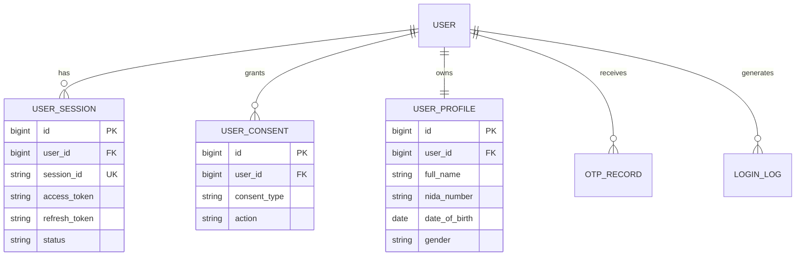
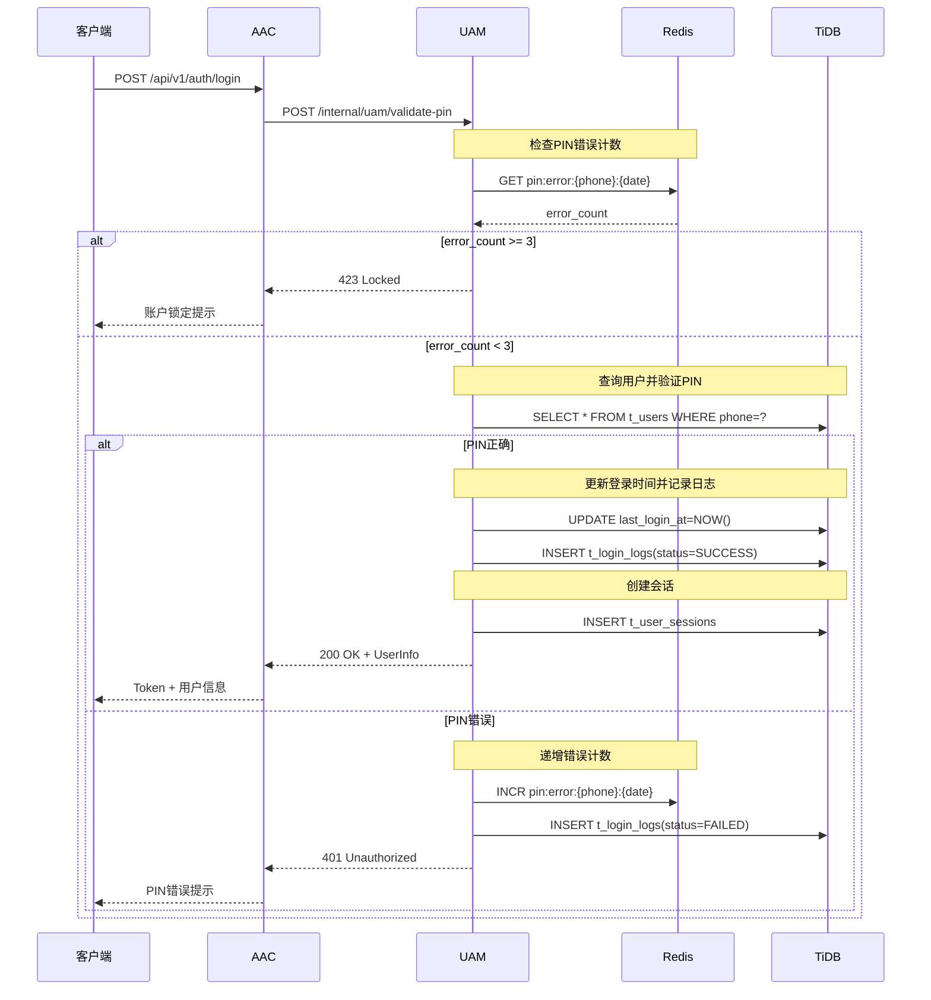
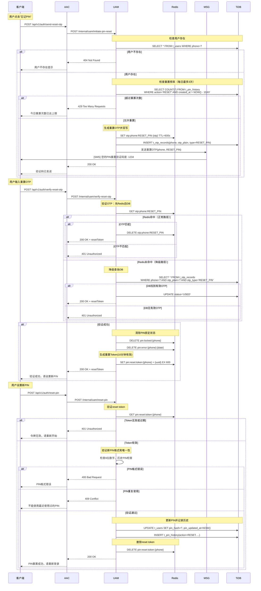
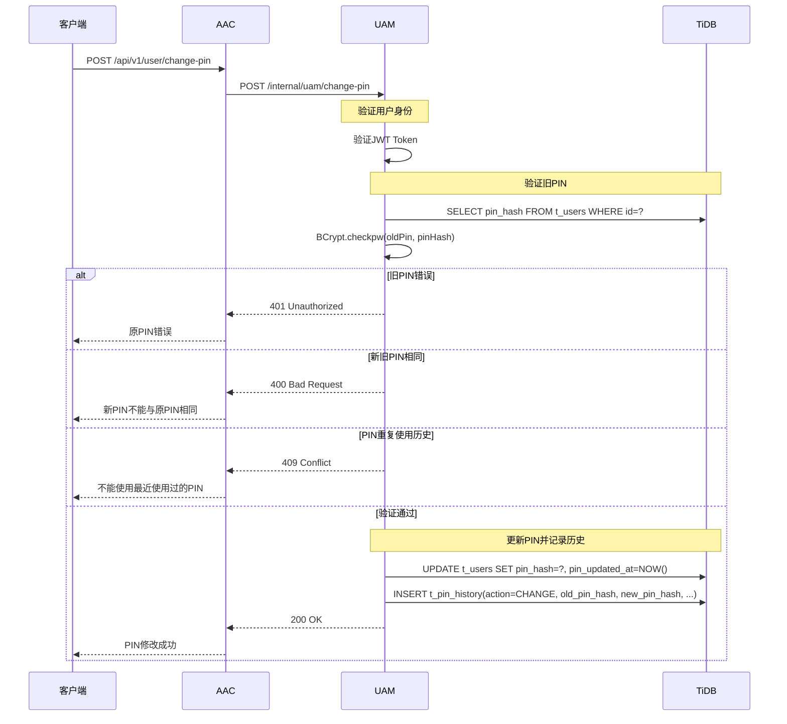
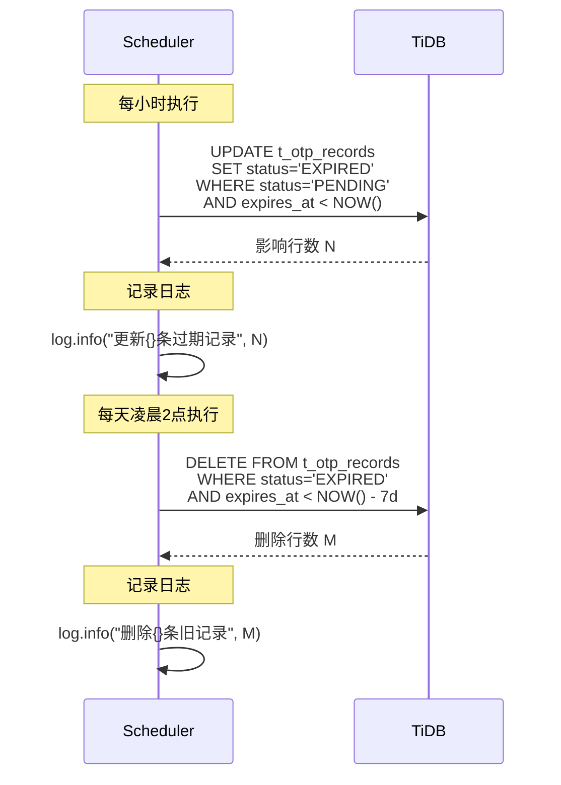
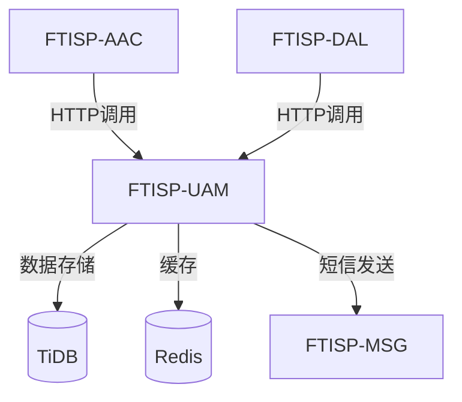

# FTISP-UAM 系统设计文档 (V3 - Java/TiDB 专用版)

> **子系统编号**: FTISP-UAM
> **子系统名称**: User Auth Management (用户认证管理)
> **版本**: V1.0
> **设计日期**: 2026-02-11

---

## 0. AI 编码元指令 (System Prompts)

- **角色**: 资深 Java 后端架构师
- **语言标准**: Java 21 (使用 `record`, `var`, `switch expression`, Virtual Threads)
- **构建工具**: Gradle 8.14.4 (Kotlin DSL `build.gradle.kts`)
- **框架规范**: Spring Boot 3.3.8
  - 使用 Spring Data JPA + TiDB
  - 使用 Jakarta EE 注解 (非 Javax)
  - **API 文档**: 使用 Swagger (SpringDoc) 注解
  - **对象映射**: 使用 MapStruct 处理 Entity <-> DTO 转换
- **数据库规范**:
  - 目标数据库: **TiDB** (兼容 MySQL 5.7+ 协议)
  - **禁止使用物理外键** (使用逻辑外键)
  - 主键策略: 优先使用 `AUTO_RANDOM` 或 `Snowflake ID`，避免单调递增导致的写热点
- **代码风格**: Google Java Style

---

## 1. 概述

### 1.1 目的

FTISP-UAM (User Auth Management) 是用户认证与数据管理核心系统，负责用户身份认证、用户资料管理、会话管理、授权记录、PIN管理等核心用户数据。

### 1.2 范围

| 包含 (In Scope) | 不包含 (Out of Scope) |
|-----------------|-----------------------|
| 用户主数据管理 | OCR识别 (由KYC负责) |
| PIN/OTP认证 | 活体检测 (由KYC负责) |
| 会话生命周期管理 | NIDA联网核查 (由KYC负责) |
| 用户授权记录管理 | 风控评估 (由风控系统负责) |
| OTP生成与验证 | 银行账户开户 (由ACS负责) |
| 登录日志与审计 | ECIF客户管理 (由ECIF负责) |

### 1.3 架构定位

```mermaid
graph TD
    AAC[FTISP-AAC<br/>鉴权中心] -->|认证操作| UAM[FTISP-UAM<br/>用户认证管理]

    UAM -->|数据存储| DB[(TiDB)]
    UAM -->|缓存| R[(Redis)]
    UAM -->|短信发送| MSG[FTISP-MSG]

    DB -->|数据表|
        DB1[t_users]
        DB2[t_user_profiles]
        DB3[t_user_sessions]
        DB4[t_otp_records]
        DB5[t_user_consents]
        DB6[t_login_logs]

    style UAM fill:#4CAF50,stroke:#2E7D32,stroke-width:3px
```

**UAM数据归属**：
- 所有用户核心数据表由UAM管理
- AAC通过内部调用接口访问UAM
- 业务系统通过AAC间接访问用户数据

---

## 2. 功能需求

### 2.1 用户故事

| ID | 故事描述 | 优先级 |
|----|----------|--------|
| UAM-US-001 | 系统能够创建新用户记录 | P0 |
| UAM-US-002 | 用户能够使用6位PIN码登录 | P0 |
| UAM-US-003 | 用户能够使用OTP验证码登录 | P0 |
| UAM-US-004 | 系统能够生成和验证OTP | P0 |
| UAM-US-005 | 系统能够创建和管理用户会话 | P0 |
| UAM-US-006 | 系统能够记录用户登录日志 | P0 |
| UAM-US-007 | 用户能够设置和重置PIN码 | P0 |
| UAM-US-008 | 系统能够管理用户授权记录 | P0 |
| UAM-US-009 | 系统能够验证用户权限边界 | P0 |
| UAM-US-010 | 系统能够处理PIN错误锁定 | P0 |
| UAM-US-011 | 用户能够更换绑定手机号 | P1 |
| UAM-US-012 | 系统能够管理多设备会话 | P1 |
| UAM-US-013 | **系统能够自动清理过期的OTP记录** | P0 |

---

## 3. API 接口定义 (Spring MVC)

### 3.1 内部接口清单

> **说明**: 以下接口仅供AAC或其他授权系统调用，不对外暴露

| 方法 | 路径 | 描述 | 调用方 |
|------|------|------|--------|
| POST | `/api/v1/internal/uam/send-otp` | 发送OTP | AAC |
| POST | `/api/v1/internal/uam/verify-otp` | 验证OTP | AAC |
| POST | `/api/v1/internal/uam/validate-pin` | 验证PIN | AAC |
| POST | `/api/v1/internal/uam/create-session` | 创建会话 | AAC |
| POST | `/api/v1/internal/uam/refresh-token` | 刷新Token | AAC |
| POST | `/api/v1/internal/uam/initiate-pin-reset` | 发起PIN重置(发送OTP) | AAC |
| POST | `/api/v1/internal/uam/verify-reset-otp` | 验证重置OTP | AAC |
| POST | `/api/v1/internal/uam/reset-pin` | 重置PIN | AAC |
| POST | `/api/v1/internal/uam/change-pin` | 修改PIN | AAC |
| GET | `/api/v1/internal/uam/users/{id}` | 获取用户信息 | AAC |
| PUT | `/api/v1/internal/uam/users/{id}/pin` | 首次设置PIN | AAC |
| GET | `/api/v1/internal/uam/users/{id}/sessions` | 获取用户会话 | AAC |
| DELETE | `/api/v1/internal/uam/sessions/{id}` | 注销会话 | AAC |
| POST | `/api/v1/internal/uam/consents` | 保存授权记录 | DAL |
| PUT | `/api/v1/internal/uam/users/{id}/profile` | 保存用户资料 | DAL |
| PUT | `/api/v1/internal/uam/users/{id}/status` | 更新用户状态 | DAL |
| GET | `/api/v1/internal/uam/users/phone/{phone}` | 根据手机号查询用户 | AAC |

### 3.2 接口详情

#### 3.2.1 发送OTP接口

**接口**: `POST /api/v1/internal/uam/send-otp`

**Request (Java Record)**:
```java
@Schema(description = "发送OTP请求")
public record InternalSendOtpRequest(
    @Schema(description = "手机号 (+255格式)", example = "+255712345678")
    @NotBlank
    @Pattern(regexp = "^(\\+255)?[67]\\d{8}$")
    String phone,

    @Schema(description = "OTP类型")
    @NotNull
    OtpType type
) {}

public enum OtpType {
    REGISTER,   // 注册
    LOGIN,      // 登录
    RESET_PIN   // 重置PIN
}
```

**Response**:
```java
@Schema(description = "发送OTP响应")
public record SendOtpResponse(
    @Schema(description = "OTP记录ID")
    Long otpId,

    @Schema(description = "提示消息")
    String message,

    @Schema(description = "有效期(秒)", example = "60")
    Long expiresInSeconds
) {}
```

#### 3.2.2 验证OTP接口

**接口**: `POST /api/v1/internal/uam/verify-otp`

**Request (Java Record)**:
```java
@Schema(description = "验证OTP请求")
public record InternalVerifyOtpRequest(
    @Schema(description = "手机号")
    @NotBlank
    String phone,

    @Schema(description = "4位验证码", example = "1234")
    @NotBlank
    @Pattern(regexp = "^\\d{4}$")
    String otp,

    @Schema(description = "OTP类型")
    @NotNull
    OtpType type
) {}
```

**Response**:
```java
@Schema(description = "验证OTP响应")
public record VerifyOtpResponse(
    @Schema(description = "是否验证成功")
    Boolean verified,

    @Schema(description = "用户信息（验证成功时返回）")
    UserInfo userInfo
) {}
```

#### 3.2.3 验证PIN接口

**接口**: `POST /api/v1/internal/uam/validate-pin`

**Request (Java Record)**:
```java
@Schema(description = "PIN登录验证请求")
public record InternalPinValidationRequest(
    @Schema(description = "手机号")
    @NotBlank
    String identifier,

    @Schema(description = "6位PIN码", example = "123456")
    @NotBlank
    @Size(min = 6, max = 6)
    String pin
) {}
```

**Response**:
```java
@Schema(description = "PIN验证响应")
public record PinValidationResponse(
    @Schema(description = "是否验证成功")
    Boolean validated,

    @Schema(description = "用户信息（验证成功时返回）")
    UserInfo userInfo,

    @Schema(description = "剩余尝试次数（验证失败时）")
    Integer remainingAttempts
) {}
```

#### 3.2.4 创建会话接口

**接口**: `POST /api/v1/internal/uam/create-session`

**Request (Java Record)**:
```java
@Schema(description = "创建会话请求")
public record CreateSessionRequest(
    @Schema(description = "用户ID")
    @NotNull
    Long userId,

    @Schema(description = "设备唯一标识")
    String deviceId,

    @Schema(description = "设备类型")
    DeviceType deviceType,

    @Schema(description = "设备信息(JSON)")
    String deviceInfo,

    @Schema(description = "IP地址")
    String ipAddress,

    @Schema(description = "User-Agent")
    String userAgent
) {}
```

**Response**:
```java
@Schema(description = "会话创建响应")
public record CreateSessionResponse(
    @Schema(description = "会话ID")
    String sessionId,

    @Schema(description = "访问令牌")
    String accessToken,

    @Schema(description = "刷新令牌")
    String refreshToken,

    @Schema(description = "过期时间(秒)")
    Long expiresIn
) {}
```

#### 3.2.5 保存用户资料接口

**接口**: `PUT /api/v1/internal/uam/users/{id}/profile`

**Request (Java Record)**:
```java
@Schema(description = "用户资料")
public record UserProfileRequest(
    @Schema(description = "姓名", example = "JUMA HAMISI JUMA")
    @NotBlank
    String fullName,

    @Schema(description = "NIDA身份证号", example = "19900101-12345-12345-01")
    @NotBlank
    String nidaNumber,

    @Schema(description = "出生日期", example = "1990-01-01")
    @NotNull
    LocalDate dateOfBirth,

    @Schema(description = "性别")
    @NotNull
    Gender gender,

    @Schema(description = "地址")
    String addressLine1,

    @Schema(description = "城市")
    String city,

    @Schema(description = "地区")
    String region
) {}

public enum Gender {
    MALE, FEMALE, OTHER
}
```

**Response**:
```java
@Schema(description = "保存用户资料响应")
public record SaveProfileResponse(
    @Schema(description = "资料ID")
    Long profileId,

    @Schema(description = "提示消息")
    String message
) {}
```

#### 3.2.6 保存授权记录接口

**接口**: `POST /api/v1/internal/uam/consents`

**Request (Java Record)**:
```java
@Schema(description = "授权记录请求")
public record SaveConsentsRequest(
    @Schema(description = "用户ID")
    @NotNull
    Long userId,

    @Schema(description = "授权列表")
    @NotEmpty
    List<ConsentRecord> consents
) {}

@Schema(description = "授权记录")
public record ConsentRecord(
    @Schema(description = "授权类型")
    @NotNull
    ConsentType consentType,

    @Schema(description = "授权名称")
    String consentName,

    @Schema(description = "是否必需")
    Boolean isRequired,

    @Schema(description = "操作类型")
    ConsentAction action
) {}

public enum ConsentType {
    CREDIT_BUREAU,      // 征信查询
    TERMS_OF_USE,        // 用户协议
    PRIVACY_POLICY,      // 隐私政策
    SAVINGS_AGREEMENT,   // 开户协议
    LOCATION             // 地理位置
}

public enum ConsentAction {
    GRANTED,    // 同意
    REVOKED,    // 撤回
    DENIED,     // 拒绝
    PRE_AGREED  // 预同意（发送OTP前）
}
```

#### 3.2.7 更新用户状态接口

**接口**: `PUT /api/v1/internal/uam/users/{id}/status`

**Request (Java Record)**:
```java
@Schema(description = "更新用户状态请求")
public record UpdateUserStatusRequest(
    @Schema(description = "用户类型")
    UserType userType,

    @Schema(description = "KYC状态")
    KycStatus kycStatus,

    @Schema(description = "平台ECIF号")
    String platformEcifId,

    @Schema(description = "分配的国家代码")
    String allocatedCountryCode,

    @Schema(description = "分配的银行代码")
    String allocatedBankCode
) {}

public enum UserType {
    NEW, STARTER, TYPE_A, TYPE_B, TYPE_C, OVERDUE
}

public enum KycStatus {
    PENDING, APPROVED, REJECTED
}
```

#### 3.2.8 获取用户信息接口

**接口**: `GET /api/v1/internal/uam/users/{id}`

**Response**:
```java
@Schema(description = "用户完整信息响应")
public record UserDetailResponse(
    Long userId,
    String phone,
    String nidaNumber,
    UserType userType,
    KycStatus kycStatus,
    String platformEcifId,
    UserProfile profile,
    List<ConsentRecord> consents,
    Instant createdAt
) {}
```

#### 3.2.9 Security Deposit 集成说明

> **说明**: Security Deposit (保证金冻结提额) 模块的用户类型管理

对于 Security Deposit 功能，UAM 需要提供以下支持：

| 需求 | 接口 | 说明 |
|------|------|------|
| **查询用户类型** | `GET /api/v1/internal/uam/users/{id}` | DAL 需要确认用户为 TYPE_C 才能进行 Security Deposit |
| **查询用户信息** | `GET /api/v1/internal/uam/users/{id}` | DAL 需要获取用户基本信息 |

**不需要更新用户类型**: Security Deposit 提额后，用户类型保持 TYPE_C 不变，授信额度由 DRE 单独管理。

**数据职责划分**:
- **UAM**: 维护用户类型 (TYPE_A/B/C) - 身份属性
- **DRE**: 维护授信额度 (cb_limit/shield_limit/prime_limit) - 业务数据

#### 3.2.10 设置PIN接口

**接口**: `POST /api/v1/internal/uam/users/{id}/pin`

**Request (Java Record)**:
```java
@Schema(description = "设置PIN请求")
public record SetPinRequest(
    @Schema(description = "6位PIN码", example = "123456")
    @NotBlank
    @Size(min = 6, max = 6)
    String pin,

    @Schema(description = "确认PIN码")
    @NotBlank
    @Size(min = 6, max = 6)
    String confirmPin
) {}
```

**Response**:
```java
@Schema(description = "设置PIN响应")
public record SetPinResponse(
    @Schema(description = "提示消息")
    String message
) {}
```

#### 3.2.10 发起PIN重置接口

> **说明**: 用户忘记PIN时，点击"忘记PIN"入口，发起重置流程

**接口**: `POST /api/v1/internal/uam/initiate-pin-reset`

**Request (Java Record)**:
```java
@Schema(description = "发起PIN重置请求")
public record InitiatePinResetRequest(
    @Schema(description = "手机号 (+255格式)", example = "+255712345678")
    @NotBlank
    @Pattern(regexp = "^(\\+255)?[67]\\d{8}$")
    String phone,

    @Schema(description = "IP地址（安全审计）")
    String ipAddress,

    @Schema(description = "设备ID（安全审计）")
    String deviceId
) {}
```

**Response**:
```java
@Schema(description = "发起PIN重置响应")
public record InitiatePinResetResponse(
    @Schema(description = "是否成功")
    boolean success,

    @Schema(description = "提示消息")
    String message,

    @Schema(description = "剩余重试次数")
    Integer remainingAttempts,

    @Schema(description = "OTP过期时间（秒）")
    Integer expiresIn
) {}
```

**错误码**:
| 错误码 | 说明 |
|--------|------|
| USER_NOT_FOUND | 用户不存在 |
| RESET_LIMIT_EXCEEDED | 今日重置次数已达上限 |

---

#### 3.2.11 验证重置OTP接口

> **说明**: 验证重置OTP，验证通过后清除PIN锁定状态

**接口**: `POST /api/v1/internal/uam/verify-reset-otp`

**Request (Java Record)**:
```java
@Schema(description = "验证重置OTP请求")
public record VerifyResetOtpRequest(
    @Schema(description = "手机号 (+255格式)", example = "+255712345678")
    @NotBlank
    String phone,

    @Schema(description = "重置OTP验证码", example = "123456")
    @NotBlank
    @Size(min = 6, max = 6)
    String otp
) {}
```

**Response**:
```java
@Schema(description = "验证重置OTP响应")
public record VerifyResetOtpResponse(
    @Schema(description = "是否成功")
    boolean success,

    @Schema(description = "提示消息")
    String message,

    @Schema(description = "重置令牌（用于设置新PIN）")
    String resetToken,

    @Schema(description = "令牌有效期（秒）")
    Integer tokenExpiresIn
) {}
```

**错误码**:
| 错误码 | 说明 |
|--------|------|
| OTP_INVALID | 验证码错误 |
| OTP_EXPIRED | 验证码已过期 |

---

#### 3.2.12 重置PIN接口

> **说明**: 在OTP验证通过后，使用resetToken设置新的PIN

**接口**: `POST /api/v1/internal/uam/reset-pin`

**Request (Java Record)**:
```java
@Schema(description = "重置PIN请求")
public record ResetPinRequest(
    @Schema(description = "手机号 (+255格式)", example = "+255712345678")
    @NotBlank
    String phone,

    @Schema(description = "重置令牌")
    @NotBlank
    String resetToken,

    @Schema(description = "新PIN码（6位数字）", example = "654321")
    @NotBlank
    @Pattern(regexp = "\\d{6}", message = "PIN必须是6位数字")
    String newPin,

    @Schema(description = "确认新PIN码")
    @NotBlank
    String confirmNewPin,

    @Schema(description = "IP地址（安全审计）")
    String ipAddress,

    @Schema(description = "设备ID（安全审计）")
    String deviceId
) {}
```

**Response**:
```java
@Schema(description = "重置PIN响应")
public record ResetPinResponse(
    @Schema(description = "是否成功")
    boolean success,

    @Schema(description = "提示消息")
    String message
) {}
```

**错误码**:
| 错误码 | 说明 |
|--------|------|
| INVALID_RESET_TOKEN | 重置令牌无效或已过期 |
| INVALID_PIN_FORMAT | PIN格式错误 |
| PIN_REUSED | 不能使用最近使用过的PIN |

---

#### 3.2.13 修改PIN接口

> **说明**: 用户已知当前PIN，主动修改PIN

**接口**: `POST /api/v1/internal/uam/change-pin`

**Request (Java Record)**:
```java
@Schema(description = "修改PIN请求")
public record ChangePinRequest(
    @Schema(description = "用户ID")
    @NotNull
    Long userId,

    @Schema(description = "原PIN码", example = "123456")
    @NotBlank
    String oldPin,

    @Schema(description = "新PIN码（6位数字）", example = "654321")
    @NotBlank
    @Pattern(regexp = "\\d{6}", message = "PIN必须是6位数字")
    String newPin,

    @Schema(description = "IP地址（安全审计）")
    String ipAddress,

    @Schema(description = "设备ID（安全审计）")
    String deviceId
) {}
```

**Response**:
```java
@Schema(description = "修改PIN响应")
public record ChangePinResponse(
    @Schema(description = "是否成功")
    boolean success,

    @Schema(description = "提示消息")
    String message
) {}
```

**错误码**:
| 错误码 | 说明 |
|--------|------|
| INVALID_OLD_PIN | 原PIN错误 |
| SAME_PIN | 新PIN不能与原PIN相同 |
| PIN_REUSED | 不能使用最近使用过的PIN |

---

#### 3.2.14 PIN历史查询接口

> **说明**: 查询用户PIN变更历史（审计用）

**接口**: `GET /api/v1/internal/uam/users/{id}/pin-history`

**Request**:
```java
// 路径参数
@PathVariable Long id  // 用户ID
```

**Response**:
```java
@Schema(description = "PIN历史记录")
public record PinHistoryResponse(
    @Schema(description = "操作类型")
    String action,        // SET/RESET/CHANGE

    @Schema(description = "操作来源")
    String createdBy,      // USER/ADMIN/RESET_FLOW

    @Schema(description = "操作原因")
    String reason,

    @Schema(description = "操作时间")
    Instant createdAt
) {}
```

---

## 4. 数据模型 (TiDB 适配)

### 4.1 实体关系图 (Mermaid ER)



### 4.2 表结构定义

#### 4.2.1 用户主表 (t_users)

> **必要性分析**: 存储用户核心身份数据，所有业务系统的用户基础

| 字段名 | 类型 (TiDB) | 必填 | 索引 | 说明 | **必要性辩护** |
|--------|-------------|------|------|------|--------------|
| `id` | `BIGINT` | Y | PK | 主键 | 使用 `AUTO_RANDOM` 避免热点 |
| `phone` | `VARCHAR(20)` | Y | UK | 手机号 | 唯一标识，用于登录 |
| `pin_hashed` | `VARCHAR(255)` | N | - | BCrypt加密的PIN | 安全存储密码 |
| `user_type` | `VARCHAR(20)` | Y | IDX | 用户类型 | NEW/STARTER/TYPE_A/B/C |
| `kyc_status` | `VARCHAR(20)` | Y | IDX | KYC状态 | PENDING/APPROVED/REJECTED |
| `nida_number` | `VARCHAR(30)` | N | UK | NIDA身份证号 | KYC后填入，唯一 |
| `platform_ecif_id` | `VARCHAR(50)` | N | IDX | 平台ECIF号 | 关联ECIF系统 |
| `allocated_country_code` | `VARCHAR(10)` | N | - | 分配国家代码 | 多国家部署 |
| `allocated_bank_code` | `VARCHAR(20)` | N | - | 分配银行代码 | 多银行部署 |
| `last_login_at` | `TIMESTAMP` | N | - | 最后登录时间 | 用于审计 |
| `created_at` | `TIMESTAMP` | Y | - | 创建时间 | 审计必需 |
| `updated_at` | `TIMESTAMP` | Y | - | 更新时间 | 审计必需 |

**DDL 示例 (TiDB)**:
```sql
CREATE TABLE t_users (
    id BIGINT PRIMARY KEY /*T![auto_rand] AUTO_RANDOM(5) */,
    phone VARCHAR(20) NOT NULL UNIQUE,
    pin_hashed VARCHAR(255),
    user_type VARCHAR(20) NOT NULL DEFAULT 'NEW',
    kyc_status VARCHAR(20) NOT NULL DEFAULT 'PENDING',
    nida_number VARCHAR(30) UNIQUE,
    platform_ecif_id VARCHAR(50),
    allocated_country_code VARCHAR(10),
    allocated_bank_code VARCHAR(20),
    last_login_at TIMESTAMP NULL,
    created_at TIMESTAMP DEFAULT CURRENT_TIMESTAMP,
    updated_at TIMESTAMP DEFAULT CURRENT_TIMESTAMP ON UPDATE CURRENT_TIMESTAMP,
    INDEX idx_user_type (user_type),
    INDEX idx_kyc_status (kyc_status),
    INDEX idx_platform_ecif (platform_ecif_id)
) COMMENT='用户主表';
```

**Entity 定义**:
```java
@Entity
@Table(name = "t_users")
public class User {
    @Id
    @GeneratedValue(strategy = GenerationType.IDENTITY)
    private Long id;

    @Column(name = "phone", unique = true, nullable = false, length = 20)
    private String phone;

    @Column(name = "pin_hashed", length = 255)
    private String pinHashed;

    @Column(name = "user_type", nullable = false, length = 20)
    @Enumerated(EnumType.STRING)
    private UserType userType = UserType.NEW;

    @Column(name = "kyc_status", nullable = false, length = 20)
    @Enumerated(EnumType.STRING)
    private KycStatus kycStatus = KycStatus.PENDING;

    @Column(name = "nida_number", unique = true, length = 30)
    private String nidaNumber;

    @Column(name = "platform_ecif_id", length = 50)
    private String platformEcifId;

    @Column(name = "allocated_country_code", length = 10)
    private String allocatedCountryCode;

    @Column(name = "allocated_bank_code", length = 20)
    private String allocatedBankCode;

    @Column(name = "last_login_at")
    private Instant lastLoginAt;

    @Column(name = "created_at", updatable = false)
    private Instant createdAt;

    @Column(name = "updated_at")
    private Instant updatedAt;
}
```

#### 4.2.2 用户资料表 (t_user_profiles)

| 字段名 | 类型 (TiDB) | 必填 | 索引 | 说明 | **必要性辩护** |
|--------|-------------|------|------|------|--------------|
| `id` | `BIGINT` | Y | PK | 主键 | 使用 `AUTO_RANDOM` |
| `user_id` | `BIGINT` | Y | UK | 用户ID | 关联t_users |
| `full_name` | `VARCHAR(100)` | Y | - | 姓名 | 业务必需 |
| `nida_number` | `VARCHAR(30)` | Y | IDX | NIDA号 | 身份验证 |
| `date_of_birth` | `DATE` | Y | - | 出生日期 | 年龄验证 |
| `gender` | `VARCHAR(10)` | Y | - | 性别 | MALE/FEMALE/OTHER |
| `address_line1` | `VARCHAR(200)` | N | - | 地址 | 风控评估 |
| `city` | `VARCHAR(50)` | N | - | 城市 | 地址信息 |
| `region` | `VARCHAR(50)` | N | - | 地区 | 地址信息 |
| `is_manual_corrected` | `BOOLEAN` | N | - | 是否手动修正 | OCR审计 |
| `ocr_original_name` | `VARCHAR(100)` | N | - | OCR原始姓名 | 审计追踪 |
| `ocr_original_nida` | `VARCHAR(30)` | N | - | OCR原始NIDA | 审计追踪 |
| `nida_verified` | `BOOLEAN` | N | - | NIDA是否验证 | 状态跟踪 |
| `nida_verified_at` | `TIMESTAMP` | N | - | NIDA验证时间 | 状态跟踪 |
| `created_at` | `TIMESTAMP` | Y | - | 创建时间 | 审计必需 |
| `updated_at` | `TIMESTAMP` | Y | - | 更新时间 | 审计必需 |

**DDL 示例**:
```sql
CREATE TABLE t_user_profiles (
    id BIGINT PRIMARY KEY /*T![auto_rand] AUTO_RANDOM(5) */,
    user_id BIGINT NOT NULL UNIQUE,
    full_name VARCHAR(100) NOT NULL,
    nida_number VARCHAR(30) NOT NULL,
    date_of_birth DATE NOT NULL,
    gender VARCHAR(10) NOT NULL,
    address_line1 VARCHAR(200),
    city VARCHAR(50),
    region VARCHAR(50),
    is_manual_corrected BOOLEAN DEFAULT FALSE,
    ocr_original_name VARCHAR(100),
    ocr_original_nida VARCHAR(30),
    nida_verified BOOLEAN DEFAULT FALSE,
    nida_verified_at TIMESTAMP NULL,
    created_at TIMESTAMP DEFAULT CURRENT_TIMESTAMP,
    updated_at TIMESTAMP DEFAULT CURRENT_TIMESTAMP ON UPDATE CURRENT_TIMESTAMP,
    INDEX idx_nida_number (nida_number)
) COMMENT='用户资料表';
```

**Entity 定义**:
```java
@Entity
@Table(name = "t_user_profiles")
public class UserProfile {
    @Id
    @GeneratedValue(strategy = GenerationType.IDENTITY)
    private Long id;

    @Column(name = "user_id", unique = true, nullable = false)
    private Long userId;

    @Column(name = "full_name", nullable = false, length = 100)
    private String fullName;

    @Column(name = "nida_number", nullable = false, length = 30)
    private String nidaNumber;

    @Column(name = "date_of_birth", nullable = false)
    private LocalDate dateOfBirth;

    @Column(name = "gender", nullable = false, length = 10)
    @Enumerated(EnumType.STRING)
    private Gender gender;

    @Column(name = "address_line1", length = 200)
    private String addressLine1;

    @Column(name = "city", length = 50)
    private String city;

    @Column(name = "region", length = 50)
    private String region;

    @Column(name = "is_manual_corrected")
    private Boolean isManualCorrected = false;

    @Column(name = "ocr_original_name", length = 100)
    private String ocrOriginalName;

    @Column(name = "ocr_original_nida", length = 30)
    private String ocrOriginalNida;

    @Column(name = "nida_verified")
    private Boolean nidaVerified = false;

    @Column(name = "nida_verified_at")
    private Instant nidaVerifiedAt;

    @Column(name = "created_at", updatable = false)
    private Instant createdAt;

    @Column(name = "updated_at")
    private Instant updatedAt;
}
```

#### 4.2.3 用户会话表 (t_user_sessions)

| 字段名 | 类型 (TiDB) | 必填 | 索引 | 说明 | **必要性辩护** |
|--------|-------------|------|------|------|--------------|
| `id` | `BIGINT` | Y | PK | 主键 | 使用 `AUTO_RANDOM` |
| `user_id` | `BIGINT` | Y | IDX | 用户ID | 会话关联 |
| `session_id` | `VARCHAR(64)` | Y | UK | 会话ID | UUID唯一标识 |
| `access_token` | `VARCHAR(500)` | Y | - | JWT访问令牌 | Token存储 |
| `refresh_token` | `VARCHAR(500)` | Y | - | JWT刷新令牌 | Token刷新 |
| `device_id` | `VARCHAR(100)` | N | IDX | 设备ID | 多设备管理 |
| `device_type` | `VARCHAR(20)` | N | - | 设备类型 | ANDROID/IOS/WEB |
| `device_info` | `TEXT` | N | - | 设备信息(JSON) | 审计追踪 |
| `ip_address` | `VARCHAR(50)` | N | - | IP地址 | 安全审计 |
| `user_agent` | `VARCHAR(500)` | N | - | User-Agent | 设备识别 |
| `status` | `VARCHAR(20)` | Y | IDX | 状态 | ACTIVE/EXPIRED/LOGOUT |
| `expires_at` | `TIMESTAMP` | Y | IDX | 过期时间 | Token管理 |
| `refresh_expires_at` | `TIMESTAMP` | Y | - | 刷新Token过期 | Token管理 |
| `last_activity_at` | `TIMESTAMP` | Y | - | 最后活动时间 | 会话管理 |
| `created_at` | `TIMESTAMP` | Y | - | 创建时间 | 审计必需 |
| `revoked_at` | `TIMESTAMP` | N | - | 注销时间 | 会话追踪 |

**DDL 示例**:
```sql
CREATE TABLE t_user_sessions (
    id BIGINT PRIMARY KEY /*T![auto_rand] AUTO_RANDOM(5) */,
    user_id BIGINT NOT NULL,
    session_id VARCHAR(64) NOT NULL UNIQUE,
    access_token VARCHAR(500) NOT NULL,
    refresh_token VARCHAR(500) NOT NULL,
    device_id VARCHAR(100),
    device_type VARCHAR(20),
    device_info TEXT,
    ip_address VARCHAR(50),
    user_agent VARCHAR(500),
    status VARCHAR(20) NOT NULL DEFAULT 'ACTIVE',
    expires_at TIMESTAMP NOT NULL,
    refresh_expires_at TIMESTAMP NOT NULL,
    last_activity_at TIMESTAMP NOT NULL,
    created_at TIMESTAMP DEFAULT CURRENT_TIMESTAMP,
    revoked_at TIMESTAMP NULL,
    INDEX idx_user_id (user_id),
    INDEX idx_status (status),
    INDEX idx_device_id (device_id)
) COMMENT='用户会话表';
```

**Entity 定义**:
```java
@Entity
@Table(name = "t_user_sessions")
public class UserSession {
    @Id
    @GeneratedValue(strategy = GenerationType.IDENTITY)
    private Long id;

    @Column(name = "user_id", nullable = false)
    private Long userId;

    @Column(name = "session_id", unique = true, nullable = false, length = 64)
    private String sessionId;

    @Column(name = "access_token", nullable = false, length = 500)
    private String accessToken;

    @Column(name = "refresh_token", nullable = false, length = 500)
    private String refreshToken;

    @Column(name = "device_id", length = 100)
    private String deviceId;

    @Column(name = "device_type", length = 20)
    @Enumerated(EnumType.STRING)
    private DeviceType deviceType;

    @Column(name = "device_info", columnDefinition = "TEXT")
    private String deviceInfo;

    @Column(name = "ip_address", length = 50)
    private String ipAddress;

    @Column(name = "user_agent", length = 500)
    private String userAgent;

    @Column(name = "status", nullable = false, length = 20)
    @Enumerated(EnumType.STRING)
    private SessionStatus status = SessionStatus.ACTIVE;

    @Column(name = "expires_at", nullable = false)
    private Instant expiresAt;

    @Column(name = "refresh_expires_at", nullable = false)
    private Instant refreshExpiresAt;

    @Column(name = "last_activity_at", nullable = false)
    private Instant lastActivityAt;

    @Column(name = "created_at", updatable = false)
    private Instant createdAt;

    @Column(name = "revoked_at")
    private Instant revokedAt;
}

public enum SessionStatus {
    ACTIVE, EXPIRED, LOGOUT, REVOKED
}
```

#### 4.2.4 OTP记录表 (t_otp_records)

> **设计原则**: 参考国内主流平台（支付宝、微信、银行）和非洲当地平台（M-Pesa），采用 **Redis + DB 双写模式**
> - Redis: 快速验证 + TTL自动过期（正常路径）
> - DB: 审计日志 + 降级兜底（Redis故障时）

| 字段名 | 类型 (TiDB) | 必填 | 索引 | 说明 | **必要性辩护** |
|--------|-------------|------|------|------|--------------|
| `id` | `BIGINT` | Y | PK | 主键（雪花算法） | 分布式唯一ID |
| `phone` | `VARCHAR(20)` | Y | IDX | 手机号 | 验证关联 |
| `otp_plain` | `VARCHAR(10)` | Y | - | OTP明文 | 仅用于审计和降级 |
| `otp_type` | `VARCHAR(20)` | Y | IDX | OTP类型 | REGISTER/LOGIN/RESET |
| `status` | `VARCHAR(20)` | Y | IDX | 状态 | PENDING/USED/EXPIRED |
| `expires_at` | `TIMESTAMP` | Y | IDX | 过期时间 | 1分钟有效期 |
| `used_at` | `TIMESTAMP` | N | - | 使用时间 | 审计追踪 |
| `created_at` | `TIMESTAMP` | Y | - | 创建时间 | 审计必需 |

**DDL 示例**:
```sql
CREATE TABLE t_otp_records (
    id BIGINT NOT NULL COMMENT '主键（雪花算法）',
    phone VARCHAR(20) NOT NULL COMMENT '手机号',
    otp_plain VARCHAR(10) NOT NULL COMMENT 'OTP明文（仅用于审计和降级）',
    otp_type VARCHAR(20) NOT NULL COMMENT 'OTP类型: REGISTER/LOGIN/RESET_PIN',
    status VARCHAR(20) NOT NULL DEFAULT 'PENDING' COMMENT '状态: PENDING/USED/EXPIRED',
    expires_at TIMESTAMP NOT NULL COMMENT '过期时间',
    used_at TIMESTAMP NULL COMMENT '使用时间',
    created_at TIMESTAMP DEFAULT CURRENT_TIMESTAMP COMMENT '创建时间',
    PRIMARY KEY (id),
    INDEX idx_phone_status (phone, status),
    INDEX idx_expires_at (expires_at)
) ENGINE=InnoDB DEFAULT CHARSET=utf8mb4 COMMENT='OTP记录表';
```

**OTP验证流程**:
```
生成OTP: Redis存明文(TTL=60s) + DB存明文（审计）
验证OTP: 先查Redis → 有则验证并删除 → 无则查DB兜底
```

#### 4.2.5 用户授权表 (t_user_consents)

| 字段名 | 类型 (TiDB) | 必填 | 索引 | 说明 | **必要性辩护** |
|--------|-------------|------|------|------|--------------|
| `id` | `BIGINT` | Y | PK | 主键 | 使用 `AUTO_RANDOM` |
| `user_id` | `BIGINT` | Y | IDX | 用户ID | 授权关联 |
| `consent_type` | `VARCHAR(50)` | Y | IDX | 授权类型 | 授权分类 |
| `consent_name` | `VARCHAR(100)` | N | - | 授权名称 | 显示用 |
| `is_required` | `BOOLEAN` | Y | - | 是否必需 | 强制标识 |
| `action` | `VARCHAR(20)` | Y | - | 操作类型 | GRANTED/REVOKED/DENIED |
| `consented_at` | `TIMESTAMP` | Y | - | 授权时间 | 审计追踪 |
| `revoked_at` | `TIMESTAMP` | N | - | 撤回时间 | 授权管理 |
| `created_at` | `TIMESTAMP` | Y | - | 创建时间 | 审计必需 |

**DDL 示例**:
```sql
CREATE TABLE t_user_consents (
    id BIGINT PRIMARY KEY /*T![auto_rand] AUTO_RANDOM(5) */,
    user_id BIGINT NOT NULL,
    consent_type VARCHAR(50) NOT NULL,
    consent_name VARCHAR(100),
    is_required BOOLEAN NOT NULL,
    action VARCHAR(20) NOT NULL,
    consented_at TIMESTAMP NOT NULL,
    revoked_at TIMESTAMP NULL,
    created_at TIMESTAMP DEFAULT CURRENT_TIMESTAMP,
    INDEX idx_user_consent (user_id, consent_type),
    INDEX idx_action (action)
) COMMENT='用户授权记录表';
```

#### 4.2.6 登录日志表 (t_login_logs)

| 字段名 | 类型 (TiDB) | 必填 | 索引 | 说明 | **必要性辩护** |
|--------|-------------|------|------|------|--------------|
| `id` | `BIGINT` | Y | PK | 主键 | 使用 `AUTO_RANDOM` |
| `user_id` | `BIGINT` | Y | IDX | 用户ID | 日志关联 |
| `login_type` | `VARCHAR(20)` | Y | IDX | 登录类型 | PIN/OTP/BIOMETRIC |
| `status` | `VARCHAR(20)` | Y | IDX | 状态 | SUCCESS/FAILED |
| `failure_reason` | `VARCHAR(100)` | N | - | 失败原因 | 错误分析 |
| `ip_address` | `VARCHAR(50)` | N | - | IP地址 | 安全审计 |
| `device_id` | `VARCHAR(100)` | N | - | 设备ID | 设备追踪 |
| `created_at` | `TIMESTAMP` | Y | - | 创建时间 | 日志时间 |

**DDL 示例**:
```sql
CREATE TABLE t_login_logs (
    id BIGINT PRIMARY KEY /*T![auto_rand] AUTO_RANDOM(5) */,
    user_id BIGINT NOT NULL,
    login_type VARCHAR(20) NOT NULL,
    status VARCHAR(20) NOT NULL,
    failure_reason VARCHAR(100),
    ip_address VARCHAR(50),
    device_id VARCHAR(100),
    created_at TIMESTAMP DEFAULT CURRENT_TIMESTAMP,
    INDEX idx_user_id (user_id),
    INDEX idx_created_at (created_at)
) COMMENT='登录日志表';
```

#### 4.2.7 PIN变更历史表 (t_pin_history)

> **用途**: 记录用户PIN的所有变更操作（设置/重置/修改），支持安全审计和历史追溯

| 字段名 | 类型 (TiDB) | 必填 | 索引 | 说明 | **必要性辩护** |
|--------|-------------|------|------|------|--------------|
| `id` | `BIGINT` | Y | PK | 主键 | 使用 `AUTO_RANDOM` |
| `user_id` | `BIGINT` | Y | IDX | 用户ID | 关联用户 |
| `action` | `VARCHAR(20)` | Y | IDX | 操作类型 | SET/RESET/CHANGE |
| `old_pin_hash` | `VARCHAR(255)` | N | - | 旧PIN哈希 | 仅CHANGE时记录 |
| `new_pin_hash` | `VARCHAR(255)` | Y | - | 新PIN哈希 | BCrypt哈希 |
| `created_by` | `VARCHAR(50)` | Y | - | 操作来源 | USER/ADMIN/RESET_FLOW |
| `reason` | `VARCHAR(100)` | N | - | 操作原因 | 审计说明 |
| `ip_address` | `VARCHAR(50)` | N | - | 操作IP | 安全追踪 |
| `device_id` | `VARCHAR(100)` | N | - | 设备ID | 设备追踪 |
| `created_at` | `TIMESTAMP` | Y | IDX | 创建时间 | 审计时间 |

**DDL 示例**:
```sql
CREATE TABLE t_pin_history (
    id BIGINT PRIMARY KEY /*T![auto_rand] AUTO_RANDOM(5) */,
    user_id BIGINT NOT NULL,
    action VARCHAR(20) NOT NULL COMMENT 'SET/RESET/CHANGE',
    old_pin_hash VARCHAR(255) COMMENT '旧PIN哈希（仅用于CHANGE记录）',
    new_pin_hash VARCHAR(255) NOT NULL COMMENT '新PIN哈希',
    created_by VARCHAR(50) NOT NULL COMMENT 'USER/ADMIN/RESET_FLOW',
    reason VARCHAR(100) COMMENT '操作原因',
    ip_address VARCHAR(50) COMMENT '操作IP',
    device_id VARCHAR(100) COMMENT '设备ID',
    created_at TIMESTAMP DEFAULT CURRENT_TIMESTAMP,
    INDEX idx_user_id_created_at (user_id, created_at),
    INDEX idx_action (action)
) COMMENT='PIN变更历史表';
```

**Entity 定义**:
```java
@Table(name = "t_pin_history")
@Data
public class PinHistory {
    @Id
    @GeneratedValue(strategy = GenerationType.IDENTITY)
    private Long id;

    @Column(name = "user_id")
    private Long userId;

    @Column(name = "action")
    @Enumerated(EnumType.STRING)
    private PinAction action;

    @Column(name = "old_pin_hash")
    private String oldPinHash;

    @Column(name = "new_pin_hash")
    private String newPinHash;

    @Column(name = "created_by")
    @Enumerated(EnumType.STRING)
    private PinChangeSource createdBy;

    @Column(name = "reason")
    private String reason;

    @Column(name = "ip_address")
    private String ipAddress;

    @Column(name = "device_id")
    private String deviceId;

    @Column(name = "created_at")
    private Instant createdAt;

    public enum PinAction {
        SET,      // 首次设置PIN
        RESET,    // 忘记PIN后重置
        CHANGE    // 用户主动修改PIN
    }

    public enum PinChangeSource {
        USER,         // 用户主动操作
        ADMIN,        // 管理员操作
        RESET_FLOW    // 忘记PIN流程
    }
}
```

**Repository 定义**:
```java
@Repository
public interface PinHistoryRepository extends JpaRepository<PinHistory, Long> {

    /**
     * 查询用户的PIN变更历史
     */
    List<PinHistory> findByUserIdOrderByCreatedAtDesc(Long userId);

    /**
     * 查询用户最近N条PIN变更记录
     */
    List<PinHistory> findTop5ByUserIdOrderByCreatedAtDesc(Long userId);

    /**
     * 检查用户是否使用过某个PIN（防止重复使用历史PIN）
     */
    @Query("SELECT COUNT(ph) > 0 FROM PinHistory ph WHERE ph.userId = :userId AND ph.newPinHash = :pinHash")
    boolean existsPinInHistory(@Param("userId") Long userId, @Param("pinHash") String pinHash);

    /**
     * 统计用户PIN重置次数（防滥用）
     */
    @Query("SELECT COUNT(ph) FROM PinHistory ph WHERE ph.userId = :userId AND ph.action = 'RESET' AND ph.createdAt > :since")
    long countResetsSince(@Param("userId") Long userId, @Param("since") Instant since);
}
```

---

## 5. 存储选型分析

### 5.1 Redis 引入决策

- [x] **需要**: UAM需要使用Redis进行以下操作
    - [x] **OTP验证码缓存**: 临时存储OTP，支持快速验证
    - [x] **PIN错误计数**: 限制登录尝试，防止暴力破解
    - [x] **限流计数器**: IP级别和用户级别的请求限制
    - [x] **Token黑名单**: 存储已吊销的Token

### 5.2 缓存策略

| Key Pattern | 数据结构 | TTL | 更新策略 |
|-------------|----------|-----|----------|
| `otp:{phone}:{code}` | String (哈希) | 60秒 | 验证后删除 |
| `pin:error:{phone}:{date}` | String (计数) | 86400秒(1天) | 递增，次日重置 |
| `pin:locked:{phone}` | String (锁标记) | 86400秒(1天) | 3次错误后设置 |
| `token:blacklist:{tokenId}` | String | 30天 | 登出时添加 |
| `rate_limit:ip:{ip}:{window}` | String (计数) | 60秒 | 滑动窗口 |

**Redis Service 实现**:
```java
@Service
@RequiredArgsConstructor
public class OtpService {
    private final RedisTemplate<String, String> redisTemplate;
    private final OtpRepository otpRepository;

    public void saveOtp(String phone, String otp, OtpType type) {
        // 1. 数据库持久化
        String hashedOtp = BCrypt.hashpw(otp, BCrypt.gensalt());
        OtpRecord record = new OtpRecord(phone, hashedOtp, type);
        otpRepository.save(record);

        // 2. Redis缓存（快速验证）
        String key = "otp:" + phone + ":" + otp;
        redisTemplate.opsForValue().set(key, hashedOtp, Duration.ofSeconds(60));

        // 3. 设置每日发送限制
        String dailyKey = "otp:daily:" + phone + ":" + LocalDate.now();
        redisTemplate.opsForValue().increment(dailyKey);
        redisTemplate.expire(dailyKey, Duration.ofDays(1));
    }

    public boolean verifyOtp(String phone, String otp) {
        String key = "otp:" + phone + ":" + otp;
        String hashed = redisTemplate.opsForValue().get(key);

        if (hashed != null) {
            // 验证成功，删除缓存
            redisTemplate.delete(key);
            return BCrypt.checkpw(otp, hashed);
        }
        return false;
    }
}

@Service
@RequiredArgsConstructor
public class PinLockService {
    private final RedisTemplate<String, String> redisTemplate;

    public boolean checkPinError(String phone) {
        String today = LocalDate.now().toString();
        String errorKey = "pin:error:" + phone + ":" + today;
        String lockKey = "pin:locked:" + phone;

        // 检查是否锁定
        Boolean locked = redisTemplate.hasKey(lockKey);
        if (Boolean.TRUE.equals(locked)) {
            return false;
        }

        // 递增错误计数
        Long errors = redisTemplate.opsForValue().increment(errorKey);

        // 3次错误后锁定
        if (errors >= 3) {
            redisTemplate.opsForValue().set(lockKey, "1", Duration.ofDays(1));
            return false;
        }

        // 设置过期时间（到当日结束）
        LocalDateTime endOfDay = LocalDateTime.now().toLocalDate().atTime(23, 59, 59);
        Duration ttl = Duration.between(LocalDateTime.now(), endOfDay);
        redisTemplate.expire(errorKey, ttl);

        return true;
    }
}
```

#### 5.3.3 PIN重置服务 (PinResetService)

> **职责**: 处理"忘记PIN"流程，包括验证OTP、清除锁定、设置新PIN、记录历史

```java
@Service
@RequiredArgsConstructor
@Slf4j
public class PinResetService {

    private final UserRepository userRepository;
    private final PinHistoryRepository pinHistoryRepository;
    private final OtpService otpService;
    private final OtpRepository otpRepository;
    private final PinSecurityService pinSecurityService;
    private final PinLockService pinLockService;
    private final RedisTemplate<String, String> redisTemplate;

    private static final int MAX_RESETS_PER_DAY = 3;
    private static final int MIN_PIN_HISTORY_COUNT = 3; // 防止重复使用最近3次PIN

    /**
     * 发送重置PIN的OTP验证码
     */
    public SendOtpResponse initiatePinReset(String phone, String ipAddress, String deviceId) {
        // 1. 检查用户是否存在
        User user = userRepository.findByPhone(phone)
            .orElseThrow(() -> new UserNotFoundException("USER_NOT_FOUND", "用户不存在"));

        // 2. 检查重置频率限制（防滥用）
        Instant oneDayAgo = Instant.now().minus(1, ChronoUnit.DAYS);
        long recentResets = pinHistoryRepository.countResetsSince(user.getId(), oneDayAgo);
        if (recentResets >= MAX_RESETS_PER_DAY) {
            throw new PinResetException("RESET_LIMIT_EXCEEDED",
                "每日最多重置" + MAX_RESETS_PER_DAY + "次PIN，请明天再试");
        }

        // 3. 发送重置OTP
        SendOtpResponse response = otpService.sendOtp(phone, OtpType.RESET_PIN, ipAddress);

        log.info("PIN reset initiated: userId={}, phone={}, ip={}", user.getId(), phone, ipAddress);

        return response;
    }

    /**
     * 验证OTP并清除PIN锁定
     */
    public VerifyOtpResponse verifyResetOtp(String phone, String otp) {
        // 1. 验证OTP
        VerifyOtpResponse response = otpService.verifyOtp(phone, otp, OtpType.RESET_PIN);

        if (!response.isSuccess()) {
            return response;
        }

        // 2. 清除PIN锁定状态
        String lockKey = "pin:locked:" + phone;
        String errorKey = "pin:error:" + phone + ":" + LocalDate.now().toString();
        redisTemplate.delete(lockKey);
        redisTemplate.delete(errorKey);

        log.info("PIN lock cleared: phone={}", phone);

        // 3. 返回允许设置新PIN的token
        String resetToken = generateResetToken(phone);
        response.setResetToken(resetToken);
        response.setMessage("验证成功，请设置新的6位PIN");

        return response;
    }

    /**
     * 设置新PIN（在OTP验证后）
     */
    public void resetPin(String phone, String newPin, String resetToken,
                       String ipAddress, String deviceId) {
        // 1. 验证reset token
        if (!validateResetToken(phone, resetToken)) {
            throw new PinResetException("INVALID_RESET_TOKEN", "重置令牌无效或已过期");
        }

        // 2. 查找用户
        User user = userRepository.findByPhone(phone)
            .orElseThrow(() -> new UserNotFoundException("USER_NOT_FOUND", "用户不存在"));

        // 3. 验证新PIN格式
        if (newPin == null || !newPin.matches("\\d{6}")) {
            throw new PinResetException("INVALID_PIN_FORMAT", "PIN必须是6位数字");
        }

        // 4. 检查是否重复使用历史PIN
        String newPinHash = pinSecurityService.hashPin(newPin);
        if (pinHistoryRepository.existsPinInHistory(user.getId(), newPinHash)) {
            throw new PinResetException("PIN_REUSED", "不能使用最近使用过的PIN");
        }

        // 5. 获取当前PIN哈希
        String currentPinHash = user.getPinHash();

        // 6. 更新用户PIN
        user.setPinHash(newPinHash);
        user.setPinUpdatedAt(Instant.now());
        userRepository.save(user);

        // 7. 记录PIN变更历史
        PinHistory history = new PinHistory();
        history.setUserId(user.getId());
        history.setAction(PinHistory.PinAction.RESET);
        history.setOldPinHash(currentPinHash);
        history.setNewPinHash(newPinHash);
        history.setCreatedBy(PinHistory.PinChangeSource.RESET_FLOW);
        history.setReason("用户忘记PIN，通过OTP验证后重置");
        history.setIpAddress(ipAddress);
        history.setDeviceId(deviceId);
        history.setCreatedAt(Instant.now());
        pinHistoryRepository.save(history);

        // 8. 删除reset token（一次性使用）
        deleteResetToken(phone);

        log.info("PIN reset completed: userId={}, phone={}, ip={}", user.getId(), phone, ipAddress);
    }

    /**
     * 生成重置令牌（有效期10分钟）
     */
    private String generateResetToken(String phone) {
        String token = UUID.randomUUID().toString().replace("-", "");
        String key = "pin:reset:token:" + phone;
        redisTemplate.opsForValue().set(key, token, Duration.ofMinutes(10));
        return token;
    }

    /**
     * 验证重置令牌
     */
    private boolean validateResetToken(String phone, String token) {
        String key = "pin:reset:token:" + phone;
        String storedToken = redisTemplate.opsForValue().get(key);
        return token != null && token.equals(storedToken);
    }

    /**
     * 删除重置令牌
     */
    private void deleteResetToken(String phone) {
        String key = "pin:reset:token:" + phone;
        redisTemplate.delete(key);
    }

    /**
     * 用户主动修改PIN（非忘记流程）
     */
    public void changePin(Long userId, String oldPin, String newPin,
                         String ipAddress, String deviceId) {
        // 1. 查找用户
        User user = userRepository.findById(userId)
            .orElseThrow(() -> new UserNotFoundException("USER_NOT_FOUND", "用户不存在"));

        // 2. 验证旧PIN
        if (!pinSecurityService.verifyPin(oldPin, user.getPinHash())) {
            throw new PinResetException("INVALID_OLD_PIN", "原PIN错误");
        }

        // 3. 验证新旧PIN不同
        if (oldPin.equals(newPin)) {
            throw new PinResetException("SAME_PIN", "新PIN不能与原PIN相同");
        }

        // 4. 验证新PIN格式
        if (newPin == null || !newPin.matches("\\d{6}")) {
            throw new PinResetException("INVALID_PIN_FORMAT", "PIN必须是6位数字");
        }

        // 5. 检查是否重复使用历史PIN
        String newPinHash = pinSecurityService.hashPin(newPin);
        if (pinHistoryRepository.existsPinInHistory(userId, newPinHash)) {
            throw new PinResetException("PIN_REUSED", "不能使用最近使用过的PIN");
        }

        // 6. 更新用户PIN
        user.setPinHash(newPinHash);
        user.setPinUpdatedAt(Instant.now());
        userRepository.save(user);

        // 7. 记录PIN变更历史
        PinHistory history = new PinHistory();
        history.setUserId(userId);
        history.setAction(PinHistory.PinAction.CHANGE);
        history.setOldPinHash(user.getPinHash());
        history.setNewPinHash(newPinHash);
        history.setCreatedBy(PinHistory.PinChangeSource.USER);
        history.setReason("用户主动修改PIN");
        history.setIpAddress(ipAddress);
        history.setDeviceId(deviceId);
        history.setCreatedAt(Instant.now());
        pinHistoryRepository.save(history);

        log.info("PIN changed: userId={}, ip={}", userId, ipAddress);
    }

    /**
     * 首次设置PIN（注册后）
     */
    public void setInitialPin(Long userId, String pin,
                             String ipAddress, String deviceId) {
        // 1. 查找用户
        User user = userRepository.findById(userId)
            .orElseThrow(() -> new UserNotFoundException("USER_NOT_FOUND", "用户不存在"));

        // 2. 检查是否已设置PIN
        if (user.getPinHash() != null && !user.getPinHash().isEmpty()) {
            throw new PinResetException("PIN_ALREADY_SET", "PIN已设置，请使用修改PIN功能");
        }

        // 3. 验证PIN格式
        if (pin == null || !pin.matches("\\d{6}")) {
            throw new PinResetException("INVALID_PIN_FORMAT", "PIN必须是6位数字");
        }

        // 4. 加密并保存PIN
        String pinHash = pinSecurityService.hashPin(pin);
        user.setPinHash(pinHash);
        user.setPinUpdatedAt(Instant.now());
        userRepository.save(user);

        // 5. 记录PIN设置历史
        PinHistory history = new PinHistory();
        history.setUserId(userId);
        history.setAction(PinHistory.PinAction.SET);
        history.setNewPinHash(pinHash);
        history.setCreatedBy(PinHistory.PinChangeSource.USER);
        history.setReason("首次设置PIN");
        history.setIpAddress(ipAddress);
        history.setDeviceId(deviceId);
        history.setCreatedAt(Instant.now());
        pinHistoryRepository.save(history);

        log.info("Initial PIN set: userId={}, ip={}", userId, ipAddress);
    }

    /**
     * 获取用户PIN历史摘要（审计用）
     */
    public List<PinHistorySummary> getPinHistorySummary(Long userId) {
        List<PinHistory> history = pinHistoryRepository.findTop5ByUserIdOrderByCreatedAtDesc(userId);

        return history.stream()
            .map(h -> new PinHistorySummary(
                h.getAction().name(),
                h.getCreatedBy().name(),
                h.getReason(),
                h.getCreatedAt()
            ))
            .toList();
    }

    public record PinHistorySummary(
        String action,
        String createdBy,
        String reason,
        Instant createdAt
    ) {}
}
```

---

## 6. 业务流程

### 6.1 PIN登录流程



### 6.2 OTP验证流程

> **设计原则**: 参考国内主流平台（支付宝、微信、银行）和非洲当地平台（M-Pesa）
> - **存储**: Redis + DB 双写
> - **验证**: 先Redis（正常路径），后DB（降级兜底）
> - **验证成功**: Redis立即删除 + DB状态原子更新为USED
> - **并发安全**: Redis分布式锁 + DB原子更新（防止重复使用）
> - **防刷**: 60秒发送冷却 + 废弃旧PENDING记录

```mermaid
sequenceDiagram
    participant C as 客户端
    participant AAC as AAC
    participant UAM as UAM
    participant R as Redis
    participant MSG as MSG
    participant DB as TiDB

    C->>AAC: POST /api/v1/auth/send-otp
    AAC->>UAM: POST /internal/uam/send-otp

    Note over UAM,R: 检查冷却时间
    UAM->>R: GET cooldown:otp:phone:LOGIN

    alt 冷却中（60秒内重复发送）
        UAM-->>AAC: 429 Too Many Requests
        AAC-->>C: 请等待X秒后再试
    else 可以发送
        Note over UAM: 生成6位OTP
        UAM->>UAM: otp = RandomUtil.generate(6)

        Note over UAM: 双写：Redis + DB
        UAM->>R: SET otp:phone:LOGIN {otp} TTL=60s
        UAM->>R: SET cooldown:otp:phone:LOGIN "1" TTL=60s
        UAM->>DB: INSERT t_otp_records(phone, otp_plain, status=PENDING)

        Note over UAM: 废弃旧的PENDING记录（避免多条记录混淆）
        UAM->>DB: UPDATE t_otp_records SET status='EXPIRED'<br/>WHERE phone=? AND otp_type=?<br/>AND status='PENDING' AND id != currentId

        UAM->>MSG: 发送短信(phone, otp)
        Note over MSG,C: 发送短信
        MSG->>C: [SMS] 您的验证码是: 1234

        UAM-->>AAC: 200 OK
        AAC-->>C: 验证码已发送
    end

    C->>AAC: POST /api/v1/auth/verify-otp
    AAC->>UAM: POST /internal/uam/verify-otp

    Note over UAM: 获取分布式锁（防止并发验证）
    UAM->>R: SET lock:otp:phone:LOGIN "1" NX TTL=5s

    alt 获取锁失败（并发请求）
        UAM-->>AAC: 429 Too Many Requests
        AAC-->>C: 请求过于频繁，请稍后重试
    else 获取锁成功
        Note over UAM: 验证OTP：先Redis后DB
        UAM->>R: GET otp:phone:LOGIN

        alt Redis命中（正常路径）
            Note over UAM,R: 验证OTP
            alt OTP匹配
                Note over UAM: 验证成功：删除Redis + 原子更新DB
                UAM->>R: DELETE otp:phone:LOGIN
                UAM->>DB: UPDATE t_otp_records SET status='USED'<br/>WHERE phone=? AND otp_type=?<br/>AND otp_plain=? AND status='PENDING'<br/>AND id = (SELECT id FROM ... ORDER BY created_at DESC LIMIT 1)

                alt 原子更新成功（updated=1）
                    Note over UAM: 释放锁
                    UAM->>R: DELETE lock:otp:phone:LOGIN
                    UAM-->>AAC: 200 OK
                else 原子更新失败（可能已被其他请求使用）
                    Note over UAM: 释放锁
                    UAM->>R: DELETE lock:otp:phone:LOGIN
                    UAM-->>AAC: 409 Conflict (验证码已使用)
                end
            else OTP不匹配
                Note over UAM: 释放锁
                UAM->>R: DELETE lock:otp:phone:LOGIN
                UAM-->>AAC: 401 Unauthorized
            end
        else Redis未命中（降级路径）
            Note over UAM: 降级查询DB
            UAM->>DB: SELECT * FROM t_otp_records<br/>WHERE phone=? AND otp_type='LOGIN'<br/>AND status='PENDING' AND expires_at>NOW()<br/>ORDER BY created_at DESC LIMIT 1

            alt DB找到有效OTP
                Note over UAM: 验证成功：原子更新record对象
                alt OTP匹配
                    UAM->>DB: UPDATE t_otp_records SET status='USED'<br/>WHERE id=? AND status='PENDING'

                    alt 原子更新成功
                        Note over UAM: 释放锁 + 清理可能残留的Redis key
                        UAM->>R: DELETE lock:otp:phone:LOGIN
                        UAM->>R: DELETE otp:phone:LOGIN
                        UAM-->>AAC: 200 OK
                    else 原子更新失败
                        Note over UAM: 释放锁
                        UAM->>R: DELETE lock:otp:phone:LOGIN
                        UAM-->>AAC: 409 Conflict (验证码已使用)
                    end
                else OTP不匹配
                    Note over UAM: 释放锁
                    UAM->>R: DELETE lock:otp:phone:LOGIN
                    UAM-->>AAC: 401 Unauthorized
                end
            else DB无有效OTP
                Note over UAM: 释放锁
                UAM->>R: DELETE lock:otp:phone:LOGIN
                UAM-->>AAC: 401 Unauthorized
            end
        end
    end

    alt 验证成功
        Note over UAM,DB: 检查用户是否存在
        UAM->>DB: SELECT * FROM t_users WHERE phone=?

        alt 用户不存在(注册)
            UAM->>DB: INSERT t_users(phone, type=NEW)
            Note over UAM: 创建新用户
        end

        Note over UAM,DB: 创建会话
        UAM->>DB: INSERT t_user_sessions
        UAM->>DB: INSERT t_login_logs(status=SUCCESS)

        AAC-->>C: Token + 用户信息
    else 验证失败
        UAM->>DB: INSERT t_login_logs(status=FAILED)
        AAC-->>C: 验证码错误
    end
```



#### 安全设计要点

| 安全措施 | 实现方式 | 防护目标 |
|---------|---------|---------|
| **发送冷却** | Redis Key `cooldown:otp:phone:TYPE` TTL=60s | 防止短信轰炸 |
| **分布式锁** | Redis Key `lock:otp:phone:TYPE` TTL=5s | 防止并发验证 |
| **原子更新** | UPDATE WHERE status='PENDING' | 防止重复使用 |
| **废弃旧记录** | 生成新OTP时旧PENDING→EXPIRED | 避免多条记录混淆 |
| **唯一最新记录** | 查询ORDER BY createdAt DESC LIMIT 1 | 只验证最新OTP |

#### 并发场景处理

**场景1：用户快速点击两次"验证"**
```
请求A: GET lock → 成功 → 验证 → DELETE lock
请求B: GET lock → 失败 → 返回429
结果：只有请求A验证成功 ✅
```

**场景2：同时验证同一个OTP**
```
请求A: UPDATE WHERE status='PENDING' → updated=1 ✅
请求B: UPDATE WHERE status='PENDING' → updated=0 ❌
结果：只有请求A验证成功 ✅
```

**场景3：用户多次点击"发送OTP"**
```
第一次: INSERT id=1, status=PENDING
第二次: INSERT id=2, status=PENDING, UPDATE id=1→EXPIRED
第三次: INSERT id=3, status=PENDING, UPDATE id=2→EXPIRED
验证时: 只验证最新的id=3 ✅
```

### 6.3 PIN重置流程（忘记PIN）

> **触发条件**: 用户忘记PIN，点击"忘记PIN"入口



### 6.4 PIN修改流程（主动修改）

> **触发条件**: 用户已知PIN，主动修改



## 6.5 定时任务

> **设计原则**: Redis有TTL自动过期，但DB需要定时清理过期记录

### 6.5.1 OTP过期记录清理任务

**任务类**: `OtpCleanupScheduler`

**执行频率**:
| 任务 | Cron表达式 | 执行时间 |
|------|-----------|---------|
| 清理过期OTP | `0 0 * * * ?` | 每小时整点 |
| 物理删除旧记录 | `0 0 2 * * ?` | 每天凌晨2点 |

**任务1: 标记过期OTP为EXPIRED**
```sql
-- 每小时执行
UPDATE t_otp_records
SET status = 'EXPIRED'
WHERE status = 'PENDING' AND expires_at < NOW();
```

**任务2: 物理删除7天前的EXPIRED记录**
```sql
-- 每天凌晨2点执行
DELETE FROM t_otp_records
WHERE status = 'EXPIRED' AND expires_at < NOW() - INTERVAL 7 DAY;
```

**流程图**:


**业务说明**:
- Redis中的OTP在60秒后自动过期（TTL）
- DB中的OTP记录需要定时任务标记为EXPIRED
- EXPIRED记录保留7天用于审计，然后物理删除
- 验证OTP时会检查`expires_at`，过期的无法通过验证

---

## 7. 子系统间交互

### 7.1 依赖关系图



### 7.2 UAM → 调用MSG (HTTP 同步)

| 本地方法 | 目标子系统 | 目标接口 | 调用时机 | 说明 |
|----------|------------|----------|----------|------|
| `sendOtp()` | MSG | `POST /api/v1/internal/msg/send-sms` | 生成OTP后 | 发送短信验证码 |

**调用示例**:
```java
@Service
@RequiredArgsConstructor
public class OtpService {
    private final MsgClient msgClient;

    public void sendOtp(String phone, String otp) {
        SendSmsRequest request = new SendSmsRequest(
            phone,
            "Your verification code is: " + otp,
            "OTP"
        );

        msgClient.sendSms(request).block(Duration.ofSeconds(5));
    }
}
```

### 7.3 其他子系统 → 调用UAM (HTTP 对外暴露)

| 接口 | 调用方 | 说明 |
|------|--------|------|
| `GET /api/v1/internal/uam/users/{id}` | AAC, DAL | 获取用户完整信息 |
| `PUT /api/v1/internal/uam/users/{id}/profile` | DAL | 保存用户资料 |
| `POST /api/v1/internal/uam/consents` | DAL | 保存授权记录 |
| `PUT /api/v1/internal/uam/users/{id}/status` | DAL | 更新用户状态 |
| `GET /api/v1/internal/uam/users/phone/{phone}` | AAC | 根据手机号查询用户 |

---

## 8. 技术选型 (已锁定)

### 8.1 核心栈

| 组件 | 版本/选型 | 备注 |
|------|-----------|------|
| JDK | **OpenJDK 21** | LTS, 使用 Virtual Threads |
| Framework | **Spring Boot 3.3.8** | 核心框架 |
| Build | **Gradle 8.14.4** | Kotlin DSL |
| DB | **TiDB** | 分布式关系型数据库 |
| ORM | Spring Data JPA | 数据访问 |
| Cache | **Redis 7.x** | 缓存和计数 |

### 8.2 项目结构

```text
ftisp-uam/
├── build.gradle.kts
├── settings.gradle.kts
└── src/
    └── main/
        ├── java/
        │   └── com/
        │       └── ftisp/
        │           └── uam/
        │               ├── UamApplication.java
        │               ├── config/
        │               │   ├── JpaConfig.java
        │               │   ├── RedisConfig.java
        │               │   └── SecurityConfig.java
        │               ├── controller/
        │               │   └── InternalUserController.java
        │               ├── service/
        │               │   ├── UserService.java
        │               │   ├── OtpService.java
        │               │   ├── SessionService.java
        │               │   ├── ConsentService.java
        │               │   └── PinLockService.java
        │               ├── repository/
        │               │   ├── UserRepository.java
        │               │   ├── OtpRepository.java
        │               │   ├── SessionRepository.java
        │               │   ├── ConsentRepository.java
        │               │   └── LoginLogRepository.java
        │               ├── model/
        │               │   ├── entity/
        │               │   │   ├── User.java
        │               │   │   ├── UserProfile.java
        │               │   │   ├── UserSession.java
        │               │   │   ├── OtpRecord.java
        │               │   │   ├── UserConsent.java
        │               │   │   └── LoginLog.java
        │               │   ├── dto/
        │               │   │   ├── request/
        │               │   │   └── response/
        │               │   └── enums/
        │               ├── client/
        │               │   └── MsgClient.java
        │               └── mapper/
        │                   └── UserMapper.java
        └── resources/
            ├── application.yml
            └── logback-spring.xml
```

---

## 9. 配置与环境

### 9.1 application.yml 关键配置

```yaml
spring:
  application:
    name: ftisp-uam

  # 数据源配置
  datasource:
    url: jdbc:mysql://${TIDB_HOST:localhost}:4000/${DB_NAME:ftisp_uam}?useSSL=false&useServerPrepStmts=true&prepStmtCacheSqlLimit=2048&prepStmtCacheSize=250
    username: ${DB_USER:root}
    password: ${DB_PASSWORD:}
    driver-class-name: com.mysql.cj.jdbc.Driver
    hikari:
      maximum-pool-size: 20
      minimum-idle: 5
      connection-timeout: 30000

  # JPA配置
  jpa:
    hibernate:
      ddl-auto: none
    show-sql: false
    database-platform: org.hibernate.dialect.TiDBDialect

  # Redis配置
  data:
    redis:
      host: ${REDIS_HOST:localhost}
      port: ${REDIS_PORT:6379}
      password: ${REDIS_PASSWORD:}
      lettuce:
        pool:
          max-active: 20
          max-idle: 10
          min-idle: 5

# 服务配置
server:
  port: ${SERVER_PORT:8080}
  shutdown: graceful

# 监控配置
management:
  endpoints:
    web:
      exposure:
        include: health,info,metrics,prometheus
  metrics:
    export:
      prometheus:
        enabled: true
```

---

## 10. 安全与权限

### 10.1 PIN加密存储规范

> **🔒 安全强制要求**: PIN码存储必须遵循以下规范，任何偏离都将被视为严重安全漏洞。

#### 10.1.1 BCrypt 强制规范

| 安全项 | 强制要求 | 说明 |
|--------|----------|------|
| 加密算法 | **BCrypt** | 禁止使用MD5、SHA1、SHA256等可逆或快速哈希 |
| Salt轮数 | **12 rounds** | 计算耗时约100ms，抗暴力破解 |
| 每次不同Salt | ✅ 必需 | BCrypt内置，相同PIN每次哈希结果不同 |
| 明文存储 | ❌ 严禁禁止 | 内存、日志、数据库中不得出现明文PIN |
| 可逆加密 | ❌ 严禁禁止 | 禁止使用AES等可逆加密存储PIN |

#### 10.1.2 PIN 加密服务实现

```java
@Service
@Slf4j
public class PinSecurityService {

    private static final int BCRYPT_COST = 12;  // 安全强度：2^12 次哈希循环

    /**
     * 加密PIN码
     * ⚠️ 安全警告：每次加密结果都不同（BCrypt自动Salt）
     */
    public String hashPin(String rawPin) {
        if (rawPin == null || rawPin.length() != 6) {
            throw new IllegalArgumentException("PIN must be exactly 6 digits");
        }

        String hashed = BCrypt.hashpw(rawPin, BCrypt.gensalt(BCRYPT_COST));

        log.debug("PIN hashed successfully");  // ⚠️ 严禁记录PIN明文或哈希值到日志
        return hashed;
    }

    /**
     * 验证PIN码
     */
    public boolean verifyPin(String rawPin, String hashedPin) {
        if (rawPin == null || hashedPin == null) {
            return false;
        }

        try {
            return BCrypt.checkpw(rawPin, hashedPin);
        } catch (Exception e) {
            log.error("PIN verification error", e);
            return false;
        }
    }
}
```

#### 10.1.3 安全日志规范

```java
// ✅ 正确的日志记录方式
log.info("User login attempt: userId={}, success={}", userId, success);

// ❌ 严禁的日志记录方式（会泄露PIN）
log.info("User login: userId={}, pin={}", userId, pin);
log.debug("Hashed PIN: {}", hashedPin);  // 哈希值也不应出现在日志中
```

---

### 10.2 双源验证机制 (Dual-Source Verification)

> **安全目标**: 防止绕过 DAL 直接调用 UAM 接口篡改用户数据。

#### 10.2.1 验证原理

| 数据来源 | 说明 | 信任等级 |
|----------|------|----------|
| 前端直接提交 | 未经验证的用户输入，不可信 | ❌ 拒绝 |
| DAL 提交 | 已通过 KYC/NIDA 验证的数据，可信 | ✅ 接受 |

#### 10.2.2 内部接口来源标记

所有内部接口调用必须携带 **数据来源标识**：

```java
/**
 * 内部接口请求头
 */
public static final String HEADER_DATA_SOURCE = "X-Data-Source";
public static final String HEADER_REQUEST_ID = "X-Request-ID";

/**
 * 数据来源枚举
 */
public enum DataSource {
    DAL("DAL", "数据聚合层-已验证"),
    AAC("AAC", "鉴权中心-基础认证"),
    UNKNOWN("UNKNOWN", "未知来源-不可信");

    private final String code;
    private final String description;
}
```

#### 10.2.3 保存用户资料接口 - 双源验证实现

```java
@RestController
@RequestMapping("/api/v1/internal/uam")
@RequiredArgsConstructor
public class UserProfileController {

    private final UserProfileService userProfileService;

    @PutMapping("/users/{id}/profile")
    public ResponseEntity<SaveProfileResponse> saveProfile(
            @PathVariable Long id,
            @Valid @RequestBody UserProfileRequest request,
            @RequestHeader(value = "X-Data-Source", defaultValue = "UNKNOWN") String dataSource) {

        // 🔒 安全检查：验证数据来源
        if (!"DAL".equals(dataSource)) {
            log.warn("Unauthorized profile update attempt: userId={}, source={}", id, dataSource);
            throw new UnauthorizedDataException(
                "INVALID_DATA_SOURCE",
                "用户资料只能通过已验证的KYC流程更新");
        }

        // 验证请求ID防止重放攻击
        String requestId = request.getHeader("X-Request-ID");
        if (requestId == null || isReplayRequest(requestId)) {
            throw new UnauthorizedDataException("INVALID_REQUEST", "无效的请求");
        }

        SaveProfileResponse response = userProfileService.saveProfile(id, request, requestId);

        return ResponseEntity.ok(response);
    }
}
```

#### 10.2.4 防重放攻击

```java
@Service
@RequiredArgsConstructor
public class RequestReplayProtectionService {

    private final RedisTemplate<String, String> redisTemplate;

    /**
     * 检查是否为重放请求
     */
    public boolean isReplayRequest(String requestId) {
        String key = "uam:replay:" + requestId;
        Boolean isFirstTime = redisTemplate.opsForValue()
            .setIfAbsent(key, "1", Duration.ofMinutes(5));
        return !Boolean.TRUE.equals(isFirstTime);
    }

    /**
     * 记录已处理的请求
     */
    public void recordProcessedRequest(String requestId) {
        String key = "uam:replay:" + requestId;
        redisTemplate.opsForValue().set(key, "1", Duration.ofMinutes(5));
    }
}
```

#### 10.2.5 数据完整性校验

```java
/**
 * 可选：对敏感字段添加签名校验
 */
public record UserProfileRequest(
    String fullName,
    String nidaNumber,
    LocalDate dateOfBirth,
    Gender gender,
    String addressLine1,
    String city,
    String region,

    @Schema(description = "数据签名（可选）")
    String signature
) {}

@Service
public class DataIntegrityService {

    /**
     * 验证数据签名
     */
    public boolean verifySignature(UserProfileRequest request, String sharedSecret) {
        if (request.signature() == null) {
            return false;
        }

        String dataToSign = String.format("%s|%s|%s|%s",
            request.fullName(), request.nidaNumber(),
            request.dateOfBirth(), request.gender());

        String expectedSig = HmacUtils.hmacSha256Hex(dataToSign, sharedSecret);
        return expectedSig.equals(request.signature());
    }
}
```

---

### 10.3 内部接口鉴权

### 10.2 内部接口鉴权

> **说明**: UAM内部接口仅供AAC和DAL调用，需要API Key验证

```java
@Configuration
public class InternalApiSecurityConfig {

    @Bean
    public SecurityFilterChain internalApiFilterChain(HttpSecurity http) throws Exception {
        return http
            .securityMatcher("/api/v1/internal/**")
            .authorizeHttpRequests(auth -> auth
                .anyRequest().hasRole("INTERNAL_SERVICE"))
            .addFilterBefore(new InternalApiKeyFilter(), SecurityContextHolderFilter.class)
            .csrf(csrf -> csrf.disable())
            .sessionManagement(session -> session
                .sessionCreationPolicy(SessionCreationPolicy.STATELESS))
            .build();
    }
}
```

---

## 11. 错误处理

### 11.1 统一错误码定义

| 错误码 | HTTP状态 | 场景 | 用户消息 |
|--------|----------|------|----------|
| `USER_NOT_FOUND` | 404 | 用户不存在 | 用户不存在 |
| `INVALID_PIN` | 401 | PIN错误 | 手机号或PIN错误 |
| `ACCOUNT_LOCKED` | 423 | 账户锁定 | PIN错误次数过多，请明日再试 |
| `INVALID_OTP` | 401 | OTP错误 | 验证码错误或已过期 |
| `OTP_EXPIRED` | 401 | OTP过期 | 验证码已过期 |
| `USER_ALREADY_EXISTS` | 409 | 用户已存在 | 该手机号已注册 |
| `NIDA_ALREADY_USED` | 409 | NIDA已被使用 | 该身份已完成认证 |
| `PIN_MISMATCH` | 400 | PIN不匹配 | 两次输入的PIN不一致 |
| `WEAK_PIN` | 400 | PIN弱密码 | PIN不能为连续或重复数字 |

---

## 15. 测试策略

### 15.1 单元测试

```java
@ExtendWith(MockitoExtension.class)
class UserServiceTest {

    @Mock
    private UserRepository userRepository;

    @Mock
    private OtpService otpService;

    @InjectMocks
    private UserService userService;

    @Test
    @DisplayName("创建新用户应成功")
    void shouldCreateUserSuccessfully() {
        // Given
        String phone = "+255712345678";
        when(userRepository.existsByPhone(phone)).thenReturn(false);

        // When
        User user = userService.createUser(phone);

        // Then
        assertThat(user).isNotNull();
        assertThat(user.getPhone()).isEqualTo(phone);
        assertThat(user.getUserType()).isEqualTo(UserType.NEW);
        verify(userRepository).save(any(User.class));
    }

    @Test
    @DisplayName("PIN验证正确应返回用户信息")
    void shouldValidatePinSuccessfully() {
        // Given
        String phone = "+255712345678";
        String pin = "123456";
        User user = new User();
        user.setPhone(phone);
        user.setPinHashed("$2a$12$encodedPin");
        when(userRepository.findByPhone(phone)).thenReturn(Optional.of(user));

        // When
        PinValidationResponse response = userService.validatePin(phone, pin);

        // Then
        assertThat(response.validated()).isTrue();
        assertThat(response.userInfo()).isNotNull();
    }
}
```

---

## 16. 附录

### A. 相关文档

- [FTISP-AAC系统设计文档](./FTISP-AAC-系统设计文档.md)
- [FTISP-KYC系统设计文档](./FTISP-KYC-系统设计文档.md)
- [FTISP-DAL系统设计文档](./FTISP-DAL-系统设计文档.md)

### B. 变更历史

| 版本 | 日期 | 变更内容 | 作者 |
|------|------|----------|------|
| 1.0 | 2026-02-11 | 初始版本 | Claude |

### C. 待定事项 (TBD)

| ID | 待定项 | 负责人 | 状态 |
|----|--------|--------|------|
| TBD-UAM-001 | 会话并发刷新冲突处理机制 | - | 待确认 |
| TBD-UAM-002 | 分布式Session共享策略 | - | 待确认 |
