# 功能模块深度分析: 贷款模块 (Credit/Loans)

> **分析日期**: 2026-02-13
> **分析方法**: MODULE_ANALYSIS_METHODOLOGY V1.0
> **输入**: PRD 4.2节 + 前端组件 + credit.png流程图 + repay.png流程图 + ACS系统设计 + ECIF系统设计
> **版本**: V1.0

---

## 核心架构

### 涉及的子系统

| 子系统 | 英文全称 | 职责 |
|--------|----------|------|
| **FTISP-AAC** | Access Authorization Center | 统一入口，路由分发（无DB） |
| **FTISP-DAL** | Data Aggregation Layer | 业务编排中心（贷款申请流程编排） |
| **FTISP-ACS** | Account Core System | 贷款账户开立、余额管理 |
| **FTISP-ECIF** | ECIF Center | ECIF客户信息查询 |
| **FTISP-CTS** | Composite Trading System | **CORE**: 贷款核心业务（借据、还款、提额、费率） |
| **FTISP-RISK** | Risk Management System | 风控审核、额度计算 |
| **FTISP-MSG** | Message Center | 短信通知 |
| **FTISP-PAY** | Payment Gateway | 放款、还款资金清算 |

### 子系统说明

**FTISP-CTS (组合交易系统)** - 负责贷款全生命周期管理：
- 借据生命周期管理（申请、审批、放款、还款、结清）
- 额度管理（CB额度、Shield额度、Prime额度）
- 还款管理（主动还款、逾期处理、展期）
- 费率计算（服务费、逾期费、展期费）
- 设备锁授权（DeviceLock）

---

## 1. 功能点分解 (Step 1)

### 1.1 模块概述

**功能模块**: 贷款与额度管理 (Credit & Loans)

**业务价值**: 为用户提供短期小额信贷服务，通过设备风控和行为数据建立信用体系

**前置条件**: 用户已完成KYC，用户类型为 TYPE_A/TYPE_B/TYPE_C

**核心特性**:
- **DeviceLock (设备锁)**: 逾期强制锁机，接管屏幕
- **CreditBuilder**: 通过保证金和行为积累信用分
- **三种额度叠加**: CB额度（保证金）、Shield额度（设备抵押）、Prime额度（信用授信）

**包含功能点**:

| ID | 功能点名称 | 触发条件 | 用户类型 | 优先级 |
|----|------------|----------|----------|--------|
| CR-00 | Loans版块入口展示 | 登录后点击Loans Tab | ALL | P0 |
| CR-01 | 额度展示与查询 | 打开Loans版块 | ALL | P0 |
| CR-02 | 借款试算 | 点击"Borrow Now" | TYPE_A/B/C | P0 |
| CR-03 | 借款申请提交 | 试算完成后 | TYPE_A/B/C | P0 |
| CR-04 | 借款审批与放款 | 提交申请后 | TYPE_A/B/C | P0 |
| CR-05 | 还款查询与发起 | 点击"查账还款" | IN_REPAYMENT | P0 |
| CR-06 | 主动还款 | 选择借据还款 | IN_REPAYMENT | P0 |
| CR-07 | 提前结清 | 点击"提前结清" | IN_REPAYMENT | P0 |
| CR-08 | 逾期处理与锁机 | 逾期未还款 | OVERDUE | P0 |
| CR-09 | 展期申请 | 到期前申请展期 | IN_REPAYMENT | P1 |
| CR-10 | 贷款历史查询 | 点击"借款历史" | ALL | P0 |
| CR-11 | 保证金提额 | 存款冻结提额 | ALL | P0 |
| CR-12 | 设备锁授权提额 | 授权设备锁 | TYPE_B/C | P0 |
| CR-13 | 提供材料提额 | 提交资料审核 | ALL | P1 |

---

## 2. 功能点详细设计 (Step 2)

### CR-00: Loans版块入口展示

#### 2.0.1 入口流程

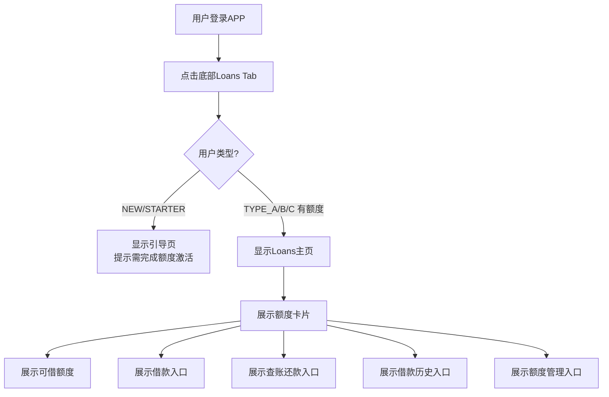

#### 2.0.2 Loans版块UI布局

```
┌─────────────────────────────────────────┐
│         LOANS                       │
├─────────────────────────────────────────┤
│  ┌─────────────────────────────────┐  │
│  │   Total Credit Limit            │  │
│  │   TZS 500,000               │  │
│  │                               │  │
│  │   Available: TZS 450,000      │  │
│  └─────────────────────────────────┘  │
│                                   │
│  [Borrow Now] [Check & Repay]       │
│  [Loan History] [Limit Management]    │
└─────────────────────────────────────────┘
```

---

### CR-01: 额度展示与查询

#### 2.1.1 三种额度类型

| 额度类型 | 获取方式 | 额度计算 | 用户类型 | 费率 |
|---------|----------|-----------|----------|------|
| **CB额度** | 存款冻结提额 | 冻结金额 * 1 | ALL | 标准费率 |
| **Shield额度** | 设备锁授权 | 固定2000 TZS | TYPE_B | 标准费率 |
| **Prime额度** | 风控授信 | 风险模型输出 | TYPE_A | 低费率（优惠券实现） |

#### 2.1.2 额度查询接口

**接口**: `GET /api/v1/credit/limit`

**Response**:
```java
@Schema(description = "额度查询响应")
public record CreditLimitResponse(
    @Schema(description = "总额度（分）")
    Long totalLimit,

    @Schema(description = "可借额度（分）")
    Long availableLimit,

    @Schema(description = "已用额度（分）")
    Long usedLimit,

    @Schema(description = "冻结额度（分）")
    Long frozenLimit,

    @Schema(description = "额度明细")
    List<LimitDetail> limitDetails
) {}

@Schema(description = "额度明细")
public record LimitDetail(
    @Schema(description = "额度类型")
    String limitType,  // CB, SHIELD, PRIME

    @Schema(description = "额度（分）")
    Long limit,

    @Schema(description = "已用额度（分）")
    Long usedLimit,

    @Schema(description = "状态")
    String status  // ACTIVE, FROZEN
) {}
```

---

### CR-02: 借款试算

#### 2.2.1 用户交互流程

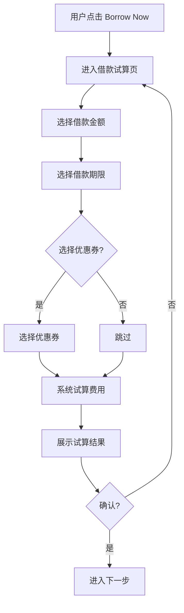

#### 2.2.2 试算费用计算

**费率配置** (来自PDF Page 35):

| 期限 | 服务费率 | 逾期费率 |
|------|----------|----------|
| 7天 | 5% | 5% |
| 14天 | 10% | 10% |
| 28天 | 20% | 20% |

**计算公式**:
```
基础费用 = 申请金额 × 服务费率
优惠券减免 = 优惠券金额（最多减免至0）
到账金额 = 申请金额 - 基础费用 + 优惠券减免
应还总额 = 申请金额 + 基础费用（无逾期情况下）
逾期罚金 = 基础费用（一次性收取，不重复计算）
```

**示例计算**:
```
借款金额: 100,000 TZS
期限: 7天
服务费率: 5%

基础费用 = 100,000 × 5% = 5,000 TZS
到账金额 = 100,000 - 5,000 = 95,000 TZS
应还总额 = 100,000 TZS
```

#### 2.2.3 试算接口

**接口**: `POST /api/v1/credit/calculate`

**Request**:
```java
@Schema(description = "借款试算请求")
public record LoanCalculateRequest(
    @Schema(description = "申请金额（分）", example = "100000")
    @NotNull
    Long amount,

    @Schema(description = "借款期限（天）", example = "7")
    @NotNull
    Integer term,

    @Schema(description = "优惠券ID")
    String couponId
) {}
```

**Response**:
```java
@Schema(description = "借款试算响应")
public record LoanCalculateResponse(
    @Schema(description = "申请金额（分）")
    Long principalAmount,

    @Schema(description = "服务费（分）")
    Long serviceFee,

    @Schema(description = "优惠券减免（分）")
    Long couponDiscount,

    @Schema(description = "到账金额（分）")
    Long disbursementAmount,

    @Schema(description = "应还总额（分）")
    Long totalRepaymentAmount,

    @Schema(description = "还款日")
    LocalDate dueDate,

    @Schema(description = "费率明细")
    FeeBreakdown feeBreakdown
) {}

@Schema(description = "费率明细")
public record FeeBreakdown(
    @Schema(description = "服务费率")
    BigDecimal serviceFeeRate,

    @Schema(description = "服务费（分）")
    Long serviceFeeAmount,

    @Schema(description = "优惠券类型")
    String couponType,  // LOAN_FEE, LOAN_INTEREST

    @Schema(description = "优惠券减免（分）")
    Long couponDiscountAmount
) {}
```

---

### CR-03: 借款申请提交

#### 2.3.1 借款主流程

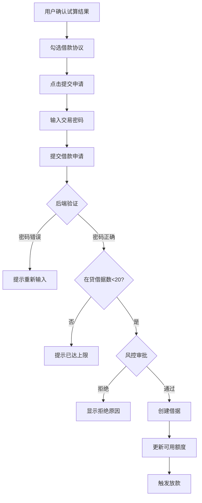

#### 2.3.2 业务规则

| 规则ID | 规则描述 | 实现逻辑 |
|--------|----------|----------|
| **BR-CR-001** | 在贷借据数限制 | 最多20笔，超过禁止借款 |
| **BR-CR-002** | 还款日计算 | 借款日 + 借款天数 - 1 |
| **BR-CR-003** | 交易密码验证 | 6位PIN验证 |
| **BR-CR-004** | 额度充足检查 | 可用额度 >= 申请金额 |
| **BR-CR-005** | 设备锁授权检查 | TYPE_B/C必须已授权设备锁 |
| **BR-CR-006** | 借款协议签署 | 必须勾选借款协议 |

#### 2.3.3 协议签署清单 (来自PDF Page 55)

**阶段四: 贷款申请与支用**

| 流程节点 | 签署方式 | 协议名称 | 核心授权内容 |
|---------|----------|----------|-------------|
| 借款试算页 | PassiveDisplay | 《关键事实声明》(KFS) | 1.借款本金<br/>2.利息金额<br/>3.手续费/税费<br/>4.总还款额<br/>5.年化利率(APR) |
| 确认提款 | Digital Signature | 《个人借款合同》 | 1.还款义务<br/>2.违约金规则<br/>3.In Duplum Rule<br/>4.催收授权 |

---

### CR-04: 借款审批与放款

#### 2.4.1 放款流程

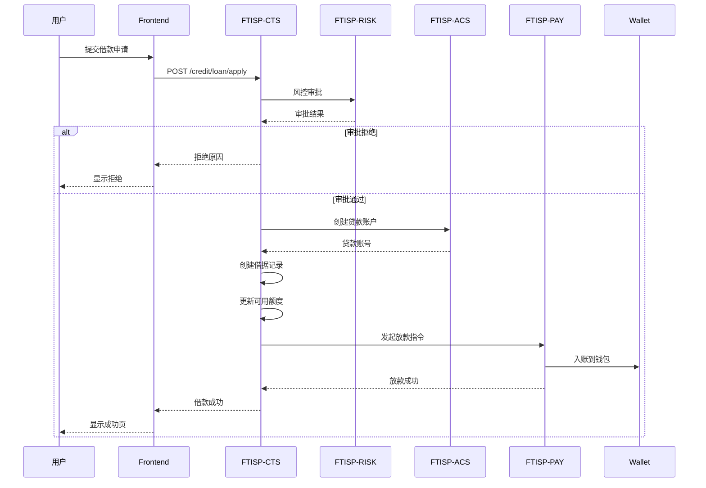

#### 2.4.2 借款状态机

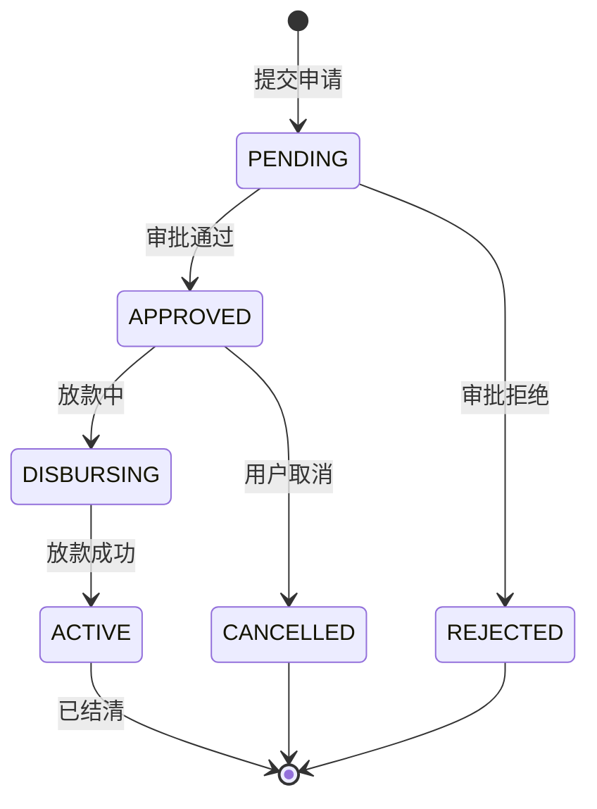

---

### CR-05: 还款查询与发起

#### 2.5.1 还款入口流程

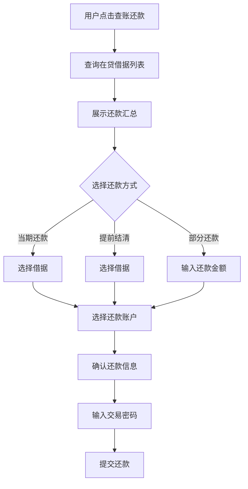

#### 2.5.2 在贷借据查询接口

**接口**: `GET /api/v1/credit/loans/active`

**Response**:
```java
@Schema(description = "在贷借据列表响应")
public record ActiveLoansResponse(
    @Schema(description = "借据列表")
    List<ActiveLoanDetail> loans,

    @Schema(description = "待还总额（分）")
    Long totalDueAmount,

    @Schema(description = "最小还款额（分）")
    Long minimumPayment
) {}

@Schema(description = "在贷借据明细")
public record ActiveLoanDetail(
    @Schema(description = "借据号")
    String loanId,

    @Schema(description = "申请金额（分）")
    Long principalAmount,

    @Schema(description = "应还总额（分）")
    Long totalDueAmount,

    @Schema(description = "已还金额（分）")
    Long paidAmount,

    @Schema(description = "剩余应还（分）")
    Long remainingAmount,

    @Schema(description = "还款日")
    LocalDate dueDate,

    @Schema(description = "逾期天数")
    Integer overdueDays,

    @Schema(description = "逾期罚金（分）")
    Long penaltyAmount,

    @Schema(description = "借据状态")
    String status,  // ACTIVE, OVERDUE

    @Schema(description = "借款期限（天）")
    Integer termDays
) {}
```

---

### CR-06: 主动还款

#### 2.6.1 还款业务流程 (来自PDF Page 26)

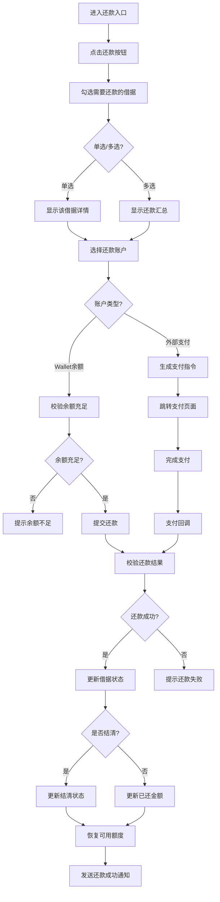

#### 2.6.2 还款顺序规则 (来自PDF Page 38)

**还款优先级**:
1. **逾期罚金** (Penalty): 优先偿还 grossPenalty - penaltyPaidThisCycle
2. **本金** (Principal): 剩余资金偿还本金

**还款方式**:
- **Wallet Balance**: 直接从APP内钱包余额扣除
- **External (M-Pesa)**: 支持从外部移动支付直接还款

#### 2.6.3 还款接口

**接口**: `POST /api/v1/credit/repayment`

**Request**:
```java
@Schema(description = "还款请求")
public record RepaymentRequest(
    @Schema(description = "借据号列表")
    @NotEmpty
    List<String> loanIds,

    @Schema(description = "还款金额（分，部分还款时必填）")
    Long amount,

    @Schema(description = "还款账户类型")
    @NotNull
    String repaymentAccountType,  // WALLET, EXTERNAL

    @Schema(description = "交易密码")
    @NotNull
    @Size(min=6, max=6)
    String pin
) {}
```

**Response**:
```java
@Schema(description = "还款响应")
public record RepaymentResponse(
    @Schema(description = "还款流水号")
    String repaymentNo,

    @Schema(description = "还款金额（分）")
    Long repaymentAmount,

    @Schema(description = "还款时间")
    Instant repaymentTime,

    @Schema(description = "借据还款明细")
    List<LoanRepaymentDetail> details
) {}

@Schema(description = "借据还款明细")
public record LoanRepaymentDetail(
    @Schema(description = "借据号")
    String loanId,

    @Schema(description = "还款金额（分）")
    Long amount,

    @Schema(description = "还本金（分）")
    Long principalAmount,

    @Schema(description = "还罚金（分）")
    Long penaltyAmount,

    @Schema(description = "剩余未还（分）")
    Long remainingAmount,

    @Schema(description = "是否结清")
    Boolean isFullyPaid
) {}
```

---

### CR-07: 提前结清

#### 2.7.1 提前结清流程

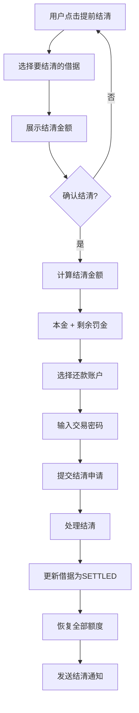

#### 2.7.2 提前结清金额计算

**计算规则**:
```
结清金额 = 剩余本金 + 逾期罚金（如有）
```

**注意**: 提前结清**不减免**任何费用，用户需支付剩余全部本金和罚金。

---

### CR-08: 逾期处理与锁机

#### 2.8.1 逾期处理流程

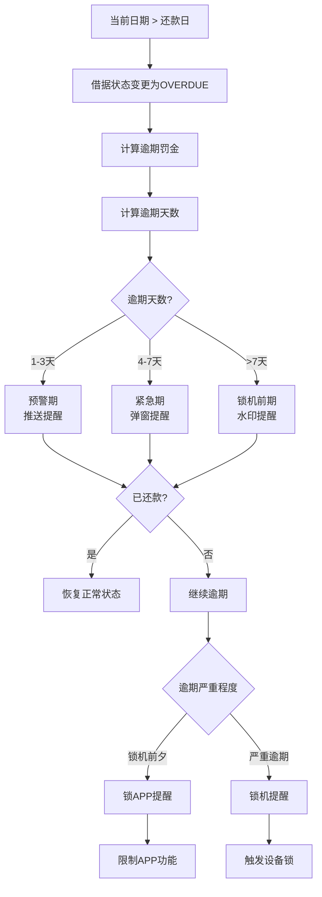

#### 2.8.2 逾期分级规则 (来自PDF Page 7-8)

| 阶段 | 逾期天数 | 视觉重心 | 设计方案 | 心理暗示 |
|------|----------|----------|----------|----------|
| **安全期** | 0-3天 | 还款日期 | 橙色进度条，"3 Days Left" | "放心，还有很久" |
| **预警期** | 4-7天 | 倒计时+金额 | "Pay TZS 12,500 to avoid penalty" | "时间不多了" |
| **紧急期** | 8-14天 | 待还金额 | 红色背景，"Pay NOW to unlock" | "付了这个数，手机就能用" |
| **锁机前夕** | 15-30天 | 锁机倒计时 | "Payment Overdue! Device Lock in 2 days" | "即将锁机" |
| **锁机期** | >30天 | 强制锁机 | 设备锁激活，限制功能 | "不还款不能用" |

#### 2.8.3 逾期费率规则

| 期限 | 逾期费率 | 说明 |
|------|----------|------|
| 7天 | 5% | 一次性收取，不累计计息 |
| 14天 | 10% | 一次性收取，不累计计息 |
| 28天 | 20% | 一次性收取，不累计计息 |

**计算示例**:
```
原始借款: 100,000 TZS (7天)
基础服务费: 5,000 TZS
逾期7天: 罚金 = 100,000 × 5% = 5,000 TZS
总应还: 100,000 + 5,000 + 5,000 = 110,000 TZS
```

#### 2.8.4 设备锁功能

**锁机配置** (来自PDF Page 46):

| APP类型 | 锁机状态 | 权限配置 | 法律/业务理由 |
|---------|----------|-----------|---------------|
| WhatsApp | 禁用 | 非生存必需品 | 制造痛点 |
| TikTok/YouTube | 禁用 | 高耗流娱乐 | 合理禁用 |
| 电话(Dialer) | 部分限制 | 仅允许紧急/客服/亲属电话 | 保留必要通信 |
| 短信(SMS) | 只读 | 允许接收OTP，限制发送 | 还款通道必需 |
| M-Pesa/TigoPesa | 必须开放 | 还款通道 | 必须让用户转账 |
| 贷款APP | 必须开放 | 还款操作界面 | 还款必需 |
| 系统设置 | 部分限制 | 防止恢复出厂/修改时间 | 防止作弊 |

**设备锁授权协议** (来自PDF Page 56):

1. **设备抵押性质**: "本设备作为信贷服务的数字抵押物"
2. **远程控制权**: "授权贷方在违约时远程锁定设备功能"
3. **免责条款**: "贷方不对锁机造成的间接损失（如生意中断）负责"

---

### CR-09: 展期申请

#### 2.9.1 展期流程

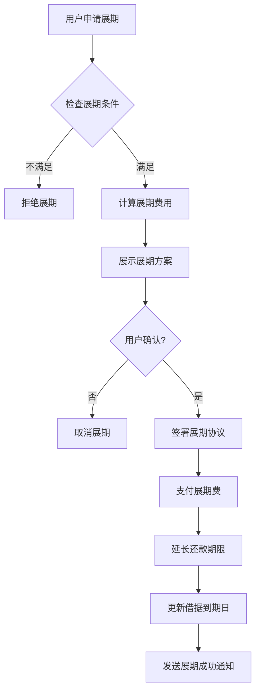

#### 2.9.2 展期费规则

**展期费计算** (来自PDF Page 35):
```
展期费 = 固定比例费用（通常等于或略高于原始借款手续费）
展期期限 = 延长一个完整周期（如30天）
```

---

### CR-10: 贷款历史查询

#### 2.10.1 查询接口

**接口**: `GET /api/v1/credit/loans/history`

**Query Parameters**:
```yaml
page: int  # 页码，从0开始
size: int  # 每页数量，默认10
status: string  # 筛选状态: ALL, ACTIVE, SETTLED, OVERDUE
```

**Response**:
```java
@Schema(description = "贷款历史响应")
public record LoanHistoryResponse(
    @Schema(description = "借据列表")
    List<LoanHistoryDetail> loans,

    @Schema(description = "总页数")
    Integer totalPages,

    @Schema(description = "当前页码")
    Integer currentPage,

    @Schema(description = "总记录数")
    Long totalElements
) {}

@Schema(description = "贷款历史明细")
public record LoanHistoryDetail(
    @Schema(description = "借据号")
    String loanId,

    @Schema(description = "申请金额（分）")
    Long principalAmount,

    @Schema(description = "借款期限（天）")
    Integer termDays,

    @Schema(description = "借款日")
    LocalDate disbursementDate,

    @Schema(description = "还款日")
    LocalDate dueDate,

    @Schema(description = "实际还款日")
    LocalDate actualRepaymentDate,

    @Schema(description = "应还总额（分）")
    Long totalDueAmount,

    @Schema(description = "实还金额（分）")
    Long paidAmount,

    @Schema(description = "借据状态")
    String status,  // ACTIVE, SETTLED, OVERDUE, CANCELLED

    @Schema(description = "逾期天数")
    Integer overdueDays
) {}
```

---

### CR-11: 保证金提额

#### 2.11.1 保证金提额流程

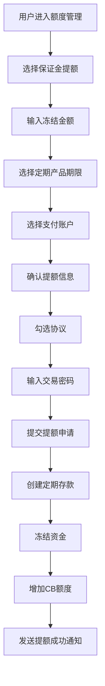

#### 2.11.2 CB额度规则

| 规则ID | 规则描述 | 实现逻辑 |
|--------|----------|----------|
| **BR-CR-101** | CB额度 = 冻结金额 | 1:1解锁额度 |
| **BR-CR-102** | 解冻需还清贷款 | 提现冻结资金前检查欠款为0 |
| **BR-CR-103** | 解冻后额度减少 | 定存解冻后，CB额度同步减少 |

**业务流程** (来自PDF Page 37):
```
LimitManagement → SecurityDeposit → 输入冻结金额 → 选择定存产品期限
→ 选择支付账户 → 勾选协议 → 输入PIN → 完成提额
```

---

### CR-12: 设备锁授权提额

#### 2.12.1 设备锁授权流程

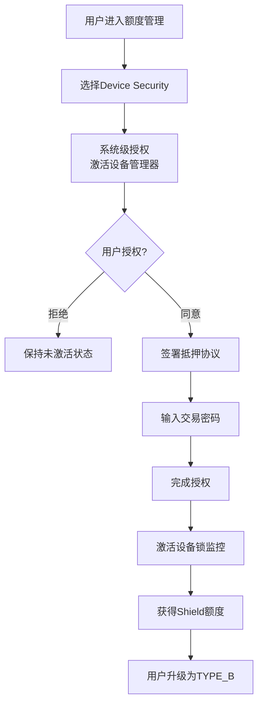

#### 2.12.2 设备锁授权协议

**授权流程** (来自PDF Page 40):
1. **系统级授权**: Android系统弹窗，"是否激活设备管理器？"
2. **抵押协议签署**: BottomSheet弹窗，"Confirm Device Collateral"
3. **PIN验证**: 输入密码以签署并确认

**协议文本**:
> "I agree that if my loan is overdue, this device will be locked. I authorize WeBank to restrict its usage."

**额度规则**:
- TYPE_B用户: 固定2000 TZS额度
- 设备作为抵押
- 激活设备锁监控

---

### CR-13: 提供材料提额

#### 2.13.1 提额流程

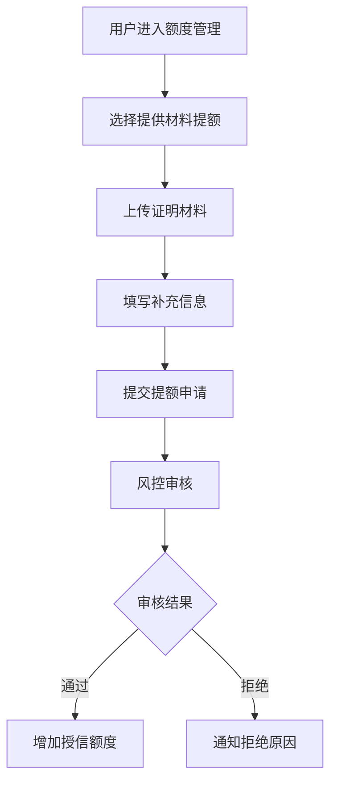

**优先级**: P1 (一期不做)

---

## 3. 子系统追踪 (Step 3 & 4)

### 3.1 子系统交互图

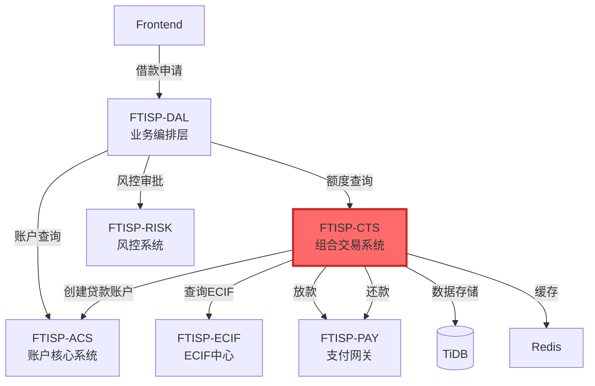

### 3.2 子系统功能点映射矩阵

| 步骤 | 子系统 | 功能点 | 输入 | 输出 | 依赖 |
|------|--------|--------|------|------|------|
| 1 | FTISP-DAL | 接收借款申请 | HTTP Request | 路由分发 | - |
| 2 | FTISP-CTS | 验证额度充足 | user_id, amount | 额度充足标识 | TiDB |
| 3 | FTISP-RISK | 风控审批 | user_id, amount | 审批结果 | 风控模型 |
| 4 | FTISP-CTS | 计算试算费用 | amount, term | 费用明细 | 费率配置 |
| 5 | FTISP-ACS | 创建贷款账户 | user_id, ecif_id | loan_account_no | TiDB |
| 6 | FTISP-CTS | 创建借据 | loan_data | loan_id | TiDB |
| 7 | FTISP-CTS | 更新可用额度 | user_id, amount | - | TiDB, Redis |
| 8 | FTISP-PAY | 发起放款 | loan_id, amount | 放款结果 | 支付渠道 |
| 9 | FTISP-CTS | 更新借据状态 | loan_id, status | - | TiDB |
| 10 | FTISP-MSG | 发送放款通知 | user_id, amount | - | 短信渠道 |

### 3.3 子系统职责

| 子系统 | 英文全称 | 职责 | **是否新增** |
|--------|----------|------|-----------|
| **FTISP-CTS** | Composite Trading System | 借据管理、额度管理、还款管理、费率计算 | **CORE** |
| **FTISP-RISK** | Risk Management System | 风控审批、额度计算、信用评分 | NO |
| **FTISP-PAY** | Payment Gateway | 放款、还款资金清算 | NO |

---

## 4. 数据流向分析 (Step 5)

### 4.1 借款完整数据流

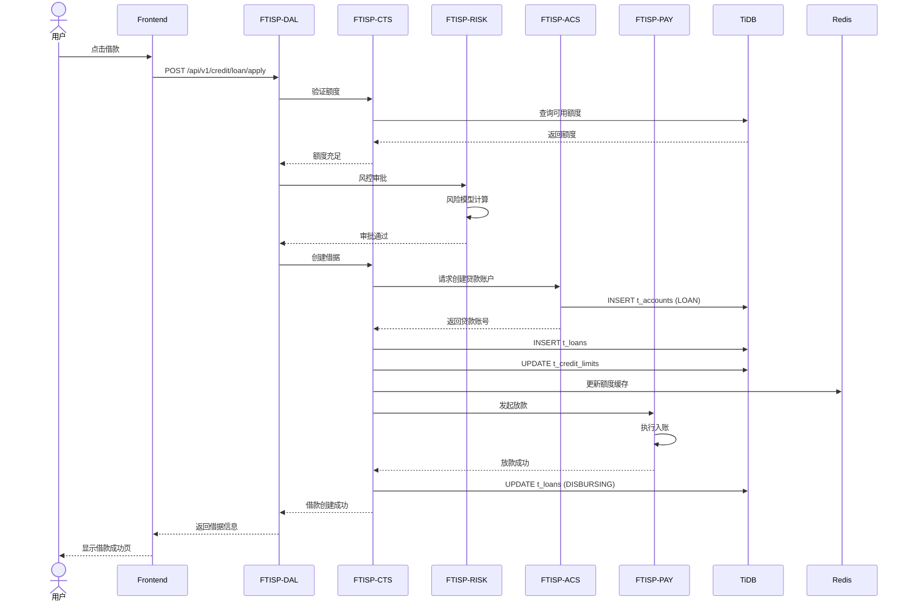

### 4.2 还款完整数据流

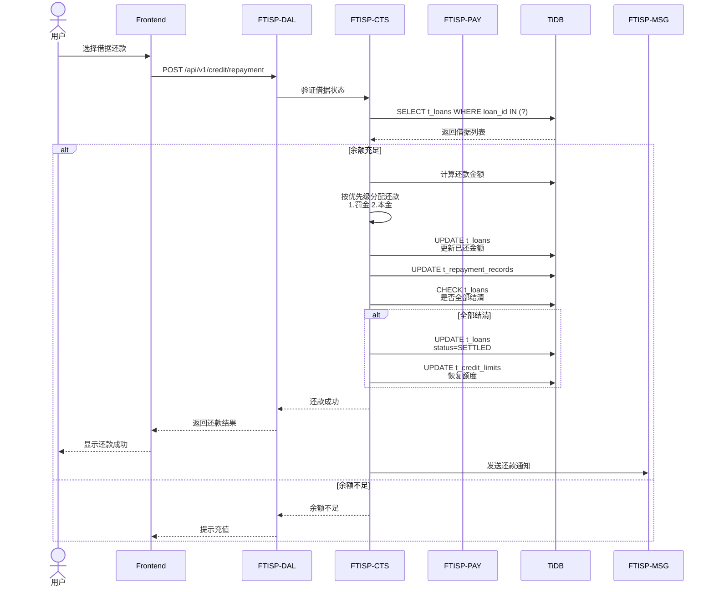

---

## 5. 接口定义 (Step 6)

### 5.1 借款申请接口

**接口**: `POST /api/v1/credit/loan/apply`

**Request Headers**:
```yaml
Authorization: Bearer {access_token}
Content-Type: application/json
```

**Request Body**:
```java
@Schema(description = "借款申请请求")
public record LoanApplyRequest(
    @Schema(description = "申请金额（分）", example = "100000")
    @NotNull
    @Min(10000)
    @Max(50000000)
    Long amount,

    @Schema(description = "借款期限（天）", example = "7")
    @NotNull
    Integer term,  // 7, 14, 28

    @Schema(description = "优惠券ID")
    String couponId,

    @Schema(description = "借款用途")
    String loanPurpose,

    @Schema(description = "转入账户")
    @NotNull
    String disbursementAccountType,  // WALLET, BANK_ACCOUNT

    @Schema(description = "交易密码")
    @NotNull
    @Size(min=6, max=6)
    String pin
) {}
```

**Response**:
```java
@Schema(description = "借款申请响应")
public record LoanApplyResponse(
    @Schema(description = "借据号")
    String loanId,

    @Schema(description = "申请金额（分）")
    Long principalAmount,

    @Schema(description = "到账金额（分）")
    Long disbursementAmount,

    @Schema(description = "还款日")
    LocalDate dueDate,

    @Schema(description = "借据状态")
    String status,  // PENDING, APPROVED, DISBURSING, ACTIVE

    @Schema(description = "预计到账时间")
    Instant estimatedDisbursementTime
) {}
```

### 5.2 额度查询接口

**接口**: `GET /api/v1/credit/limit`

**Response**:
```java
@Schema(description = "额度查询响应")
public record CreditLimitResponse(
    @Schema(description = "总额度（分）")
    Long totalLimit,

    @Schema(description = "可借额度（分）")
    Long availableLimit,

    @Schema(description = "已用额度（分）")
    Long usedLimit,

    @Schema(description = "额度明细")
    List<LimitDetail> limitDetails
) {}
```

### 5.3 在贷借据查询接口

**接口**: `GET /api/v1/credit/loans/active`

**Response**:
```java
@Schema(description = "在贷借据响应")
public record ActiveLoansResponse(
    @Schema(description = "借据列表")
    List<ActiveLoanDetail> loans,

    @Schema(description = "待还总额（分）")
    Long totalDueAmount,

    @Schema(description = "最早还款日")
    LocalDate earliestDueDate
) {}
```

### 5.4 还款接口

**接口**: `POST /api/v1/credit/repayment`

**Request Body**:
```java
@Schema(description = "还款请求")
public record RepaymentRequest(
    @Schema(description = "借据号列表")
    @NotEmpty
    List<String> loanIds,

    @Schema(description = "还款金额（分，部分还款时必填）")
    Long amount,

    @Schema(description = "还款账户类型")
    @NotNull
    String repaymentAccountType,

    @Schema(description = "交易密码")
    @NotNull
    @Size(min=6, max=6)
    String pin
) {}
```

### 5.5 贷款历史查询接口

**接口**: `GET /api/v1/credit/loans/history`

**Query Parameters**:
```yaml
page: int  # 页码
size: int  # 每页数量
status: string  # 状态筛选
```

**Response**:
```java
@Schema(description = "贷款历史响应")
public record LoanHistoryResponse(
    @Schema(description = "借据列表")
    List<LoanHistoryDetail> loans,

    @Schema(description = "分页信息")
    PageInfo pageInfo
) {}
```

### 5.6 保证金提额接口

**接口**: `POST /api/v1/credit/limit/deposit`

**Request Body**:
```java
@Schema(description = "保证金提额请求")
public record DepositLimitRequest(
    @Schema(description = "冻结金额（分）")
    @NotNull
    Long amount,

    @Schema(description = "定期产品期限（天）")
    @NotNull
    Integer depositTerm,

    @Schema(description = "支付账户")
    @NotNull
    String paymentAccount,

    @Schema(description = "交易密码")
    @NotNull
    @Size(min=6, max=6)
    String pin
) {}
```

### 5.7 设备锁授权接口

**接口**: `POST /api/v1/credit/limit/device-lock`

**Request Body**:
```java
@Schema(description = "设备锁授权请求")
public record DeviceLockRequest(
    @Schema(description = "设备IMEI")
    @NotNull
    String deviceImei,

    @Schema(description = "是否同意授权")
    @NotNull
    Boolean agreed,

    @Schema(description = "交易密码")
    @NotNull
    @Size(min=6, max=6)
    String pin
) {}
```

**Response**:
```java
@Schema(description = "设备锁授权响应")
public record DeviceLockResponse(
    @Schema(description = "授权成功")
    Boolean success,

    @Schema(description = "新增Shield额度（分）")
    Long shieldLimit,

    @Schema(description = "总额度（分）")
    Long totalLimit
) {}
```

---

## 6. **NEW** 数据模型设计

### 6.1 实体关系图

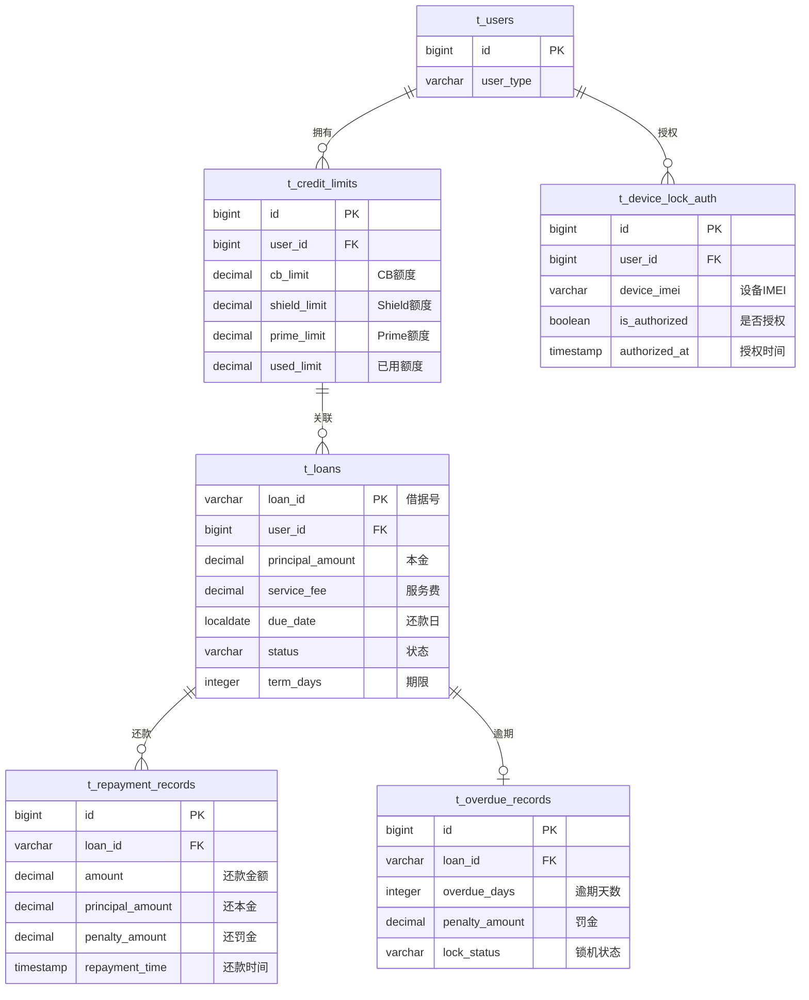

### 6.2 **NEW** 表结构定义

#### 6.2.1 **NEW** 表名: `t_credit_limits` - FTISP-CTS

**必要性分析**: 存储用户额度信息，支持三种额度叠加

| 字段名 | 类型 (TiDB) | 必填 | 索引 | 说明 | **必要性辩护** |
|--------|-------------|------|------|------|--------------|
| id | BIGINT AUTO_RANDOM | Y | PK | 主键 | TiDB分布式主键 |
| user_id | BIGINT | Y | UK | 用户ID | 唯一标识用户 |
| cb_limit | DECIMAL(15,2) | Y | - | CB额度（分） | 保证金提额 |
| shield_limit | DECIMAL(15,2) | Y | - | Shield额度（分） | 设备锁提额 |
| prime_limit | DECIMAL(15,2) | Y | - | Prime额度（分） | 风控授信 |
| used_limit | DECIMAL(15,2) | Y | - | 已用额度（分） | 当前使用额度 |
| frozen_limit | DECIMAL(15,2) | Y | - | 冻结额度（分） | 冻结中额度 |
| total_limit | DECIMAL(15,2) | Y | - | 总额度（分） | 总额度=CB+Shield+Prime |
| customer_type | VARCHAR(20) | Y | - | 客户类型 | TYPE_A/B/C |
| credit_score | INT | N | - | 信用分 | 风控输出 |
| updated_at | DATETIME(3) | Y | - | 更新时间 | 数据更新追踪 |

**TiDB DDL**:
```sql
CREATE TABLE t_credit_limits (
    id BIGINT AUTO_RANDOM PRIMARY KEY,
    user_id BIGINT NOT NULL UNIQUE COMMENT '用户ID',
    cb_limit DECIMAL(15,2) NOT NULL DEFAULT 0 COMMENT 'CB额度（分）',
    shield_limit DECIMAL(15,2) NOT NULL DEFAULT 0 COMMENT 'Shield额度（分）',
    prime_limit DECIMAL(15,2) NOT NULL DEFAULT 0 COMMENT 'Prime额度（分）',
    used_limit DECIMAL(15,2) NOT NULL DEFAULT 0 COMMENT '已用额度（分）',
    frozen_limit DECIMAL(15,2) NOT NULL DEFAULT 0 COMMENT '冻结额度（分）',
    total_limit DECIMAL(15,2) NOT NULL DEFAULT 0 COMMENT '总额度（分）',
    customer_type VARCHAR(20) NOT NULL COMMENT '客户类型',
    credit_score INT COMMENT '信用分',
    updated_at DATETIME(3) NOT NULL DEFAULT CURRENT_TIMESTAMP(3) ON UPDATE CURRENT_TIMESTAMP(3) COMMENT '更新时间',

    INDEX idx_user_id (user_id),
    INDEX idx_customer_type (customer_type)
) ENGINE=InnoDB DEFAULT CHARSET=utf8mb4 COMMENT='信用额度表';
```

#### 6.2.2 **NEW** 表名: `t_loans` - FTISP-CTS

**必要性分析**: 存储借据核心数据

| 字段名 | 类型 (TiDB) | 必填 | 索引 | 说明 | **必要性辩护** |
|--------|-------------|------|------|------|--------------|
| loan_id | VARCHAR(32) | Y | PK | 借据号 | 业务主键 |
| user_id | BIGINT | Y | IDX | 用户ID | 关联用户 |
| loan_account_no | VARCHAR(32) | Y | IDX | 贷款账号 | 关联ACS账户 |
| platform_ecif_id | VARCHAR(32) | Y | - | 平台ECIF号 | 关联ECIF |
| principal_amount | DECIMAL(15,2) | Y | - | 本金（分） | 申请金额 |
| service_fee | DECIMAL(15,2) | Y | - | 服务费（分） | 手续费 |
| coupon_discount | DECIMAL(15,2) | N | - | 优惠券减免（分） | 优惠 |
| disbursement_amount | DECIMAL(15,2) | Y | - | 到账金额（分） | 实际到账 |
| total_due_amount | DECIMAL(15,2) | Y | - | 应还总额（分） | 应还金额 |
| paid_amount | DECIMAL(15,2) | Y | - | 已还金额（分） | 已还金额 |
| remaining_amount | DECIMAL(15,2) | Y | - | 剩余应还（分） | 剩余未还 |
| penalty_amount | DECIMAL(15,2) | Y | - | 逾期罚金（分） | 逾期罚金 |
| term_days | INT | Y | - | 借款期限（天） | 7/14/28 |
| disbursement_date | DATETIME(3) | N | - | 放款日期 | 实际放款时间 |
| due_date | DATE | Y | - | 还款日 | 应还日期 |
| actual_repayment_date | DATETIME(3) | N | - | 实际还款日 | 结清日期 |
| status | VARCHAR(20) | Y | IDX | 借据状态 | 状态机 |
| overdue_days | INT | Y | - | 逾期天数 | 当前逾期天数 |
| is_device_lock_enabled | BOOLEAN | Y | - | 是否启用设备锁 | 设备锁标识 |
| created_at | DATETIME(3) | Y | - | 创建时间 | 创建时间 |
| updated_at | DATETIME(3) | Y | - | 更新时间 | 更新时间 |

**TiDB DDL**:
```sql
CREATE TABLE t_loans (
    loan_id VARCHAR(32) NOT NULL PRIMARY KEY COMMENT '借据号',
    user_id BIGINT NOT NULL COMMENT '用户ID',
    loan_account_no VARCHAR(32) NOT NULL COMMENT '贷款账号',
    platform_ecif_id VARCHAR(32) NOT NULL COMMENT '平台ECIF号',
    principal_amount DECIMAL(15,2) NOT NULL COMMENT '本金（分）',
    service_fee DECIMAL(15,2) NOT NULL COMMENT '服务费（分）',
    coupon_discount DECIMAL(15,2) DEFAULT 0 COMMENT '优惠券减免（分）',
    disbursement_amount DECIMAL(15,2) NOT NULL COMMENT '到账金额（分）',
    total_due_amount DECIMAL(15,2) NOT NULL COMMENT '应还总额（分）',
    paid_amount DECIMAL(15,2) NOT NULL DEFAULT 0 COMMENT '已还金额（分）',
    remaining_amount DECIMAL(15,2) NOT NULL COMMENT '剩余应还（分）',
    penalty_amount DECIMAL(15,2) NOT NULL DEFAULT 0 COMMENT '逾期罚金（分）',
    term_days INT NOT NULL COMMENT '借款期限（天）',
    disbursement_date DATETIME(3) COMMENT '放款日期',
    due_date DATE NOT NULL COMMENT '还款日',
    actual_repayment_date DATETIME(3) COMMENT '实际还款日',
    status VARCHAR(20) NOT NULL COMMENT '借据状态',
    overdue_days INT NOT NULL DEFAULT 0 COMMENT '逾期天数',
    is_device_lock_enabled BOOLEAN NOT NULL DEFAULT FALSE COMMENT '是否启用设备锁',
    created_at DATETIME(3) NOT NULL DEFAULT CURRENT_TIMESTAMP(3) COMMENT '创建时间',
    updated_at DATETIME(3) NOT NULL DEFAULT CURRENT_TIMESTAMP(3) ON UPDATE CURRENT_TIMESTAMP(3) COMMENT '更新时间',

    INDEX idx_user_id (user_id),
    INDEX idx_status (status),
    INDEX idx_due_date (due_date),
    INDEX idx_user_status (user_id, status)
) ENGINE=InnoDB DEFAULT CHARSET=utf8mb4 COMMENT='借据表';
```

#### 6.2.3 **NEW** 表名: `t_repayment_records` - FTISP-CTS

**必要性分析**: 记录还款明细

| 字段名 | 类型 (TiDB) | 必填 | 索引 | 说明 | **必要性辩护** |
|--------|-------------|------|------|------|--------------|
| id | BIGINT AUTO_RANDOM | Y | PK | 主键 | TiDB分布式主键 |
| repayment_no | VARCHAR(32) | Y | UK | 还款流水号 | 唯一标识 |
| loan_id | VARCHAR(32) | Y | IDX | 借据号 | 关联借据 |
| user_id | BIGINT | Y | IDX | 用户ID | 关联用户 |
| repayment_amount | DECIMAL(15,2) | Y | - | 还款金额（分） | 本次还款总额 |
| principal_amount | DECIMAL(15,2) | Y | - | 还本金（分） | 偿还本金 |
| penalty_amount | DECIMAL(15,2) | Y | - | 还罚金（分） | 偿还罚金 |
| repayment_type | VARCHAR(20) | Y | - | 还款类型 | NORMAL/EARLY/ROLLOVER |
| repayment_account_type | VARCHAR(20) | Y | - | 还款账户类型 | WALLET/EXTERNAL |
| repayment_time | DATETIME(3) | Y | - | 还款时间 | 还款时间戳 |
| created_at | DATETIME(3) | Y | - | 创建时间 | 创建时间 |

**TiDB DDL**:
```sql
CREATE TABLE t_repayment_records (
    id BIGINT AUTO_RANDOM PRIMARY KEY,
    repayment_no VARCHAR(32) NOT NULL UNIQUE COMMENT '还款流水号',
    loan_id VARCHAR(32) NOT NULL COMMENT '借据号',
    user_id BIGINT NOT NULL COMMENT '用户ID',
    repayment_amount DECIMAL(15,2) NOT NULL COMMENT '还款金额（分）',
    principal_amount DECIMAL(15,2) NOT NULL COMMENT '还本金（分）',
    penalty_amount DECIMAL(15,2) NOT NULL DEFAULT 0 COMMENT '还罚金（分）',
    repayment_type VARCHAR(20) NOT NULL COMMENT '还款类型',
    repayment_account_type VARCHAR(20) NOT NULL COMMENT '还款账户类型',
    repayment_time DATETIME(3) NOT NULL COMMENT '还款时间',
    created_at DATETIME(3) NOT NULL DEFAULT CURRENT_TIMESTAMP(3) COMMENT '创建时间',

    INDEX idx_loan_id (loan_id),
    INDEX idx_user_id (user_id),
    INDEX idx_repayment_time (repayment_time)
) ENGINE=InnoDB DEFAULT CHARSET=utf8mb4 COMMENT='还款记录表';
```

#### 6.2.4 **NEW** 表名: `t_overdue_records` - FTISP-CTS

**必要性分析**: 记录逾期处理记录

| 字段名 | 类型 (TiDB) | 必填 | 索引 | 说明 | **必要性辩护** |
|--------|-------------|------|------|------|--------------|
| id | BIGINT AUTO_RANDOM | Y | PK | 主键 | TiDB分布式主键 |
| loan_id | VARCHAR(32) | Y | IDX | 借据号 | 关联借据 |
| user_id | BIGINT | Y | IDX | 用户ID | 关联用户 |
| overdue_date | DATE | Y | - | 逾期日期 | 逾期发生日期 |
| overdue_days | INT | Y | - | 逾期天数 | 当前逾期天数 |
| penalty_amount | DECIMAL(15,2) | Y | - | 罚金（分） | 逾期罚金 |
| lock_status | VARCHAR(20) | Y | - | 锁机状态 | NONE/WARNING/LOCKED |
| notification_sent | BOOLEAN | Y | - | 是否已通知 | 通知标识 |
| created_at | DATETIME(3) | Y | - | 创建时间 | 创建时间 |
| updated_at | DATETIME(3) | Y | - | 更新时间 | 更新时间 |

**TiDB DDL**:
```sql
CREATE TABLE t_overdue_records (
    id BIGINT AUTO_RANDOM PRIMARY KEY,
    loan_id VARCHAR(32) NOT NULL COMMENT '借据号',
    user_id BIGINT NOT NULL COMMENT '用户ID',
    overdue_date DATE NOT NULL COMMENT '逾期日期',
    overdue_days INT NOT NULL COMMENT '逾期天数',
    penalty_amount DECIMAL(15,2) NOT NULL COMMENT '罚金（分）',
    lock_status VARCHAR(20) NOT NULL COMMENT '锁机状态',
    notification_sent BOOLEAN NOT NULL DEFAULT FALSE COMMENT '是否已通知',
    created_at DATETIME(3) NOT NULL DEFAULT CURRENT_TIMESTAMP(3) COMMENT '创建时间',
    updated_at DATETIME(3) NOT NULL DEFAULT CURRENT_TIMESTAMP(3) ON UPDATE CURRENT_TIMESTAMP(3) COMMENT '更新时间',

    INDEX idx_loan_id (loan_id),
    INDEX idx_user_id (user_id),
    INDEX idx_overdue_date (overdue_date),
    INDEX idx_lock_status (lock_status)
) ENGINE=InnoDB DEFAULT CHARSET=utf8mb4 COMMENT='逾期记录表';
```

#### 6.2.5 **NEW** 表名: `t_device_lock_auth` - FTISP-CTS

**必要性分析**: 记录设备锁授权

| 字段名 | 类型 (TiDB) | 必填 | 索引 | 说明 | **必要性辩护** |
|--------|-------------|------|------|------|--------------|
| id | BIGINT AUTO_RANDOM | Y | PK | 主键 | TiDB分布式主键 |
| user_id | BIGINT | Y | IDX | 用户ID | 关联用户 |
| device_imei | VARCHAR(50) | Y | - | 设备IMEI | 设备唯一标识 |
| device_brand | VARCHAR(50) | N | - | 设备品牌 | 设备信息 |
| device_model | VARCHAR(50) | N | - | 设备型号 | 设备信息 |
| is_authorized | BOOLEAN | Y | - | 是否授权 | 授权状态 |
| auth_agreement_version | VARCHAR(20) | Y | - | 协议版本 | 协议版本号 |
| authorized_at | DATETIME(3) | N | - | 授权时间 | 授权时间戳 |
| revoked_at | DATETIME(3) | N | - | 撤销时间 | 撤销时间戳 |
| created_at | DATETIME(3) | Y | - | 创建时间 | 创建时间 |
| updated_at | DATETIME(3) | Y | - | 更新时间 | 更新时间 |

**TiDB DDL**:
```sql
CREATE TABLE t_device_lock_auth (
    id BIGINT AUTO_RANDOM PRIMARY KEY,
    user_id BIGINT NOT NULL COMMENT '用户ID',
    device_imei VARCHAR(50) NOT NULL COMMENT '设备IMEI',
    device_brand VARCHAR(50) COMMENT '设备品牌',
    device_model VARCHAR(50) COMMENT '设备型号',
    is_authorized BOOLEAN NOT NULL DEFAULT FALSE COMMENT '是否授权',
    auth_agreement_version VARCHAR(20) NOT NULL COMMENT '协议版本',
    authorized_at DATETIME(3) COMMENT '授权时间',
    revoked_at DATETIME(3) COMMENT '撤销时间',
    created_at DATETIME(3) NOT NULL DEFAULT CURRENT_TIMESTAMP(3) COMMENT '创建时间',
    updated_at DATETIME(3) NOT NULL DEFAULT CURRENT_TIMESTAMP(3) ON UPDATE CURRENT_TIMESTAMP(3) COMMENT '更新时间',

    INDEX idx_user_id (user_id),
    INDEX idx_device_imei (device_imei)
) ENGINE=InnoDB DEFAULT CHARSET=utf8mb4 COMMENT='设备锁授权表';
```

---

## 7. 业务规则

### 7.1 费率配置

| 费率类型 | 7天 | 14天 | 28天 | 说明 |
|---------|------|-------|-------|------|
| 服务费率 | 5% | 10% | 20% | 放款时一次性收取 |
| 逾期费率 | 5% | 10% | 20% | 一次性收取，不累计 |
| 展期费 | 固定比例 | 固定比例 | 固定比例 | 根据期限设定 |

### 7.2 用户分层规则

| 用户类型 | 获取条件 | 额度来源 | 费率 |
|---------|----------|-----------|------|
| **TYPE_C (Builder)** | 风控拒绝，无设备锁 | CB额度（保证金1:1） | 标准费率 |
| **TYPE_B (Shield)** | 风控拒绝，有设备锁 | Shield额度（固定2000 TZS） | 标准费率 |
| **TYPE_A (Prime)** | 风控通过 | Prime额度（风险模型输出） | 低费率（优惠券） |

### 7.3 还款规则

| 规则ID | 规则描述 | 实现逻辑 |
|--------|----------|----------|
| **BR-CR-201** | 还款优先级 | 1.逾期罚金 2.本金 |
| **BR-CR-202** | 还款日计算 | 借款日 + 借款天数 - 1 |
| **BR-CR-203** | 结清恢复额度 | 全部还清后恢复可用额度 |
| **BR-CR-204** | 部分还款不恢复额度 | 未结清前不恢复额度 |

### 7.4 逾期规则

| 规则ID | 规则描述 | 实现逻辑 |
|--------|----------|----------|
| **BR-CR-301** | 逾期判定 | 当前日期 > 还款日 |
| **BR-CR-302** | 逾期天数计算 | 当前日期 - 还款日 |
| **BR-CR-303** | 逾期罚金 | 一次性收取 = 本金 × 逾期费率 |
| **BR-CR-304** | 锁机触发 | 逾期天数 > 阈值（如30天） |

---

## 8. 前端代码映射

### 8.1 前端组件

| 组件 | 文件 | 说明 |
|------|------|------|
| 借款申请组件 | `loan-application.component.ts` | 借款试算、信息填写、提交申请 |
| 借款处理组件 | `loan-processing.component.ts` | 审批进度、放款动画 |
| Loans版块组件 | `loans-tab.component.ts` | Loans主页、额度展示、入口 |

### 8.2 前端状态机

```typescript
// 借款申请状态
type LoanApplicationStep =
  'INFO' |      // 借款试算
  'UPLOAD' |     // 上传材料
  'SUBMIT' |     // 确认提交
  'REVIEW' |     // 审批中
  'APPROVED' |   // 已批准
  'CONTRACT';    // 签署合同

// 借据状态
type LoanStatus =
  'PENDING' |     // 待审批
  'APPROVED' |    // 已批准
  'DISBURSING' |  // 放款中
  'ACTIVE' |      // 还款中
  'OVERDUE' |     // 逾期
  'SETTLED' |     // 已结清
  'CANCELLED';    // 已取消
```

---

## 9. 异常场景处理

| 场景 | HTTP状态 | 错误码 | 前端处理 |
|------|----------|--------|----------|
| 额度不足 | 400 | INSUFFICIENT_CREDIT | 提示额度不足，推荐提额 |
| 在贷借据超限 | 400 | MAX_ACTIVE_LOANS | 提示最多20笔借据 |
| 交易密码错误 | 401 | INVALID_PIN | 提示密码错误，剩余次数 |
| 借款申请被拒 | 200 | LOAN_REJECTED | 显示拒绝原因 |
| 还款余额不足 | 400 | INSUFFICIENT_BALANCE | 提示充值 |
| 设备锁未授权 | 403 | DEVICE_LOCK_NOT_AUTHORIZED | 引导授权设备锁 |
| 重复申请 | 409 | DUPLICATE_APPLICATION | 提示处理中 |

---

## 10. 安全检查点

### 10.1 数据安全

| 检查项 | 实现方式 |
|--------|----------|
| 交易密码加密传输 | HTTPS/TLS |
| 借款协议电子签名 | 记录签署日志 |
| 设备锁授权记录 | 不可抵赖证据 |
| 敏感数据脱敏 | 日志隐藏关键信息 |

### 10.2 风控措施

| 风险点 | 防控措施 |
|--------|----------|
| 恶意刷单 | 借据数量限制（20笔） |
| 身份冒用 | 设备锁授权验证 |
| 逾期不还 | 分级锁机机制 |
| 欺诈申请 | 风控模型审批 |

---

## 11. 与其他模块差异对比

| 项目 | 贷款模块 | KYC模块 | 登录模块 | 说明 |
|------|----------|----------|----------|------|
| **核心子系统** | FTISP-CREDIT (新增) | FTISP-KYC | FTISP-UAM | 贷款新增专门子系统 |
| **数据表** | t_loans, t_credit_limits | t_kyc_documents | t_user_sessions | 独立数据表 |
| **状态机复杂度** | 借据状态机 | KYC流程状态 | 登录状态 | 贷款状态最复杂 |
| **费率计算** | 有费率模型 | 无 | 无 | 贷款特有 |
| **设备锁** | 支持 | 不支持 | 不支持 | 贷款独有特性 |

---

## 12. 优化建议 (方法论迭代)

### 12.1 本次分析发现的方法论优化点

| 发现 | 优化建议 | 优先级 |
|------|----------|--------|
| 新增子系统FTISP-CREDIT | 需要完整的系统设计文档 | 高 |
| 三种额度叠加 | 需要明确额度计算逻辑 | 高 |
| 设备锁授权 | 需要与技术供应商确认实现方案 | 高 |
| 逾期分级处理 | 需要与产品确认阈值 | 中 |
| 费率配置化 | 建议支持动态配置 | 中 |

### 12.2 建议新增章节

- **Credit Scoring Model**: 信用评分模型说明
- **Device Lock Integration**: 设备锁技术对接方案
- **Collection Strategy**: 催收策略与流程
- **Risk Management**: 风控模型与规则引擎

---

*本文档使用 MODULE_ANALYSIS_METHODOLOGY V1.0 方法论生成，版本 V1.0 基于PRD 4.2节和相关资源创建。*
