# 功能模块深度分析: 用户注册/KYC模块

> **分析日期**: 2026-02-05
> **输入**: PRD 3.1节 + PRD 4.1节 + 前端代码 + register.png流程图 + systemList.txt

## 核心架构

### 涉及的子系统

| 子系统 | 英文全称 | 职责 |
|--------|----------|------|
| **FTISP-AAC** | Access Authorization Center | 统一入口，路由分发（无DB） |
| **FTISP-UAM** | User Auth Management | 用户认证、资料、会话、PIN管理 |
| **FTISP-DAL** | Data Aggregation Layer | 业务编排中心（有流程实例DB） |
| **FTISP-KYC** | KYC Service | OCR、NIDA核查、活体检测（验证日志） |
| **FTISP-MSG** | Message Center | 短信发送 |
| **FTISP-ECIF** | ECIF Center | ECIF中心：管理平台ECIF号、银行ECIF映射、调用外部银行开户 |
| **FTISP-ACS** | Account Core System | 存款户/贷款户开户（风控通过后） |

### KYC验证服务架构

- **FTISP-KYC 统一管理所有KYC验证服务**
  - OCR扫描（对接第三方：Smile Identity/Google Vision等）
  - NIDA联网核查（对接第三方：NIDA官方系统等）
  - 活体检测/刷脸（对接第三方：Smile Identity/AWS Rekognition等）
- **用户资料统一在 UAM** (fullName, nidaNumber, dateOfBirth, address)
- **授权记录在 UAM** (t_user_consents)
- **KYC不存储用户主数据**，仅存储验证日志（t_kyc_documents, t_verification_logs）

### ECIF开户架构

> **开户流程**: DAL → ECIF → 外部银行服务
> **映射存储**: ECIF内部存储平台ECIF号与银行ECIF号映射关系

| 步骤 | 系统 | 说明 |
|------|------|------|
| 1 | DAL → ECIF | 请求创建ECIF客户 |
| 2 | ECIF | 生成平台ECIF号（传众平台客户ID） |
| 3 | ECIF → 外部银行 | 调用银行开户服务 |
| 4 | 外部银行 → ECIF | 返回银行ECIF号（某国家某银行） |
| 5 | ECIF | 内部存储映射关系（t_ecif_mappings） |

**多国家多银行扩展**：
- 一个平台ECIF号可对应多个银行ECIF号
- ECIF内部表 t_ecif_mappings 存储：{平台ECIF号, 国家, 银行, 银行ECIF号}
- 支持后续新增国家和银行

### 数据归属

| 数据类型 | 归属系统 | 说明 |
|----------|----------|------|
| 用户基础信息 | UAM | t_users |
| 用户资料 | UAM | t_user_profiles |
| 授权记录 | UAM | t_user_consents |
| OTP/PIN | UAM | t_otp_records, t_users.pin_hashed |
| 会话管理 | UAM | t_user_sessions |
| OCR记录 | KYC | t_kyc_documents |
| NIDA/活体日志 | KYC | t_verification_logs |
| 流程实例 | DAL | t_process_instances |
| 短信日志 | MSG | t_sms_logs |
| 平台ECIF号 | ECIF | t_ecif_customers |
| 银行ECIF映射 | ECIF | t_ecif_mappings |

---

> **本文档是注册/KYC模块的权威设计文档，后续所有沟通都基于此文档持续优化。**

---

## 1. 功能点分解 (Step 1)

### 1.1 模块概述

**功能模块**: 用户注册与 KYC (Know Your Customer)

**业务价值**: 完成新用户开户，满足金融监管要求，建立用户身份档案

**前置条件**: 用户类型为 NEW，处于未登录状态

**KYC流程完整范围**：

KYC (Know Your Customer) 是一个完整的客户身份识别流程，**不仅仅是刷脸**，包括：

| 阶段 | 内容 | 目的 |
|------|------|------|
| **1. 身份信息收集** | 手机号、身份证扫描、OCR识别、基本信息确认 | 收集用户身份基础数据 |
| **2. 身份信息核实** | NIDA数据库校验（验证身份证真实性） | 防止虚假身份 |
| **3. 合规授权收集** | 征信授权、用户协议、隐私政策、开户协议、地理位置 | 满足金融监管要求 |
| **4. 生物识别验证** | 活体检测、人脸比对（验证是本人操作） | 防止冒用身份 |
| **5. 风控评估** | 提交风控系统审核，确定用户等级 | 评估信用风险 |
| **6. 账户开通** | ECIF开户、存款户/贷款户创建 | 完成开户流程 |

**状态流转**:
```
手机号验证 → 身份信息收集(OCR) → 信息确认授权 → NIDA核实 → 活体检测 → 风控审核 → 账户开通 → PIN设置
```

**包含功能点**:

| ID | 功能点名称 | 触发条件 | 用户类型 | 优先级 |
|----|------------|----------|----------|--------|
| KYC-01 | 手机号检测/输入 | 打开注册页 | NEW | P0 |
| KYC-02 | 平台协议签署(发送OTP前) | 输入手机号后，**勾选才能发送OTP** ⚠️ | NEW | P0 |
| KYC-03 | 发送OTP短信 | 勾选协议后点击发送 | NEW | P0 |
| KYC-04 | OTP验证 | 输入OTP后 | NEW | P0 |
| KYC-05 | 身份证扫描(NIDA) | 验证通过后进入KYC流程 | NEW | P0 |
| KYC-06 | OCR信息提取 | 完成身份证扫描 | NEW | P0 |
| KYC-07 | 身份信息确认 | OCR完成后 | NEW | P0 |
| KYC-08 | 勾选授权/协议 | 信息确认后，**点击Continue前** ⚠️ | NEW | P0 |
| KYC-09 | 地理位置获取 | 勾选授权时，**点击Continue前** ⚠️ | NEW | P0 |
| KYC-10 | NIDA数据库校验 | **点击Continue后** | NEW | P0 |
| KYC-11 | 活体/人脸识别 | NIDA校验通过后 | NEW | P0 |
| KYC-12 | 交易密码设置 | 活体验证后（可选） | NEW | P0 |
| KYC-13 | 提交审批&账户创建 | 完成后提交 | STARTER | P0 |

**正确流程顺序**：
```
手机号 → 勾选平台协议 → 发送OTP → OTP验证 → OCR识别 → 显示结果 → 用户编辑信息
  ↑           ↑                                                     │
  └── 前端控制：未勾选禁用发送按钮 ──────────────────────────────────────┘

KYC阶段:
OCR识别 → 显示结果 → 用户编辑信息 → 勾选授权/协议 → 允许获取位置 → 点击Continue → NIDA校验 → 人脸识别 → (可选)设置PIN → 提交完成
         ↑___________________________↑___________________↑
                    在点击Continue之前完成
```

**协议签署的两个时机**：
1. **KYC-02**: 发送OTP前 - 平台协议（用户协议、隐私政策）- 前端控制
2. **KYC-08**: 信息确认后 - 授权协议（征信授权、开户协议、地理位置授权）- 需记录到后端

**注**: Face ID设置不是注册流程的一部分，是用户后续在设置中可选启用的功能。

---

## 2. 功能点详细设计 (Step 2)

### KYC-01: 手机号检测/输入

#### 2.1.1 用户交互流程

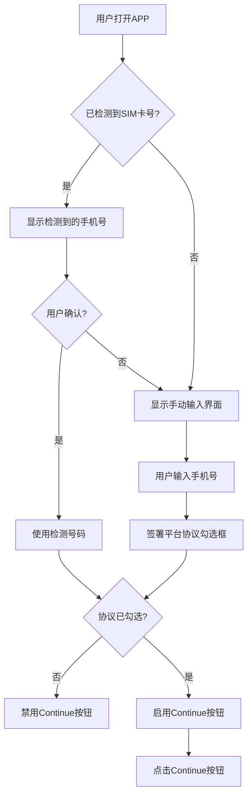

#### 2.1.2 业务规则

| 规则ID | 规则描述 | 实现逻辑 |
|--------|----------|----------|
| **BR-KYC-001** | 自动读取SIM卡号 | navigator.sim.read() 或 TelephonyManager |
| **BR-KYC-002** | 手机号格式验证 | 正则 `^(\+255)?[67]\d{8}$` |
| **BR-KYC-003** | 必须签署平台协议 | 复选框勾选校验 |

#### 2.1.3 前端实现

```typescript
// kyc-process.component.ts
phoneInputMode = signal<'detect' | 'manual'>('detect');
detectedPhoneNumber = '+255 712 345 678'; // 从SIM卡读取
agreedToTermsAuth = signal(false);
```

---

### KYC-02: OTP短信验证

#### 2.2.1 用户交互流程

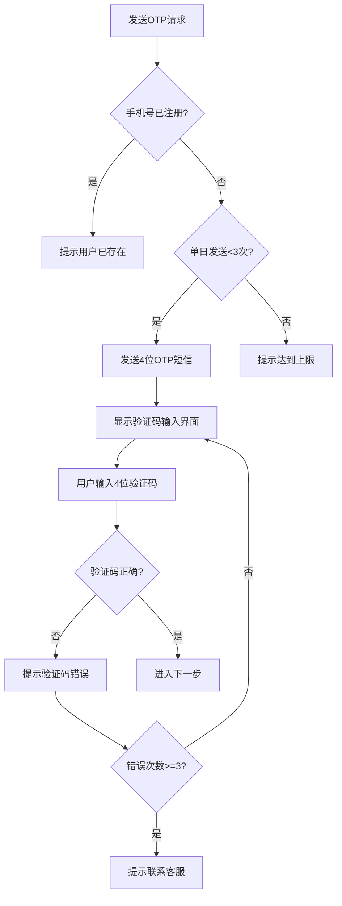

#### 2.2.2 业务规则

| 规则ID | 规则描述 | 实现逻辑 |
|--------|----------|----------|
| **BR-KYC-004** | OTP为4位数字 | `@Pattern(regexp = "^\\d{4}$")` |
| **BR-KYC-005** | OTP有效期1分钟 | Redis存储，TTL=60秒 |
| **BR-KYC-006** | 单日发送限制10次 | Redis计数器，重置时间23:59:59 |
| **BR-KYC-007** | **发送冷却时间60秒** | **Redis Key `cooldown:otp:phone:TYPE` TTL=60s，防止短信轰炸** |
| **BR-KYC-008** | **并发验证防护** | **Redis分布式锁 `lock:otp:phone:TYPE` TTL=5s，防止同一OTP被重复使用** |
| **BR-KYC-009** | **原子状态更新** | **UPDATE WHERE status='PENDING'，确保OTP只能使用一次** |
| **BR-KYC-010** | **废弃旧PENDING记录** | **生成新OTP时，将旧的PENDING记录标记为EXPIRED，避免多条记录混淆** |
| **BR-KYC-011** | 重发倒计时60秒 | 前端控制 |
| **BR-KYC-012** | 协议签署后端强制校验 | 必须提供 `agreedToTerms=true`，后端收到即视为"隐式同意"，记录 `PRE_AGREED` 到 `t_user_consents` |

---

### KYC-03: 平台协议签署

#### 2.3.1 协议清单

| 协议名称 | 强制性 | 说明 |
|----------|--------|------|
| Terms of Use | 是 | 用户使用条款 |
| Privacy Policy | 是 | 隐私政策 |
| Credit Bureau Consent | 是 | 征信局查询授权 |
| Savings Account Agreement | 是 | 开户协议 |

#### 2.3.2 授权记录

> **优化设计**: 授权表拆分为核心授权表（`t_user_consents`）和地理日志表（`t_user_geo_logs`），避免每次授权都存储冗余的位置信息。

**核心授权表** (`t_user_consents`):
```java
@Entity
@Table(name = "t_user_consents")
public class UserConsent {
    @Id
    private Long id;

    @Column(name = "user_id")
    private Long userId;

    // 授权类型
    @Column(name = "consent_type")
    private String consentType;  // CREDIT_BUREAU, TERMS_OF_USE, PRIVACY_POLICY, SAVINGS_AGREEMENT

    @Column(name = "consent_name")
    private String consentName;  // 显示名称

    @Column(name = "is_required")
    private Boolean isRequired;  // 是否强制

    @Column(name = "action")
    private String action;       // GRANTED, REVOKED, DENIED, PRE_AGREED

    @Column(name = "consented_at")
    private Instant consentedAt;

    @Column(name = "created_at")
    private Instant createdAt;
}
```

**地理日志表** (`t_user_geo_logs`):
```java
@Entity
@Table(name = "t_user_geo_logs")
public class UserGeoLog {
    @Id
    private Long id;

    @Column(name = "user_id")
    private Long userId;

    @Column(name = "session_id")  // 弱关联：通过session或request_id关联
    private String sessionId;

    @Column(name = "latitude")
    private BigDecimal latitude;

    @Column(name = "longitude")
    private BigDecimal longitude;

    @Column(name = "city")
    private String city;

    @Column(name = "region")
    private String region;

    @Column(name = "ip_address")
    private String ipAddress;

    @Column(name = "device_id")
    private String deviceId;

    @Column(name = "created_at")
    private Instant createdAt;
}
```

---

### KYC-04: 身份证扫描 (NIDA)

> **流程图对应**: 步骤11-13 "拍摄NIDA ID正面 → 拍摄NIDA ID背面 → OCR识别信息"

#### 2.4.1 扫描流程 (纯前端操作)

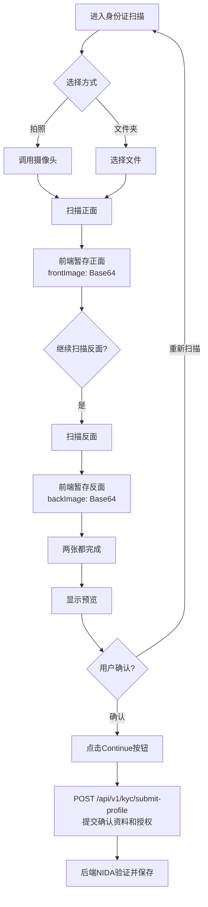

**注意**: OCR识别在两面扫描完成后**自动触发**，无需用户点击Continue。
```

#### 2.4.2 关键说明

| 步骤 | 操作 | 是否调用后端 | 说明 |
|------|------|-------------|------|
| 扫描正面 | 调起摄像头拍照 | ❌ 纯前端 | 暂存到前端变量 (base64) |
| 扫描反面 | 调起摄像头拍照 | ❌ 纯前端 | 暂存到前端变量 (base64) |
| 两张都完成 | **自动触发OCR** | ✅ **自动调用后端** | 调用OCR识别接口 |
| OCR识别完成 | 显示识别结果 | - | **自动**显示OCR结果供用户确认 |
| 用户编辑信息 | 前端操作 | ❌ 纯前端 | 用户可修改OCR结果 |
| 用户点击Continue | 提交确认信息 | ✅ **此时才存储** | 一起保存：OCR记录+确认信息+授权 ⚠️ |

**关键纠正**：
- OCR识别完成后**不立即存储**，仅返回结果给前端
- 用户可以编辑OCR结果
- 等用户点击Continue（确认信息+勾选授权后）才一起存储
- 存储的是**用户最终确认的信息**，而不是OCR原始结果 |

#### 2.4.3 OCR识别字段

| 字段 | 说明 | 示例 |
|------|------|------|
| fullName | 姓名 | JUMA HAMISI JUMA |
| nidaNumber | NIDA身份证号 | 19900101-12345-12345-01 |
| dateOfBirth | 出生日期 | 01 / 01 / 1990 |

#### 2.4.4 OCR记录存储

> **存储时机**: 用户点击Continue后，**与确认信息+授权记录一起存储**
> **关键纠正**: OCR识别完成后**不立即存储**，仅返回结果给前端，用户可编辑

**为什么不在OCR识别后立即存储？**

| 原因 | 说明 |
|------|------|
| 用户可编辑 | OCR结果可能被用户修改，立即存储无意义 |
| 避免脏数据 | 用户可能重新扫描或取消流程 |
| 一次性提交 | Continue点击时确认所有信息，一起存储 |

**正确的存储时机**：

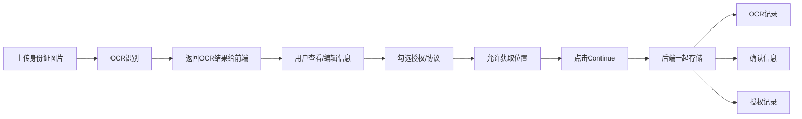

**存储的数据表**：

```java
// KYC系统 - OCR识别记录表
@Entity
@Table(name = "t_kyc_documents")
public class KycDocument {
    @Id
    private Long id;

    @Column(name = "user_id")
    private Long userId;

    // 原始OCR结果（用于审计）
    @Column(name = "ocr_original_full_name")
    private String ocrOriginalFullName;

    @Column(name = "ocr_original_nida_number")
    private String ocrOriginalNidaNumber;

    @Column(name = "ocr_original_dob")
    private LocalDate ocrOriginalDob;

    // 用户最终确认的信息（这才是存储的重点）
    @Column(name = "confirmed_full_name")
    private String confirmedFullName;

    @Column(name = "confirmed_nida_number")
    private String confirmedNidaNumber;

    @Column(name = "confirmed_dob")
    private LocalDate confirmedDob;

    // 是否用户手动修改过
    @Column(name = "is_manual_corrected")
    private Boolean isManualCorrected = false;

    // 图片存储（使用fileId+fileHash，不存URL）
    @Column(name = "front_file_id")
    private String frontFileId;  // 文件唯一标识

    @Column(name = "front_file_hash")
    private String frontFileHash;  // SHA-256，完整性校验

    @Column(name = "front_file_size")
    private Long frontFileSize;

    @Column(name = "front_file_type")
    private String frontFileType;  // image/jpeg

    @Column(name = "back_file_id")
    private String backFileId;

    @Column(name = "back_file_hash")
    private String backFileHash;

    @Column(name = "back_file_size")
    private Long backFileSize;

    @Column(name = "back_file_type")
    private String backFileType;

    @Column(name = "ocr_confidence")
    private BigDecimal ocrConfidence;

    @Column(name = "verification_status")
    private String verificationStatus;  // NOT_VERIFIED, PENDING, APPROVED, REJECTED

    @Column(name = "created_at")
    private Instant createdAt;
}
```

#### 2.4.5 文件存储设计原则

> **为什么存fileId+fileHash而不是URL？**

| 存储方式 | 问题 |
|----------|------|
| **直接存储URL** | ❌ URL包含敏感信息（bucket、路径）<br>❌ OSS迁移时URL变化，数据不一致<br>❌ 无法检测文件是否被篡改 |
| **存储fileId+fileHash** | ✅ 无敏感信息泄露<br>✅ OSS迁移不影响fileId<br>✅ fileHash可检测篡改<br>✅ URL通过fileId动态生成 |

**fileId的作用**：
- 文件的唯一标识符（通常是UUID）
- 用于定位文件和生成访问URL
- OSS迁移时fileId不变，只需修改URL生成逻辑

**fileHash的作用**：
- 文件内容的SHA-256哈希值
- 用于完整性校验（文件是否被篡改）
- 用于去重（相同内容不重复存储）

**URL生成方式**：
```java
// 通过fileId动态生成URL，不存储
public String getFileUrl(String fileId) {
    // 从配置读取OSS endpoint
    String ossEndpoint = config.getOssEndpoint();
    String bucket = config.getBucket();
    return String.format("%s/%s/%s", ossEndpoint, bucket, fileId);
}

// 带签名的URL（私有文件）
public String getSignedFileUrl(String fileId) {
    // 生成临时访问URL，带过期时间
    return ossClient.generatePresignedUrl(bucket, fileId, 3600);
}
```

**数据完整性校验**：
```java
// 上传时计算hash
String fileHash = DigestUtils.sha256Hex(fileData);

// 存储到数据库
ocrRecord.setFrontFileHash(fileHash);

// 下载时校验
String downloadedHash = DigestUtils.sha256Hex(downloadedData);
if (!downloadedHash.equals(ocrRecord.getFrontFileHash())) {
    throw new SecurityException("文件已被篡改");
}
```

---

#### 2.4.6 User主表设计

> **归属系统**: UAM
> **唯一性约束**: 一个手机号 = 一个NIDA号 = 一个用户

```java
@Entity
@Table(name = "t_users", uniqueConstraints = {
    @UniqueConstraint(columnNames = "phone"),
    @UniqueConstraint(columnNames = "nida_number")
})
public class User {
    @Id
    private Long id;

    @Column(name = "phone", unique = true, nullable = false)
    private String phone;

    @Column(name = "nida_number", unique = true)
    private String nidaNumber;  // KYC通过后填入

    @Column(name = "pin_hashed")
    private String pinHashed;

    @Column(name = "user_type")
    private String userType;  // NEW, TYPE_A, TYPE_B, TYPE_C

    @Column(name = "kyc_status")
    private String kycStatus;  // PENDING, APPROVED, REJECTED

    @Column(name = "platform_ecif_id")
    private String platformEcifId;  // 关联ECIF

    @Column(name = "created_at")
    private Instant createdAt;
}
```

**业务规则**：
| 场景 | 检查项 | 规则 |
|------|--------|------|
| 注册 | 手机号 | 手机号唯一，已注册则提示"该手机号已注册" |
| KYC提交 | NIDA号 | NIDA号唯一，已被其他用户使用则提示"该身份已认证，请用原手机号登录" |
| 修改手机号 | 新手机号 | 新手机号未被其他用户使用 |

---

#### 2.4.7 用户资料存储

> **存储时机**: 用户点击Continue后
> **存储位置**: 直接保存到 UAM.t_user_profiles（无临时表）
> **关键纠正**: 不再使用临时表，用户确认后直接存储到正式表

```java
// UAM服务 - 用户资料表（直接存储，无临时表）
@Entity
@Table(name = "t_user_profiles")
public class UserProfile {
    @Id
    private Long id;

    @Column(name = "user_id")
    private Long userId;

    // 用户确认后的三项基本信息
    @Column(name = "full_name")
    private String fullName;

    @Column(name = "nida_number")
    private String nidaNumber;

    @Column(name = "date_of_birth")
    private LocalDate dateOfBirth;

    @Column(name = "gender")
    private String gender;  // MALE / FEMALE / OTHER
                           // 转换到ECIF时: MALE→"1", FEMALE→"2", OTHER→"9"

    // 地址信息
    @Column(name = "address_line1")
    private String addressLine1;

    @Column(name = "city")
    private String city;

    @Column(name = "region")
    private String region;

    // 是否用户手动修改过OCR结果
    @Column(name = "is_manual_corrected")
    private Boolean isManualCorrected = false;

    @Column(name = "ocr_original_name")
    private String ocrOriginalName;  // 保留OCR原始值用于审计

    @Column(name = "ocr_original_nida")
    private String ocrOriginalNida;

    // NIDA验证状态
    @Column(name = "nida_verified")
    private Boolean nidaVerified = false;

    @Column(name = "nida_verified_at")
    private Instant nidaVerifiedAt;

    @Column(name = "created_at")
    private Instant createdAt;

    @Column(name = "updated_at")
    private Instant updatedAt;
}
```

#### 2.4.8 授权记录存储

> **存储时机**: 用户每次勾选授权/协议/地址时立即记录
> **用途**: 合规审计，永久保留
> **存储位置**: UAM.t_user_consents

授权记录存储在 `t_user_consents` 表（详见 2.3.2 节）。

#### 2.4.9 授权类型清单

| 授权类型 | consent_type | consent_name | 是否强制 | 存储时机 |
|----------|--------------|--------------|----------|----------|
| 征信查询授权 | CREDIT_BUREAU | Credit Bureau Consent | ✅ 是 | NIDA校验前必须勾选 |
| 地理位置 | LOCATION | Location Access | ⚠️ 可拒 | 用户授权位置时 |
| 用户协议 | AGREEMENT | Terms of Use | ✅ 是 | 注册时勾选 |
| 隐私政策 | AGREEMENT | Privacy Policy | ✅ 是 | 注册时勾选 |
| 开户协议 | AGREEMENT | Savings Account Agreement | ✅ 是 | 信息确认时勾选 |

#### 2.4.10 图片存储

> **存储时机**: OCR识别完成时
> **存储位置**: KYC调用OSS加密存储，记录URL到t_kyc_documents
> **安全设计**: 使用散列路径避免热点和枚举攻击。路径格式 `kyc/{yyyy}/{hash_prefix_2chars}/{file_uuid}.jpg`，完全解耦业务语义。

| 数据项 | 存储位置 | 说明 |
|--------|----------|------|
| 身份证正面 | OSS: `kyc/{yyyy}/{hash_prefix_2chars}/{uuid_front}.jpg` | AES-256加密 + 散列分片 |
| 身份证反面 | OSS: `kyc/{yyyy}/{hash_prefix_2chars}/{uuid_back}.jpg` | AES-256加密 + 散列分片 |
| 人脸自拍 | OSS: `kyc/{yyyy}/{hash_prefix_2chars}/{uuid_selfie}.jpg` | AES-256加密 + 散列分片 |
| SHA256哈希 | TiDB: t_kyc_documents.file_hash | 防篡改校验 |
| fileId映射 | TiDB: t_kyc_documents.file_id | UUID，通过DB映射查找OSS路径 |

---

#### 2.4.11 用户会话管理

> **归属系统**: UAM
> **用途**: 管理用户登录会话，支持token鉴权、会话过期、多设备管理

```java
@Entity
@Table(name = "t_user_sessions")
public class UserSession {
    @Id
    private Long id;

    @Column(name = "user_id")
    private Long userId;

    @Column(name = "session_id", unique = true)
    private String sessionId;      // 会话唯一标识 (UUID)

    @Column(name = "access_token")
    private String accessToken;    // JWT access token

    @Column(name = "refresh_token")
    private String refreshToken;   // JWT refresh token

    @Column(name = "device_id")
    private String deviceId;       // 设备唯一标识

    @Column(name = "device_type")
    private String deviceType;     // ANDROID / IOS / WEB

    @Column(name = "device_info")
    private String deviceInfo;     // 设备信息（JSON）：型号、OS版本等

    @Column(name = "ip_address")
    private String ipAddress;

    @Column(name = "user_agent")
    private String userAgent;

    @Column(name = "status")
    private String status;         // ACTIVE / EXPIRED / LOGOUT

    @Column(name = "expires_at")
    private Instant expiresAt;     // access_token过期时间

    @Column(name = "refresh_expires_at")
    private Instant refreshExpiresAt;  // refresh_token过期时间

    @Column(name = "last_activity_at")
    private Instant lastActivityAt;

    @Column(name = "created_at")
    private Instant createdAt;

    @Column(name = "revoked_at")
    private Instant revokedAt;     // 注销时间
}
```

**会话状态机**：

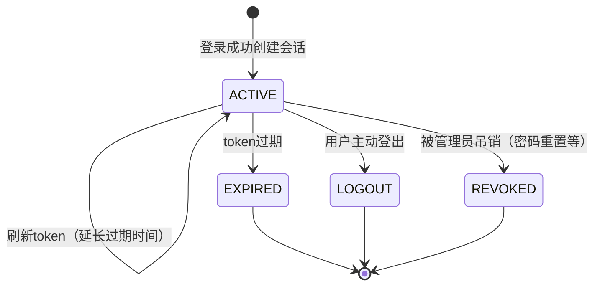

**会话管理策略**：

| 场景 | 策略 |
|------|------|
| 多设备登录 | 允许，每个设备独立会话 |
| token过期 | access_token过期后可用refresh_token刷新 |
| 单点登出 | 仅注销当前会话，不影响其他设备 |
| 全局登出 | 注销用户所有会话（密码重置、账号风险） |
| 会话清理 | 定时清理过期会话 |

---

### KYC-05 & KYC-06: OCR信息提取与确认

> **正确流程**: OCR → 用户编辑 → 勾选授权/协议/位置 → 点击Continue → NIDA校验 → 人脸识别

#### 2.5.1 信息确认与授权界面

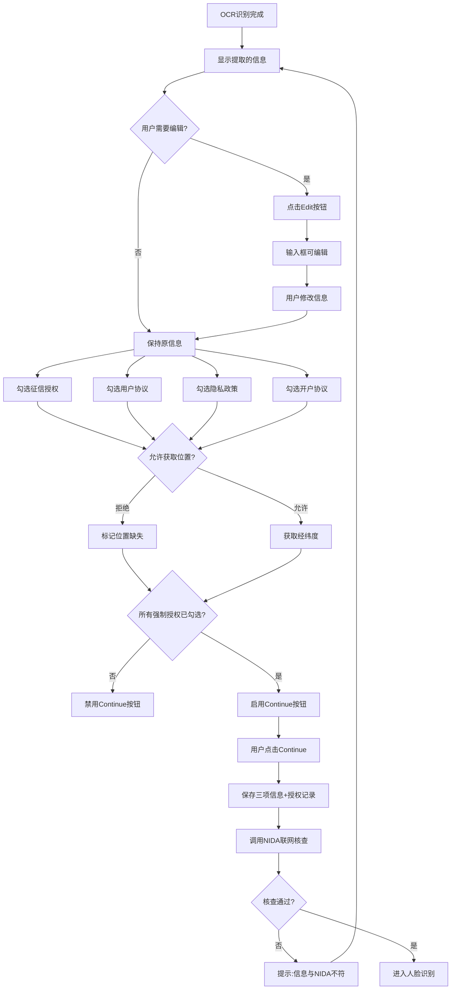

#### 2.5.2 地理位置获取

```typescript
handleLocationPermission(granted: boolean) {
  if (granted) {
    navigator.geolocation.getCurrentPosition(
      (position) => {
        const { latitude, longitude } = position.coords;
        // 调用逆地理编码API获取城市信息
      }
    );
  }
  this.locationPermissionState.set(granted ? 'GRANTED' : 'DENIED');
}
```

#### 2.5.3 业务规则

| 规则ID | 规则描述 | 实现逻辑 |
|--------|----------|----------|
| **BR-KYC-008** | 允许手动修正OCR | 字段可编辑 |
| **BR-KYC-009** | 必须获取地理位置 | navigator.geolocation API |
| **BR-KYC-010** | 拒绝地理位置可继续 | 标记为位置缺失，不影响流程 |

---

### KYC-07: NIDA数据库校验 ⚠️ 关键步骤

> **重要性**: 这是防止虚假身份注册的关键安全措施

#### 2.6.1 NIDA校验流程

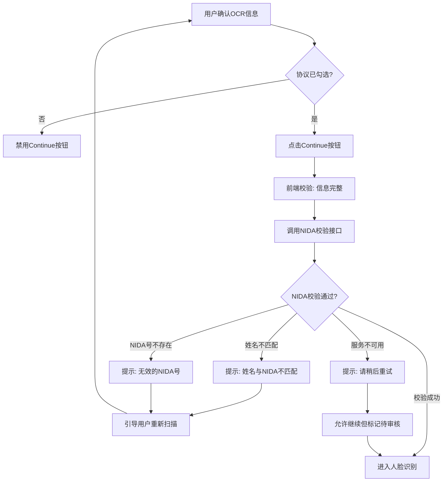

#### 2.6.2 业务规则

| 规则ID | 规则描述 | 实现逻辑 |
|--------|----------|----------|
| **BR-NIDA-001** | 必须通过NIDA校验 | 在进入人脸识别前完成 |
| **BR-NIDA-002** | 姓名完全匹配 | OCR姓名 == NIDA姓名（忽略空格大小写） |
| **BR-NIDA-003** | NIDA号格式校验 | 格式: `YYYYMMDD-XXXXX-XXXXX-XX` |
| **BR-NIDA-004** | 出生日期校验 | OCR日期 == NIDA日期 |
| **BR-NIDA-005** | 需要征信授权 | 必须勾选 Credit Bureau Consent |
| **BR-NIDA-006** | 服务降级处理 | NIDA不可用时允许继续但标记为待审核 |
| **BR-NIDA-007** | NIDA数据权威性 | NIDA返回的gender、district等字段具有最高权威性，校验通过时应强制覆盖用户输入值 |

#### 2.6.3 接口定义

**接口**: `POST /api/v1/kyc/verify-nida`

**请求**:
```java
@Schema(description = "NIDA校验请求")
public record NidaVerificationRequest(
    @Schema(description = "OCR识别的姓名", example = "JUMA HAMISI JUMA")
    @NotBlank
    String fullName,

    @Schema(description = "OCR识别的NIDA号", example = "19900101-12345-12345-01")
    @NotBlank
    @Pattern(regexp = "^\\d{8}-\\d{5}-\\d{5}-\\d{2}$")
    String nidaNumber,

    @Schema(description = "OCR识别的出生日期", example = "1990-01-01")
    @NotBlank
    LocalDate dateOfBirth
) {}
```

**响应**:
```java
@Schema(description = "NIDA校验响应")
public record NidaVerificationResponse(
    @Schema(description = "是否校验通过")
    boolean verified,

    @Schema(description = "NIDA数据库返回的信息")
    NidaData nidaData,

    @Schema(description = "匹配度分数 (0-100)")
    Integer matchScore
) {}

@Schema(description = "NIDA数据")
public record NidaData(
    String fullName,
    String nidaNumber,
    LocalDate dateOfBirth,
    String gender,
    String district
) {}
```

**错误响应**:
```java
@Schema(description = "NIDA校验失败响应")
public record NidaVerificationErrorResponse(
    @Schema(description = "错误码", example = "NAME_MISMATCH")
    String code,

    @Schema(description = "错误消息")
    String message,

    @Schema(description = "错误详情")
    NidaErrorDetails details
) {}

public record NidaErrorDetails(
    String reason,        // NAME_MISMATCH / INVALID_NIDA / NOT_FOUND
    String expectedName,  // NIDA数据库中的姓名
    String providedName   // 用户提供的姓名
) {}
```

---

### KYC-08: 地理位置获取

> **流程图对应**: 步骤20 "请求地理位置权限"

#### 2.7.1 地理位置处理流程

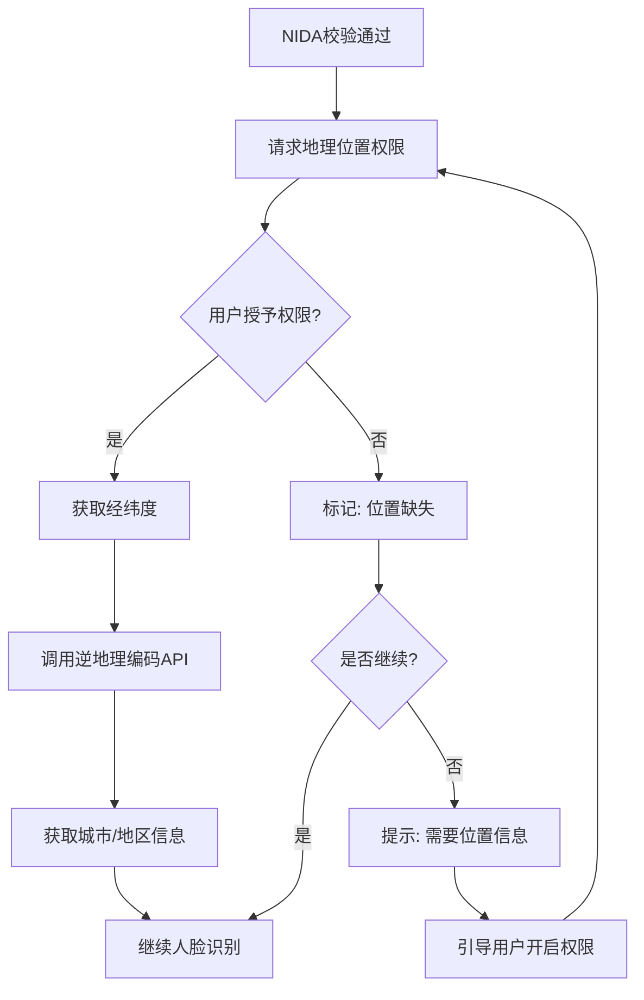

#### 2.7.2 业务规则

| 规则ID | 规则描述 | 实现逻辑 |
|--------|----------|----------|
| **BR-KYC-014** | 允许拒绝地理位置 | 不阻断注册流程 |
| **BR-KYC-015** | 拒绝位置标记风险 | 用户标签增加 `LOCATION_DENIED` |
| **BR-KYC-016** | 风险用户限制 | 可能影响初始额度或需要人工审核 |
| **BR-KYC-017** | 逆地理编码 | 调用地图API将经纬度转换为城市 |

#### 2.7.3 地理位置数据模型

```java
@Embeddable
public class GeoLocation {
    @Column(name = "latitude")
    private Double latitude;

    @Column(name = "longitude")
    private Double longitude;

    @Column(name = "city")
    private String city;

    @Column(name = "region")
    private String region;

    @Column(name = "country")
    private String country;

    @Column(name = "permission_granted")
    private Boolean permissionGranted;
}
```

#### 2.7.4 风控处理

| 位置状态 | 处理策略 | 说明 |
|----------|----------|------|
| GRANTED | 正常流程 | 获取城市信息用于反欺诈 |
| DENIED | 标记风险 | 添加用户标签，不影响注册 |
| DENIED + 多次失败 | 人工审核 | 可能需要补充证明材料 |

---

### KYC-09: 开户协议签署

#### 2.8.1 协议清单

| 协议名称 | 强制性 | 说明 |
|----------|--------|------|
| Terms of Use | 是 | 用户使用条款 |
| Privacy Policy | 是 | 隐私政策 |
| Credit Bureau Consent | 是 | **NIDA查询必须** |
| Savings Account Agreement | 是 | 开户协议 |

#### 2.8.2 签署记录

授权记录存储在 `t_user_consents` 表（详见 2.3.2 节）

---

### KYC-10: 活体/人脸识别

#### 2.6.1 活体检测流程

```mermaid
flowchart TD
    A[进入人脸识别] --> B[切换前置摄像头]
    B --> C[显示圆形取景框]
    C --> D{检测到人脸?}

    D -->|否| E[提示"请将脸部对准圆框"]
    D -->|是| F[活体检测动作]

    F --> G{活体验证通过?}
    G -->|否| H[提示验证失败，重试]
    G -->|是| I[人脸匹配检查]

    I --> J{人脸与身份证匹配?}
    J -->|否| K[提示匹配失败，终止流程]
    J -->|是| L[提交KYC申请]
```

#### 2.6.2 活体检测动作

| 动作类型 | 说明 | 触发方式 |
|----------|------|----------|
| 静态检测 | 保持正面姿势2秒 | 自动触发 |
| 动作检测 | 眨眼、张嘴、摇头 | 随机指令 |
| 光线变化 | 检测光线反射 | 防止照片攻击 |

---

### KYC-10: 交易密码设置

#### 2.7.1 PIN设置流程

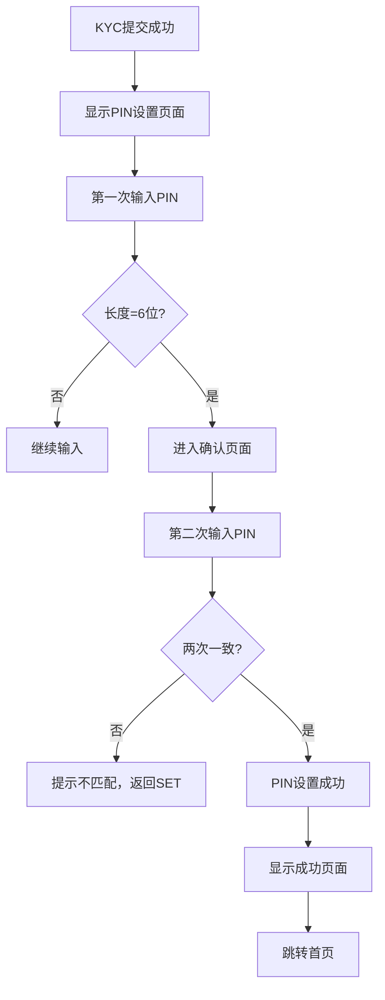

#### 2.7.2 业务规则

| 规则ID | 规则描述 | 实现逻辑 |
|--------|----------|----------|
| **BR-KYC-011** | PIN长度为6位 | `@Size(min = 6, max = 6)` |
| **BR-KYC-012** | 必须两次确认 | 前端比对 |
| **BR-KYC-013** | 可跳过PIN设置 | 不影响注册流程 |

---

### KYC-10a: PIN登录流程

> **说明**: 用户设置PIN后，可使用PIN进行快速登录
> **调用时机**: 用户选择PIN登录方式

#### 2.7.3 PIN登录流程时序图

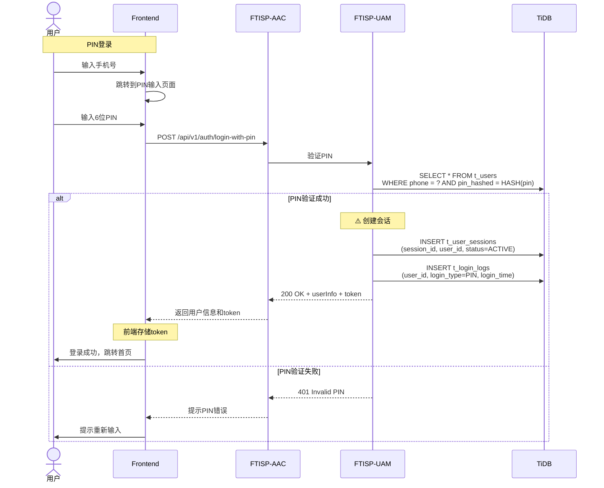

#### 2.7.4 PIN登录接口定义

> **路由**: Frontend → AAC → UAM

**接口**: `POST /api/v1/auth/login-with-pin`

**请求**:
```yaml
authentication: none
requestBody:
  phone: string         # 手机号
  pin: string           # 6位PIN码
  deviceId: string      # 设备唯一标识
  deviceType: string    # ANDROID / IOS / WEB
```

**响应**:
```yaml
"200": 登录成功
  body:
    sessionId: string
    accessToken: string     # JWT access token
    refreshToken: string
    expiresIn: number
    user:
      userId: number
      phone: string
      userType: string
      kycStatus: string
    message: "登录成功"

"401": PIN验证失败
  body:
    code: "INVALID_PIN"
    message: "PIN码错误，请重新输入"
    attemptsLeft: number  # 剩余尝试次数

"423": 账户已锁定
  body:
    code: "ACCOUNT_LOCKED"
    message: "PIN错误次数过多，账户已临时锁定，请稍后再试"
```

**业务规则**：
| 规则ID | 规则描述 | 实现逻辑 |
|--------|----------|----------|
| **BR-AUTH-001** | PIN错误次数限制 | 5次错误后锁定账户30分钟 |
| **BR-AUTH-002** | 设备绑定 | PIN登录需验证已绑定设备（可选） |
| **BR-AUTH-003** | 登录日志 | 记录每次PIN登录尝试 |

---

### KYC-11: 提交KYC申请与风控审核

> **流程图对应**: 步骤23 "提交完整KYC数据"
> **关键点**: 提交KYC后流程结束，用户可选择设置PIN；风控异步审核通过后回调处理，更新用户状态并开户

#### 2.11.1 提交KYC申请流程

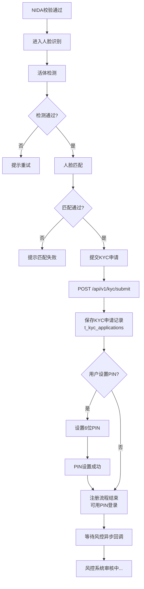

#### 2.11.2 KYC申请记录表

```java
@Entity
@Table(name = "t_kyc_applications")
public class KycApplication {
    @Id
    private Long id;

    @Column(name = "user_id")
    private Long userId;

    // 关联记录
    @Column(name = "kyc_document_id")
    private Long kycDocumentId;

    @Column(name = "basic_info_id")
    private Long basicInfoId;

    // 申请状态
    @Column(name = "application_status")
    private String applicationStatus;  // PENDING, UNDER_REVIEW, APPROVED, REJECTED

    @Column(name = "submitted_at")
    private Instant submittedAt;

    @Column(name = "reviewed_at")
    private Instant reviewedAt;

    // 风控结果 (回调时更新)
    @Column(name = "risk_result")
    private String riskResult;  // APPROVED, REJECTED, MANUAL_REVIEW

    @Column(name = "risk_score")
    private Integer riskScore;

    @Column(name = "customer_type")
    private String customerType;  // STARTER, TYPE_C, TYPE_A

    @Column(name = "credit_limit")
    private BigDecimal creditLimit;

    // 回调信息
    @Column(name = "callback_received_at")
    private Instant callbackReceivedAt;

    @Column(name = "callback_processed")
    private Boolean callbackProcessed = false;

    @Column(name = "created_at")
    private Instant createdAt;
}
```

#### 2.11.3 审批状态机

> **说明**: 风控系统分别审核存款户和贷款户资格，任一通过即创建ECIF，两者都拒才拒绝

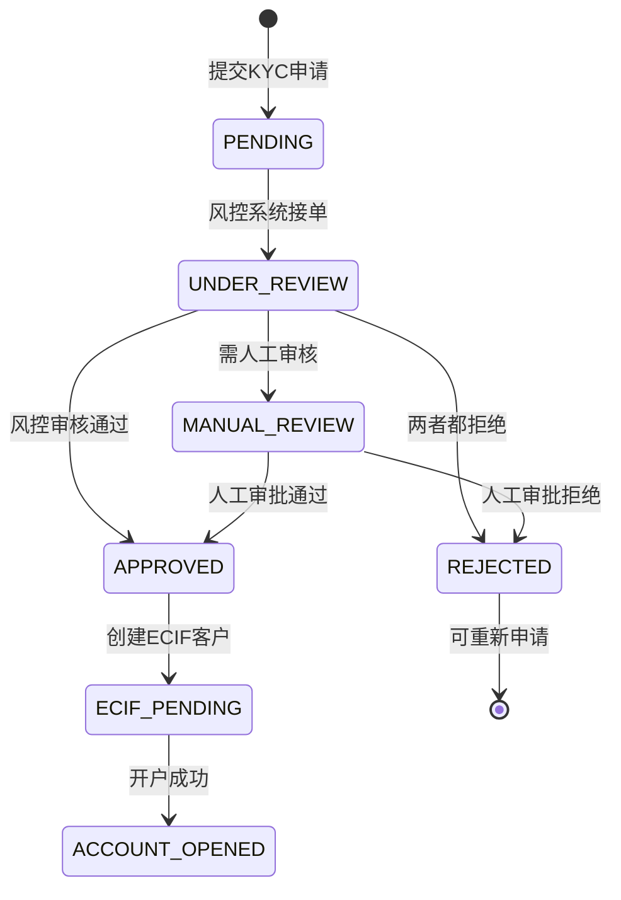

**风控回调结果说明**:

| 字段 | 说明 | 示例值 |
|------|------|--------|
| riskResult | 审批结果 | APPROVED / REJECTED / MANUAL_REVIEW |
| userType | 用户等级（由风控系统评估） | TYPE_A / TYPE_B / TYPE_C |
| canOpenDepositAccount | 能否开存款户 | true / false |
| canOpenLoanAccount | 能否开贷款户 | true / false |
| creditLimit | 贷款额度 | 数值 |

**开户逻辑**:
- 当 `riskResult = APPROVED` 时：
  - 只要 `canOpenDepositAccount = true` 或 `canOpenLoanAccount = true`，就创建ECIF客户
  - 根据对应标识开立存款户/贷款户
  - 用户等级由风控系统的 `userType` 决定
- 当两者都为 `false` 时，才视为 `REJECTED`

#### 2.11.4 风控异步回调处理

> **说明**: 风控系统回调到DAL，DAL根据流程实例ID找到对应流程并编排后续操作

> **回调接口**: `POST /api/v1/internal/dal/risk-callback`

```java
@RestController
@RequestMapping("/api/v1/internal/dal")
public class DalRiskCallbackController {

    @PostMapping("/risk-callback")
    @Transactional
    public ResponseEntity<?> handleRiskCallback(
        @RequestBody RiskCallbackRequest request,
        @RequestHeader("X-Signature") String signature
    ) {
        // 1. 验证签名
        if (!verifySignature(request, signature)) {
            return ResponseEntity.status(401).body("Invalid signature");
        }

        // 2. 查找流程实例记录（DAL存储）
        ProcessInstance process = processInstanceRepository.findById(request.getProcessInstanceId());

        // 3. 检查是否已处理
        if (process.getCallbackProcessed()) {
            return ResponseEntity.ok().body("Already processed");
        }

        // 4. 更新流程实例回调信息
        process.setRiskResult(request.getRiskResult());
        process.setRiskScore(request.getRiskScore());
        process.setCustomerType(request.getCustomerType());
        process.setCreditLimit(request.getCreditLimit());
        process.setCanOpenDepositAccount(request.getCanOpenDepositAccount());
        process.setCanOpenLoanAccount(request.getCanOpenLoanAccount());
        process.setCallbackReceivedAt(Instant.now());
        process.setCallbackProcessed(true);
        processInstanceRepository.save(process);

        // 5. DAL编排：根据风控结果处理后续流程
        switch (request.getRiskResult()) {
            case "APPROVED":
                handleApproved(process, request);
                break;
            case "REJECTED":
                handleRejected(process, request);
                break;
            case "MANUAL_REVIEW":
                handleManualReview(process, request);
                break;
        }

        return ResponseEntity.ok().body("Callback processed");
    }

    private void handleApproved(ProcessInstance process, RiskCallbackRequest callback) {
        Long userId = process.getUserId();

        // 1. DAL调用ECIF创建客户（开户+绑定）
        EcifCustomerResponse ecifCustomer = ecifClient.createCustomer(...);

        // 2. DAL调用ACS开立账户
        if (callback.getCanOpenDepositAccount()) {
            accountClient.openDepositAccount(userId, ecifCustomer.getPlatformEcifId());
        }
        if (callback.getCanOpenLoanAccount()) {
            accountClient.openLoanAccount(userId, ecifCustomer.getPlatformEcifId(), callback.getCreditLimit());
        }

        // 3. DAL调用UAM更新用户状态
        uamClient.updateUserStatus(userId, callback.getCustomerType(), "APPROVED");

        // 4. DAL完成流程实例
        process.setStatus("COMPLETED");
        process.setCompletedAt(Instant.now());
        processInstanceRepository.save(process);

        // 6. 发送通知
        msgClient.sendAccountOpenedNotification(userId);
    }
```

#### 2.11.5 风控通过后处理

> **V1.5架构**: 用户资料已直接存储到正式表，无需迁移

```java
/**
 * 风控审核通过后处理
 * 更新用户状态，并根据风控结果决定开户类型
 */
@Transactional
private void handleRiskControlApproved(Long userId, RiskControlResult result) {
    // 1. 更新用户状态
    User user = userRepository.findById(userId);
    user.setUserType(result.getUserType()); // TYPE_A, TYPE_B, TYPE_C
    user.setKycStatus("APPROVED");
    user.setKycApprovedAt(Instant.now());
    userRepository.save(user);

    // 2. 更新KYC申请状态
    KycApplication application = kycApplicationRepository.findByUserId(userId);
    application.setStatus("APPROVED");
    application.setApprovedAt(Instant.now());
    kycApplicationRepository.save(application);

    // 3. 根据风控结果开户
    if (result.canOpenDepositAccount()) {
        accountService.openDepositAccount(userId);
    }
    if (result.canOpenLoanAccount()) {
        accountService.openLoanAccount(userId);
    }
}
```

#### 2.11.6 完整数据生命周期时序图

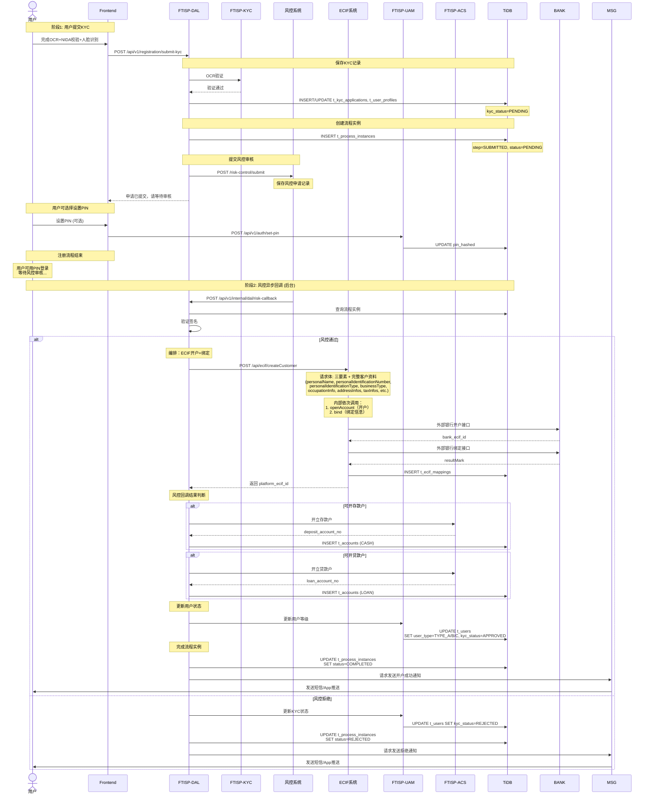

#### 2.11.7 数据存储说明

> **V1.5架构**: 无临时表迁移，数据直接存储到正式表

| 数据类型 | 存储位置 | 存储时机 | 说明 |
|----------|----------|----------|------|
| 用户资料 | UAM.t_user_profiles | 用户点击Continue后 | 直接存储，无迁移 |
| 授权记录 | UAM.t_user_consents | 用户勾选授权时 | 直接存储，永久保留 |
| OCR记录 | KYC.t_kyc_documents | OCR识别完成后 | 验证日志，永久保留 |
| KYC申请 | KYC.t_kyc_applications | 提交KYC申请时 | 状态跟踪 |

#### 2.11.8 用户等级流转

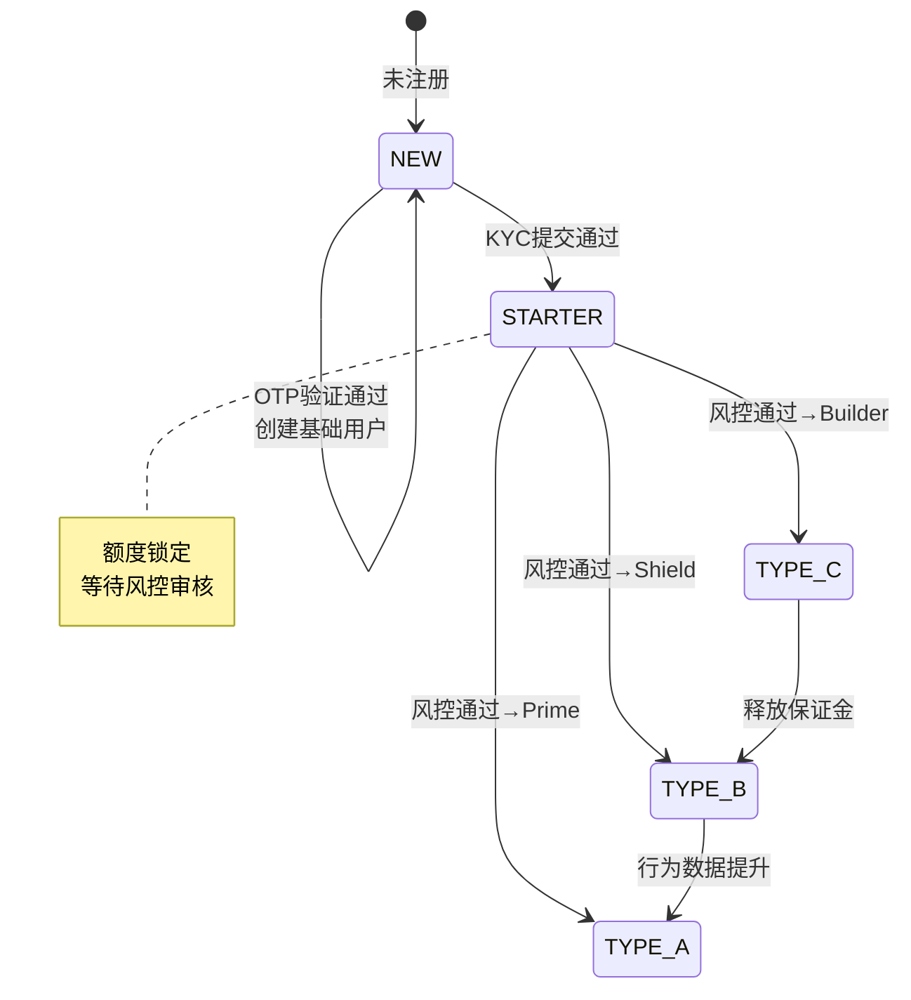

#### 2.11.9 用户等级更新时机

| 阶段 | 操作 | user_type变化 | 说明 |
|------|------|----------------|------|
| OTP验证通过 | 创建基础用户 | - → NEW | 创建用户记录 |
| **KYC提交通过** | **更新用户状态** | **NEW → STARTER** | **额度锁定，等待风控** |
| **风控审核通过** | **回调更新等级** | **STARTER → TYPE_A/B/C** | **根据风控结果决定** |

#### 2.11.10 风控回调用户类型说明

| 风控回调 customerType | 用户等级 | 说明 |
|-----------------------|----------|------|
| STARTER | STARTER | 保持锁定状态（极少情况） |
| TYPE_C | Builder (C级) | 保证金模式，额度=存款冻结金额 |
| TYPE_B | Shield (B级) | 设备锁授权，服务费9折 |
| TYPE_A | Prime (A级) | 高价值用户，低息低费 |

#### 2.11.11 审批结果处理

#### 2.11.9 账户创建流程

> **流程图节点24-25**: "账户开通(Stage3_Account) → 系统创建账户"

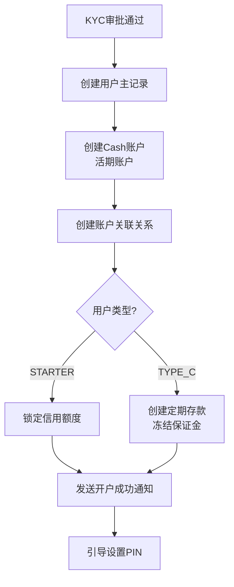

#### 2.11.4 账户创建数据模型

```java
@Entity
@Table(name = "t_accounts")
public class Account {
    @Id
    private Long id;

    @Column(name = "user_id")
    private Long userId;

    @Column(name = "account_type")
    private AccountType accountType; // CASH, SAVINGS, TERM_DEPOSIT

    @Column(name = "account_number")
    private String accountNumber; // 系统生成

    @Column(name = "balance")
    private BigDecimal balance;

    @Column(name = "available_balance")
    private BigDecimal availableBalance;

    @Column(name = "currency")
    private String currency = "TZS";

    @Column(name = "status")
    private AccountStatus status; // ACTIVE, FROZEN, CLOSED

    @Column(name = "is_collateral")
    private Boolean isCollateral = false; // 是否作为抵押

    @Column(name = "credit_limit")
    private BigDecimal creditLimit = BigDecimal.ZERO;
}
```

#### 2.11.5 Starter用户处理

| 用户状态 | 特征 | 解锁方式 | 流程 |
|----------|------|----------|------|
| STARTER | KYC通过，额度锁定 | 保证金存款 | 引导存入资金 → 1:1解锁额度 |
| STARTER | KYC通过，额度锁定 | 设备锁授权 | 引导授权PayTrigger → 获得体验额度 |

---

### KYC-12: Face ID设置

> **流程图对应**: 步骤27 "引导生物识别"

#### 2.12.1 Face ID设置流程

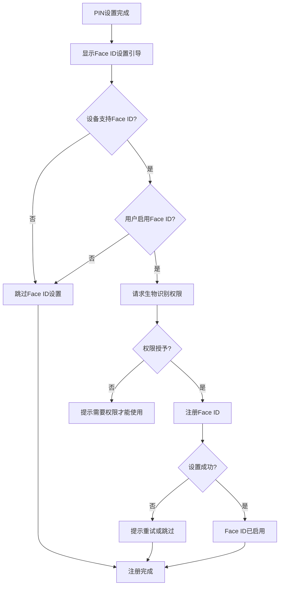

#### 2.12.2 业务规则

| 规则ID | 规则描述 | 实现逻辑 |
|--------|----------|----------|
| **BR-KYC-018** | Face ID可选 | 不影响注册完成 |
| **BR-KYC-019** | 设备兼容性检测 | 检查是否支持Face ID/Fingerprint |
| **BR-KYC-020** | 可在设置中启用 | 允许后续在Profile中启用 |

#### 2.12.3 生物识别数据模型

```java
@Entity
@Table(name = "t_user_biometrics")
public class UserBiometric {
    @Id
    private Long id;

    @Column(name = "user_id")
    private Long userId;

    @Column(name = "biometric_type")
    private BiometricType biometricType; // FACE_ID, FINGERPRINT

    @Column(name = "enabled")
    private Boolean enabled = false;

    @Column(name = "device_id")
    private String deviceId; // 绑定设备

    @Column(name = "enrolled_at")
    private Instant enrolledAt;
}
```

---

### 2.15 用户权限边界与状态机

#### 2.15.1 用户状态权限矩阵

| 用户状态 | 能否登录 | 可访问功能 | 说明 |
|----------|----------|------------|------|
| NEW | ✅ OTP登录 | 查看手机号、开始KYC | OTP验证后创建 |
| STARTER | ✅ PIN登录 | 查看审核进度、完善资料 | KYC提交后，风控审核中 |
| TYPE_A/B/C | ✅ PIN登录 | 全部功能 | 风控通过后 |

#### 2.15.2 STARTER状态用户权限

> **说明**: 用户KYC提交后状态变为STARTER，等待风控审核

**允许的操作**:
- 查看KYC审核进度 (`GET /api/v1/kyc/application-status`)
- 完善补充资料（如职业信息、税务信息）
- 设置/修改PIN
- 退出登录

**禁止的操作**:
- 申请贷款/借款
- 转账/支付
- 修改核心身份信息（姓名、NIDA号）

#### 2.15.3 风控审核期间用户行为

| 场景 | 处理方式 |
|------|----------|
| 用户查询审核进度 | 返回 currentStep, estimatedTime |
| 用户修改资料 | 允许修改非核心字段，触发风控重新评估 |
| 风控超时(>48小时) | 自动转入人工审核队列 |

---

### 2.16 数据映射与转换规则

#### 2.16.1 Gender字段映射

| 来源 | 存储值 | 目标 | 映射规则 |
|------|--------|------|----------|
| t_user_profiles | MALE/FEMALE | t_ecif_customers.gender | MALE→"1", FEMALE→"2", OTHER→"9" |
| NIDA返回 | M/F | t_user_profiles.gender | M→MALE, F→FEMALE |

#### 2.16.2 数据转换工具类

```java
public class EcifDataMapper {
    public static String mapGenderToEcif(String gender) {
        return switch (gender) {
            case "MALE" -> "1";
            case "FEMALE" -> "2";
            default -> "9";
        };
    }

    public static String mapGenderFromNida(String nidaGender) {
        return "M".equals(nidaGender) ? "MALE" : "FEMALE";
    }
}
```

#### 2.16.3 地址信息转换

| t_user_profiles | t_ecif_addresses | 映射规则 |
|-----------------|------------------|----------|
| addressLine1 | address | 完整映射 |
| city | city | 完整映射 |
| region | province | 完整映射 |
| - | add_type | 默认"2"（居住地） |
| - | country_code | 从用户配置获取 |

---

## 3. 子系统追踪 (Step 3 & 4)

### 3.1 子系统交互图

> **说明**: AAC是统一入口，无DB；用户数据分散在UAM、KYC等业务系统

```mermaid
graph TD
    F[Frontend] -->|HTTP| AAC[FTISP-AAC<br/>鉴权中心-统一入口]

    Note over AAC: AAC仅做路由，不存储数据

    AAC -->|认证路由: 直接调用| UAM[FTISP-UAM<br/>用户认证管理]

    UAM -->|数据存储| DB[(TiDB)]

    AAC -->|业务路由: 走DAL| DAL[FTISP-DAL<br/>数据聚合层]

    DAL -->|组织调用| KYC[FTISP-KYC<br/>KYC验证服务]

    KYC -->|OCR识别| OCR[第三方OCR服务]
    KYC -->|NIDA校验| NIDA[NIDA官方系统]
    KYC -->|活体检测| BIO[第三方生物识别服务]

    KYC -->|提交风控| RC[风控系统]
    RC -->|异步回调| DAL

    DAL -->|风控通过后开ECIF户| ECIF[FTISP-ECIF<br/>ECIF中心]
    ECIF -->|调用外部银行| BANK[外部银行服务]

    DAL -->|开立账户| ACS[FTISP-ACS<br/>账户核心]

    KYC -->|存储验证日志| DB
    KYC -->|存储图片| OSS

    UAM -->|发送短信| MSG[FTISP-MSG<br/>消息中心]

    style OCR fill:#f9f,stroke:#333,stroke-width:2px
    style NIDA fill:#f9f,stroke:#333,stroke-width:2px
    style BIO fill:#f9f,stroke:#333,stroke-width:2px
    style RC fill:#f9f,stroke:#333,stroke-width:2px
    style BANK fill:#f9f,stroke:#333,stroke-width:2px
    style ECIF fill:#ff9,stroke:#333,stroke-width:2px
    style ACS fill:#ff9,stroke:#333,stroke-width:2px
```

### 3.1.1 子系统职责说明

| 子系统 | 是否有DB | 用户数据职责 | 调用方式 |
|--------|----------|---------------|----------|
| **FTISP-AAC** | ❌ 无 | 仅路由，不存储 | 统一入口 |
| **FTISP-DAL** | ✅ 有 | 业务编排中心：流程实例、步骤日志 | 组织调用+流程编排 |
| **FTISP-UAM** | ✅ 有 | 用户域：t_users, t_otp_records, t_pin_history, t_user_consents, t_user_profiles, t_user_sessions, t_user_addresses | 直接调用 |
| **FTISP-MSG** | ✅ 有 | t_sms_logs (发送日志) | 通过UAM调用 |
| **FTISP-KYC** | ✅ 有 | 验证日志：t_kyc_documents, t_verification_logs | 通过DAL调用 |
| **FTISP-ECIF** | ✅ 有 | ECIF客户管理：t_ecif_customers, t_ecif_mappings (平台ECIF号→银行ECIF号映射) | 通过DAL调用 |
| **FTISP-ACS** | ✅ 有 | 账户核心：开户（风控通过后调用） | 通过DAL调用 |

**KYC验证服务架构**:
- **FTISP-KYC 统一管理所有KYC验证服务**
  - OCR扫描（内部适配器对接第三方：Smile Identity/Google Vision）
  - NIDA联网核查（内部适配器对接NIDA官方系统）
  - 活体检测/刷脸（内部适配器对接第三方：Smile Identity/AWS Rekognition）
- **用户资料统一在UAM** (fullName, nidaNumber, dateOfBirth, address)
- **授权记录在UAM** (t_user_consents)
- **KYC不存储用户主数据**，仅存储验证日志
- **DAL作为业务编排中心**，有自己的DB管理流程实例

**ECIF开户架构**:
- **FTISP-ECIF**: ECIF中心（统一管理）
  - 生成平台ECIF号（传众平台客户ID）
  - 调用外部银行服务开户
  - 获取银行返回的ECIF号
  - **内部存储**映射关系（t_ecif_mappings）
  - 支持多国家多银行（一对多映射）

**认证操作路由规则**:

| 操作 | 路由方式 | 原因 |
|------|----------|------|
| 发送OTP | AAC → **UAM** → MSG | 认证凭证管理，UAM负责 |
| 验证OTP | AAC → **UAM** (直接) | 核心认证，快速响应 |
| 设置PIN | AAC → **UAM** (直接) | 凭证操作，直接管理 |
| 创建会话 | AAC → **UAM** (直接) | 会话管理，实时性 |
| **KYC流程** | AAC → **DAL** (编排) | 跨系统业务流程 |
| **开户流程** | AAC → **DAL** (编排) | 跨系统业务流程 |

### 3.2 子系统功能点映射矩阵

| 步骤 | 子系统 | 功能点 | 输入 | 输出 | 依赖 |
|------|--------|--------|------|------|------|
| 1 | FTISP-AAC | 接收注册请求 | HTTP Request | 路由分发 | - |
| 2 | FTISP-AAC | 验证手机号格式 | phone | 验证结果 | - |
| 3 | FTISP-AAC | 路由到发送OTP | phone | - | **FTISP-UAM** ⚠️ |
| 3a | FTISP-UAM | **生成OTP** | phone | otp_code | 随机数生成器 |
| 3b | FTISP-UAM | **存储OTP** | phone, otp | - | Redis + TiDB (t_otp_records) |
| 3c | FTISP-UAM | **调用MSG发送** | phone, otp | - | FTISP-MSG |
| 3d | FTISP-MSG | **发送短信** | phone, otp | - | 短信网关 |
| 3e | FTISP-MSG | **保存发送日志** | phone, otp | log_id | TiDB (t_sms_logs) |
| 4 | FTISP-AAC | 路由到验证OTP | phone, otp | - | FTISP-UAM (直接) |
| 5 | FTISP-UAM | **验证OTP** | phone, otp | 验证结果 | Redis + TiDB |
| 6 | FTISP-UAM | **创建基础用户** | phone | user_id | TiDB (t_users) |
| 7 | FTISP-UAM | **创建用户会话** | user_id, device_id | session_id | TiDB (t_user_sessions) ⚠️ |
| 8 | FTISP-AAC | 路由到OCR扫描 | images | - | **FTISP-DAL** (编排) |
| 8a | FTISP-DAL | **创建流程实例** | user_id | process_id | TiDB (t_process_instances) |
| 8b | FTISP-DAL | 调用KYC OCR服务 | images | - | **FTISP-KYC** ⚠️ |
| 9 | FTISP-KYC | **OCR识别** | images | OCR结果 | 第三方OCR服务 |
| -- | -- | **前端操作** | 编辑信息+勾选授权 | -- | -- |
| 10 | FTISP-AAC | 提交用户资料 | profile + consents | - | **FTISP-DAL** (编排) |
| 10a| FTISP-DAL | 调用UAM保存资料 | profile | - | FTISP-UAM |
| 10b| FTISP-UAM | **保存用户资料** | profile | profile_id | TiDB (**t_user_profiles**) ⚠️ |
| 10c| FTISP-DAL | 调用UAM保存授权 | consents | - | FTISP-UAM |
| 10d| FTISP-UAM | **保存授权记录** | consents | consent_ids | TiDB (**t_user_consents**) ⚠️ |
| 10e| FTISP-DAL | 调用KYC保存OCR记录 | ocrData + confirmedData | - | **FTISP-KYC** ⚠️ |
| 10f| FTISP-KYC | **保存OCR记录** | ocr原始值 + confirmed确认值 | ocr_id | TiDB (t_kyc_documents) ⚠️ |
| 11 | FTISP-DAL | 调用KYC验证NIDA | profile | - | **FTISP-KYC** ⚠️ |
| 11a| FTISP-KYC | **NIDA数据校验** | name, nida, dob | 校验结果 | 第三方NIDA系统 |
| 11b| FTISP-KYC | **保存验证日志** | result | - | TiDB (t_verification_logs) |
| 12 | FTISP-DAL | 调用KYC活体检测 | selfie | - | **FTISP-KYC** ⚠️ |
| 12a| FTISP-KYC | **活体/人脸检测** | selfie | livenessScore | 第三方生物识别服务 |
| 12b| FTISP-KYC | **保存验证日志** | result | - | TiDB (t_verification_logs) |
| 13 | FTISP-DAL | **更新KYC状态** | user_id | - | FTISP-UAM |
| 14 | FTISP-UAM | **更新用户状态** | user_id | - | TiDB (t_users.kyc_status) |
| 15 | FTISP-DAL | 提交风控审查 | kycData | applicationId | **风控系统** |
| 16 | FTISP-DAL | **处理风控回调** | callbackResult | - | 流程编排 |
| 17a| FTISP-DAL | **请求创建ECIF客户** | userData | - | **FTISP-ECIF** ⚠️ |
| 17b| FTISP-ECIF | **生成平台ECIF号** | userData | platform_ecif_id | 内部生成 |
| 17c| FTISP-ECIF | **调用外部银行开户** | userData | bank_ecif_id | 外部银行服务 |
| 17d| FTISP-ECIF | **存储映射关系** | platform_ecif_id + bank_ecif_id | - | 内部存储 t_ecif_mappings ⚠️ |
| 18a| FTISP-DAL | **判断能否开存款户** | riskResult | canOpenDeposit | 风控回调结果 |
| 18b| FTISP-DAL | **开立存款户** | platform_ecif_id | deposit_account_no | **FTISP-ACS** (条件执行) |
| 19a| FTISP-DAL | **判断能否开贷款户** | riskResult | canOpenLoan | 风控回调结果 |
| 19b| FTISP-DAL | **开立贷款户** | platform_ecif_id | loan_account_no | **FTISP-ACS** (条件执行) |
| 20 | FTISP-UAM | **更新用户等级** | user_id, type | - | TiDB (t_users.user_type) |
| 21 | FTISP-DAL | **完成流程实例** | process_id | - | TiDB (t_process_instances) |
| 22 | FTISP-AAC | 路由到设置PIN | pin | - | FTISP-UAM (直接) |
| 23 | FTISP-UAM | 设置PIN | pin | - | TiDB (t_users.pin_hashed) |

**开户说明**:
- 步骤17-19仅在风控审批通过后执行
- **FTISP-ECIF**: 生成平台ECIF号，调用外部银行开户，获取银行ECIF号，**内部存储**映射关系
- 步骤18a/18b：风控回调结果判断能否开存款户，若可则调用FTISP-ACS开立
- 步骤19a/19b：风控回调结果判断能否开贷款户，若可则调用FTISP-ACS开立
- 存款户和贷款户的开户权限独立判断，可能只批准其中一种
- **多国家多银行**: 一个平台ECIF号可对应多个银行ECIF号（FTISP-ECIF内部存储）

---

## 4. 数据流向分析 (Step 5)

### 4.1 完整注册流程数据流

> **关键说明**:
> - AAC仅做路由，不存储数据
> - 发送OTP走 UAM → MSG (认证凭证管理)
> - 验证OTP/设置PIN直接调用UAM
> - 用户资料直接保存到UAM (无临时表迁移)
> - 授权记录保存到UAM (不在KYC)
> - DAL作为业务编排中心 (有流程实例表)
> - KYC仅做验证服务 (t_verification_logs)

```mermaid
sequenceDiagram
    actor U as 用户
    participant F as Frontend
    participant AAC as FTISP-AAC<br/>(统一入口，无DB)
    participant UAM as FTISP-UAM<br/>(认证域)
    participant MSG as FTISP-MSG<br/>(消息中心)
    participant UAM as FTISP-UAM<br/>(用户资料域)
    participant DAL as FTISP-DAL<br/>(编排中心)
    participant KYC as FTISP-KYC<br/>(验证服务)
    participant RC as 风控系统
    participant ECIF as FTISP-ECIF<br/>(ECIF中心)
    participant BANK as 外部银行服务
    participant ACS as FTISP-ACS<br/>(账户核心)
    participant DB[(TiDB)]
    participant OSS as OSS存储

    Note over U,AAC: 第一阶段：注册成为基础用户

    U->>F: 输入手机号
    F->>AAC: POST /api/v1/auth/send-otp

    Note over AAC: 认证操作 → UAM
    AAC->>UAM: 路由请求

    Note over UAM: UAM生成OTP（Redis+DB双写）
    UAM->>UAM: 生成6位随机码
    UAM->>Redis: SET otp:{phone}:{code} {otp_plain} TTL=60
    UAM->>DB: INSERT t_otp_records<br/>(otp_id, phone, otp_plain)
    UAM->>Redis: SET otp:daily:{phone}:{date}

    Note over UAM: UAM调用MSG发送
    UAM->>MSG: 发送短信 (异步)
    MSG->>DB: INSERT t_sms_logs<br/>(sms_id, phone, otp_id)
    MSG->>U: 发送短信 (第三方网关)

    UAM-->>AAC: 200 OK
    AAC-->>F: 验证码已发送

    U->>F: 输入OTP
    F->>AAC: POST /api/v1/auth/verify-otp
    AAC->>UAM: 验证OTP（先Redis后DB）

    Note over UAM: 验证OTP
    UAM->>Redis: GET otp:{phone}:{code}

    alt Redis命中（正常路径）
        alt OTP正确
            Note over UAM: 验证成功：删除Redis + 查DB更新状态
            UAM->>Redis: DELETE otp:{phone}:{code}
            UAM->>DB: SELECT * FROM t_otp_records<br/>WHERE phone=? AND otp_type='REGISTER'<br/>AND status='PENDING' AND expires_at>NOW()
            UAM->>DB: UPDATE t_otp_records<br/>SET status='USED', used_at=NOW()
            Note over UAM: UAM创建用户
            UAM->>DB: INSERT t_users<br/>(phone, user_type=NEW)
            UAM->>DB: INSERT t_user_sessions
            AAC-->>F: 200 OK + token + session_id
        else OTP错误
            AAC-->>F: 401 Invalid OTP
        end
    else Redis未命中（降级路径）
        Note over UAM: 降级查询DB（获取分布式锁 + 原子更新）
        UAM->>DB: SELECT * FROM t_otp_records<br/>WHERE phone=? AND otp_type='REGISTER'<br/>AND status='PENDING' AND expires_at>NOW()<br/>ORDER BY created_at DESC LIMIT 1

        alt DB找到有效OTP
            Note over UAM: 验证成功：原子更新record对象（防并发）
            alt OTP正确
                UAM->>DB: UPDATE t_otp_records<br/>SET status='USED', used_at=NOW()<br/>WHERE id=? AND status='PENDING'<br/>(原子更新，防止并发重复使用)
                UAM->>DB: INSERT t_users<br/>(phone, user_type=NEW)
                UAM->>DB: INSERT t_user_sessions
                AAC-->>F: 200 OK + token + session_id
            else OTP错误
                AAC-->>F: 401 Invalid OTP
            end
        else DB无有效OTP
            AAC-->>F: 401 Invalid OTP
        end
    end

    Note over U,F: 第二阶段：身份证扫描 (纯前端操作)

    U->>F: 扫描/选择身份证正面
    F->>F: 暂存frontImage: Base64
    U->>F: 扫描/选择身份证反面
    F->>F: 暂存backImage: Base64
    U->>F: 点击Continue按钮

    Note over U,DAL: 第三阶段：KYC信息收集 (DAL编排)

    F->>AAC: POST /api/v1/kyc/upload-documents
    AAC->>DAL: 路由到编排中心

    Note over DAL: 创建流程实例
    DAL->>DB: INSERT t_process_instances<br/>(process_id, user_id, step=OCR)

    DAL->>KYC: 调用OCR服务
    KYC->>OSS: 上传图片
    KYC->>KYC: OCR识别
    KYC->>DB: INSERT t_kyc_documents<br/>(document_id, user_id, ocr_result)
    KYC-->>DAL: 返回OCR结果

    DAL->>DB: UPDATE t_process_instances<br/>SET step=OCR_COMPLETED
    DAL-->>AAC: 返回OCR结果
    AAC-->>F: 返回OCR数据

    Note over U,F: 用户确认并提交

    U->>F: 确认信息+勾选授权
    F->>AAC: POST /api/v1/kyc/submit-profile
    AAC->>DAL: 路由到编排中心

    Note over DAL: 编排：保存用户资料
    DAL->>UAM: 保存用户资料
    Note over UAM: 直接保存到正式表 (无临时表)
    UAM->>DB: INSERT t_user_profiles<br/>(user_id, fullName, nidaNumber, ...)
    Note over DB: ⚠️ 用户资料在UAM<br/>不再有临时表迁移

    Note over DAL: 编排：保存授权记录
    DAL->>UAM: 保存授权记录
    UAM->>DB: INSERT t_user_consents<br/>(user_id, consentType, consentedAt)
    Note over DB: ⚠️ 授权记录在UAM<br/>不在KYC

    Note over DAL: 编排：调用NIDA验证
    DAL->>KYC: NIDA验证服务
    KYC->>KYC: 调用第三方NIDA核查
    KYC->>DB: INSERT t_verification_logs<br/>(仅验证日志)
    Note over DB: ⚠️ KYC仅保存验证日志<br/>不存储用户主数据
    KYC-->>DAL: 返回验证结果

    alt NIDA验证通过
        Note over DAL: 编排：更新KYC状态
        DAL->>UAM: 更新KYC状态
        UAM->>DB: UPDATE t_users<br/>SET kyc_status=VERIFIED

        Note over DAL: 编排：提交风控
        DAL->>RC: 提交风控审核
        DAL-->>AAC: 提交成功，等待审核
    end

    Note over U,F: 第四阶段：可选设置PIN

    U->>F: 设置PIN (可选)
    F->>AAC: POST /api/v1/auth/set-pin
    AAC->>UAM: 设置PIN
    UAM->>DB: UPDATE t_users SET pin_hashed
    AAC-->>F: PIN设置成功

    Note over U,DB: 第五阶段：风控异步回调 (DAL编排)

    RC->>DAL: 风控回调
    DAL->>DB: 查询流程实例

    alt 风控通过
        Note over DAL: 编排：创建ECIF客户

        DAL->>ECIF: 请求创建ECIF客户
        Note over ECIF: 生成平台ECIF号
        ECIF->>ECIF: 生成 platform_ecif_id

        Note over ECIF: 调用外部银行开户
        ECIF->>BANK: POST /bank/customer/create
        BANK-->>ECIF: bank_ecif_id

        Note over ECIF: 内部存储映射关系
        ECIF->>ECIF: 存储到 t_ecif_mappings(platform_ecif_id, bank_ecif_id)

        ECIF-->>DAL: platform_ecif_id

        Note over DAL: 编排：更新用户信息
        DAL->>UAM: 更新ECIF ID和用户类型
        UAM->>DB: UPDATE t_users<br/>SET ecif_customer_id=?, user_type=TYPE_A/B/C

        Note over DAL: 编排：开户（根据风控结果）
        alt 可开存款户
            DAL->>ACS: 开立存款户
            ACS-->>DAL: deposit_account_no
        end

        alt 可开贷款户
            DAL->>ACS: 开立贷款户
            ACS-->>DAL: loan_account_no
        end

        Note over DAL: 完成流程实例
        DAL->>DB: UPDATE t_process_instances<br/>SET status=COMPLETED

        DAL->>MSG: 请求发送开户成功通知
        MSG->>U: 发送短信/App推送
    else 风控拒绝
        DAL->>UAM: 更新KYC状态
        UAM->>DB: UPDATE t_users SET kyc_status=REJECTED
        DAL->>MSG: 请求发送拒绝通知
        MSG->>U: 发送短信/App推送
    end
```

    Note over KYC,DB: 存储1: OCR记录
    KYC->>DB: INSERT t_kyc_documents
    Note over DB: t_kyc_*表由KYC管理<br/>图片URL + OCR结果<br/>永久保留用于审计

    KYC-->>DAL: 返回OCR数据
    DAL-->>AAC: 返回数据
    AAC-->>F: 200 OK + OCR数据

---

## 5. 接口定义 (Step 6)

### 5.1 发送OTP接口

> **路由**: AAC → UAM → MSG

**接口**: `POST /api/v1/auth/send-otp`

**路由**: AAC → UAM → MSG

**请求**:
```yaml
authentication: none
requestBody:
  phone: string        # 手机号 (+255格式)
  type: string         # REGISTER | LOGIN | RESET_PIN
  agreedToTerms: boolean  # ⚠️ 是否同意平台协议（必须）
```

**响应**:
```yaml
"200": 成功
  body:
    message: "验证码已发送"
    expiresInSeconds: 60
    canResendInSeconds: 60

"400": 参数错误
  body:
    code: "INVALID_PHONE"
    message: "请输入有效的手机号"

"429": 发送限制
  body:
    code: "OTP_LIMIT_EXCEEDED"
    message: "今日验证码发送次数已达上限（10次）"
```

### 5.2 验证OTP接口

> **路由**: AAC → UAM

**接口**: `POST /api/v1/auth/verify-otp`

**请求**:
```yaml
authentication: none
requestBody:
  phone: string  # 手机号
  otp: string    # 4位验证码
  type: string   # REGISTER | LOGIN
```

**响应**:
```yaml
"200": 成功
  body:
    token: string          # 临时token
    isNewUser: boolean     # 是否新用户
    message: "验证成功"

"401": 验证失败
  body:
    code: "INVALID_OTP"
    message: "验证码错误或已过期"
```

---

### 5.2a 创建会话接口（登录）

> **路由**: Frontend → UAM
> **说明**: OTP验证成功后调用，创建用户会话

**接口**: `POST /api/v1/auth/create-session`

**请求**:
```yaml
authentication: Bearer Token (临时token)
requestBody:
  deviceId: string      # 设备唯一标识
  deviceType: string    # ANDROID / IOS / WEB
  deviceInfo: object    # 设备信息（可选）
```

**响应**:
```yaml
"200": 成功
  body:
    sessionId: string
    accessToken: string     # JWT access token (15分钟)
    refreshToken: string    # JWT refresh token (30天)
    expiresIn: number       # access_token过期秒数
    user:
      userId: number
      phone: string
      userType: string      # NEW / TYPE_A / B / C
      kycStatus: string     # PENDING / APPROVED / REJECTED
    message: "登录成功"

"401": 临时token无效
  body:
    code: "INVALID_TEMP_TOKEN"
    message: "请重新验证OTP"
```

---

### 5.2b 刷新Token接口

> **路由**: Frontend → UAM
> **说明**: access_token过期后用refresh_token刷新

**刷新策略**:
- refresh_token 有效期为30天
- 每次刷新后生成新的 refresh_token（轮转机制）
- 同一用户多设备刷新时，后者覆盖前者（乐观锁）
- 刷新成功后旧 refresh_token 立即失效

**接口**: `POST /api/v1/auth/refresh-token`

**请求**:
```yaml
authentication: none
requestBody:
  refreshToken: string
```

**响应**:
```yaml
"200": 成功
  body:
    accessToken: string
    expiresIn: number
    message: "Token刷新成功"

"401": refresh_token无效或过期
  body:
    code: "INVALID_REFRESH_TOKEN"
    message: "请重新登录"
```

---

### 5.2c 登出接口

> **路由**: Frontend → UAM
> **说明**: 用户主动登出，注销当前会话

**接口**: `POST /api/v1/auth/logout`

**请求**:
```yaml
authentication: Bearer Token
requestBody:
  sessionId: string    # 可选，用于精确保销特定会话
  logoutAllDevices: boolean  # 是否登出所有设备，默认false
```

**响应**:
```yaml
"200": 成功
  body:
    message: "登出成功"
```

---

### 5.2d 获取当前用户信息接口

> **路由**: Frontend → UAM
> **说明**: 根据token获取当前登录用户信息

**接口**: `GET /api/v1/auth/me`

**请求**:
```yaml
authentication: Bearer Token
```

**响应**:
```yaml
"200": 成功
  body:
    userId: number
    phone: string
    nidaNumber: string
    userType: string
    kycStatus: string
    platformEcifId: string
    allocatedCountryCode: string
    allocatedBankCode: string
    profile:
      fullName: string
      dateOfBirth: string
      address: string
```

---

### 5.3 上传身份证接口

> **调用时机**: 用户扫描完正反两张照片，点击Continue按钮后才调用
> **说明**: 身份证扫描（拍照/选图）是纯前端操作，不涉及后端
> **路由**: Frontend → DAL → KYC → OSS (存储图片)

**接口**: `POST /api/v1/kyc/upload-documents`

**请求**:
```yaml
authentication: Bearer Token
requestBody:
  frontImage: string  # 正面照片 Base64
  backImage: string   # 反面照片 Base64
contentType: application/json
```

**响应**:
```yaml
"200": 成功
  body:
    documentId: string
    ocrData:
      fullName: string
      nidaNumber: string
      dateOfBirth: string
    fileInfo:
      front:
        fileId: string      # 文件唯一标识
        fileHash: string     # SHA-256哈希
        fileSize: number     # 文件大小（字节）
      back:
        fileId: string
        fileHash: string
        fileSize: number

"400": 识别失败
  body:
    code: "OCR_FAILED"
    message: "无法识别身份证信息，请重新拍摄"
```

**fileId 和 fileHash 的说明**：

| 字段 | 用途 | 示例 |
|------|------|------|
| fileId | 文件唯一标识，用于定位和获取文件 | `uuid-v1` |
| fileHash | 文件内容SHA-256哈希，用于完整性校验 | `a3d5f...c9e2` |
| fileSize | 文件大小，用于预估下载时间 | `2048576` |

### 5.4 提交信息并授权接口

> **调用时机**: 用户点击Continue按钮后
> **说明**: 一次性提交三项信息、授权记录、地理位置，然后调用NIDA校验
> **路由**: Frontend → DAL → UAM (存储资料/授权) + KYC (NIDA校验)

**接口**: `POST /api/v1/kyc/submit-with-consents`

**请求**:
```yaml
authentication: Bearer Token
requestBody:
  # 三项信息 (用户可编辑过)
  fullName: string           # 姓名
  nidaNumber: string         # NIDA号
  dateOfBirth: string        # 出生日期 (ISO 8601)
  isManualCorrected: boolean # 是否手动修正过
  kycDocumentId: number      # OCR记录ID

  # 授权信息
  consents:
    creditBureau: boolean      # 征信查询授权 (强制)
    termsOfUse: boolean        # 用户协议 (强制)
    privacyPolicy: boolean     # 隐私政策 (强制)
    savingsAgreement: boolean  # 开户协议 (强制)

  # 地理位置 (可选)
  location:
    granted: boolean          # 是否授权
    latitude: number          # 纬度
    longitude: number         # 经度
    city: string              # 城市
    region: string            # 地区
```

**响应**:
```yaml
"200": 校验通过
  body:
    basicInfoId: number
    consentIds: number[]
    nidaVerified: true
    nextStep: "FACE_VERIFICATION"
    message: "NIDA校验通过，进入人脸识别"

"400": 缺少强制授权
  body:
    code: "REQUIRED_CONSENTS_MISSING"
    message: "请完成所有必须的授权项"
    missing: ["creditBureau", "termsOfUse"]

"400": NIDA校验失败
  body:
    code: "NIDA_VERIFICATION_FAILED"
    message: "信息与NIDA记录不符"
    details:
      reason: string         # NAME_MISMATCH / INVALID_NIDA / NOT_FOUND
      expectedName: string   # NIDA数据库中的姓名
      providedName: string   # 用户提供的姓名

"400": NIDA号已被使用
  body:
    code: "NIDA_ALREADY_USED"
    message: "该身份已完成认证，请使用绑定的手机号登录或联系客服修改绑定手机号"
    details:
      boundPhone: string     # 该NIDA号绑定的手机号（脱敏显示，如 255***1234）
```

### 5.5 NIDA校验接口 (保留，供单独调用)

> **说明**: 此接口在 submit-with-consents 中内部调用，也可单独调用
> **路由**: DAL → KYC → NIDA系统

**接口**: `POST /api/v1/kyc/verify-nida`

**请求**:
```yaml
authentication: Bearer Token (内部调用)
requestBody:
  fullName: string      # 姓名
  nidaNumber: string    # NIDA号
  dateOfBirth: string   # 出生日期
```

**响应**:
```yaml
"200": 校验通过
  body:
    verified: true
    nidaData:
      fullName: string
      nidaNumber: string
      dateOfBirth: string
      gender: string        # ⚠️ NIDA返回的性别（具有最高权威性）
      district: string       # ⚠️ NIDA返回的地区（具有最高权威性）
    matchScore: number

"400": 校验失败
  body:
    verified: false
    reason: string
```

### 5.5 NIDA校验接口 (保留，供单独调用)

> **说明**: 此接口在 submit-with-consents 中内部调用，也可单独调用
> **路由**: DAL → KYC → NIDA系统

**接口**: `POST /api/v1/kyc/verify-nida`

**请求**:
```yaml
authentication: Bearer Token (内部调用)
requestBody:
  fullName: string      # 姓名
  nidaNumber: string    # NIDA号
  dateOfBirth: string   # 出生日期
```

**响应**:
```yaml
"200": 校验通过
  body:
    verified: true
    nidaData:
      fullName: string
      nidaNumber: string
      dateOfBirth: string
      gender: string         # 性别
      district: string       # 地区
    matchScore: number       # 匹配度 (0-100)

"400": 校验失败
  body:
    code: "NIDA_VERIFICATION_FAILED"
    message: "NIDA信息不匹配"
    details:
      reason: string         # NAME_MISMATCH / INVALID_NIDA / NOT_FOUND
      expectedName: string   # NIDA数据库中的姓名
      providedName: string   # 用户提供的姓名

"422": NIDA服务不可用
  body:
    code: "NIDA_SERVICE_UNAVAILABLE"
    message: "NIDA验证服务暂时不可用，请稍后重试"
```

**业务规则**:
- 姓名必须完全匹配（忽略空格和大小写）
- NIDA号格式必须正确: `YYYYMMDD-XXXXX-XXXXX-XX`
- 出生日期必须与NIDA数据库一致
- 需要用户签署 Credit Bureau Consent 才能调用

---

### 5.6 活体检测接口

> **重要性**: 防止虚假身份注册，满足金融监管要求
> **路由**: Frontend → DAL → KYC

**接口**: `POST /api/v1/kyc/liveness-check`

**请求**:
```yaml
authentication: Bearer Token
requestBody:
  selfieImage: string  # Base64图片
  livenessActions: array  # ['BLINK', 'TURN_HEAD']
```

**响应**:
```yaml
"200": 成功
  body:
    livenessScore: number  # 0-100
    matchScore: number     # 与身份证匹配度
    passed: boolean
    fileInfo:
      fileId: string      # 人脸自拍文件唯一标识
      fileHash: string     # SHA-256哈希
      fileSize: number

"403": 验证失败
  body:
    code: "FACE_MISMATCH"
    message: "人脸与身份证不匹配"
```

### 5.7 设置PIN接口

> **路由**: Frontend → UAM

**接口**: `POST /api/v1/auth/set-pin`

**请求**:
```yaml
authentication: Bearer Token
requestBody:
  pin: string         # 6位PIN码
  confirmPin: string  # 确认PIN码
```

**响应**:
```yaml
"200": 成功
  body:
    message: "PIN设置成功"

"400": 参数错误
  body:
    code: "INVALID_PIN"
    message: "PIN必须是6位数字"
```

---

### 5.8 提交KYC申请接口

> **路由**: Frontend → DAL → 风控系统
> **说明**: DAL创建流程实例，然后调用风控系统提交审核

**接口**: `POST /api/v1/kyc/submit`

**请求**:
```yaml
authentication: Bearer Token
requestBody: {}
```

**响应**:
```yaml
"200": 成功
  body:
    applicationId: string
    status: "PENDING"
    estimatedReviewTime: string  # "24小时"
    message: "您的申请已提交，请等待审核"
```

---

### 5.9 风控回调接口（内部接口）

> **路由**: 风控系统 → DAL
> **说明**: 风控系统异步回调，DAL根据结果编排后续流程
> **分布式一致性**: `t_process_instances` 应记录细粒度状态（`ECIF_CREATED`, `ACS_OPENED`, `UAM_UPDATED`），确保 `handleApproved` 可重入。若ACS账户已存在，直接返回账号而不报错，继续执行后续UAM更新。

**接口**: `POST /api/v1/internal/dal/risk-callback`

**请求**:
```yaml
authentication: HMAC-SHA256签名
headers:
  X-Signature: string    # 签名: HMAC-SHA256(body + timestamp, secret_key)
  X-Timestamp: string    # ⚠️ 时间戳防重放：服务端校验 |now - timestamp| < 60s
requestBody:
  processInstanceId: string      # 流程实例ID
  riskResult: string             # APPROVED / REJECTED / MANUAL_REVIEW
  riskScore: number              # 风险评分
  customerType: string           # 用户等级 (TYPE_A/B/C)
  creditLimit: number            # 贷款额度
  canOpenDepositAccount: boolean # 能否开存款户
  canOpenLoanAccount: boolean    # 能否开贷款户
```

**响应**:
```yaml
"200": 成功
  body:
    message: "Callback processed"

"401": 签名验证失败
  body:
    code: "INVALID_SIGNATURE"
    message: "签名验证失败"

"400": 流程实例不存在
  body:
    code: "PROCESS_NOT_FOUND"
    message: "流程实例不存在"
```

---

### 5.10 ECIF开户接口（内部接口）

> **路由**: DAL → ECIF
> **说明**: 组合接口，一次性完成开户和信息绑定

**接口**: `POST /api/v1/ecif/createCustomer`

**请求**:
```yaml
authentication: API Key
requestBody:
  # 开户三要素
  personalName: string                  # 姓名
  personalIdentificationNumber: string  # 证件号码
  personalIdentificationType: string    # 证件类型 (1/2/3/4)
  businessType: string                  # 业务类型 (100001/100002/100003)

  # 客户详细资料（绑定用）
  personalChineseName: string
  personalEnglishName: string
  birthDay: string           # yyyy-MM-dd
  birthCountry: string
  gender: string             # 1-男 2-女 9-不详
  phoneInfos: array          # 电话信息
  addressInfos: array        # 地址信息
  occupationInfo: object     # 职业信息
  taxInfos: array            # 税务信息
  credentialInfos: array     # 证件信息
  fatcaInfo: object          # FATCA信息
```

**响应**:
```yaml
"200": 成功
  body:
    ecifNo: string              # 平台ECIF号
    bankEcifNo: string          # 银行ECIF号
    isOldEcif: boolean          # 是否已存在
    resultMark: string          # 绑定结果标识

"400": 参数错误
  body:
    code: "INVALID_PARAMETER"
    message: "参数错误"

"500": 开户失败
  body:
    code: "ECIF_OPEN_FAILED"
    message: "ECIF开户失败"
```

---

### 5.11 开立存款户接口（内部接口）

> **路由**: DAL → ACS
> **说明**: 根据风控结果开立存款账户
> **接口来源**: FTISP-ACS账户系统

**接口**: `POST /api/v1/account/open`

**请求**:
```yaml
authentication: API Key
requestBody:
  header:
    sys_seq_no: string      # 系统流水号（幂等键）- 必填
    biz_seq_no?: string     # 业务流水号 - 可选
    source_system: string   # 来源系统编码 - 必填 (例: FTISP-DAL)
    request_time: string    # 请求时间戳 (yyyy-MM-dd HH:mm:ss) - 必填
  body:
    user_id: string         # 用户ID - 必填
    bank_code?: string      # 银行编码 (默认CRDB) - 可选
    ecif_no: string         # ECIF客户号 - 必填
    account_type?: string   # 账户类型 (默认SAVINGS) - 可选
    account_class?: integer # 账户类别 (1-I类 2-II类 3-III类) - 可选
    currency?: string       # 币种 (默认TZS) - 可选
    open_branch?: string    # 开户机构号 - 可选
    remark?: string         # 备注 - 可选
```

**请求示例**:
```json
{
  "header": {
    "sys_seq_no": "SYS20250213001",
    "biz_seq_no": "BIZ20250213001",
    "source_system": "FTISP-DAL",
    "request_time": "2025-02-13 10:30:00"
  },
  "body": {
    "user_id": "U202401010001",
    "bank_code": "CRDB",
    "ecif_no": "ECIF202401010001",
    "account_type": "SAVINGS",
    "account_class": 1,
    "currency": "TZS",
    "open_branch": "001",
    "remark": "个人存款账户开户"
  }
}
```

**响应**:
```yaml
"200": 成功
  header:
    sys_seq_no: string      # 系统流水号
    resp_code: string       # 响应码 (0000-成功 其他-失败)
    resp_msg: string        # 响应信息
    response_time: string   # 响应时间戳
  body:
    account_id: integer     # 账户ID
    account_no: string      # 存款账号
    bank_code: string       # 银行编码
    account_status: integer # 账户状态 (0-开户中 1-正常 2-冻结 3-销户)
    account_status_desc: string  # 状态描述
    core_account_seq: string    # 核心账户序号
    open_date: string       # 开户日期 (yyyy-MM-dd)
    remark: string          # 备注信息

"400": 开户失败
  body:
    code: "ACCOUNT_OPEN_FAILED"
    message: "开立存款户失败"
```

**响应示例**:
```json
{
  "header": {
    "sys_seq_no": "SYS20250213001",
    "resp_code": "0000",
    "resp_msg": "交易成功",
    "response_time": "2025-02-13 10:30:05"
  },
  "body": {
    "account_id": 1001,
    "account_no": "6225887766554433",
    "bank_code": "CRDB",
    "account_status": 1,
    "account_status_desc": "正常",
    "core_account_seq": "CORE202401010001",
    "open_date": "2025-02-13",
    "remark": "开户成功"
  }
}
```

**业务规则**:
| 规则ID | 规则描述 |
|--------|----------|
| **BR-ACS-001** | 使用 `sys_seq_no` 作为幂等键，相同流水号重复请求返回原结果 |
| **BR-ACS-002** | `account_type` 默认为 `SAVINGS`（储蓄账户） |
| **BR-ACS-003** | 新开户账户初始余额为 0 |
| **BR-ACS-004** | 开户成功后需调用余额查询接口获取账户余额信息 |

**账户类型枚举**:
| 值 | 说明 | 备注 |
|----|------|------|
| `SAVINGS` | 储蓄账户 | 默认类型 |
| `FIXED` | 定期存款 | 购买定期存款时使用 |
| `LOAN` | 贷款账户 | 贷款开户时使用 |

**账户类别枚举**:
| 值 | 说明 |
|----|------|
| `1` | I类户 | 全功能账户 |
| `2` | II类户 | 限额账户 |
| `3` | III类户 | 小额账户 |

**账户状态枚举**:
| 值 | 说明 |
|----|------|
| `0` | 开户中 |
| `1` | 正常 |
| `2` | 冻结 |
| `3` | 销户 |

---

### 5.12 查询用户账户余额接口（内部接口）

> **路由**: DAL → ACS
> **说明**: 根据用户ID、银行编码、ECIF客户号查询账户余额信息
> **接口来源**: FTISP-ACS账户系统

**接口**: `POST /api/v1/account/balance`

**请求**:
```yaml
authentication: API Key
requestBody:
  header:
    sys_seq_no: string      # 系统流水号 - 可选
    biz_seq_no?: string     # 业务流水号 - 可选
    source_system?: string  # 来源系统编码 - 可选
    request_time?: string   # 请求时间戳 - 可选
  body:
    user_id: string         # 用户ID - 必填
    bank_code: string       # 银行编码 - 必填
    ecif_no: string         # ECIF客户号 - 必填
```

**请求示例**:
```json
{
  "header": {
    "sys_seq_no": "SYS20250213002",
    "source_system": "FTISP-DAL",
    "request_time": "2025-02-13 10:35:00"
  },
  "body": {
    "user_id": "U202401010001",
    "bank_code": "CRDB",
    "ecif_no": "ECIF202401010001"
  }
}
```

**响应**:
```yaml
"200": 成功
  header:
    sys_seq_no: string      # 系统流水号
    resp_code: string       # 响应码 (0000-成功)
    resp_msg: string        # 响应信息
    response_time: string   # 响应时间戳
  body:
    total_count: integer    # 总记录数
    list_acct_info:        # 账户余额信息列表
      - cust_number: string       # 客户号
        card_number: string       # 卡号
        cust_account_no: string   # 客户账号
        open_branch_code: string  # 开户机构
        subaccount_serial_no: string  # 账户序号
        currency_code: string     # 货币代码
        opendate: string          # 开户日期 (yyyyMMdd)
        deposit_term: string      # 存期 (0D表示活期)
        value_date: string        # 起息日期 (yyyyMMdd)
        expiry_date: string       # 到期日期 (yyyyMMdd)
        last_balance: number      # 上日账户余额
        current_running_bal: number # 当前账户余额
        available_balance: number  # 可用余额
        account_status: string    # 账户状态 (A-正常)
        hold_amount: number       # 冻结金额

"400": 查询失败
  body:
    code: "BALANCE_QUERY_FAILED"
    message: "查询账户余额失败"
```

**响应示例**:
```json
{
  "header": {
    "sys_seq_no": "SYS20250213002",
    "resp_code": "0000",
    "resp_msg": "交易成功",
    "response_time": "2025-02-13 10:35:02"
  },
  "body": {
    "total_count": 2,
    "list_acct_info": [
      {
        "cust_number": "0961107946",
        "card_number": "",
        "cust_account_no": "8390000251",
        "open_branch_code": "001",
        "subaccount_serial_no": "00001",
        "currency_code": "TZS",
        "opendate": "20250213",
        "deposit_term": "0D",
        "value_date": "20250213",
        "expiry_date": "",
        "last_balance": 0.0,
        "current_running_bal": 0.0,
        "available_balance": 0.0,
        "account_status": "A",
        "hold_amount": 0.0
      },
      {
        "cust_number": "0961107946",
        "card_number": "",
        "cust_account_no": "8390000252",
        "open_branch_code": "001",
        "subaccount_serial_no": "00002",
        "currency_code": "TZS",
        "opendate": "20250213",
        "deposit_term": "3M",
        "value_date": "20250213",
        "expiry_date": "20250513",
        "last_balance": 10000.0,
        "current_running_bal": 10000.0,
        "available_balance": 10000.0,
        "account_status": "A",
        "hold_amount": 0.0
      }
    ]
  }
}
```

**业务规则**:
| 规则ID | 规则描述 |
|--------|----------|
| **BR-ACS-BAL-001** | 返回用户所有账户的余额信息（活期+定期） |
| **BR-ACS-BAL-002** | `deposit_term` = `0D` 表示活期账户 |
| **BR-ACS-BAL-003** | `available_balance` 为可用余额（扣除冻结金额） |
| **BR-ACS-BAL-004** | `account_status` = `A` 表示账户正常 |

**开户后余额查询流程**:
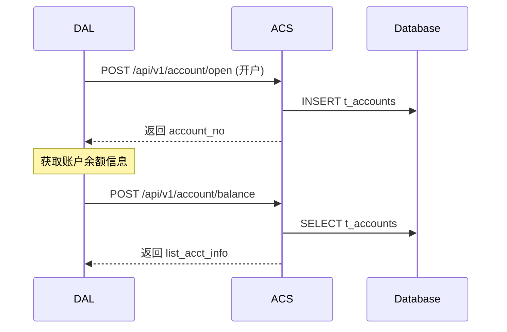

---

### 5.13 开立贷款户接口（内部接口）

> **路由**: DAL → ACS
> **说明**: 根据风控结果开立贷款账户
> **接口来源**: FTISP-ACS账户系统
> **注意**: ⚠️ **此接口ACS暂时未提供，后续接口格式参照存款户接口设计**

**状态**: 🟡 待ACS提供

**预期接口**: `POST /api/v1/account/open-loan`

**预期请求格式** (参照存款户接口):
```yaml
authentication: API Key
requestBody:
  header:
    sys_seq_no: string      # 系统流水号（幂等键）- 必填
    biz_seq_no?: string     # 业务流水号 - 可选
    source_system: string   # 来源系统编码 - 必填 (例: FTISP-DAL)
    request_time: string    # 请求时间戳 (yyyy-MM-dd HH:mm:ss) - 必填
  body:
    user_id: string         # 用户ID - 必填
    bank_code?: string      # 银行编码 (默认CRDB) - 可选
    ecif_no: string         # ECIF客户号 - 必填
    account_type: string    # 账户类型 (LOAN) - 必填
    credit_limit: number    # 授信额度 - 必填
    currency?: string       # 币种 (默认TZS) - 可选
    open_branch?: string    # 开户机构号 - 可选
    remark?: string         # 备注 - 可选
```

**待确认事项**:
- [ ] ACS是否提供此接口
- [ ] 如果不提供，贷款户开户通过何种方式处理
- [ ] 贷款户账户号生成规则
- [ ] 贷款户与授信额度的关联方式

**当前处理方案**: 待与ACS团队确认后更新

**接口**: `POST /api/v1/account/open-loan`

**请求**:
```yaml
authentication: API Key
requestBody:
  header:
    sys_seq_no: string      # 系统流水号（幂等键）- 必填
    biz_seq_no?: string     # 业务流水号 - 可选
    source_system: string   # 来源系统编码 - 必填 (例: FTISP-DAL)
    request_time: string    # 请求时间戳 (yyyy-MM-dd HH:mm:ss) - 必填
  body:
    user_id: string         # 用户ID - 必填
    bank_code?: string      # 银行编码 (默认CRDB) - 可选
    ecif_no: string         # ECIF客户号 - 必填
    account_type: string    # 账户类型 (LOAN) - 必填
    credit_limit: number    # 授信额度 - 必填
    currency?: string       # 币种 (默认TZS) - 可选
    open_branch?: string    # 开户机构号 - 可选
    remark?: string         # 备注 - 可选
```

**请求示例**:
```json
{
  "header": {
    "sys_seq_no": "SYS20250213003",
    "biz_seq_no": "BIZ20250213003",
    "source_system": "FTISP-DAL",
    "request_time": "2025-02-13 10:40:00"
  },
  "body": {
    "user_id": "U202401010001",
    "bank_code": "CRDB",
    "ecif_no": "ECIF202401010001",
    "account_type": "LOAN",
    "credit_limit": 50000.00,
    "currency": "TZS",
    "open_branch": "001",
    "remark": "个人贷款账户开户"
  }
}
```

**响应**:
```yaml
"200": 成功
  header:
    sys_seq_no: string      # 系统流水号
    resp_code: string       # 响应码 (0000-成功)
    resp_msg: string        # 响应信息
    response_time: string   # 响应时间戳
  body:
    account_id: integer     # 账户ID
    account_no: string      # 贷款账号
    bank_code: string       # 银行编码
    account_status: integer # 账户状态 (0-开户中 1-正常 2-冻结 3-销户)
    account_status_desc: string  # 状态描述
    core_account_seq: string    # 核心账户序号
    open_date: string       # 开户日期 (yyyy-MM-dd)
    credit_limit: number    # 授信额度
    available_limit: number # 可用额度
    remark: string          # 备注信息

"400": 开户失败
  body:
    code: "ACCOUNT_OPEN_FAILED"
    message: "开立贷款户失败"
```

**响应示例**:
```json
{
  "header": {
    "sys_seq_no": "SYS20250213003",
    "resp_code": "0000",
    "resp_msg": "交易成功",
    "response_time": "2025-02-13 10:40:05"
  },
  "body": {
    "account_id": 1002,
    "account_no": "6225887766554444",
    "bank_code": "CRDB",
    "account_status": 1,
    "account_status_desc": "正常",
    "core_account_seq": "CORE202401010002",
    "open_date": "2025-02-13",
    "credit_limit": 50000.00,
    "available_limit": 50000.00,
    "remark": "开户成功"
  }
}
```

**业务规则**:
| 规则ID | 规则描述 |
|--------|----------|
| **BR-ACS-LOAN-001** | 使用 `sys_seq_no` 作为幂等键 |
| **BR-ACS-LOAN-002** | `account_type` 必须为 `LOAN` |
| **BR-ACS-LOAN-003** | 新开贷款户的 `available_limit` 等于 `credit_limit` |
| **BR-ACS-LOAN-004** | 贷款额度由风控系统回调结果传入 |

---

### 5.14 查询账户信息接口（内部接口）

> **路由**: DAL → ACS
> **说明**: 根据用户ID、银行编码等条件查询存款账户信息
> **接口来源**: FTISP-ACS账户系统

**接口**: `POST /api/v1/account/query`

**请求**:
```yaml
authentication: API Key
requestBody:
  header:
    sys_seq_no?: string     # 系统流水号 - 可选
    biz_seq_no?: string     # 业务流水号 - 可选
    source_system?: string  # 来源系统编码 - 可选
    request_time?: string   # 请求时间戳 - 可选
  body:
    user_id: string         # 用户ID - 必填
    bank_code?: string      # 银行编码 (不传查所有) - 可选
```

**请求示例**:
```json
{
  "header": {
    "sys_seq_no": "SYS20250213004",
    "source_system": "FTISP-DAL",
    "request_time": "2025-02-13 10:45:00"
  },
  "body": {
    "user_id": "U202401010001",
    "bank_code": "CRDB"
  }
}
```

**响应**:
```yaml
"200": 成功
  header:
    sys_seq_no: string      # 系统流水号
    resp_code: string       # 响应码 (0000-成功)
    resp_msg: string        # 响应信息
    response_time: string   # 响应时间戳
  body:
    total_count: integer    # 总记录数
    account_list:           # 账户列表
      - account_id: integer        # 账户ID
        user_id: string            # 用户ID
        bank_code: string          # 银行编码
        ecif_no: string            # ECIF客户号
        account_no: string         # 存款账号
        account_status: integer    # 账户状态 (0-开户中 1-正常 2-冻结 3-销户)
        account_status_desc: string # 状态描述
        account_type: string       # 账户类型 (SAVINGS/FIXED/LOAN)
        account_class: integer     # 账户类别 (1-I类 2-II类 3-III类)
        currency: string           # 币种
        open_date: string          # 开户日期 (yyyy-MM-dd)
        open_branch: string        # 开户机构号
        core_account_seq: string   # 核心账户序号
        create_time: string        # 创建时间
        update_time: string        # 更新时间

"400": 查询失败
  body:
    code: "ACCOUNT_QUERY_FAILED"
    message: "查询账户信息失败"
```

**响应示例**:
```json
{
  "header": {
    "sys_seq_no": "SYS20250213004",
    "resp_code": "0000",
    "resp_msg": "交易成功",
    "response_time": "2025-02-13 10:45:02"
  },
  "body": {
    "total_count": 2,
    "account_list": [
      {
        "account_id": 1001,
        "user_id": "U202401010001",
        "bank_code": "CRDB",
        "ecif_no": "ECIF202401010001",
        "account_no": "6225887766554433",
        "account_status": 1,
        "account_status_desc": "正常",
        "account_type": "SAVINGS",
        "account_class": 1,
        "currency": "TZS",
        "open_date": "2025-02-13",
        "open_branch": "001",
        "core_account_seq": "CORE202401010001",
        "create_time": "2025-02-13 10:30:05",
        "update_time": "2025-02-13 10:30:05"
      },
      {
        "account_id": 1002,
        "user_id": "U202401010001",
        "bank_code": "CRDB",
        "ecif_no": "ECIF202401010001",
        "account_no": "6225887766554444",
        "account_status": 1,
        "account_status_desc": "正常",
        "account_type": "LOAN",
        "account_class": 1,
        "currency": "TZS",
        "open_date": "2025-02-13",
        "open_branch": "001",
        "core_account_seq": "CORE202401010002",
        "create_time": "2025-02-13 10:40:05",
        "update_time": "2025-02-13 10:40:05"
      }
    ]
  }
}
```

**业务规则**:
| 规则ID | 规则描述 |
|--------|----------|
| **BR-ACS-QUERY-001** | 不传 `bank_code` 则查询用户所有银行的账户 |
| **BR-ACS-QUERY-002** | 返回账户列表按 `account_id` 升序排列 |
| **BR-ACS-QUERY-003** | `account_type` 枚举值: SAVINGS(储蓄), FIXED(定期), LOAN(贷款) |

---

### 5.15 ACS接口汇总

> **接口来源**: FTISP-ACS账户系统
> **文档位置**: `d:\africa\acs\API_Summary.md`

FTISP-ACS提供的账户相关接口汇总：

| 接口名称 | 接口路径 | 请求方法 | 状态 | 说明 |
|---------|---------|----------|------|------|
| 开立存款账户 | `/api/v1/account/open` | POST | ✅ 已提供 | 风控通过后开立存款账户 |
| 查询账户信息 | `/api/v1/account/query` | POST | ✅ 已提供 | 查询用户的存款账户信息 |
| 查询账户余额 | `/api/v1/account/balance` | POST | ✅ 已提供 | 查询账户余额信息 |
| 开立贷款账户 | `/api/v1/account/open-loan` | POST | 🟡 待提供 | 风控通过后开立贷款账户 |

**公共请求头格式**:
```yaml
header:
  sys_seq_no: string      # 系统流水号（幂等键）- 必填
  biz_seq_no?: string     # 业务流水号 - 可选
  source_system: string   # 来源系统编码 - 必填
  request_time: string    # 请求时间戳 (yyyy-MM-dd HH:mm:ss) - 必填
```

**公共响应头格式**:
```yaml
header:
  sys_seq_no: string      # 系统流水号
  resp_code: string       # 响应码 (0000-成功 其他-失败)
  resp_msg: string        # 响应信息
  response_time: string   # 响应时间戳
```

**账户类型枚举**:
| 值 | 说明 | 备注 |
|----|------|------|
| `SAVINGS` | 储蓄账户 | 活期存款账户 |
| `FIXED` | 定期存款 | 定期存款账户 |
| `LOAN` | 贷款账户 | 贷款账户 |

**账户状态枚举**:
| 值 | 说明 |
|----|------|
| `0` | 开户中 |
| `1` | 正常 |
| `2` | 冻结 |
| `3` | 销户 |

**账户类别枚举**:
| 值 | 说明 |
|----|------|
| `1` | I类户 | 全功能账户 |
| `2` | II类户 | 限额账户 |
| `3` | III类户 | 小额账户 |

---

### 5.16 查询KYC审核进度接口

> **路由**: Frontend → DAL
> **说明**: STARTER状态用户查询审核进度

**接口**: `GET /api/v1/kyc/application-status`

**请求**:
```yaml
authentication: Bearer Token
```

**响应**:
```yaml
"200": 成功
  body:
    applicationId: string
    status: string              # PENDING / UNDER_REVIEW / APPROVED / REJECTED / MANUAL_REVIEW
    currentStep: string         # 当前审核步骤
    estimatedTime: string       # 预计完成时间（如 "2小时"）
    submittedAt: string         # ISO 8601
    rejectReason: string        # 拒绝原因（如果status=REJECTED）
```

---

### 5.17 更换手机号接口

> **路由**: Frontend → UAM
> **说明**: 用户更换已绑定的手机号
> **僵尸账号处理**: 更换前需检查新手机号是否存在 `NEW` 状态的僵尸记录（创建>24h未完成KYC），若存在则先物理删除再执行更换

**接口**: `PUT /api/v1/user/phone`

**请求**:
```yaml
authentication: Bearer Token
requestBody:
  oldPhone: string      # 旧手机号（验证用）
  newPhone: string      # 新手机号
  oldOtp: string        # 旧手机收到的OTP
  newOtp: string        # 新手机收到的OTP
```

**响应**:
```yaml
"200": 成功
  body:
    message: "手机号已更换"

"400": NIDA验证失败
  body:
    code: "NIDA_VERIFICATION_REQUIRED"
    message: "需要完成NIDA人脸验证"
    nextStep: "NIDA_FACE_VERIFICATION"
```

---

### 5.18 撤回授权接口

> **路由**: Frontend → UAM
> **说明**: 用户撤回某项授权（如地理位置）

**接口**: `DELETE /api/v1/user/consents/{consentType}`

**请求**:
```yaml
authentication: Bearer Token
pathParams:
  consentType: string  # LOCATION
```

**响应**:
```yaml
"200": 成功
  body:
    message: "地理位置授权已撤回"
    serviceImpact: "可能影响风控评估结果"

"400": 不可撤回
  body:
    code: "CONSENT_NOT_REVOCABLE"
    message: "该授权为开户必需，不可撤回"
```

---

### 5.19 请求人工审核接口

> **路由**: Frontend → DAL
> **说明**: OCR/NIDA失败后，用户请求人工审核

**接口**: `POST /api/v1/kyc/submit-manual-review`

**请求**:
```yaml
authentication: Bearer Token
requestBody:
  reason: string           # 请求人工审核的原因
  additionalInfo: string   # 补充说明
  attachments: array       # 附加证明材料（文件ID列表）
```

**响应**:
```yaml
"200": 成功
  body:
    applicationId: string
    status: "MANUAL_REVIEW"
    estimatedTime: "1-3个工作日"
    message: "您的申请已提交人工审核"
```

---

### 5.20 会话管理接口

> **路由**: Frontend → UAM
> **说明**: 获取用户所有活跃会话

**接口**: `GET /api/v1/auth/sessions`

**请求**:
```yaml
authentication: Bearer Token
```

**响应**:
```yaml
"200": 成功
  body:
    sessions:
      - sessionId: string
        deviceType: string        # ANDROID / IOS / WEB
        deviceInfo: string        # 设备信息
        ipAddress: string
        lastActivityAt: string    # ISO 8601
        isCurrent: boolean        # 是否当前会话
```

---

### 5.18 注销指定会话接口

> **路由**: Frontend → UAM
> **说明**: 远程注销某个设备的会话

**接口**: `DELETE /api/v1/auth/sessions/{sessionId}`

**请求**:
```yaml
authentication: Bearer Token
pathParams:
  sessionId: string
```

**响应**:
```yaml
"200": 成功
  body:
    message: "会话已注销"
```

---

---

## 6. 跨子系统数据流

### 6.1 数据流表

| 数据项 | 流向 | 说明 |
|--------|------|------|
| 注册请求 | Frontend → AAC | HTTP POST |
| OTP发送 | AAC → **UAM** → MSG | ⚠️ 认证凭证管理 |
| OTP验证 | AAC → UAM → Redis | 读写 |
| 身份证图片 | Frontend → DAL → KYC → OSS | 通过DAL编排 |
| OCR识别 | DAL → KYC → OCR引擎 | KYC内部适配器 |
| 活体检测 | DAL → BIO | 通过DAL编排 |
| **用户资料** | Frontend → AAC → **DAL → UAM** | ⚠️ UAM直接存储 |
| **授权记录** | Frontend → AAC → **DAL → UAM** | ⚠️ UAM存储 |
| NIDA验证 | DAL → KYC → NIDA系统 | KYC验证服务 |
| KYC申请 | Frontend → AAC → DAL | DAL流程编排 |
| 风控回调 | 风控系统 → DAL | DAL编排处理 |

### 6.2 事件发布

| 事件名称 | 发布者 | 订阅者 | 触发时机 |
|----------|--------|--------|----------|
| UserRegistered | UAM | 日志系统 | 注册成功 |
| OtpSent | UAM | 日志系统 | OTP发送 |
| OtpVerified | UAM | 日志系统 | OTP验证成功 |
| ProfileSaved | **UAM** | 日志系统 | ⚠️ 用户资料保存 |
| **KycProcessStarted** | **DAL** | 审批系统 | ⚠️ KYC流程启动 |
| **KycProcessCompleted** | **DAL** | 消息中心 | ⚠️ KYC流程完成 |
| AccountOpened | DAL | 消息中心 | 开户成功 |
| PinSet | UAM | 日志系统 | 密码设置 |

### 6.3 数据表归属

| 数据表 | 归属系统 | 说明 |
|--------|----------|------|
| **t_users** | **UAM** | 用户主表（认证域） |
| **t_otp_records** | **UAM** | OTP记录（认证域） |
| **t_pin_history** | **UAM** | PIN历史（认证域） |
| **t_user_consents** | **UAM** | 授权记录（认证域） |
| **t_login_logs** | **UAM** | 登录日志（认证域） |
| **t_user_profiles** | **UAM** | 用户资料（用户域） |
| **t_user_sessions** | **UAM** | 会话管理（用户域） |
| **t_user_addresses** | **UAM** | 地址信息（用户域） |
| **t_kyc_documents** | **KYC** | OCR记录（验证日志） |
| **t_verification_logs** | **KYC** | NIDA/活体验证日志 |
| **t_process_instances** | **DAL** | 流程实例（编排中心） |
| **t_process_step_logs** | **DAL** | 步骤日志（编排中心） |
| **t_sms_logs** | **MSG** | 短信发送日志 |
| **t_ecif_customers** | **ECIF** | 平台ECIF客户信息 |
| **t_ecif_mappings** | **ECIF** | ECIF映射关系（平台→银行） |
| **t_accounts** | **ACS** | 账户信息 |

---

## 8. ECIF数据表设计

### 7.0 FTISP-ECIF 系统定位

> **核心职责**: 身份映射管理（Identity Mapping）

| 职责 | 包含 | 不包含 |
|------|------|--------|
| **ECIF** | 平台ECIF号、银行ECIF映射、外部银行开户 | 客户标签、关系图谱 |

**与相关系统的关系**：

```
FTISP-ECIF (身份映射)
    ↓ 提供 platform_ecif_id
FTISP-TAG (标签服务)
    ↓ 关联 user_id / platform_ecif_id
FTISP-REGR (关系图谱)
    ↓ 关联 platform_ecif_id 作为图节点
```

| 系统 | 职责 | 调用时机 |
|------|------|----------|
| **FTISP-ECIF** | 身份映射（平台↔银行） | 开户时**必须**调用 |
| **FTISP-TAG** | 客户标签/画像（风险等级、分类） | 风控/运营**按需**调用 |
| **FTISP-REGR** | 关系网络（担保、关联等） | 贷后/反欺诈**分析**调用 |

**设计原则**：
- ECIF专注"身份管理"，数据模型简单、写入频繁
- TAG独立演进标签体系，支持灵活的标签分类
- REGR独立演进图算法，可能采用图数据库技术

---

### 7.1 平台ECIF客户表 (t_ecif_customers)

> **归属系统**: FTISP-ECIF
> **用途**: 存储完整的客户信息（开户时从UAM获取，用于调用外部银行）

```java
@Entity
@Table(name = "t_ecif_customers")
public class EcifCustomer {
    @Id
    private Long id;

    @Column(name = "user_id")
    private Long userId;  // 关联t_users

    @Column(name = "platform_ecif_id", unique = true)
    private String platformEcifId;  // 平台ECIF号（ECIF生成）

    // ========== 基本信息 ==========
    @Column(name = "personal_chinese_name")
    private String personalChineseName;

    @Column(name = "personal_english_name")
    private String personalEnglishName;

    @Column(name = "birth_day")
    private LocalDate birthDay;

    @Column(name = "birth_country")
    private String birthCountry;

    @Column(name = "gender")
    private String gender;  // 1-男 2-女 9-不详

    @Column(name = "special_ind")
    private String specialInd;  // 0普通 1审核特别 2-VIP

    @Column(name = "customer_use_status")
    private String customerUseStatus;  // 1正常 2禁用

    @Column(name = "remarks")
    private String remarks;

    @Column(name = "ekyc_qa_remarks")
    private String ekycQaRemarks;

    @Column(name = "financial_contract")
    private String financialContract;

    @Column(name = "verified_en_address")
    private String verifiedEnAddress;

    @Column(name = "degree")
    private String degree;

    @Column(name = "staff_type")
    private String staffType;

    @Column(name = "user_privacy_policy")
    private String userPrivacyPolicy;

    // ========== 联系方式 ==========
    @Column(name = "phone")
    private String phone;

    @Column(name = "idd_code")
    private String iddCode;  // 国际区号

    @Column(name = "email")
    private String email;

    // ========== 证件信息 ==========
    @Column(name = "card_type")
    private String cardType;  // 1-香港身份证 2-大陆身份证 3-港澳通行证 4-香港工作签证

    @Column(name = "card_no")
    private String cardNo;

    // ========== 系统字段 ==========
    @Column(name = "country_code")
    private String countryCode;  // 从UAM allocated_country_code

    @Column(name = "bank_code")
    private String bankCode;     // 从UAM allocated_bank_code

    @Column(name = "customer_type")
    private String customerType;  // INDIVIDUAL, CORPORATE

    @Column(name = "customer_status")
    private String customerStatus;  // ACTIVE, SUSPENDED, CLOSED

    @Column(name = "nida_number")
    private String nidaNumber;  // 冗余存储，便于查询

    @Column(name = "is_old_ecif")
    private Boolean isOldEcif;  // 外部银行是否已有该客户

    @Column(name = "bank_ecif_id")
    private String bankEcifId;  // 外部银行返回的ECIF号

    @Column(name = "result_mark")
    private String resultMark;  // 绑定结果标识

    @Column(name = "latest_open_date")
    private Instant latestOpenDate;

    @Column(name = "latest_close_date")
    private Instant latestCloseDate;

    @Column(name = "created_at")
    private Instant createdAt;

    @Column(name = "updated_at")
    private Instant updatedAt;
}
```

**数据来源**：

| 字段类别 | 来源 |
|----------|------|
| userId | UAM.t_users.id |
| 基本信息（姓名、生日等） | UAM.t_user_profiles |
| 联系方式（phone, email） | UAM.t_users.phone, t_user_profiles |
| 证件信息（cardType, cardNo） | UAM.t_user_profiles |
| countryCode, bankCode | UAM.t_users.allocated_* |
| platformEcifId | ECIF生成 |
| bankEcifId, resultMark | 外部银行返回 |

**说明**：
- 完整的客户信息存储在ECIF，便于调用外部银行接口
- 扩展信息（地址、职业、税务等）使用独立表存储，以下详述

---

### 7.1.1 ECIF地址信息表 (t_ecif_addresses)

> **归属系统**: FTISP-ECIF
> **关系**: t_ecif_customers.id ← t_ecif_addresses.customer_id (1:N)

```java
@Entity
@Table(name = "t_ecif_addresses")
public class EcifAddress {
    @Id
    private Long id;

    @Column(name = "customer_id")
    private Long customerId;  // 关联t_ecif_customers

    @Column(name = "platform_ecif_id")
    private String platformEcifId;

    // 地址类型：1-出生地 2-居住地 3-联系地址
    @Column(name = "add_type")
    private String addType;

    @Column(name = "address")
    private String address;  // 详细地址

    @Column(name = "country_code")
    private String countryCode;

    @Column(name = "country")
    private String country;

    @Column(name = "province_code")
    private String provinceCode;

    @Column(name = "province")
    private String province;

    @Column(name = "city_code")
    private String cityCode;

    @Column(name = "city")
    private String city;

    @Column(name = "district")
    private String district;

    @Column(name = "subdistrict")
    private String subdistrict;

    @Column(name = "zip_code")
    private String zipCode;

    @Column(name = "house_status")
    private String houseStatus;

    @Column(name = "verified")
    private String verified;  // 是否验证 1-是 0-否

    @Column(name = "contact_user")
    private String contactUser;

    @Column(name = "contact_number")
    private String contactNumber;

    @Column(name = "created_at")
    private Instant createdAt;
}
```

---

### 7.1.2 ECIF地址EPRC扩展信息表 (t_ecif_address_eprc)

> **归属系统**: FTISP-ECIF
> **关系**: t_ecif_customers.id ← t_ecif_address_eprc.customer_id (1:N)

```java
@Entity
@Table(name = "t_ecif_address_eprc")
public class EcifAddressEprc {
    @Id
    private Long id;

    @Column(name = "customer_id")
    private Long customerId;

    @Column(name = "platform_ecif_id")
    private String platformEcifId;

    @Column(name = "add_type")
    private String addType;  // 1-出生地 2-居住地 3-联系地址

    // EPRC校验状态
    @Column(name = "eprc_status")
    private String eprcStatus;  // 0-空值 1-正常 2-待确认 3-已确认 4-未能确认 9-待运行

    @Column(name = "eprc_score")
    private String eprcScore;

    @Column(name = "eprc_pattern_code")
    private String eprcPatternCode;

    @Column(name = "eprc_business_id")
    private String eprcBusinessId;

    @Column(name = "dps_address_indicator")
    private String dpsAddressIndicator;  // O/B/N/U

    @Column(name = "created_at")
    private Instant createdAt;
}
```

---

### 7.1.3 ECIF职业信息表 (t_ecif_occupations)

> **归属系统**: FTISP-ECIF
> **关系**: t_ecif_customers.id ← t_ecif_occupations.customer_id (1:1)

```java
@Entity
@Table(name = "t_ecif_occupations")
public class EcifOccupation {
    @Id
    private Long id;

    @Column(name = "customer_id", unique = true)
    private Long customerId;

    @Column(name = "platform_ecif_id")
    private String platformEcifId;

    @Column(name = "job")
    private String job;  // 职称

    @Column(name = "position")
    private String position;  // 职位

    @Column(name = "industry")
    private String industry;  // 单位所属行业

    @Column(name = "income_from")
    private String incomeFrom;  // 收入来源

    @Column(name = "income_range")
    private String incomeRange;  // 收入范围

    @Column(name = "month_income")
    private String monthIncome;  // 月收入

    @Column(name = "emp_main")
    private String empMain;  // 是否主信息

    @Column(name = "emp_serialno")
    private String empSerialno;  // 工作信息序号

    @Column(name = "emp_comp")
    private String empComp;  // 公司

    @Column(name = "emp_add")
    private String empAdd;  // 公司地址

    @Column(name = "emp_comp_tel")
    private String empCompTel;  // 公司联系电话

    @Column(name = "emp_serv_y")
    private String empServY;  // 服务年限

    @Column(name = "io_amount")
    private String ioAmount;  // 个人资产

    @Column(name = "created_at")
    private Instant createdAt;

    @Column(name = "updated_at")
    private Instant updatedAt;
}
```

---

### 7.1.4 ECIF税务信息表 (t_ecif_taxes)

> **归属系统**: FTISP-ECIF
> **关系**: t_ecif_customers.id ← t_ecif_taxes.customer_id (1:N)

```java
@Entity
@Table(name = "t_ecif_taxes")
public class EcifTax {
    @Id
    private Long id;

    @Column(name = "customer_id")
    private Long customerId;

    @Column(name = "platform_ecif_id")
    private String platformEcifId;

    @Column(name = "tax_cty_code")
    private String taxCtyCode;  // 纳税国别

    @Column(name = "declare_ind")
    private String declareInd;  // 申报标志

    @Column(name = "tax_code")
    private String taxCode;  // 纳税编号

    @Column(name = "tax_type")
    private String taxType;  // 纳税类型 A/B/C

    @Column(name = "tax_reason")
    private String taxReason;  // 纳税原因

    @Column(name = "tax_resident_status")
    private String taxResidentStatus;  // 税务居民状态

    @Column(name = "tax_status")
    private String taxStatus;  // 1-正常 2-删除

    @Column(name = "created_at")
    private Instant createdAt;

    @Column(name = "updated_at")
    private Instant updatedAt;
}
```

---

### 7.1.5 ECIF证件信息表 (t_ecif_credentials)

> **归属系统**: FTISP-ECIF
> **关系**: t_ecif_customers.id ← t_ecif_credentials.customer_id (1:N)

```java
@Entity
@Table(name = "t_ecif_credentials")
public class EcifCredential {
    @Id
    private Long id;

    @Column(name = "customer_id")
    private Long customerId;

    @Column(name = "platform_ecif_id")
    private String platformEcifId;

    @Column(name = "main_credential")
    private String mainCredential;  // Y-主证件

    @Column(name = "card_type")
    private String cardType;  // 1-香港身份证 2-大陆身份证 3-港澳通行证 4-香港工作签证

    @Column(name = "card_no")
    private String cardNo;  // 证件号

    @Column(name = "card_front")
    private String cardFront;  // 证件照前面

    @Column(name = "card_back")
    private String cardBack;  // 证件照背面

    @Column(name = "cre_name")
    private String creName;  // 中文名

    @Column(name = "cre_en_name")
    private String creEnName;  // 英文名

    @Column(name = "cre_first_name")
    private String creFirstName;

    @Column(name = "cre_mid_name")
    private String creMidName;

    @Column(name = "cre_last_name")
    private String creLastName;

    @Column(name = "living_photo")
    private String livingPhoto;  // 活体照片

    @Column(name = "issuer")
    private String issuer;  // 发卡机构

    @Column(name = "effective_date")
    private LocalDate effectiveDate;

    @Column(name = "valid_date")
    private LocalDate validDate;

    @Column(name = "visa_type")
    private String visaType;  // 签证类型

    @Column(name = "visa_valid_date")
    private LocalDate visaValidDate;

    @Column(name = "hk_id_card_symbol")
    private String hkIdCardSymbol;

    @Column(name = "hk_permanent")
    private String hkPermanent;  // 1-永久居民 0-非永久

    // ⚠️ 扩展性字段：非洲市场（坦桑尼亚/尼日利亚）证件字段通过JSON扩展存储
    @Column(name = "extra_info")
    @Column(columnDefinition = "JSON")
    private Map<String, Object> extraInfo;  // 存储国家特有证件字段（如Voters ID, Driver License）

    @Column(name = "created_at")
    private Instant createdAt;

    @Column(name = "updated_at")
    private Instant updatedAt;
}
```

---

### 7.1.6 ECIF FATCA信息表 (t_ecif_fatca)

> **归属系统**: FTISP-ECIF
> **关系**: t_ecif_customers.id ← t_ecif_fatca.customer_id (1:1)

```java
@Entity
@Table(name = "t_ecif_fatca")
public class EcifFatca {
    @Id
    private Long id;

    @Column(name = "customer_id", unique = true)
    private Long customerId;

    @Column(name = "platform_ecif_id")
    private String platformEcifId;

    @Column(name = "contract_id")
    private String contractId;  // CRS声明书电子合同ID

    @Column(name = "template_id")
    private String templateId;  // CRS声明书文本模板ID

    @Column(name = "file_url")
    private String fileUrl;  // CRS声明书文件地址

    @Column(name = "fatca_status")
    private String fatcaStatus;  // Non-US Account/US Account/Non consenting US Account/Pending

    @Column(name = "fatca_time")
    private LocalDate fatcaTime;  // 声明书签署日期

    @Column(name = "reasonableness_test")
    private String reasonablenessTest;  // 1-是 0-否

    @Column(name = "reasonable_explanation")
    private String reasonableExplanation;  // 1/2/3/4/5

    @Column(name = "reasonable_explanation_remarks")
    private String reasonableExplanationRemarks;

    @Column(name = "created_at")
    private Instant createdAt;

    @Column(name = "updated_at")
    private Instant updatedAt;
}
```

---

### 7.2 ECIF映射关系表 (t_ecif_mappings)

> **归属系统**: FTISP-ECIF
> **用途**: 存储平台ECIF号与银行ECIF号的映射关系
> **扩展性**: 一个平台ECIF号可对应多个银行ECIF号

```java
@Entity
@Table(name = "t_ecif_mappings")
public class EcifMapping {
    @Id
    private Long id;

    @Column(name = "platform_ecif_id")
    private String platformEcifId;  // 平台ECIF号

    @Column(name = "country_code")
    private String countryCode;  // 国家代码

    @Column(name = "bank_code")
    private String bankCode;  // 银行代码

    @Column(name = "bank_name")
    private String bankName;  // 银行名称

    @Column(name = "bank_ecif_id")
    private String bankEcifId;  // 银行返回的ECIF号

    @Column(name = "account_type")
    private String accountType;  // DEPOSIT, LOAN

    @Column(name = "mapping_status")
    private String mappingStatus;  // ACTIVE, INACTIVE

    @Column(name = "mapped_at")
    private Instant mappedAt;

    @Column(name = "created_at")
    private Instant createdAt;

    // 复合唯一索引
    // UNIQUE(platform_ecif_id, country_code, bank_code, account_type)
}
```

### 7.3 多国家多银行扩展设计

| 设计要点 | 说明 |
|----------|------|
| **一对多映射** | 一个平台ECIF号对应多个银行ECIF号 |
| **复合唯一索引** | UNIQUE(platform_ecif_id, country_code, bank_code, account_type) |
| **支持新增国家** | 通过country_code区分不同国家 |
| **支持新增银行** | 通过bank_code区分不同银行 |
| **账户类型区分** | 同一银行不同账户类型(DEPOSIT/LOAN)分别映射 |

---

## 9. 前端代码映射

### 7.1 前端组件

| 组件 | 文件 | 说明 |
|------|------|------|
| 欢迎组件 | `welcome.component.ts` | 注册/登录入口 |
| KYC流程组件 | `kyc-process.component.ts` | 完整KYC流程 |
| 网关组件 | `gateway.component.ts` | 用户角色选择 |

### 7.2 身份证扫描前端实现

> **关键点**: 扫描是纯前端操作，两张都完成后才上传后端

```typescript
// kyc-process.component.ts

// 纯前端变量 - 暂存图片
frontIdImage = signal<string | null>(null);  // 正面照片 Base64
backIdImage = signal<string | null>(null);   // 反面照片 Base64
bothScanned = computed(() =>
  !!this.frontIdImage() && !!this.backIdImage()
);

// 方式1: 摄像头拍照 - 纯前端
async captureFromCamera(side: 'front' | 'back') {
  const stream = await navigator.mediaDevices.getUserMedia({
    video: { facingMode: side === 'front' ? 'environment' : 'user' }
  });

  this.videoElement.nativeElement.srcObject = stream;

  // 拍照并转为Base64
  const image = this.captureFrameToBase64();

  // 纯前端暂存 - 不调用后端
  if (side === 'front') {
    this.frontIdImage.set(image);
  } else {
    this.backIdImage.set(image);
  }
}

// 方式2: 从文件夹选择 - 纯前端
selectFromFile(side: 'front' | 'back', event: Event) {
  const file = (event.target as HTMLInputElement).files?.[0];
  if (!file) return;

  const reader = new FileReader();
  reader.onload = () => {
    const base64 = reader.result as string;
    // 纯前端暂存 - 不调用后端
    if (side === 'front') {
      this.frontIdImage.set(base64);
    } else {
      this.backIdImage.set(base64);
    }
  };
  reader.readAsDataURL(file);
}

// 两张都扫描完成后，用户点击Continue
async submitIdImages() {
  // 此时才调用后端，同时上传两张照片
  const response = await this.kycService.uploadIdImages({
    frontImage: this.frontIdImage()!,
    backImage: this.backIdImage()!
  });

  // 后端返回OCR结果
  this.ocrResult.set(response);
  this.onboardingStep.set('KYC_CONFIRM_ID');
}
```

### 7.3 状态机

```typescript
// onboardingStep 状态
type OnboardingStep =
  | 'IDLE'                                    // 初始状态
  | 'AUTH_PHONE'                              // 手机号输入
  | 'AUTH_OTP'                                // OTP验证
  | 'KYC_SCAN_ID'                             // 扫描身份证 (纯前端)
  | 'KYC_CONFIRM_ID'                          // 确认OCR信息
  | 'KYC_FACE'                                // 人脸识别
  | 'REVIEW'                                  // 设置PIN
  | 'FORGOT_PIN_START'                        // 重置PIN开始
  | 'FORGOT_PIN_OTP'                          // 重置PIN验证OTP
  | 'FORGOT_PIN_FACE'                         // 重置PIN人脸验证
  | 'FORGOT_PIN_SETPIN'                       // 重置PIN设置
  | 'FORGOT_PIN_CONFIRM'                      // 重置PIN确认
  | 'FORGOT_PIN_SUCCESS';                     // 重置PIN成功
```

### 7.4 进度条

```typescript
progressSteps = [
  { name: 'Identity', icon: '🆔' },  // 身份证扫描
  { name: 'Selfie', icon: '😊' },    // 人脸识别
  { name: 'PIN', icon: '🔒' }        // 设置密码
];
```

---

## 10. 异常场景处理

| 场景 | HTTP状态 | 错误码 | 前端处理 |
|------|----------|--------|----------|
| 手机号格式错误 | 400 | INVALID_PHONE | 提示格式错误 |
| OTP发送限制 | 429 | OTP_LIMIT_EXCEEDED | 今日已达上限(10次)，提示明日再试 |
| OCR识别失败 | 400 | OCR_FAILED | 提示重新拍摄 |
| 摄像头权限拒绝 | - | CAMERA_DENIED | 引导开启权限 |
| 地理位置拒绝 | - | LOCATION_DENIED | 继续流程，标记缺失 |
| 人脸匹配失败 | 403 | FACE_MISMATCH | 提示重新拍摄 |
| 活体检测失败 | 403 | LIVENESS_FAILED | 提示真人操作 |
| 协议未签署 | 400 | AGREEMENTS_REQUIRED | 禁用继续按钮 |
| KYC审批拒绝 | 200 | REJECTED | 显示拒绝原因 |

### 8.5 异常处理与补偿机制

#### 8.5.1 风控系统异常处理

| 异常场景 | 检测方式 | 补偿机制 |
|----------|----------|----------|
| 风控系统超时 | 48小时未回调 | 自动转入人工审核 |
| 回调丢失 | 定时任务扫描PENDING状态 | 触发查询接口 |
| 签名验证失败 | 401响应 | 重试3次，告警 |
| 风控系统宕机 | 连续失败 | 降级到人工审核 |

**补偿定时任务**:
```java
@Scheduled(cron = "0 */30 * * * *")  // 每30分钟
public void checkPendingKycApplications() {
    List<KycApplication> pendingApps = kycRepository
        .findByStatusAndSubmittedBefore("PENDING", Instant.now().minus(48, ChronoUnit.HOURS));

    for (KycApplication app : pendingApps) {
        // 1. 尝试查询风控系统状态
        // 2. 如果无响应，转入人工审核
        app.setApplicationStatus("MANUAL_REVIEW");
        app.setManualReviewReason("风控系统超时，自动转入人工审核");
    }
}
```

#### 8.5.2 NIDA冲突处理

| 场景 | 错误码 | 处理方式 |
|------|--------|----------|
| NIDA号已被其他用户使用 | NIDA_ALREADY_USED | 提示绑定的手机号（脱敏），提供申诉入口 |
| 身份盗用申诉 | - | 新增申诉流程，需提供额外证明材料 |
| 手机号变更 | - | 需NIDA验证+旧手机验证 |

#### 8.5.4 KYC降级策略

| 异常场景 | 处理策略 |
|----------|----------|
| OCR服务不可用 | 允许用户手动输入所有信息，转入人工审核队列 |
| OCR部分字段失败 | 提供单字段手动录入（如OCR无法识别姓名） |
| 活体检测服务宕机 | 降级到人工审核 |

**人工审核入口**:
```java
// 当OCR/活体服务不可用时，前端提供手动审核入口
POST /api/v1/kyc/submit-manual-review
{
  "reason": "OCR_SERVICE_UNAVAILABLE",
  "manualInputData": {
    "fullName": "用户手动输入",
    "nidaNumber": "1990...",
    "dateOfBirth": "1990-01-01"
  }
}
```

**手机号变更流程**:
```mermaid
flowchart TD
    A[用户请求更换手机号] --> B[验证旧手机OTP]
    B --> C[验证新手机OTP]
    C --> D[NIDA人脸验证]
    D --> E[更新t_users.phone]
    E --> F[记录变更日志]
```

#### 8.5.3 OCR识别失败处理

| 失败原因 | 重试策略 | 最终处理 |
|----------|----------|----------|
| 图片模糊 | 允许3次重拍 | 仍失败则提示"请到柜台办理" |
| 光线不足 | 提供拍照指引 | - |
| 证件类型不支持 | 直接拒绝 | 提示支持的证件类型 |
| OCR服务不可用 | 降级到人工审核 | 上传图片，人工录入 |

#### 8.5.4 会话异常处理

| 异常场景 | 处理方式 |
|----------|----------|
| refresh_token并发刷新 | 乐观锁，后者覆盖前者，更新会话表 |
| refresh_token泄露 | 全局登出，生成新token |
| 会话过期 | 返回401，前端引导重新登录 |
| 设备丢失 | 远程注销该设备会话 |

---

### 8.6 授权管理与撤回流程

#### 8.6.1 授权撤回接口

**接口**: `DELETE /api/v1/user/consents/{consentType}`

**请求**:
```yaml
authentication: Bearer Token
pathParams:
  consentType: string  # CREDIT_BUREAU / LOCATION / TERMS_OF_USE / PRIVACY_POLICY
```

**响应**:
```yaml
"200": 撤回成功
  body:
    message: "授权已撤回"
    serviceImpact: string  # 说明撤回后的影响

"400": 不可撤回的授权
  body:
    code: "CONSENT_NOT_REVOCABLE"
    message: "该授权为开户必需，不可撤回"
```

#### 8.6.2 授权撤回影响矩阵

| 授权类型 | 是否可撤回 | 撤回影响 |
|----------|------------|----------|
| CREDIT_BUREAU | ❌ 否 | 开户必需 |
| LOCATION | ✅ 是 | 标记位置缺失，不影响开户 |
| TERMS_OF_USE | ❌ 否 | 使用服务必需 |
| PRIVACY_POLICY | ❌ 否 | 使用服务必需 |
| SAVINGS_AGREEMENT | ❌ 否 | 开户必需 |

#### 8.6.3 授权撤回数据记录

```java
public void revokeConsent(Long userId, String consentType) {
    UserConsent consent = consentRepository.findByUserIdAndType(userId, consentType);

    // 更新原记录为REVOKED
    consent.setAction("REVOKED");
    consent.setRevokedAt(Instant.now());
    consent.setRevokeReason("USER_REQUEST");
    consentRepository.save(consent);

    // 创建新记录
    UserConsent newConsent = new UserConsent();
    newConsent.setUserId(userId);
    newConsent.setConsentType(consentType);
    newConsent.setAction("DENIED");
    newConsent.setConsentedAt(Instant.now());
    consentRepository.save(newConsent);

    // 触发业务处理
    handleConsentRevocation(userId, consentType);
}
```

#### 8.6.4 GDPR合规要求

- **撤回响应时间**: 24小时内处理完成
- **数据删除**: 用户要求删除账户时，30天内完成
- **数据导出**: 提供用户所有数据的导出功能
- **授权记录保留**: 撤回记录永久保留（审计要求）

#### 8.6.5 数据保留策略

| 数据类型 | 保留期限 | 清理方式 | 说明 |
|----------|----------|----------|------|
| OTP记录 | 7天 | 定时任务 | Redis过期(TTL=60s)+DB定时清理 |
| 短信日志 | 90天 | 归档后删除 | 合规要求 |
| KYC图片 | 7年 | 冷存储迁移 | 金融监管要求 |
| 授权记录 | 永久 | 不删除 | 审计要求 |
| 会话记录 | 90天 | 定时任务 | 仅保留活跃会话 |
| 登录日志 | 1年 | 归档 | 安全审计 |

**OTP清理定时任务** (UAM子系统):
```java
@Component
@RequiredArgsConstructor
public class OtpCleanupScheduler {

    // 任务1: 每小时标记过期OTP为EXPIRED
    @Scheduled(cron = "0 0 * * * ?")  // 每小时整点
    public void markExpiredOtpRecords() {
        // 将PENDING且已过期的记录标记为EXPIRED
        otpRepository.markExpiredRecordsAsExpired(Instant.now());
    }

    // 任务2: 每天凌晨2点物理删除7天前的EXPIRED记录
    @Scheduled(cron = "0 0 2 * * ?")  // 每天凌晨2点
    public void deleteOldExpiredRecords() {
        // 物理删除7天前的EXPIRED记录
        otpRepository.deleteOldExpiredRecords(
            Instant.now().minus(7, ChronoUnit.DAYS)
        );
    }
}
```

#### 8.6.6 OTP安全设计

> **设计参考**: 国内主流平台（支付宝、微信、银行）+ 非洲平台（M-Pesa）

**安全威胁矩阵**:

| 威胁 | 攻击场景 | 防护措施 |
|------|---------|---------|
| 短信轰炸 | 恶意用户频繁请求OTP | 60秒冷却时间 + 单日限制10次 |
| 并发验证 | 快速点击两次"验证" | Redis分布式锁（5秒TTL） |
| 重复使用 | 同一OTP使用多次 | 原子更新（WHERE status='PENDING'） |
| 记录混淆 | 多条PENDING记录 | 生成新OTP时废弃旧记录 |
| 重放攻击 | 使用已过期的OTP | 验证时检查expires_at + 定时清理 |

**防护机制**:

1. **发送冷却（防刷）**
```java
// 60秒内不能重复发送
String cooldownKey = "cooldown:otp:" + phone + ":" + type;
if (redis.hasKey(cooldownKey)) throw "请等待X秒后再试";
redis.set(cooldownKey, "1", 60s);
```

2. **分布式锁（防并发）**
```java
// 防止并发验证同一个OTP
String lockKey = "lock:otp:" + phone + ":" + type;
Boolean locked = redis.setIfAbsent(lockKey, "1", 5s);
if (!locked) return false; // 拒绝并发请求
try {
    // 验证逻辑
} finally {
    redis.delete(lockKey);
}
```

3. **原子更新（防重复使用）**
```java
// 只更新PENDING状态的记录，已使用的不会被更新
UPDATE t_otp_records SET status='USED', used_at=NOW()
WHERE phone=? AND otpPlain=? AND status='PENDING'
AND id = (SELECT id FROM ... ORDER BY created_at DESC LIMIT 1)
-- 返回updated=1表示成功，updated=0表示已被使用
```

4. **废弃旧记录（防混淆）**
```java
// 生成新OTP时，将旧的PENDING记录标记为EXPIRED
UPDATE t_otp_records SET status='EXPIRED'
WHERE phone=? AND otpType=? AND status='PENDING' AND id != currentId;
```

**并发场景验证**:

```
场景：用户快速点击两次"验证"
请求A: GET lock → 成功 → 验证 → DELETE lock → 返回成功
请求B: GET lock → 失败 → 返回"请求过于频繁"
✅ 结果：只有请求A验证成功

场景：两个请求同时验证不同的OTP
请求A: UPDATE WHERE otp='111111' AND status='PENDING' → updated=1 ✅
请求B: UPDATE WHERE otp='222222' AND status='PENDING' → updated=0 ❌ (已被A使用)
✅ 结果：只有请求A验证成功
```

**清理流程说明**:
```
Redis: TTL=60秒自动过期
    ↓
DB: PENDING记录（用户无法验证，因为findValidOtp检查expires_at）
    ↓
任务1（每小时）: PENDING → EXPIRED（软删除，保留审计）
    ↓
任务2（每天凌晨2点）: EXPIRED且>7天 → 物理删除
```

---

## 11. 安全检查点

### 11.1 数据安全

| 检查项 | 实现方式 |
|--------|----------|
| PIN加密存储 | BCrypt加密 |
| 人脸图片加密 | AES-256-GCM |
| 身份证号码脱敏 | 展示时掩码处理 |
| 协议签署记录 | 记录IP和设备ID |

### 11.2 防欺诈

| 风险点 | 防控措施 |
|--------|----------|
| 重复注册 | 手机号+设备号唯一 |
| 虚假身份 | NIDA数据库核验 |
| 照片攻击 | 活体检测 |
| 地理位置 | 反欺诈黑名单 |

---

## 12. 优化建议 (方法论迭代)

### 12.1 本次分析发现的方法论优化点

| 发现 | 优化建议 | 优先级 |
|------|----------|--------|
| 缺少"状态机追踪"章节 | 增加 Step 2.6: 状态机追踪 | 高 |
| 缺少"第三方服务"依赖 | 增加 Step 4.3: 外部服务依赖图 | 中 |
| 缺少"性能指标" | 增加 KYC 处理时效要求 | 中 |

### 12.2 建议新增章节

- **Step 2.6**: 状态机追踪 (OnboardingStep 状态转换)
- **Step 4.3**: 外部服务依赖 (OCR、活体检测、人脸比对)
- **Step 9**: 安全检查点清单

---

## 13. 流程图验证与隐性信息补充

> **验证日期**: 2026-02-05
> **验证来源**: flowpicture/register.png + 隐性信息补充

### 13.1 关键隐性信息补充

| # | 隐性信息 | 设计影响 | 状态 |
|---|----------|----------|------|
| 1 | OTP验证后即成为平台用户 | 分阶段用户表结构设计 | ✅ 已更新 |
| 2 | NIDA对接第三方核查系统 | 新增FTISP-THIRD-PARTY子系统 | ✅ 已更新 |
| 3 | 风控异步回调 → ECIF开户 | 异步回调接口设计 | ✅ 已更新 |
| 4 | 存款户/贷款户分开开户 | 两个独立开户接口 | ✅ 已更新 |
| 5 | PIN设置与开户解耦 | PIN设置后立即可登录 | ✅ 已更新 |

### 13.2 用户分阶段创建架构

```
游客 → OTP验证 → 基础用户(已注册) → KYC完成 → 风控通过 → ECIF开户 → 完整用户(已开户)
       ↓              ↓                    ↓            ↓           ↓
    无user_id    创建t_users        完善t_user_   回调处理    绑定ecif_customer_id
                 user_type=NEW     profiles      开户接口    创建存款户/贷款户
```

### 13.3 外部系统对接

| 系统 | 用途 | 接口 | 状态 |
|------|------|------|------|
| 第三方核查系统 | NIDA身份校验 | /api/v1/third-party/nida/verify | ✅ 已定义 |
| 风控系统 | 信用评估（回调到DAL） | /api/v1/internal/dal/risk-callback | ✅ 已定义 |
| ECIF系统 | 核心银行开户 | /api/v1/ecif/createCustomer | ✅ 已定义 |

### 13.4 完整流程覆盖验证

| 阶段 | 流程图节点 | 分析文档 | 状态 |
|------|-----------|---------|------|
| 注册验证 | 步骤1-9 | KYC-01, KYC-02, KYC-03 | ✅ 100% |
| 身份认证 | 步骤10-22 | KYC-04 ~ KYC-10 | ✅ 100% |
| 提交审核 | 步骤23 | KYC-11 | ✅ |
| 风控回调 | (异步) | KYC-11 回调处理 | ✅ **已补充** |
| ECIF开户 | 步骤24-25 | KYC-11 账户创建 | ✅ **已补充** |
| PIN设置 | 步骤26 | KYC-10-2 | ✅ |
| Face ID | 步骤27 | KYC-12 | ✅ |
| 注册完成 | 步骤28 | 流程结束 | ✅ |

## 14. 核心架构原则

1. **用户域统一管理**: UAM统一管理用户认证、资料、会话、PIN
2. **KYC验证统一管理**: KYC统一管理OCR、NIDA核查、活体检测
3. **适配器模式对接第三方**: 灵活切换第三方服务商
4. **DAL作为编排中心**: 管理流程实例，协调各服务调用
5. **简化架构**: 注册/KYC模块涉及5个系统（AAC、UAM、DAL、KYC、MSG）

## 15. 运维监控与KPI

### 13.1 关键性能指标 (KPI)

| 指标类别 | 指标名称 | 目标值 | 监控方式 |
|----------|----------|--------|----------|
| **性能** | OCR识别响应时间 | < 5秒 (P95) | Metrics |
| | NIDA校验响应时间 | < 10秒 (P95) | Metrics |
| | 活体检测响应时间 | < 5秒 (P95) | Metrics |
| | KYC总流程时长 | < 3分钟 (不含风控) | Metrics |
| **业务** | KYC流程转化率 | > 80% | Analytics |
| | OCR首次成功率 | > 90% | Metrics |
| | 活体检测通过率 | > 85% | Metrics |
| | 风控审核SLA | 24小时 | Timer |
| **可用性** | OTP发送成功率 | > 99% | Metrics |
| | 第三方服务可用性 | > 99.5% | Health Check |
| | 系统整体可用性 | > 99.9% | Uptime |

### 13.2 监控指标定义

#### 13.2.1 KYC流程漏斗监控

```java
// 关键节点埋点
@Component
public class KycMetrics {
    private final MeterRegistry meterRegistry;

    // OCR识别计数
    public void recordOcrAttempt(boolean success) {
        Counter.builder("kyc.ocr.attempt")
            .tag("success", String.valueOf(success))
            .register(meterRegistry)
            .increment();
    }

    // NIDA校验计时
    public void recordNidaVerification(Duration duration, boolean success) {
        Timer.builder("kyc.nida.duration")
            .tag("success", String.valueOf(success))
            .register(meterRegistry)
            .record(duration);
    }

    // 活体检测计数
    public void recordLivenessCheck(boolean passed) {
        Counter.builder("kyc.liveness.attempt")
            .tag("passed", String.valueOf(passed))
            .register(meterRegistry)
            .increment();
    }
}
```

#### 13.2.2 第三方服务监控

| 服务 | 健康检查接口 | 告警阈值 |
|------|-------------|----------|
| OCR服务 | GET /health/ocr | 连续3次失败 |
| NIDA系统 | GET /health/nida | 响应>30秒 |
| 活体检测 | GET /health/biometric | 成功率<95% |
| 风控系统 | GET /health/risk | 48小时无回调 |

### 13.3 告警规则

| 告警名称 | 触发条件 | 严重级别 | 通知方式 |
|----------|----------|----------|----------|
| KYC流程异常 | 5分钟内失败>10次 | 🔴 P0 | 短信+电话 |
| OCR服务降级 | OCR成功率<80% | 🟠 P1 | 邮件+IM |
| 风控回调积压 | PENDING>1000条 | 🟠 P1 | 邮件+IM |
| OTP发送异常 | 发送失败率>5% | 🟠 P1 | 邮件+IM |
| 第三方服务超时 | 响应时间>P95*2 | 🟡 P2 | IM |

### 13.4 数据保留策略

| 数据类型 | 保留期限 | 清理方式 | 说明 |
|----------|----------|----------|------|
| OTP记录 | 7天 | 定时任务 | Redis过期+DB清理 |
| 短信日志 | 90天 | 归档后删除 | 合规要求 |
| KYC图片 | 7年 | 冷存储 | 金融监管要求 |
| 授权记录 | 永久 | 不删除 | 审计要求 |
| 会话记录 | 90天 | 定时任务 | 仅保留活跃会话 |
| 登录日志 | 1年 | 归档 | 安全审计 |

### 13.5 日志规范

```java
// 统一日志格式
@Slf4j
@Component
public class KycLogger {
    public void logKycStep(Long userId, String step, String status, Map<String, Object> metadata) {
        log.info("KYC_STEP | userId={} | step={} | status={} | metadata={}",
            userId, step, status, objectMapper.writeValueAsString(metadata));
    }

    public void logThirdPartyCall(String service, String endpoint, Duration duration, boolean success) {
        log.info("THIRD_PARTY_CALL | service={} | endpoint={} | duration={}ms | success={}",
            service, endpoint, duration.toMillis(), success);
    }
}
```

### 13.6 仪表盘

**KYC实时监控仪表盘**包含：
- 当前KYC申请数（按状态分组）
- OCR/NIDA/活体检测实时成功率
- 平均审核时长（24小时/7天/30天）
- 第三方服务健康状态
- 今日注册用户数趋势图

---

## 16. 前端断点续传机制

### 14.1 草稿保存策略

| 阶段 | 保存时机 | 存储位置 | 恢复策略 |
|------|----------|----------|----------|
| 手机号输入 | 失去焦点 | localStorage | 自动填充 |
| OCR结果 | 接口返回成功后 | localStorage | 显示确认页 |
| 用户资料编辑 | 每次字段修改 | sessionStorage | 防刷新丢失 |
| 协议勾选 | 状态变化 | sessionStorage | 防刷新丢失 |

### 14.2 草稿数据结构

```typescript
interface KycDraft {
  version: number;           // 草稿版本，用于冲突检测
  step: OnboardingStep;      // 当前步骤
  phone?: string;            // 手机号
  ocrResult?: OcrData;       // OCR结果
  userProfile?: UserProfile; // 用户资料
  consents?: ConsentState;   // 授权状态
  timestamp: number;         // 最后更新时间
}

const DRAFT_KEY = 'kyc_draft_v1';
```

### 14.3 状态恢复逻辑

```typescript
@Component({ template: `...` })
export class KycProcessComponent implements OnInit {
  ngOnInit() {
    // 1. 尝试恢复草稿
    const draft = this.loadDraft();
    if (draft) {
      const timeDiff = Date.now() - draft.timestamp;
      if (timeDiff < 24 * 60 * 60 * 1000) { // 24小时内
        this.confirmRestoreDraft(draft);
      } else {
        this.clearDraft(); // 超过24小时，清除草稿
      }
    }
  }

  // 每次状态变化时保存
  private saveDraft() {
    const draft: KycDraft = {
      version: 1,
      step: this.onboardingStep(),
      phone: this.phone(),
      ocrResult: this.ocrResult(),
      userProfile: this.userProfile(),
      consents: this.consents(),
      timestamp: Date.now()
    };
    localStorage.setItem(DRAFT_KEY, JSON.stringify(draft));
  }

  // 完成KYC后清除草稿
  private clearDraft() {
    localStorage.removeItem(DRAFT_KEY);
  }
}
```

### 14.4 异常恢复场景

| 场景 | 恢复策略 | 用户体验 |
|------|----------|----------|
| 页面刷新 | 从localStorage恢复 | 自动恢复，提示"已恢复上次进度" |
| 切换APP | 跨设备不同步 | 重新开始（安全考虑） |
| 网络中断 | 自动重试3次 | 显示"网络异常，正在重试..." |
| 后端错误 | 保留草稿 | 提示错误，允许稍后重试 |
| 草稿版本冲突 | 提示用户选择 | "发现本地草稿，是否恢复？" |

---

## 17. 第三方服务对接

| 服务类型 | 对接方式 | 第三方选项 |
|----------|----------|-----------|
| **OCR扫描** | KYC内部适配器 | Smile Identity ⭐ / Google Vision / AWS Textract |
| **NIDA核查** | KYC内部适配器 | 坦桑尼亚NIDA官方系统 |
| **活体检测** | KYC内部适配器 | Smile Identity ⭐ / AWS Rekognition |

## 18. 待确认问题

| 问题 | 说明 | 状态 |
|------|------|------|
| 第三方OCR服务商选择 | Smile Identity vs Google vs AWS | ❓ 待确认 |
| NIDA官方接口规范 | 需要NIDA提供接口文档 | ❓ 待确认 |
| 风控回调签名算法 | HMAC-SHA256密钥管理 | ❓ 待确认 |
| ECIF系统认证方式 | API Key/OAuth2/mTLS | ❓ 待确认 |
| 开户失败重试策略 | ECIF开户失败的补偿机制 | ❓ 待确认 |
| KYC数据保留时长 | t_kyc_documents数据保留策略 | ❓ 待确认 |

---

*本文档是注册/KYC模块的权威设计文档，后续所有沟通都基于此文档持续优化。*
