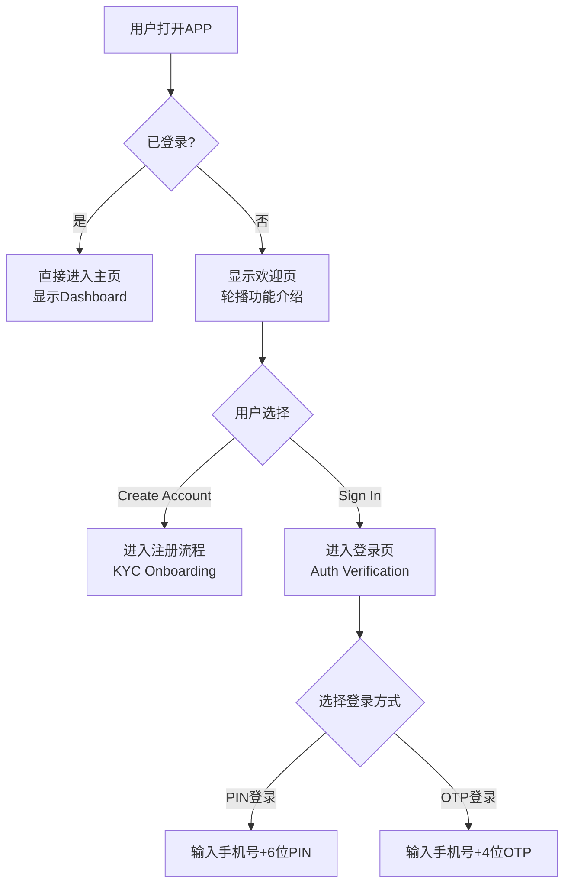
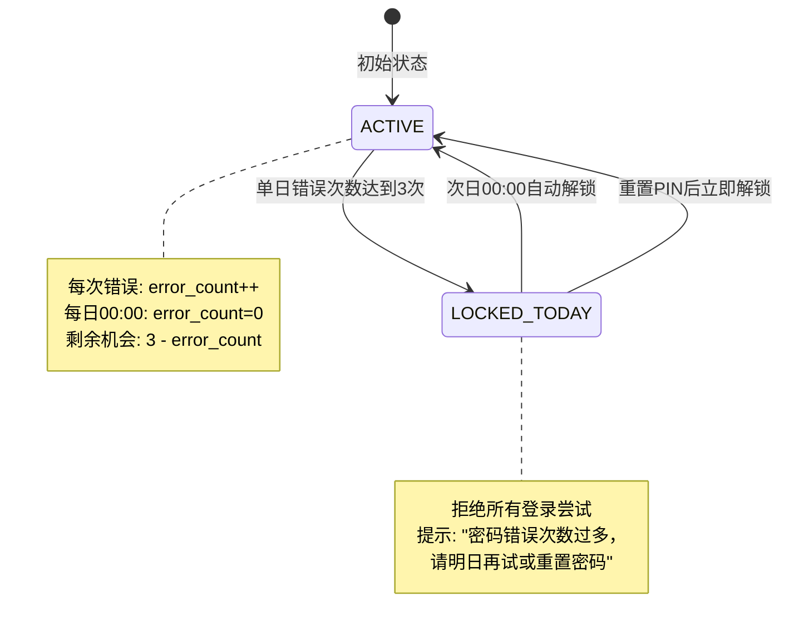
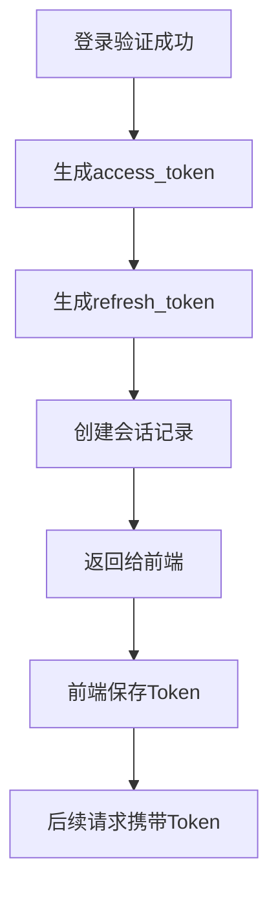
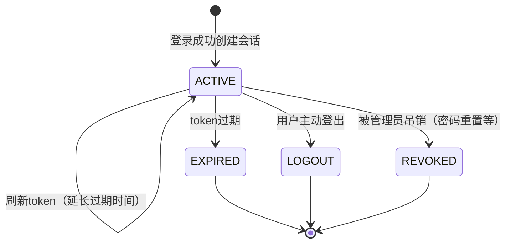
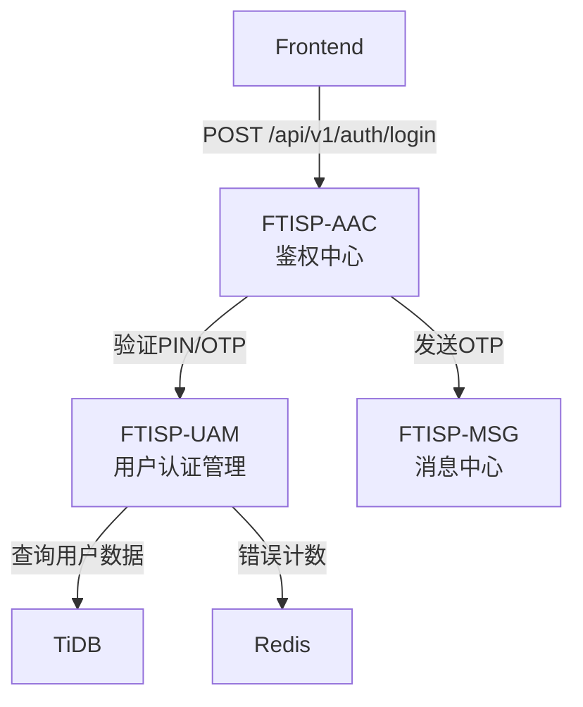
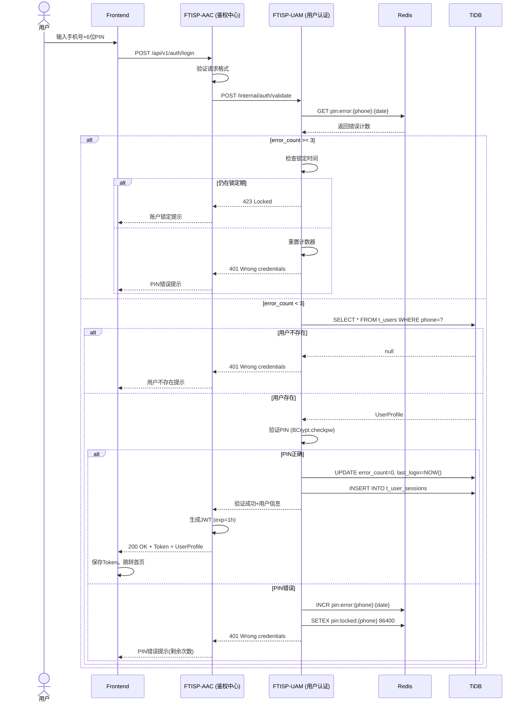

# 功能模块深度分析: 用户登录模块

> **分析日期**: 2026-02-05
> **分析方法**: MODULE_ANALYSIS_METHODOLOGY V1.0
> **输入**: PRD 3.1节 + 前端代码 + systemList.txt + login流程图 + bank.pdf
> **版本**: V2.2 (基于PDF确认生物识别功能，定位为设备管理)

---

## 1. 功能点分解 (Step 1)

### 1.1 模块概述

**功能模块**: 用户登录与认证

**业务价值**: 允许已注册用户访问系统，保障账户安全

**前置条件**: 用户已完成注册流程 (NEW → STARTER → TYPE_A/B/C)

**包含功能点**:

| ID | 功能点名称 | 触发条件 | 用户类型 | 优先级 |
|----|------------|----------|----------|--------|
| LP-00 | 登录入口展示 | 打开APP未登录 | NEW | P0 |
| LP-01 | 手机号+PIN登录 | 选择PIN登录 | ALL | P0 |
| LP-02 | 手机号+OTP登录 | 选择OTP登录 | ALL | P0 |
| LP-03 | 生物识别认证 | 设备管理中启用 | ALL | P1 |
| LP-04 | PIN错误锁定 | 连续3次错误 | ALL | P0 |
| LP-05 | OTP发送限制 | 单日超过3次 | ALL | P0 |
| LP-06 | 重置PIN | 点击"忘记PIN" | ALL | P0 |
| LP-07 | 会话管理 | 登录成功后 | ALL | P0 |

---

## 2. 功能点详细设计 (Step 2)

### LP-00: 登录入口展示

#### 2.0.1 入口流程



#### 2.0.2 前端组件

| 组件 | 文件 | 说明 |
|------|------|------|
| 欢迎组件 | `welcome.component.ts` | 展示功能介绍，提供注册/登录入口 |
| 登录组件 | `auth-verification.component.ts` | PIN/OTP输入，生物识别提示 |
| 网关组件 | `gateway.component.ts` | Demo环境用户角色选择 |

---

### LP-01: 手机号+PIN登录

#### 2.1.1 用户交互流程

```mermaid
flowchart TD
    A[用户选择登录] --> B[显示登录页]
    B --> C[输入手机号]
    C --> D[显示6位PIN输入框]

    D --> E{用户输入PIN}
    E --> F{PIN长度=6?}
    F -->|否| G[继续输入]
    F -->|是| H[点击"验证"按钮]

    H --> I[发送登录请求]
    I --> J{后端验证}

    J -->|PIN正确| K[验证成功<br/>创建会话]
    J -->|PIN错误| L[错误次数+1]

    L --> M{错误次数≥3?}
    M -->|是| N[账户锁定至明日]
    M -->|否| O[显示错误提示<br/>还剩{3-错误次数}次机会]

    K --> P{已启用生物识别?}
    P -->|是| Q[调用生物识别验证]
    P -->|否| R[直接进入主页]

    Q --> S{验证通过?}
    S -->|是| R
    S -->|否| T[回退到PIN登录]
```

#### 2.1.2 业务规则

| 规则ID | 规则描述 | 实现逻辑 |
|--------|----------|----------|
| **BR-LP-001** | 手机号格式验证 | 正则校验 `^(\+255)?[67]\d{8}$` |
| **BR-LP-002** | PIN长度固定6位 | `@Size(min=6, max=6)` |
| **BR-LP-003** | 单日PIN错误3次锁定 | Redis计数器，key=`pin:error:{phone}:{date}` |
| **BR-LP-004** | 锁定后重置PIN | 解锁需要通过"忘记PIN"流程 |

#### 2.1.3 PIN输入界面

```
┌─────────────────────────────────┐
│        Security Check           │
│                                  │
│    Enter your 6-digit PIN       │
│                                  │
│    ●  ●  ●  ●  ●  ●            │
│   (filled) (empty)               │
│                                  ││
│    ┌───┬───┬───┐                │
│    │ 1 │ 2 │ 3 │                │
│    ├───┼───┼───┤                │
│    │ 4 │ 5 │ 6 │                │
│    ├───┼───┼───┤                │
│    │   │ 0 │ ⌫ │                │
│    └───┴───┴───┘                │
└─────────────────────────────────┘
```

---

### LP-02: 手机号+OTP登录

#### 2.2.1 用户交互流程

```mermaid
flowchart TD
    A[用户选择登录] --> B[选择"短信验证码登录"]
    B --> C[输入手机号]
    C --> D[点击"发送验证码"]

    D --> E{手机号已注册?}
    E -->|否| F[提示手机号未注册<br/>引导去注册]
    E -->|是| G{单日发送次数<3?}

    G -->|是| H[发送OTP短信]
    G -->|否| I[提示达到发送上限]

    H --> J[用户输入4位验证码]
    J --> K[点击"验证并登录"]

    K --> L{验证码正确?}
    L -->|否| M[提示验证码错误]
    L -->|是| N[生成JWT Token<br/>创建会话]

    N --> O[跳转首页]
```

#### 2.2.2 业务规则

| 规则ID | 规则描述 | 实现逻辑 |
|--------|----------|----------|
| **BR-LP-005** | OTP为4位数字 | `@Pattern(regexp = "^\\d{4}$")` |
| **BR-LP-006** | OTP有效期1分钟 | Redis存储，TTL=60秒 (与KYC模块一致) |
| **BR-LP-007** | 单日发送限制3次 | Redis计数器，key=`otp:daily:{phone}:{date}` |
| **BR-LP-008** | 重发倒计时60秒 | 前端控制 |

---

### LP-03: 生物识别认证 (Biometric Login)

> **说明**: 位于设备管理(Device Management)中的可选功能，用于提升登录便利性
> **来源**: PRD Device Management章节提及 "Biometric Login"

#### 2.3.1 功能说明

用户可在设备管理中启用生物识别（Face ID/指纹），后续登录时可直接使用生物识别替代PIN输入。

#### 2.3.2 启用流程

```mermaid
flowchart TD
    A[用户进入设备管理] --> B[选择"Biometric Login"]
    B --> C{设备支持生物识别?}
    C -->|是| D[调用系统生物识别API]
    C -->|否| E[提示设备不支持]

    D --> F{用户授权?}
    F -->|同意| G[绑定生物识别信息]
    F -->|拒绝| H[保持未启用状态]

    G --> I[启用成功]
    I --> J[后续登录可使用生物识别]
```

#### 2.3.3 业务规则

| 规则ID | 规则描述 | 实现逻辑 |
|--------|----------|----------|
| **BR-LP-BIO-001** | 可选功能 | 不启用不影响正常登录 |
| **BR-LP-BIO-002** | 设备绑定 | 生物识别绑定到当前设备 |
| **BR-LP-BIO-003** | 失败降级 | 生物识别失败后回退到PIN输入 |
| **BR-LP-BIO-004** | 安全存储 | 生物识别模板存储在设备安全区域 |

---

### LP-04: PIN错误锁定

#### 2.4.1 状态机



#### 2.4.2 锁定规则

| 状态 | 触发条件 | 解锁条件 | 错误提示 |
|------|----------|----------|----------|
| ACTIVE | 正常 | - | "PIN错误，还剩 {3-错误次数} 次机会" |
| LOCKED_TODAY | 单日错误≥3次 | 次日00:00 或 重置PIN | "PIN错误次数过多，请明日再试或重置密码" |

#### 2.4.3 Redis数据结构

```
# PIN错误计数
pin:error:{phone}:{date} = error_count
TTL: 到当日23:59:59

# 锁定状态
pin:locked:{phone} = "1"
TTL: 到当日23:59:59
```

---

### LP-05: OTP发送限制

#### 2.5.1 限制规则

| 维度 | 限制规则 | 实现方式 |
|------|----------|----------|
| 单日单手机号 | 3次 | Redis key=`otp:daily:{phone}:{date}` |
| 单日单设备 | 10次 | Redis key=`otp:daily:{device_id}:{date}` |
| OTP有效期 | 1分钟 | Redis TTL=60秒 (与KYC模块一致) |
| 重发间隔 | 60秒 | 前端倒计时 |

---

### LP-06: 重置PIN

#### 2.6.1 重置流程

```mermaid
flowchart TD
    A[用户点击"忘记PIN"] --> B[输入手机号]
    B --> C{手机号已注册?}
    C -->|否| D[提示手机号未注册]
    C -->|是| E[发送OTP短信]

    E --> F[用户输入4位OTP]
    F --> G{验证码正确?}
    G -->|否| H[提示验证码错误]
    G -->|是| I[进行人脸验证]

    I --> J{人脸验证通过?}
    J -->|否| K[提示验证失败]
    J -->|是| L[显示PIN输入界面]

    L --> M[输入新6位PIN]
    M --> N[确认新PIN]

    N --> O{两次一致?}
    O -->|否| P[提示PIN不一致]
    O -->|是| Q[更新PIN]

    Q --> R[重置错误计数器]
    R --> S[返回登录页]
```

#### 2.6.2 安全验证

| 验证步骤 | 目的 | 实现方式 |
|----------|------|----------|
| OTP验证 | 确认手机号所有权 | 4位OTP，1分钟有效期 |
| 人脸验证 | 确认本人操作 | 活体检测 + 人脸比对 |
| PIN设置 | 设置新的6位PIN | 强度校验 |

---

### LP-07: 会话管理

#### 2.7.1 会话创建流程



#### 2.7.2 Token设计

| Token类型 | 长度 | 有效期 | 用途 |
|-----------|------|--------|------|
| access_token | JWT | 1小时 | API访问认证 |
| refresh_token | UUID | 30天 | 刷新access_token |

#### 2.7.3 会话数据表 (t_user_sessions)

```java
@Entity
@Table(name = "t_user_sessions")
public class UserSession {
    @Id
    private Long id;

    @Column(name = "user_id")
    private Long userId;

    @Column(name = "session_id", unique = true)
    private String sessionId;      // 会话唯一标识 (UUID)

    @Column(name = "access_token")
    private String accessToken;    // JWT access token

    @Column(name = "refresh_token")
    private String refreshToken;   // JWT refresh token

    @Column(name = "device_id")
    private String deviceId;       // 设备唯一标识

    @Column(name = "device_type")
    private String deviceType;     // ANDROID / IOS / WEB

    @Column(name = "device_info")
    private String deviceInfo;     // 设备信息（JSON）

    @Column(name = "ip_address")
    private String ipAddress;

    @Column(name = "status")
    private String status;         // ACTIVE / EXPIRED / LOGOUT

    @Column(name = "expires_at")
    private Instant expiresAt;     // access_token过期时间

    @Column(name = "refresh_expires_at")
    private Instant refreshExpiresAt;  // refresh_token过期时间

    @Column(name = "last_activity_at")
    private Instant lastActivityAt;

    @Column(name = "created_at")
    private Instant createdAt;
}
```

#### 2.7.4 会话状态机



---

## 3. 子系统追踪 (Step 3 & 4)

> **说明**: 登录模块复用KYC模块已定义的子系统架构，确保系统一致性

### 3.1 子系统交互图



### 3.2 子系统功能点映射矩阵

| 步骤 | 子系统 | 功能点 | 输入 | 输出 | 依赖 |
|------|--------|--------|------|------|------|
| 1 | FTISP-AAC | 接收登录请求 | HTTP Request | 路由分发 | - |
| 2 | FTISP-AAC | 验证请求格式 | Header/Body | 验证结果 | - |
| 3 | FTISP-UAM | 验证PIN/OTP | identifier, credential | 验证结果 | TiDB |
| 4 | FTISP-UAM | 检查错误次数 | identifier | error_count | Redis |
| 5 | FTISP-UAM | 更新登录时间 | user_id | - | TiDB |
| 6 | FTISP-AAC | 生成JWT Token | user_id, UserType | JWT String | 私钥 |
| 7 | FTISP-UAM | 创建会话记录 | user_id, device_info | session_id | TiDB |
| 8 | FTISP-AAC | 返回登录响应 | UserProfile, Token | Response JSON | - |

### 3.3 子系统职责

| 子系统 | 英文全称 | 职责 |
|--------|----------|------|
| **FTISP-AAC** | Access Authorization Center | 统一入口，路由分发（无DB） |
| **FTISP-UAM** | User Auth Management | 用户认证、PIN验证、会话管理 |
| **FTISP-MSG** | Message Center | OTP短信发送 |

---

## 4. 数据流向分析 (Step 5)

### 4.1 手机号+PIN登录完整数据流



---

## 5. 接口定义 (Step 6)

### 5.1 登录接口

> **路由**: Frontend → AAC → UAM
> **说明**: 使用手机号+PIN或OTP登录

**接口**: `POST /api/v1/auth/login`

**请求**:
```yaml
authentication: none
requestBody:
  identifier: string  # 手机号
  pin: string          # 6位PIN (可选)
  otp: string          # 4位OTP (可选)
  loginType: string    # PIN / OTP
```

**响应**:
```yaml
"200": 成功
  body:
    token: string              # JWT access_token
    refreshToken: string       # JWT refresh_token
    expiresIn: number          # access_token过期时间(秒)
    user:
      id: string
      name: string
      phone: string
      type: string              # STARTER / TYPE_A / TYPE_B / TYPE_C
      biometricsEnabled: boolean
    message: "登录成功"

"401": 认证失败
  body:
    code: "WRONG_CREDENTIALS"
    message: "手机号或PIN/OTP错误"
    details:
      remainingAttempts: number  # 剩余尝试次数
    requestId: string

"423": 账户锁定
  body:
    code: "ACCOUNT_LOCKED"
    message: "PIN错误次数过多，请明日再试或重置PIN"
    requestId: string
```

### 5.2 发送OTP接口

> **路由**: Frontend → AAC → UAM → MSG
> **说明**: 发送OTP验证码

**接口**: `POST /api/v1/auth/send-otp`

**请求**:
```yaml
authentication: none
requestBody:
  phone: string        # 手机号 (+255格式)
  type: string         # LOGIN / REGISTER
```

**响应**:
```yaml
"200": 成功
  body:
    message: "验证码已发送"
    expiresInSeconds: 60   # 1分钟
    canResendInSeconds: 60  # 60秒后可重发

"400": 参数错误
  body:
    code: "INVALID_PHONE"
    message: "请输入有效的手机号"

"429": 发送限制
  body:
    code: "OTP_LIMIT_EXCEEDED"
    message: "今日验证码发送次数已达上限"
    requestId: string
```

### 5.3 刷新Token接口

> **路由**: Frontend → AAC → UAM
> **说明**: access_token过期后用refresh_token刷新

**刷新策略**:
- refresh_token 有效期为30天
- 每次刷新后生成新的 refresh_token（轮转机制）
- 同一用户多设备刷新时，后者覆盖前者（乐观锁）
- 刷新成功后旧 refresh_token 立即失效

**接口**: `POST /api/v1/auth/refresh-token`

**请求**:
```yaml
authentication: none
requestBody:
  refreshToken: string
```

**响应**:
```yaml
"200": 成功
  body:
    accessToken: string
    refreshToken: string    # 新的refresh_token
    expiresIn: number

"401": refresh_token无效或过期
  body:
    code: "INVALID_REFRESH_TOKEN"
    message: "请重新登录"
```

### 5.4 重置PIN接口

> **路由**: Frontend → AAC → UAM
> **说明**: 用户忘记PIN时重置

**接口**: `POST /api/v1/auth/reset-pin`

**请求**:
```yaml
authentication: none
requestBody:
  phone: string      # 手机号
  otp: string        # 4位短信验证码
  newPin: string     # 新6位PIN
  confirmPin: string  # 确认新PIN
```

**响应**:
```yaml
"200": 成功
  body:
    message: "PIN已重置"

"400": 参数错误
  body:
    code: "PIN_MISMATCH"
    message: "两次输入的PIN不一致"

"401": 验证失败
  body:
    code: "OTP_INVALID"
    message: "验证码错误或已过期"
```

### 5.5 登出接口

> **路由**: Frontend → AAC → UAM
> **说明**: 用户主动登出，注销当前会话

**接口**: `POST /api/v1/auth/logout`

**请求**:
```yaml
authentication: Bearer Token
```

**响应**:
```yaml
"200": 成功
  body:
    message: "登出成功"
```

### 5.6 会话列表接口

> **路由**: Frontend → UAM
> **说明**: 获取用户所有活跃会话

**接口**: `GET /api/v1/auth/sessions`

**请求**:
```yaml
authentication: Bearer Token
```

**响应**:
```yaml
"200": 成功
  body:
    sessions:
      - sessionId: string
        deviceType: string        # ANDROID / IOS / WEB
        deviceInfo: string        # 设备信息
        ipAddress: string
        lastActivityAt: string    # ISO 8601
        isCurrent: boolean        # 是否当前会话
```

### 5.7 注销指定会话接口

> **路由**: Frontend → UAM
> **说明**: 远程注销某个设备的会话

**接口**: `DELETE /api/v1/auth/sessions/{sessionId}`

**请求**:
```yaml
authentication: Bearer Token
pathParams:
  sessionId: string
```

**响应**:
```yaml
"200": 成功
  body:
    message: "会话已注销"
```

---

## 6. 跨子系统数据流

### 6.1 数据流表

| 数据项 | 流向 | 说明 |
|--------|------|------|
| 登录请求 | Frontend → AAC | HTTP POST |
| PIN/OTP验证 | AAC → UAM | 内部调用 |
| 用户数据查询 | UAM ↔ TiDB | SQL查询 |
| 错误计数 | UAM → Redis | 读写 |
| OTP发送 | UAM → MSG | 内部调用 |
| JWT签发 | AAC | 使用私钥签名 |
| Token | AAC → Frontend | HTTP Response |

### 6.2 事件发布

| 事件名称 | 发布者 | 订阅者 | 触发时机 |
|----------|--------|--------|----------|
| UserLoggedIn | AAC | 日志系统 | 登录成功 |
| LoginFailed | AAC | 日志系统 | 登录失败 |
| AccountLocked | UAM | 消息中心 | 账户锁定 |
| PINReset | UAM | 消息中心 | PIN重置 |
| SessionCreated | UAM | 审计系统 | 会话创建 |

---

## 7. 前端代码映射

### 7.1 前端组件

| 组件 | 文件 | 说明 |
|------|------|------|
| 欢迎组件 | `welcome.component.ts` | 欢迎页，提供注册/登录入口 |
| 登录组件 | `auth-verification.component.ts` | PIN/OTP输入，生物识别提示 |
| 网关组件 | `gateway.component.ts` | Demo环境用户角色选择 |

### 7.2 前端Service方法

| 方法 | 调用时机 | 返回值 |
|------|----------|--------|
| `loginUser()` | 点击登录按钮 | void (设置persona) |
| `verifyPin(pin: string)` | PIN验证 | boolean |
| `enableBiometrics()` | 启用生物识别 | void |
| `logout()` | 退出登录 | void |
| `startOnboarding(mode)` | 开始登录/注册流程 | void |

### 7.3 用户状态 (UserService)

```typescript
export type UserType = 'NEW' | 'STARTER' | 'TYPE_A' | 'TYPE_B' | 'TYPE_C' | 'OVERDUE' | 'USSD';
export type OnboardingStep =
  'IDLE' |
  'AUTH_PHONE' |
  'AUTH_OTP' |
  'KYC_SCAN_ID' |
  'KYC_CONFIRM_ID' |
  'KYC_FACE' |
  'REVIEW';

export interface UserProfile {
  name: string;
  phone: string;
  type: UserType;
  pin: string;                    // 6位PIN
  biometricsEnabled: boolean;     // 生物识别是否启用
  isDeviceLockAuthorized: boolean;

  // ... 其他字段
}
```

---

## 8. 异常场景处理

| 场景 | HTTP状态 | 错误码 | 前端处理 |
|------|----------|--------|----------|
| 用户不存在 | 401 | WRONG_CREDENTIALS | 提示用户名密码错误 |
| PIN错误 | 401 | WRONG_CREDENTIALS | 提示剩余次数 |
| PIN长度错误 | 400 | INVALID_PIN_LENGTH | 提示必须6位 |
| 账户锁定 | 423 | ACCOUNT_LOCKED | 提示重置PIN |
| 手机号格式错误 | 400 | INVALID_PHONE | 提示格式错误 |
| OTP发送限制 | 429 | OTP_LIMIT_EXCEEDED | 提示明日再试 |
| OTP过期 | 401 | OTP_EXPIRED | 提示重新获取 |
| 生物识别失败 | - | BIOMETRIC_FAILED | 提示输入PIN |
| 会话过期 | 401 | TOKEN_EXPIRED | 引导重新登录 |

---

## 9. 安全检查点

### 9.1 数据安全

| 检查项 | 实现方式 |
|--------|----------|
| PIN加密存储 | BCrypt加密 |
| 签名验证失败 | 重试3次，告警 |
| PIN错误次数限制 | Redis计数器，超限锁定 |
| 会话过期检测 | JWT自动过期 |
| 敏感信息脱敏 | 日志中PIN不记录明文 |

### 9.2 防欺诈

| 风险点 | 防控措施 |
|--------|----------|
| 暴力破解PIN | 3次错误锁定 |
| OTP刷量 | 单日限制+设备限制 |
| 会话劫持 | JWT签名验证 |
| 重放攻击 | Token过期时间控制 |

---

## 10. 与KYC模块差异对比

| 项目 | KYC模块 | 登录模块 | 说明 |
|------|---------|----------|------|
| **PIN长度** | 4-6位 | 固定6位 | 登录模块更严格 |
| **OTP有效期** | 1分钟 | 1分钟 | ✅ 一致 |
| **子系统架构** | AAC+UAM+DAL+KYC+MSG | AAC+UAM+MSG | ✅ 复用相同架构 |
| **会话管理** | 共用表 | 共用表 | ✅ 共用设计 |
| **Token格式** | JWT | JWT | ✅ 一致 |

---

## 11. 优化建议 (方法论迭代)

### 11.1 本次分析发现的方法论优化点

| 发现 | 优化建议 | 优先级 |
|------|----------|--------|
| 登录入口流程缺失 | 增加 LP-00 登录入口章节 | 高 |
| 生物识别认证缺失 | 增加 LP-03 生物识别章节（设备管理功能） | 高 |
| PIN长度不一致 | 统一为固定6位 | 高 |
| 子系统架构差异 | 统一使用KYC模块定义的子系统 | 高 |
| 会话管理缺失 | 增加 LP-07 会话管理章节 | 中 |
| Token刷新机制 | 增加刷新接口和轮转策略 | 中 |

### 11.2 建议新增章节

- **Session Management**: 会话生命周期管理
- **Biometric Security**: 生物识别安全最佳实践（设备管理功能）
- **Multi-Device Support**: 多设备登录管理

---

*本文档使用 MODULE_ANALYSIS_METHODOLOGY V1.0 方法论生成，V2.2基于前端实现与KYC模块对齐更新，保留生物识别功能。*
