# 功能模块深度分析: 存款模块 (Savings & Investment)

> **分析日期**: 2026-02-13
> **版本**: V1.1 (基于Review更新)
> **更新内容**:
> 1. 新增SV-10活跃定期存款管理功能
> 2. 补充空状态用户旅程设计
> 3. 优化数据库索引设计
> 4. 修正利息计算公式说明
> 5. 加强风控集成说明
> 6. 增强接口幂等性和并发控制
> 7. 完善安全检查点

---

## 1. 功能点分解 (Step 1)

### 1.1 模块概述

**功能模块**: 存款与理财 (Savings & Investment)

**业务价值**: 为用户提供现金账户管理、定期存款产品、资金充值取现等核心金融服务

**前置条件**: 用户已完成注册流程 (NEW → STARTER → TYPE_A/B/C)，已开立存款账户

**包含功能点**:

| ID | 功能点名称 | 触发条件 | 用户类型 | 优先级 |
|----|------------|----------|----------|--------|
| SV-00 | 存款概览展示 | 打开Banking版块 | ALL | P0 |
| SV-01 | 入金(Add Cash) | 点击充值按钮 | ALL | P0 |
| SV-02 | 转账(Send Money) | 点击转账按钮 | ALL | P0 |
| SV-03 | 账单支付(Pay Bill) | 点击账单按钮 | ALL | P1 |
| SV-04 | 取现(Withdraw) | 点击取现按钮 | ALL | P0 |
| SV-05 | 定期存款创建 | 点击New Saving Plan | ALL | P0 |
| SV-06 | 定期存款赎回 | 点击提前支取 | ALL | P0 |
| SV-07 | 存款冻结提额 | Security Deposit提额 | TYPE_C | P0 |
| SV-08 | 交易历史查询 | 查看交易记录 | ALL | P0 |
| SV-09 | 账户详情查看 | 点击Details按钮 | ALL | P0 |
| SV-10 | 活跃定期存款管理 | 管理Active Saving Plans | ALL | P0 |

---

## 2. 功能点详细设计 (Step 2)

### SV-00: 存款概览展示

#### 2.0.1 数据结构

根据前端代码 `savings-portfolio.component.ts`，概览展示以下数据：

```
总资产 (Total Assets) = Cash账户余额 + Savings Plans总价值

Savings Plans:
  - 定期存款本金
  - 累计收益(accruedEarnings)
  - 状态(ACTIVE/MATURED)
```

#### 2.0.2 展示状态与空状态设计

| 状态 | 条件 | 展示内容 |
|------|--------|----------|
| 无存款 | 总资产=0 | 新客引导界面 |
| 有存款 | 总资产>0 | 资产卡片+交易列表 |

**空状态用户旅程设计 (Empty State User Journey)**:

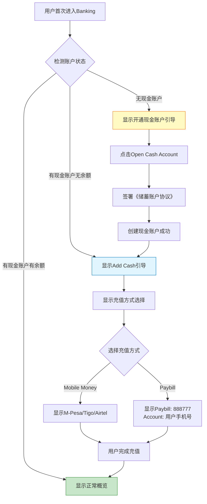

**空状态引导卡片设计**:

| 场景 | 卡片标题 | 卡片内容 | CTA按钮 |
|------|---------|---------|---------|
| 无账户 | "开启您的数字银行之旅" | "开通现金账户，享受便捷金融服务" | "Open Cash Account" |
| 无余额 | "充值您的账户" | "通过Mobile Money或Paybill快速充值" | "Add Cash" |
| 无定期存款 | "让您的资金增值" | "创建定期存款，享受高达12.5%年化收益" | "New Saving Plan" |

---

### SV-01: 入金(Add Cash)

#### 2.1.1 用户交互流程 (三种模式)

根据 `d:\africa\flowpicture\addCash.png` 流程图，入金支持以下三种渠道：

1.  **Mobile Money (STK Push)**: App主动发起，运营商弹窗。
2.  **Bank Transfer**: 线下转账，展示收款账号。
3.  **Wakala Agent**: 线下/被动充值，展示 Control Number。

```mermaid
flowchart TD
    A[用户点击Add Cash] --> B{选择充值方式}
    
    %% 渠道1: Mobile Money (STK Push)
    B -->|Mobile Money| MM[初始化 Mobile Money 流程]
    MM --> MM1[输入充值金额 & 手机号]
    MM1 --> MM2[选择运营商<br/>M-Pesa/Tigo/Airtel]
    MM2 --> MM3[点击 Next & 确认页]
    MM3 --> MM4[点击 Confirm Deposit]
    MM4 --> MM5[唤起 App PIN/生物识别鉴权]
    MM5 -->|验证通过| MM6[调用后端发起交易]
    MM6 --> MM7[手机收到运营商USSD弹窗]
    MM7 --> MM8[用户输入 **M-Pesa PIN**]
    MM8 -.->|异步回调| S1[系统处理]

    %% 渠道2: Bank Transfer
    B -->|Bank Transfer| BT[展示收款银行账户信息]
    BT --> BT1[用户通过银行App转账]
    BT1 --> BT2[流程结束, 等待到账通知]
    BT2 -.->|异步回调| S1

    %% 渠道3: Wakala Agent
    B -->|Wakala Agent| WA[展示充值指引页]
    WA --> WA1[生成/展示 Control Number]
    WA1 --> WA2[用户线下向代理商付款]
    WA2 --> WA3[点击 'I have made payment']
    WA3 --> WA4[调用后端查询状态]
    WA4 -.->|轮询/回调| S1

    %% 系统处理
    S1[系统处理 (User Service/CTS)]
    S1 --> S2[更新钱包余额]
    S2 --> S3[创建交易记录 (Type: CREDIT)]
    S3 --> S4[返回成功状态]
    S4 --> S5[展示成功页面: Deposit Successful]
```

#### 2.1.2 业务规则

| 规则ID | 规则描述 | 实现逻辑 |
|--------|----------|----------|
| **BR-SV-001** | Paybill号固定 | 888777 |
| **BR-SV-002** | 充值到账规则 | 实时或准实时（T+0） |
| **BR-SV-003** | 充值金额限制 | 单笔最小100TZS，最大50000TZS |
| **BR-SV-004** | 每日充值限额 | Tier限制(见KYC模块) |

---

### SV-02: 转账(Send Money)

#### 2.2.1 转账类型

根据前端代码，支持三种转账类型：

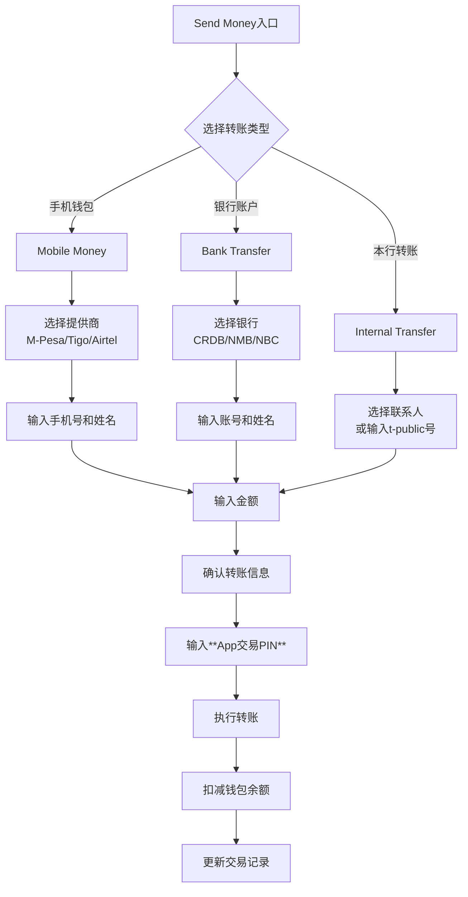

#### 2.2.2 业务规则

| 规则ID | 规则描述 | 实现逻辑 |
|--------|----------|----------|
| **BR-SV-005** | 本行转账免费 | 手续费=0 |
| **BR-SV-006** | 跨行转账收费 | 手续费由银行收取 |
| **BR-SV-007** | 转账到手机钱包 | 手续费由提供商收取 |
| **BR-SV-008** | 余额充足校验 | availableBalance >= transferAmount + fee |
| **BR-SV-009** | 每日转帐限额 | Tier限制 |
| **BR-SV-010** | 收款人信息保存 | 保存到常用收款人列表 |

---

### SV-03: 账单支付(Pay Bill)

#### 2.3.1 支付类型

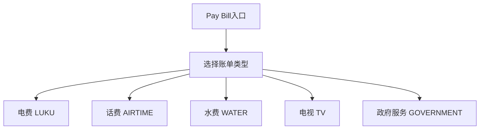

#### 2.3.2 业务规则

| 规则ID | 规则描述 | 实现逻辑 |
|--------|----------|----------|
| **BR-SV-011** | 支付前校验余额 | 余额充足才允许支付 |
| **BR-SV-012** | 账单支付手续费 | 根据账单类型收取 |
| **BR-SV-013** | 支付限额 | Tier每日限额 |

---

### SV-04: 取现(Withdraw)

#### 2.4.1 取现流程

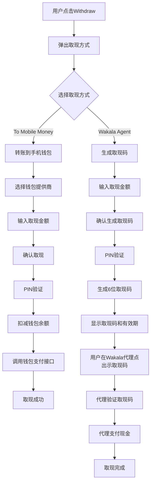

#### 2.4.2 业务规则

| 规则ID | 规则描述 | 实现逻辑 |
|--------|----------|----------|
| **BR-SV-014** | 取现码有效期 | 30分钟 |
| **BR-SV-015** | 取现码一次性使用 | 使用后立即失效 |
| **BR-SV-016** | 取现限额 | 单笔最小100TZS，Tier限额 |
| **BR-SV-017** | 取现手续费 | 每笔收取固定手续费 |
| **BR-SV-018** | Wakala代理验证 | 代理输入取现码验证有效性 |

---

### SV-05: 定期存款创建

#### 2.5.1 存款产品配置

根据前端代码，产品配置如下：

```typescript
depositPlans = [
  { name: '3 Months', duration: 3, rate: 0.08 },   // 8% p.a.
  { name: '6 Months', duration: 6, rate: 0.10 },   // 10% p.a.
  { name: '12 Months', duration: 12, rate: 0.115 }, // 11.5% p.a.
  { name: '24 Months', duration: 24, rate: 0.125 }, // 12.5% p.a.
];
```

#### 2.5.2 创建流程

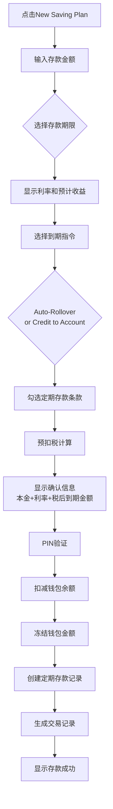

**关键系统交互**:
- **AAC**: 接收用户请求，鉴权
- **DAL**: 编排流程，**调用 ECIF 获取客户号 (ecif_no)**，调用 CTS 创建存款
- **CTS**: 执行核心存款逻辑，调用 ACS 冻结资金

#### 2.5.3 收益计算

**利息计算公式 (单利计算 Simple Interest)**:

```
本金 (Principal) = depositAmount
年利率 (APR) = selectedPlan.rate
期限 (Term) = selectedPlan.duration (月数)

# 日利息计算
日利息 (Daily Interest) = Principal × APR / 365

# 总利息计算 (单利)
利息 (Gross Interest) = Principal × APR × (Term / 12)

# 税额计算
税额 (Tax) = Gross Interest × 10% (坦桑尼亚预扣税)

# 税后利息
税后利息 (Net Interest) = Gross Interest - Tax

# 到期金额
到期金额 (Maturity Amount) = Principal + Net Interest
```

**说明**:
- 本产品采用**单利计算**，不计复利
- 利息按日累计，到期一次性支付
- 到期自动续存时，本金+利息成为新的一笔定期存款

#### 2.5.4 到期指令处理

| 指令类型 | 说明 | 执行逻辑 |
|----------|------|----------|
| Auto-Rollover | 自动续存 | 到期时本金+利息自动转入新的定期存款 |
| Credit to Account | 到期入账 | 到期时本金+利息解冻到现金账户 |

---

### SV-06: 定期存款赎回 (提前支取)

#### 2.6.1 赎回流程

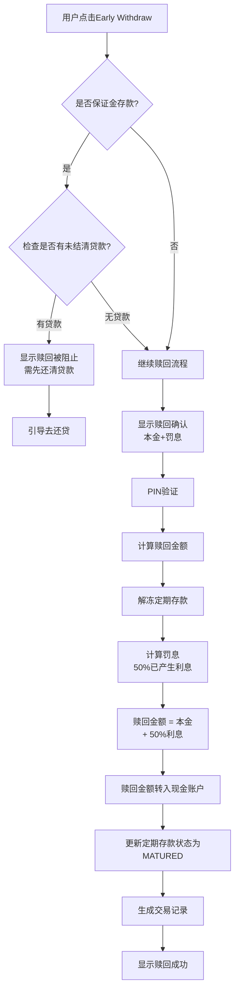

#### 2.6.2 提前支取规则

| 规则ID | 规则描述 | 实现逻辑 |
|--------|----------|----------|
| **BR-SV-019** | 提前支取罚息 | 扣除已产生利息的50% |
| **BR-SV-020** | 罚息不罚本金 | 本金全额返还 |
| **BR-SV-021** | 到期自动续存 | 默认Auto-Rollover |
| **BR-SV-022** | 保证金赎回限制 | 有未结清贷款时禁止赎回 |

---

### SV-07: 存款冻结提额 (Security Deposit)

> **说明**: 这是Type_C(Builder)用户获得授信额度的关键方式

#### 2.7.1 提额流程

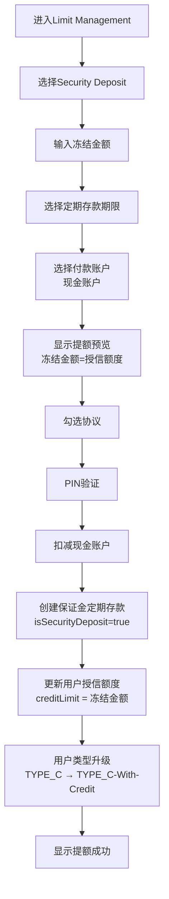

#### 2.7.2 保证金规则

| 规则ID | 规则描述 | 实现逻辑 |
|--------|----------|----------|
| **BR-SV-023** | 1:1额度授予 | 额度=保证金冻结金额 |
| **BR-SV-024** | 保证金赎回限制 | 赎回需先还清所有贷款 |
| **BR-SV-025** | 赎回后额度调整 | 赎回后额度相应减少 |
| **BR-SV-026** | 保证金利息计算 | 正常利息收益，不因冻结而减免 |
| **BR-SV-043** | 到期指令锁定 | 必须为 AUTO_ROLLOVER，用户不可选择 |
| **BR-SV-044** | 用户类型升级 | TYPE_C → TYPE_C_WITH_CREDIT |

#### 2.7.3 前端界面状态

| 视图状态 | 说明 | 关键组件 |
|---------|------|----------|
| `main` | Limit Management 主界面 | 选择 Security Deposit / Device Security |
| `SECURITY_DEPOSIT_INPUT` | 输入冻结金额、选择期限 | 金额输入框、期限选择、付款方式 |
| `SECURITY_DEPOSIT_CONFIRM` | 确认界面，显示预览 | 新额度展示、协议勾选、PIN验证 |
| `LIMIT_INCREASE_SUCCESS` | 提额成功动画 | 额度变更展示、庆祝动画 |

#### 2.7.4 Security Deposit 数据流

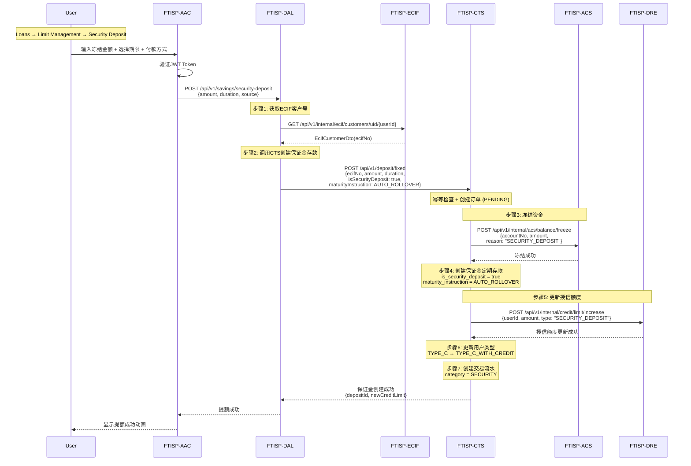

#### 2.7.5 Security Deposit 接口定义

**前端接口** (已实现 - `loans-tab.component.ts`):

| 操作 | 接口 | 方法 | 说明 |
|------|------|------|------|
| 创建保证金存款 | `/api/v1/savings/security-deposit` | POST | 创建保证金定期存款并提额 |

**请求参数**:
```typescript
{
  amount: number,           // 冻结金额(分)
  durationMonths: number,   // 期限: 3/6/12
  interestRate: number,     // 年利率 (如0.08表示8%)
  source: 'WALLET' | 'EXTERNAL'  // 付款来源
}
```

**响应数据**:
```typescript
{
  depositId: string,        // 保证金定期存款ID
  oldCreditLimit: number,   // 原授信额度
  newCreditLimit: number,   // 新授信额度
  maturityAmount: number,   // 到期金额(本金+税后利息)
  maturityDate: string,     // 到期日期
  effectiveDate: string     // 额度生效时间
}
```

#### 2.7.6 特殊限制说明

**与普通定期存款的区别**:

| 特性 | 普通定期存款 | Security Deposit |
|------|-------------|------------------|
| 到期指令 | 用户可选择 | **强制 AUTO_ROLLOVER** |
| 赎回限制 | 随时可赎回(罚息) | **有未结清贷款时不可赎回** |
| 额度关联 | 无 | **1:1 授信额度** |
| 用户类型 | 不影响 | **TYPE_C → TYPE_C_WITH_CREDIT** |
| 利息收益 | 正常 | **正常(不因冻结减免)** |

#### 2.7.7 保证金赎回流程

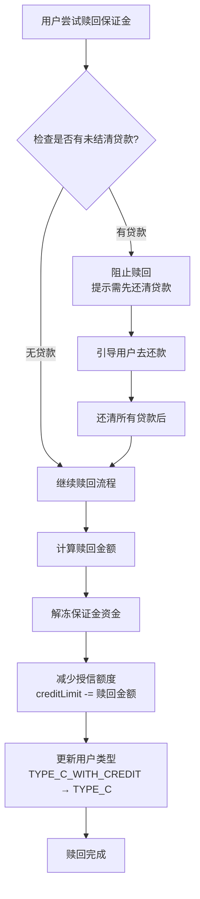

#### 2.7.8 错误处理

| 错误码 | HTTP状态 | 场景 | 用户提示 |
|--------|----------|------|----------|
| `SECURITY_DEPOSIT_HAS_LOAN` | 403 | 有未结清贷款时赎回 | "需先还清所有贷款才可赎回保证金存款" |
| `INSUFFICIENT_BALANCE` | 400 | 余额不足 | "可用余额不足，请选择其他付款方式" |
| `INVALID_DURATION` | 400 | 无效期限 | "保证金存款仅支持3/6/12个月期限" |
| `USER_TYPE_MISMATCH` | 403 | 用户类型不符 | "仅TYPE_C用户可通过保证金提额" |

---

### SV-08: 交易历史查询

#### 2.8.1 功能概述

支持用户查询所有交易记录，支持按类型筛选、分页加载、下载历史记录。

#### 2.8.2 交易类型

| 交易类型 | Category | 说明 | 流水方向 | 图标 |
|----------|----------|------|----------|------|
| WALLET | TRANSFERS | 现金账户充值/取现 | CREDIT/DEBIT | 💰 |
| SAVINGS | SAVINGS | 定期存款创建/赎回 | DEBIT/CREDIT | 📈 |
| TRANSFER | TRANSFERS | 转账 | DEBIT | 💸 |
| BILL | TRANSFERS | 账单支付 | DEBIT | 📄 |
| LOAN | LOANS | 借款放款 | CREDIT | 💳 |
| REPAYMENT | LOANS | 还款 | DEBIT | ✅ |
| FEE | TRANSFERS | 手续费 | DEBIT | 💸 |

#### 2.8.3 前端状态管理

```typescript
interface TransactionHistoryState {
  // 当前筛选条件
  filter: 'ALL' | 'SAVINGS' | 'LOANS' | 'TRANSFERS';

  // 交易列表
  transactions: Transaction[];

  // 分页状态
  currentPage: number;
  totalPages: number;
  hasMore: boolean;

  // 加载状态
  isLoading: boolean;
  isDownloading: boolean;

  // 选中交易（详情弹窗）
  selectedTx: Transaction | null;
}
```

#### 2.8.4 数据流时序

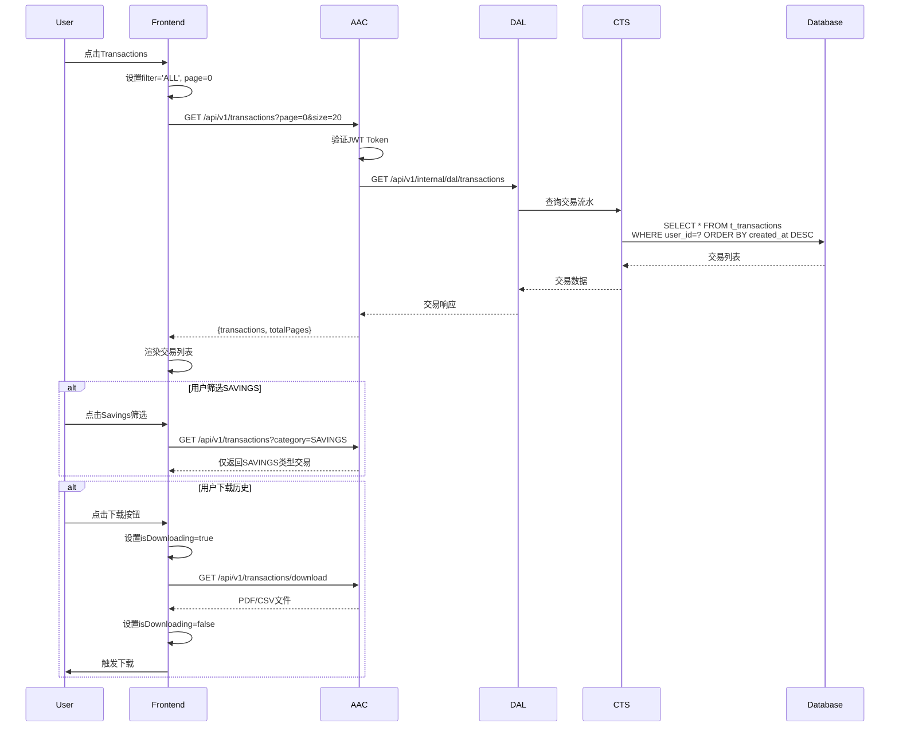

#### 2.8.5 筛选逻辑映射

| 前端Filter | 后端Category | 包含的交易类型 |
|------------|--------------|----------------|
| ALL | ALL | 全部 |
| SAVINGS | SAVINGS | WALLET(Credit only), SAVINGS |
| LOANS | LOANS | LOAN, REPAYMENT |
| TRANSFERS | TRANSFERS | TRANSFER, BILL, FEE, WALLET(Debit) |

#### 2.8.6 分页策略

- **默认每页**: 20 条
- **最大页数**: 50 (最多1000条记录)
- **缓存策略**: 内存缓存最近100条
- **加载更多**: 滚动到底部自动加载下一页

#### 2.8.7 下载功能

| 格式 | 支持 | 用途 |
|------|------|------|
| PDF | ✅ | 打印/存档 |
| CSV | ✅ | Excel导入分析 |
| Excel | ❌ | 暂不支持 |

#### 2.8.8 交易详情展示

```typescript
interface TransactionDetail {
  id: string;                    // 交易流水号
  type: 'CREDIT' | 'DEBIT';     // 收支类型
  category: string;              // 分类
  title: string;                 // 标题
  description?: string;          // 描述
  amount: number;                // 金额（分）
  date: string;                  // 交易时间
  status: 'PENDING' | 'COMPLETED' | 'FAILED';
  fee?: number;                  // 手续费
  balance?: number;              // 交易后余额
  reference?: string;            // 参考号
  counterparty?: {               // 对方信息
    name: string;
    account: string;
    bank?: string;
  };
}
```

#### 2.8.9 深度链接

交易历史支持深度链接到相关功能：

| 交易类型 | 深度链接 | 参数 |
|----------|----------|------|
| SAVINGS (创建) | 定期存款详情 | depositId |
| SAVINGS (赎回) | 定期存款详情 | depositId |
| LOAN | 贷款详情 | loanId |
| REPAYMENT | 贷款详情 | loanId |
| TRANSFER | 交易详情 | transactionId |

#### 2.8.10 查询接口

```java
GET /api/v1/transactions?page=0&size=20&category=ALL

Response:
{
  transactions: [
    {
      id: "TXN20260213001",
      type: "DEBIT",
      category: "SAVINGS",
      title: "New Saving Plan",
      amount: 1000000,
      date: "2026-02-13T10:30:00Z",
      status: "COMPLETED"
    }
  ],
  totalPages: 5,
  currentPage: 0
}
```

---

### SV-09: 账户详情查看

#### 2.9.1 功能概述

展示用户存款账户的完整信息，包括账号、余额、状态等详细信息。

#### 2.9.2 账户信息展示

根据前端 `savings-portfolio.component.ts` 中的账户详情弹窗：

| 信息项 | 字段名 | 说明 | 示例值 |
|--------|--------|------|--------|
| Account Number | accountNo | 存款账号 | 102-033-044-055 |
| Account Type | accountType | 账户类型 | SAVINGS |
| Account Status | accountStatus | 账户状态 | ACTIVE |
| Status Desc | accountStatusDesc | 状态描述 | Normal |
| Currency | currency | 币种 | TZS |
| Available Balance | availableBalance | 可用余额 | 50000.00 |
| Frozen Balance | frozenBalance | 冻结金额 | 0.00 |
| Current Balance | currentBalance | 当前余额 | 50000.00 |
| Paybill Number | paybillNumber | Paybill号 | 888777 |
| Bank Name | bankName | 银行名称 | Trans-Public Bank |
| Branch | branch | 分行 | Digital Branch |
| Opened At | openedAt | 开户时间 | 2024-01-15 |
| Core Account Seq | coreAccountSeq | 核心账户序号 | ACS001 |

#### 2.9.3 数据流时序

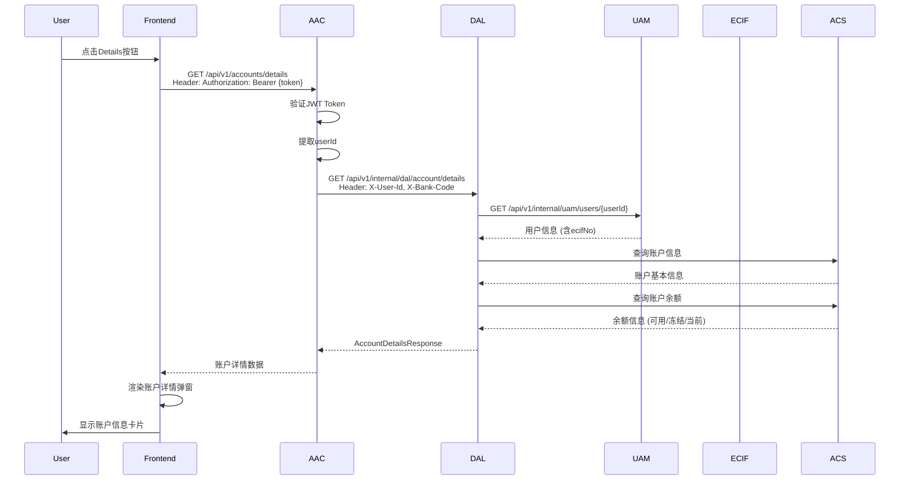

#### 2.9.4 前端组件状态

```typescript
interface AccountDetailsState {
  visible: boolean;
  loading: boolean;
  error?: string;

  // 账户信息
  accountNo: string;
  accountType: string;
  accountStatus: string;
  currency: string;

  // 余额信息
  availableBalance: number;
  frozenBalance: number;
  currentBalance: number;

  // 银行信息
  paybillNumber: string;
  bankName: string;
  branch: string;
  openedAt: string;
}
```

#### 2.9.5 空状态处理

| 状态 | 条件 | 展示内容 |
|------|--------|----------|
| 无账户 | 用户未开户 | "开立现金账户"引导 |
| 账户审核中 | status=PENDING | "账户审核中，请耐心等待" |
| 账户冻结 | status=FROZEN | "账户已冻结，请联系客服" |
| 账户正常 | status=ACTIVE | 显示完整账户信息 |

#### 2.9.6 余额类型说明

| 余额类型 | 说明 | 计算方式 |
|----------|------|----------|
| Current Balance | 当前余额 | availableBalance + frozenBalance |
| Available Balance | 可用余额 | 可用于交易的金额 |
| Frozen Balance | 冻结金额 | 定期存款本金等冻结金额 |

#### 2.9.7 错误处理

| 错误码 | HTTP状态 | 场景 | 用户提示 |
|--------|----------|------|----------|
| ACCOUNT_NOT_FOUND | 404 | 账户不存在 | "账户不存在，请先开立现金账户" |
| ACCOUNT_FROZEN | 403 | 账户已冻结 | "账户已冻结，请联系客服解除" |
| USER_NOT_VERIFIED | 403 | 用户未完成KYC | "请先完成身份验证" |

#### 2.9.8 前端交互

```typescript
// 打开账户详情
openAccountDetails() {
  this.showAccountDetails.set(true);
  this.loadAccountDetails();
}

// 加载账户详情
async loadAccountDetails() {
  const response = await this.httpClient.get('/api/v1/accounts/details');
  this.accountDetails.set(response);
}

// 复制账号
copyAccountNumber() {
  navigator.clipboard.writeText(this.accountDetails().accountNo);
  this.showToast('账号已复制');
}

// 显示Paybill号
showPaybillInfo() {
  this.showToast('Paybill: 888777\nAccount: ' + this.userPhone());
}
```

---

### SV-10: 活跃定期存款管理 (Active Saving Plans Management)

> **新增功能点**: 支持用户查看和管理所有活跃的定期存款

#### 2.10.1 管理功能概览

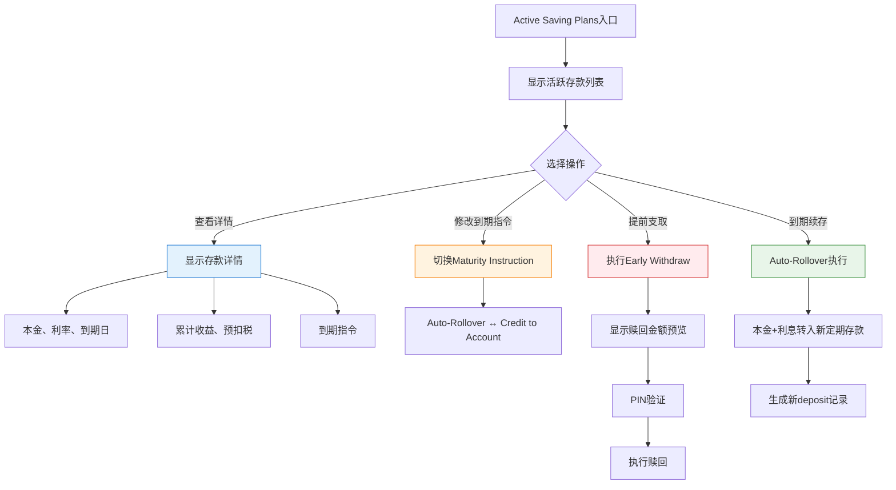

#### 2.10.2 到期指令修改规则

| 规则ID | 规则描述 | 实现逻辑 |
|--------|----------|----------|
| **BR-SV-037** | 到期前可修改 | 距离开到期日>1天可修改 |
| **BR-SV-038** | 到期日锁定 | 到期日当天及提前1天不可修改 |
| **BR-SV-039** | 保证金限制 | Security Deposit不可修改到期指令 |
| **BR-SV-040** | 修改记录 | 记录修改历史到审计日志 |

#### 2.10.3 到期自动续存流程

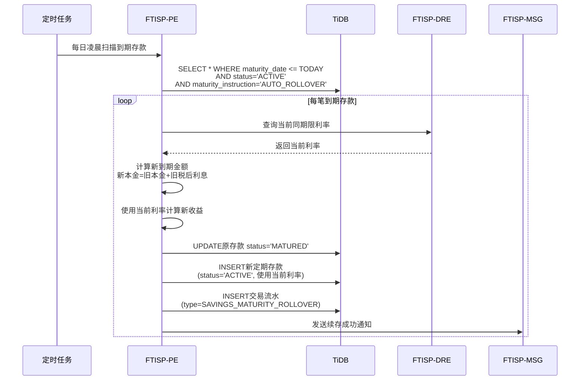

#### 2.10.4 管理界面数据结构

```typescript
interface ActiveDepositManagement {
  depositId: string;
  planName: string;           // "12 Months"
  principal: number;           // 本金
  currentInterestRate: number; // 当前年利率
  marketInterestRate: number;  // 市场当前利率（用于对比）
  accruedInterest: number;     // 累计收益
  maturityDate: string;        // 到期日期
  daysToMaturity: number;     // 距离到期天数
  maturityInstruction: string; // 到期指令
  canModifyInstruction: boolean; // 是否可修改指令
  isSecurityDeposit: boolean;  // 是否保证金
  linkedLoans: string[];      // 关联的贷款ID（保证金场景）
}
```

---

## 3. 子系统追踪 (Step 3 & 4)

### 3.1 子系统交互图

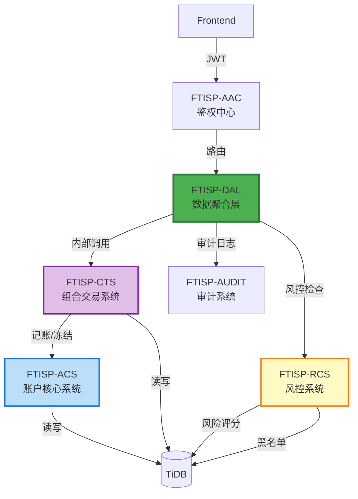

### 3.2 子系统功能点映射矩阵

| 步骤 | 子系统 | 功能点 | 输入 | 输出 | 依赖 |
|------|--------|--------|------|------|------|
| 1 | FTISP-AAC | 鉴权验证 | JWT Token | 用户信息 | - |
| 2 | FTISP-DAL | 业务转发 | 存款请求 | 转发至CTS | CTS |
| 3 | FTISP-CTS | 订单编排/幂等 | 存款请求 | 交易流水号 | - |
| 4 | FTISP-ACS | 账户查询 | userId | 账户信息 | TiDB |
| 5 | FTISP-ACS | 余额查询 | accountNo | 余额信息 | TiDB |
| 6 | FTISP-ACS | 余额冻结 | accountNo, amount | 冻结结果 | TiDB |
| 7 | FTISP-ACS | 余额解冻 | accountNo, amount | 解冻结果 | TiDB |
| 8 | FTISP-CTS | 创建定期存款 | depositInfo | txnId | TiDB |
| 9 | FTISP-CTS | 赎回定期存款 | depositId | 赎回结果 | TiDB |
| 10 | FTISP-CTS | 产品查询 | productCode | 产品配置(利率/期限) | - |
| 11 | FTISP-CTS | 交易流水记录 | txnInfo | - | TiDB |
| 12 | FTISP-RCS | 风控评分 | txnInfo | 风险评分(低/中/高) | TiDB |
| 13 | FTISP-AUDIT | 审计日志记录 | auditInfo | - | TiDB |
| 14 | FTISP-CTS | 存款收益计算 | depositInfo | 利息/税额/到期金额 | - |
| 15 | FTISP-CTS | 到期自动续存 | maturityDate | 新存款记录 | TiDB |

### 3.3 子系统职责

| 子系统 | 英文全称 | 职责 |
|--------|----------|------|
| **FTISP-AAC** | Access Authorization Center | 统一入口，路由分发 |
| **FTISP-DAL** | Data Aggregation Layer | 简单聚合，业务透传 (Gateway/BFF) |
| **FTISP-ACS** | Account Core System | 账户管理、余额管理、记账处理引擎、资金冻结 |
| **FTISP-CTS** | Composite Trading System | **订单编排中心、交易状态机、幂等控制、交易流水管理**、产品管理(PSS)、存款/贷款业务逻辑 |
| **FTISP-RCS** | Risk Control System | 风险控制与反欺诈 |
| **FTISP-AUDIT** | Audit System | 审计日志与合规 |

### 3.4 风控系统集成设计

存款模块与风控系统的集成点:

| 风控检查点 | 触发时机 | 风控系统响应 | 处理策略 |
|-----------|---------|-------------|---------|
| **充值风控** | 第三方支付回调 | 检测异常充值行为 | 可疑金额延迟入账，人工复核 |
| **大额交易** | 转账/取现>限额 | 触发大额交易验证 | 需二次验证或人工审批 |
| **高频交易** | 短时间内多笔交易 | 检测欺诈模式 | 临时冻结账户，发送警告 |
| **取现码风控** | 生成/核销取现码 | 检测异常取现行为 | 可疑取现码标记，代理需验证 |
| **保证金赎回** | Security Deposit赎回 | 检测贷款状态 | 有未结清贷款时阻止赎回 |

**风控规则引擎集成**:

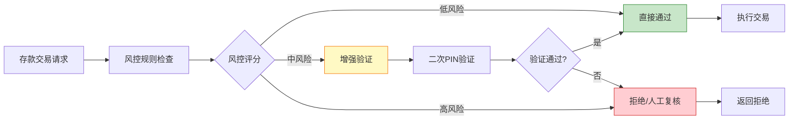

---

## 4. 数据流向分析 (Step 5)

### 4.1 定期存款创建完整数据流

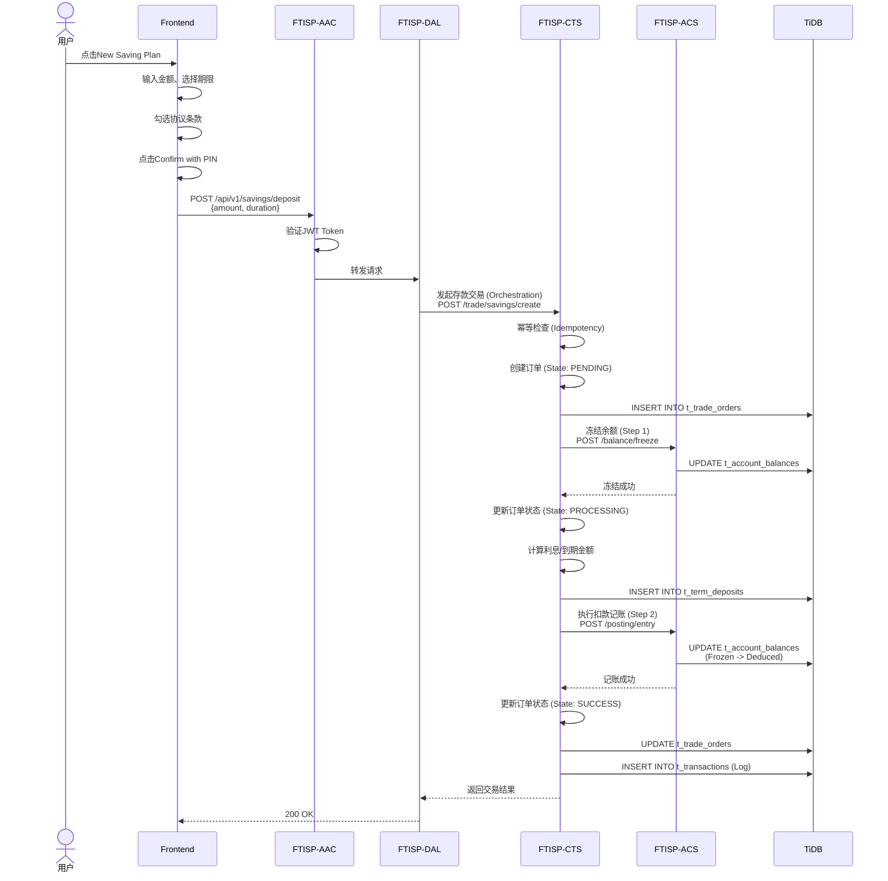

### 4.2 定期存款赎回数据流

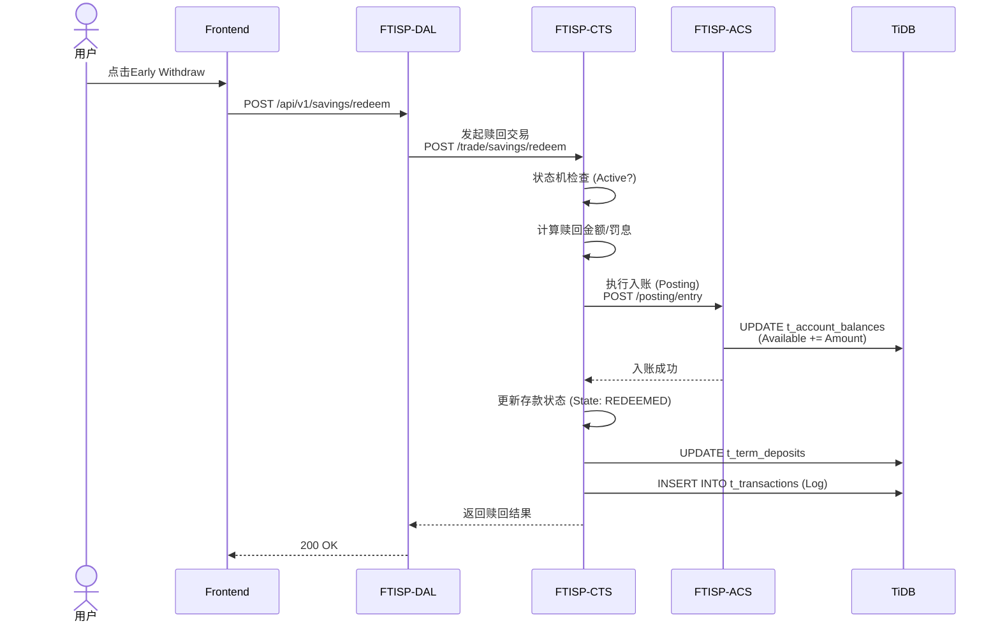

### 4.3 余额充值数据流 (Mobile Money STK Push)

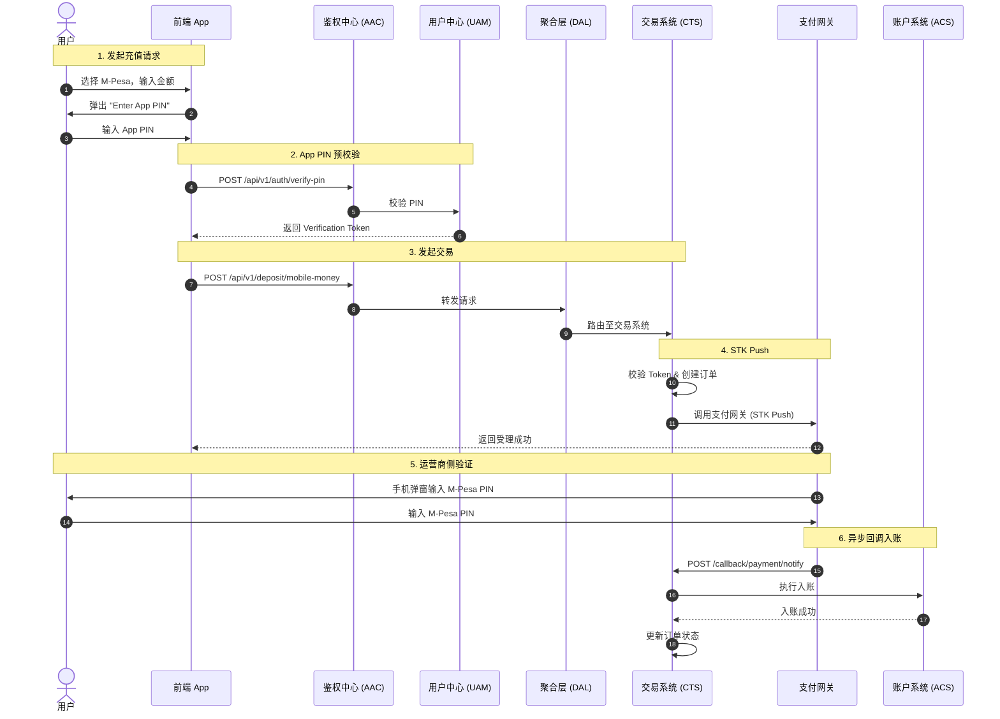

---

## 5. 接口定义 (Step 6)

### 5.1 创建定期存款接口

> **路由**: Frontend → AAC → DAL → CTS/ACS

**接口**: `POST /api/v1/savings/deposit`

**请求**:
```yaml
authentication: Bearer Token
requestBody:
  amount: number           # 存款金额(分)
  duration: number         # 期限(月): 3/6/12/24
  maturityInstruction: string # 到期指令: AUTO_ROLLOVER/CREDIT_TO_ACCOUNT
  sourceAccountNo: string  # 付款账号(可选，默认现金账户)
```

**响应**:
```yaml
"200": 成功
  body:
    depositId: string        # 定期存款ID
    accountNo: string       # 账号
    amount: number          # 本金
    interestRate: number    # 年利率
    maturityDate: string    # 到期日期(ISO 8601)
    maturityAmount: number  # 税后到期金额
    accruedInterest: number # 当前累计收益
    taxWithheld: number     # 预扣税额
    createdAt: string      # 创建时间

"400": 余额不足
  body:
    code: "INSUFFICIENT_BALANCE"
    message: "可用余额不足"
    details:
      required: number
      available: number

"404": 账户不存在
  body:
    code: "ACCOUNT_NOT_FOUND"
    message: "账户不存在"
```

### 5.2 赎回定期存款接口

> **路由**: Frontend → AAC → DAL → CTS/ACS

**接口**: `POST /api/v1/savings/redeem`

**请求**:
```yaml
authentication: Bearer Token
requestBody:
  depositId: string       # 定期存款ID
```

**响应**:
```yaml
"200": 成功
  body:
    depositId: string
    redeemAmount: number     # 赎回金额(分)
    principal: number        # 本金
    interestForfeited: number # 罚息金额
    transactionId: string   # 交易ID
    redeemedAt: string     # 赎回时间

"403": 赎回被阻止
  body:
    code: "REDEEM_BLOCKED"
    message: "需先还清贷款才可赎回保证金存款"
```

### 5.3 查询定期存款列表接口

> **路由**: Frontend → AAC → DAL → CTS

**接口**: `GET /api/v1/savings/plans`

**请求**:
```yaml
authentication: Bearer Token
queryParameters:
  status: string  # 可选: ACTIVE/MATURED/ALL
```

**响应**:
```yaml
"200": 成功
  body:
    plans:
      - id: string
        accountNo: string
        principal: number
        interestRate: number
        duration: number
        maturityDate: string
        maturityAmount: number
        accruedInterest: number
        status: string              # ACTIVE/MATURED/REDEEMED
        maturityInstruction: string
        isSecurityDeposit: boolean
        createdAt: string
    summary:
      totalPrincipal: number
      totalInterest: number
      totalValue: number
```

### 5.4 交易历史查询接口

> **路由**: Frontend → AAC → DAL → ACS

**接口**: `GET /api/v1/transactions`

**请求**:
```yaml
authentication: Bearer Token
queryParameters:
  page: number           # 页码(从0开始)
  size: number           # 每页数量
  category: string       # 可选: ALL/WALLET/SAVINGS/TRANSFER/BILL/LOAN
  startDate: string      # 可选: ISO 8601
  endDate: string        # 可选: ISO 8601
```

**响应**:
```yaml
"200": 成功
  body:
    transactions:
      - id: string
        type: string            # CREDIT/DEBIT
        category: string        # WALLET/SAVINGS/TRANSFER等
        title: string
        amount: number
        date: string           # ISO 8601
        status: string         # PENDING/COMPLETED/FAILED
        balance: number        # 交易后余额
        relatedAccount: string # 关联账户
    pagination:
      page: number
      size: number
      totalElements: number
      totalPages: number
```

### 5.5 账户详情查询接口

> **对应功能**: SV-00 存款概览展示 + SV-09 账户详情查看
> **调用链**: Frontend → AAC → DAL → ACS

**前端接口**: `GET /api/v1/accounts/details`

**请求**:
```yaml
authentication: Bearer Token
```

**响应**:
```yaml
"200": 成功
  body:
    accountNo: string
    accountType: string       # SAVINGS/FIXED/LOAN
    accountStatus: string     # NORMAL/FROZEN/CLOSED
    accountStatusDesc: string # 状态描述
    currency: string          # TZS
    availableBalance: number  # 可用余额
    frozenBalance: number     # 冻结金额
    currentBalance: number    # 当前余额
    paybillNumber: string     # 888777
    bankName: string          # Trans-Public Bank
    branch: string
    openedAt: string
    coreAccountSeq: string    # 核心账户序号
```

#### 5.5.1 内部调用流程

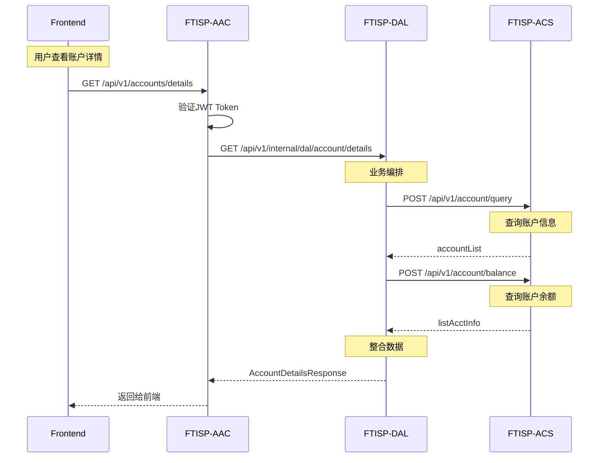

#### 5.5.2 ACS接口调用

**1. 查询账户信息**
```yaml
接口: POST /api/v1/account/query
请求体:
  header:
    sys_seq_no: string
    source_system: "FTISP-DAL"
    request_time: string
  body:
    user_id: string
    bank_code?: string      # 不传查所有
```

**2. 查询账户余额**
```yaml
接口: POST /api/v1/account/balance
请求体:
  header:
    sys_seq_no: string
    source_system: "FTISP-DAL"
    request_time: string
  body:
    user_id: string
    bank_code: string       # 必填
    ecif_no: string         # 必填
```

#### 5.5.3 数据整合逻辑

| ACS返回字段 | 前端显示字段 | 说明 |
|-------------|-------------|------|
| `account_no` | `accountNo` | 存款账号 |
| `account_type` | `accountType` | 账户类型 |
| `account_status` | `accountStatus` | 账户状态 |
| `account_status_desc` | `accountStatusDesc` | 状态描述 |
| `available_balance` | `availableBalance` | 可用余额 |
| `hold_amount` | `frozenBalance` | 冻结金额 |
| `current_running_bal` | `currentBalance` | 当前余额 |
| `currency_code` | `currency` | 币种 |

#### 5.5.4 错误处理

| 错误码 | 描述 | 处理 |
|--------|------|------|
| `ACCOUNT_NOT_FOUND` | 账户不存在 | 提示用户先开户 |
| `ACS_SERVICE_ERROR` | ACS服务异常 | 降级处理，显示缓存数据 |

### 5.6 转账接口

### 5.6 转账接口

**接口**: `POST /api/v1/transfers/execute`

**请求**:
```yaml
authentication: Bearer Token
requestBody:
  transferType: string     # MOBILE_MONEY/BANK_TRANSFER/INTERNAL
  amount: number           # 转账金额
  currency: string         # TZS
  transactionToken: string # 交易鉴权Token (PIN验证后获取)
  recipient: object        # 收款人信息
    name: string
    number: string         # 手机号/银行卡号/内部账号
    type: string
    provider: string       # MOBILE_MONEY时需要
    bank: string           # BANK_TRANSFER时需要
  remark: string           # 可选
```

**响应**:
```yaml
"200": 成功
  body:
    transferId: string
    status: string         # PENDING/COMPLETED
    amount: number
    fee: number
    totalAmount: number
    executedAt: string

"400": 参数错误
"401": 鉴权失败 (Token无效)
"402": 余额不足
```

### 5.7 转账预览接口 (费用计算)

**接口**: `POST /api/v1/transfers/preview`

**请求**:
```yaml
requestBody:
  amount: number
  transferType: string
  provider: string
```

**响应**:
```yaml
"200": 成功
  body:
    amount: number
    fee: number
    totalAmount: number
    currency: string
```

### 5.8 收款人反查接口 (内部转账)

**接口**: `GET /api/v1/transfers/recipient-name`

**请求**:
```yaml
queryParameters:
  identifier: string       # 手机号或账号
```

**响应**:
```yaml
"200": 成功
  body:
    name: string           # 掩码处理后的姓名 (e.g. "J*** D***")
    accountNo: string      # 对应的内部账号
```

### 5.9 取现预览接口 (算费)

**接口**: `POST /api/v1/withdrawals/preview`

**请求**:
```yaml
requestBody:
  amount: number
  withdrawalType: string   # WAKALA/MOBILE_MONEY
  provider: string         # 可选
```

**响应**:
```yaml
"200": 成功
  body:
    amount: number
    fee: number
    totalAmount: number
    currency: string
```

### 5.11 定期存款预览 (收益试算)

**接口**: `POST /api/v1/savings/preview-creation`

**请求**:
```yaml
requestBody:
  amount: number
  productId: string        # 产品编号 (e.g. "R2156002")
  duration: integer        # 月数 (e.g. 12)
```

**响应**:
```yaml
"200": 成功
  body:
    principal: number      # 本金
    interestRate: number   # 年利率
    grossInterest: number  # 税前利息
    tax: number            # 预扣税
    netInterest: number    # 税后利息
    maturityAmount: number # 到期总金额
    maturityDate: string   # 预计到期日
```

### 5.12 创建定期存款

**接口**: `POST /api/v1/savings/create`

**请求**:
```yaml
authentication: Bearer Token
requestBody:
  amount: number
  productId: string        # 产品编号
  autoRollover: boolean    # 是否自动续存
  transactionToken: string # 交易鉴权Token
```

**响应**:
```yaml
"200": 成功
  body:
    savingId: string       # 定期存单号
    accountNo: string      # 生成的定期账号
    status: string         # ACTIVE
    valueDate: string      # 起息日
    expiryDate: string     # 到期日
```

### 5.13 提前赎回预览 (罚息试算)

**接口**: `POST /api/v1/savings/preview-redemption`

**请求**:
```yaml
requestBody:
  savingId: string         # 定期存单号
```

**响应**:
```yaml
"200": 成功
  body:
    principal: number      # 本金
    grossInterest: number  # 已产生利息
    penalty: number        # 罚息 (e.g. 50% of interest)
    payoutAmount: number   # 实际到手金额 (本金 + 剩余利息)
```

### 5.14 执行提前赎回

**接口**: `POST /api/v1/savings/redeem`

**请求**:
```yaml
authentication: Bearer Token
requestBody:
  savingId: string         # 定期存单号
  transactionToken: string # 交易鉴权Token
```

**响应**:
```yaml
"200": 成功
  body:
    redemptionId: string
    status: string         # REDEEMED
    payoutAmount: number
    executedAt: string
```

---

## 6. 跨子系统数据流

### 6.1 数据流表

| 数据项 | 流向 | 说明 |
|--------|------|------|
| 定期存款请求 | Frontend → DAL → CTS | 产品查询+创建订单 |
| 赎回请求 | Frontend → DAL → CTS | 订单赎回 |
| **账户查询** | **Frontend → AAC → DAL → ACS** | **账户信息查询** |
| **余额查询** | **Frontend → AAC → DAL → ACS** | **账户余额查询** |
| 余额冻结 | CTS → ACS | 交易前置冻结 |
| 余额解冻 | CTS → ACS | 赎回后解冻 |
| 交易记录 | CTS → CTS | 流水持久化 |
| 交易状态 | CTS → CTS | 状态流转 |
| 授权记录 | Frontend → UAM | 协议签署记录 |

#### 6.1.1 账户查询详细数据流

```
Frontend → AAC → DAL → ACS

1. Frontend: GET /api/v1/accounts/details
   └─ Header: Authorization: Bearer {JWT}

2. AAC: 验证JWT，提取userId
   └─ 路由到: GET /api/v1/internal/dal/account/details

3. DAL: 业务转发
   ├─ 调用 ACS: POST /api/v1/account/query
   │  └─ 获取账户列表
   ├─ 调用 ACS: POST /api/v1/account/balance
   │  └─ 获取余额信息
   └─ 整合返回

4. ACS: 返回账户数据
   ├─ account_no: 存款账号
   ├─ account_type: 账户类型
   ├─ account_status: 账户状态
   └─ available_balance: 可用余额
```

### 6.2 事件发布

| 事件名称 | 发布者 | 订阅者 | 触发时机 |
|----------|--------|--------|----------|
| DepositCreated | CTS | MSG/BI/AUDIT | 定期存款创建成功 |
| DepositRedeemed | CTS | MSG/BI/AUDIT | 定期存款赎回成功 |
| DepositMatured | CTS | MSG/BI/AUDIT | 定期存款到期自动续存 |
| BalanceUpdated | ACS | BI/AUDIT | 余额变更 |
| TransactionInitiated | CTS | RCS/AUDIT | 交易启动 |
| TransactionCompleted | CTS | MSG/AUDIT | 交易完成 |
| RiskScoreCalculated | RCS | AUDIT/CTS | 风控评分完成 |
| SuspiciousActivityDetected | RCS | AUDIT/MSG | 检测到可疑活动 |

---

## 7. 前端代码映射

### 7.1 前端组件

| 组件 | 文件 | 说明 |
|------|------|------|
| 存款组合组件 | `savings-portfolio.component.ts` | Banking版块主组件 |
| 定期存款条款 | `fixed-deposit-terms.component.ts` | 定存条款展示 |
| 存款账户协议 | `savings-account-agreement.component.ts` | 存款账户协议展示 |

### 7.2 前端数据模型

```typescript
// 定期存款模型
interface TermDeposit {
  id: string;
  accountNo: string;
  planName: string;          // 如 "12 Months"
  amount: number;            // 本金(分)
  interestRate: number;      // 年利率(如0.115表示11.5%)
  duration: number;          // 期限(月)
  maturityDate: string;      // 到期日期
  maturityInstruction: 'Auto-Rollover' | 'Credit to Account';
  accruedEarnings: number;   // 累计收益
  status: 'ACTIVE' | 'MATURED' | 'REDEEMED';
  isSecurityDeposit: boolean; // 是否保证金存款
}

// 收益分析
interface EarningsBreakdown {
  savings: number;      // 存款收益
  investments: number;  // 投资收益
  wallet: number;        // 钱包收益(通常为0)
  total: number;         // 总收益
}

// 转账收款人
interface Recipient {
  name: string;
  number: string;
  type: 'MOBILE' | 'BANK' | 'INTERNAL';
  provider?: string;
  avatar?: string;
  initial: string;
}
```

### 7.3 用户状态

```typescript
// UserService中的存款相关计算
totalAssets(): number {
  return this.currentUser()?.walletBalance + this.totalSavingsPlansValue();
}

totalSavingsPlansValue(): number {
  return this.activeDeposits().reduce((sum, d) =>
    sum + d.amount + d.accruedEarnings, 0
  );
}

yesterdayEarnings(): number {
  return this.earningsBreakdown().total;
}
```

---

## 8. 数据表设计 (NEW - 新增表)

### 8.1 定期存款表 (t_term_deposits) - FTISP-CTS

> **必要性分析**: 存储定期存款核心数据，业务强依赖，无法从其他表推导

```mermaid
erDiagram
    t_term_deposits ||--o{ t_transactions : 流水
    t_term_deposits }o--|| t_account_balances : 关联
    t_term_deposits ||--o| t_accounts : 属于
```

| 字段名 | 类型 (TiDB) | 必填 | 索引 | 说明 | **必要性辩护** |
|--------|-------------|------|------|------|--------------|
| id | BIGINT AUTO_RANDOM | Y | PK | 主键 | TiDB分布式主键 |
| deposit_no | VARCHAR(32) | Y | UK | 定期存款号 | 业务主键，唯一标识 |
| account_no | VARCHAR(32) | Y | IDX | 账号 | 关联t_accounts |
| user_id | BIGINT | Y | IDX | 用户ID | 关联用户，查询用户存款 |
| platform_ecif_id | VARCHAR(32) | Y | - | 平台ECIF号 | 关联ECIF |
| principal_amount | BIGINT | Y | - | 本金金额(分) | 存款本金 |
| interest_rate | DECIMAL(10,6) | Y | - | 年利率 | 如0.115表示11.5% |
| duration_months | INT | Y | - | 期限(月) | 3/6/12/24 |
| maturity_instruction | VARCHAR(20) | Y | - | 到期指令 | AUTO_ROLLOVER/CREDIT_TO_ACCOUNT |
| maturity_date | DATETIME(3) | Y | - | 到期日期 | 计算到期日 |
| accrued_interest | BIGINT | Y | - | 累计利息(分) | 已产生但未支付的利息 |
| tax_withheld | BIGINT | Y | - | 预扣税额(分) | 已扣除的税金 |
| maturity_amount | BIGINT | Y | - | 到期金额(分) | 税后到期本息和 |
| redeem_amount | BIGINT | N | - | 赎回金额(分) | 实际赎回金额 |
| redeem_date | DATETIME(3) | N | - | 赎回日期 | 提前支取或到期赎回日期 |
| is_security_deposit | BOOLEAN | Y | IDX | 保证金标识 | 用于CreditBuilder额度 |
| status | VARCHAR(20) | Y | IDX | 状态 | ACTIVE/MATURED/REDEEMED |
| process_instance_id | VARCHAR(64) | Y | IDX | 流程实例ID | 幂等键 |
| version | BIGINT | Y | - | 乐观锁版本号 | 并发控制 |
| created_at | DATETIME(3) | Y | - | 创建时间 | 审计必需 |
| updated_at | DATETIME(3) | Y | - | 更新时间 | 审计必需 |

**TiDB DDL**:
```sql
CREATE TABLE t_term_deposits (
    id BIGINT AUTO_RANDOM PRIMARY KEY,
    deposit_no VARCHAR(32) NOT NULL UNIQUE COMMENT '定期存款号',
    account_no VARCHAR(32) NOT NULL COMMENT '账号',
    user_id BIGINT NOT NULL COMMENT '用户ID',
    platform_ecif_id VARCHAR(32) NOT NULL COMMENT '平台ECIF号',
    principal_amount BIGINT NOT NULL COMMENT '本金金额(分)',
    interest_rate DECIMAL(10,6) NOT NULL COMMENT '年利率',
    duration_months INT NOT NULL COMMENT '期限(月)',
    maturity_instruction VARCHAR(20) NOT NULL COMMENT '到期指令',
    maturity_date DATETIME(3) NOT NULL COMMENT '到期日期',
    accrued_interest BIGINT NOT NULL DEFAULT 0 COMMENT '累计利息(分)',
    tax_withheld BIGINT NOT NULL DEFAULT 0 COMMENT '预扣税额(分)',
    maturity_amount BIGINT NOT NULL COMMENT '到期金额(分)',
    redeem_amount BIGINT COMMENT '赎回金额(分)',
    redeem_date DATETIME(3) COMMENT '赎回日期',
    is_security_deposit BOOLEAN NOT NULL DEFAULT FALSE COMMENT '保证金标识',
    status VARCHAR(20) NOT NULL DEFAULT 'ACTIVE' COMMENT '状态',
    process_instance_id VARCHAR(64) NOT NULL COMMENT '流程实例ID',
    version BIGINT NOT NULL DEFAULT 0 COMMENT '乐观锁版本号',
    created_at DATETIME(3) NOT NULL DEFAULT CURRENT_TIMESTAMP(3) COMMENT '创建时间',
    updated_at DATETIME(3) NOT NULL DEFAULT CURRENT_TIMESTAMP(3) ON UPDATE CURRENT_TIMESTAMP(3) COMMENT '更新时间',

    INDEX idx_account_no (account_no),
    INDEX idx_user_id (user_id),
    INDEX idx_platform_ecif_id (platform_ecif_id),
    INDEX idx_status (status),
    INDEX idx_maturity_date (maturity_date COMMENT '到期日索引-用于定时任务扫描'),
    INDEX idx_is_security_deposit (is_security_deposit),
    INDEX idx_process_instance_id (process_instance_id),
    INDEX idx_user_status (user_id, status COMMENT '用户活跃存款查询复合索引'),
    INDEX idx_security_status (is_security_deposit, status COMMENT '保证金状态复合索引')
) ENGINE=InnoDB DEFAULT CHARSET=utf8mb4 COMMENT='定期存款表';
```

### 8.2 交易流水表 (t_transactions) - FTISP-CTS

> **必要性分析**: 统一记录所有交易流水，满足金融监管要求，作为业务交易凭证

| 字段名 | 类型 (TiDB) | 必填 | 索引 | 说明 | **必要性辩护** |
|--------|-------------|------|------|------|--------------|
| id | BIGINT AUTO_RANDOM | Y | PK | 主键 | TiDB分布式主键 |
| txn_no | VARCHAR(32) | Y | UK | 交易流水号 | 业务主键，唯一标识 |
| account_no | VARCHAR(32) | Y | IDX | 账号 | 关联t_accounts |
| user_id | BIGINT | Y | IDX | 用户ID | 关联用户，查询用户交易 |
| txn_type | VARCHAR(20) | Y | IDX | 交易类型 | CREDIT/DEBIT |
| category | VARCHAR(20) | Y | IDX | 交易分类 | WALLET/SAVINGS/TRANSFER/BILL/LOAN/REPAYMENT/FEE |
| title | VARCHAR(200) | Y | - | 交易标题 | 交易描述 |
| amount | BIGINT | Y | - | 交易金额(分) | 绝对值 |
| balance_after | BIGINT | Y | - | 交易后余额(分) | 用于流水校验 |
| status | VARCHAR(20) | Y | IDX | 交易状态 | PENDING/COMPLETED/FAILED |
| related_account_no | VARCHAR(32) | N | IDX | 关联账号 | 转账收款人等 |
| channel | VARCHAR(50) | N | - | 交易渠道 | MOBILE_MONEY/BANK_TRANSFER/WAKALA等 |
| ref_no | VARCHAR(50) | N | - | 参考号 | 外部交易号 |
| created_at | DATETIME(3) | Y | IDX | 交易时间 | 按时间查询 |

**TiDB DDL**:
```sql
CREATE TABLE t_transactions (
    id BIGINT AUTO_RANDOM PRIMARY KEY,
    txn_no VARCHAR(32) NOT NULL UNIQUE COMMENT '交易流水号',
    account_no VARCHAR(32) NOT NULL COMMENT '账号',
    user_id BIGINT NOT NULL COMMENT '用户ID',
    txn_type VARCHAR(20) NOT NULL COMMENT '交易类型',
    category VARCHAR(20) NOT NULL COMMENT '交易分类',
    title VARCHAR(200) NOT NULL COMMENT '交易标题',
    amount BIGINT NOT NULL COMMENT '交易金额(分)',
    balance_after BIGINT NOT NULL COMMENT '交易后余额(分)',
    status VARCHAR(20) NOT NULL DEFAULT 'PENDING' COMMENT '状态',
    related_account_no VARCHAR(32) COMMENT '关联账号',
    channel VARCHAR(50) COMMENT '交易渠道',
    ref_no VARCHAR(50) COMMENT '参考号',
    created_at DATETIME(3) NOT NULL DEFAULT CURRENT_TIMESTAMP(3) COMMENT '交易时间',

    INDEX idx_account_no (account_no),
    INDEX idx_user_id (user_id),
    INDEX idx_txn_type_category (txn_type, category),
    INDEX idx_status (status),
    INDEX idx_created_at (created_at),
    INDEX idx_user_created (user_id, created_at),
    INDEX idx_balance_after (balance_after COMMENT '余额校验索引')
) ENGINE=InnoDB DEFAULT CHARSET=utf8mb4 COMMENT='交易流水表';
```

### 8.3 收款人表 (t_recipients) - FTISP-CTS

> **必要性分析**: 存储常用收款人信息，提升用户体验

| 字段名 | 类型 (TiDB) | 必填 | 索引 | 说明 | **必要性辩护** |
|--------|-------------|------|------|------|--------------|
| id | BIGINT AUTO_RANDOM | Y | PK | 主键 | TiDB分布式主键 |
| user_id | BIGINT | Y | IDX | 用户ID | 每个用户独立的收款人列表 |
| recipient_type | VARCHAR(20) | Y | IDX | 收款人类型 | MOBILE/BANK/INTERNAL |
| name | VARCHAR(100) | Y | - | 收款人姓名 | 显示用 |
| number | VARCHAR(50) | Y | - | 收款人号码 | 手机号/银行卡号/内部账号 |
| provider | VARCHAR(50) | N | - | 提供商/银行 | M-Pesa/CRDB等 |
| avatar_url | VARCHAR(200) | N | - | 头像URL | 可选 |
| created_at | DATETIME(3) | Y | - | 创建时间 | 首次添加时间 |
| updated_at | DATETIME(3) | Y | - | 更新时间 | 最后使用时间 |

**TiDB DDL**:
```sql
CREATE TABLE t_recipients (
    id BIGINT AUTO_RANDOM PRIMARY KEY,
    user_id BIGINT NOT NULL COMMENT '用户ID',
    recipient_type VARCHAR(20) NOT NULL COMMENT '收款人类型',
    name VARCHAR(100) NOT NULL COMMENT '收款人姓名',
    number VARCHAR(50) NOT NULL COMMENT '收款人号码',
    provider VARCHAR(50) COMMENT '提供商/银行',
    avatar_url VARCHAR(200) COMMENT '头像URL',
    created_at DATETIME(3) NOT NULL DEFAULT CURRENT_TIMESTAMP(3) COMMENT '创建时间',
    updated_at DATETIME(3) NOT NULL DEFAULT CURRENT_TIMESTAMP(3) ON UPDATE CURRENT_TIMESTAMP(3) COMMENT '更新时间',

    INDEX idx_user_id (user_id),
    INDEX idx_recipient_type (recipient_type)
) ENGINE=InnoDB DEFAULT CHARSET=utf8mb4 COMMENT='收款人表';
```

### 8.4 取现码表 (t_withdrawal_codes) - FTISP-CTS

> **必要性分析**: 存储Wakala取现码，支持线下取现

| 字段名 | 类型 (TiDB) | 必填 | 索引 | 说明 | **必要性辩护** |
|--------|-------------|------|------|------|--------------|
| id | BIGINT AUTO_RANDOM | Y | PK | 主键 | TiDB分布式主键 |
| user_id | BIGINT | Y | IDX | 用户ID | 关联用户 |
| withdrawal_code | VARCHAR(6) | Y | UK | 取现码 | 6位数字，唯一标识 |
| amount | BIGINT | Y | - | 取现金额(分) | 取现金额 |
| withdrawal_type | VARCHAR(20) | Y | - | 取现类型 | WAKALA/MOBILE_MONEY |
| status | VARCHAR(20) | Y | IDX | 状态 | PENDING/USED/EXPIRED |
| valid_until | DATETIME(3) | Y | IDX | 有效期 | 通常30分钟 |
| used_at | DATETIME(3) | N | - | 使用时间 | 核销时间 |
| agent_id | VARCHAR(50) | N | - | 代理ID | Wakala代理标识 |
| created_at | DATETIME(3) | Y | - | 创建时间 | 生成时间 |

**TiDB DDL**:
```sql
CREATE TABLE t_withdrawal_codes (
    id BIGINT AUTO_RANDOM PRIMARY KEY,
    user_id BIGINT NOT NULL COMMENT '用户ID',
    withdrawal_code VARCHAR(6) NOT NULL UNIQUE COMMENT '取现码',
    amount BIGINT NOT NULL COMMENT '取现金额(分)',
    withdrawal_type VARCHAR(20) NOT NULL COMMENT '取现类型',
    status VARCHAR(20) NOT NULL DEFAULT 'PENDING' COMMENT '状态',
    valid_until DATETIME(3) NOT NULL COMMENT '有效期',
    used_at DATETIME(3) COMMENT '使用时间',
    agent_id VARCHAR(50) COMMENT '代理ID',
    created_at DATETIME(3) NOT NULL DEFAULT CURRENT_TIMESTAMP(3) COMMENT '创建时间',

    INDEX idx_user_id (user_id),
    INDEX idx_withdrawal_code (withdrawal_code),
    INDEX idx_status_valid (status, valid_until)
) ENGINE=InnoDB DEFAULT CHARSET=utf8mb4 COMMENT='取现码表';
```

### 8.5 余额表扩展 (t_account_balances) - FTISP-ACS

> **已有表扩展**: 为支持并发控制，新增version字段

| 字段名 | 类型 (TiDB) | 必填 | 索引 | 说明 | **必要性辩护** |
|--------|-------------|------|------|------|--------------|
| account_no | VARCHAR(32) | Y | PK | 账号 | 主键 |
| available_balance | BIGINT | Y | - | 可用余额(分) | 可用于交易 |
| frozen_balance | BIGINT | Y | - | 冻结余额(分) | 定期存款等占用 |
| version | BIGINT | Y | - | 乐观锁版本号 | **并发控制** |

**并发控制机制**:
```sql
-- 乐观锁更新模式
UPDATE t_account_balances
SET available_balance = available_balance - ?,
    frozen_balance = frozen_balance + ?,
    version = version + 1,
    updated_at = NOW()
WHERE account_no = ?
  AND version = ?;  -- 版本号校验

-- 检查影响行数，=0表示并发冲突
```

---

## 9. 业务规则汇总

### 9.1 定期存款规则

| 规则ID | 规则描述 | 计算逻辑 |
|--------|----------|----------|
| **BR-SV-027** | 利息计算(单利) | 日利息 = 本金 × 年利率 / 365 |
| **BR-SV-028** | 税率计算 | 税额 = 利息 × 10% |
| **BR-SV-029** | 到期金额 | 到期金额 = 本金 + (利息 - 税额) |
| **BR-SV-030** | 提前支取罚息 | 罚息 = 累计利息 × 50% |
| **BR-SV-031** | 到期自动续存 | maturityInstruction=默认AUTO_ROLLOVER |
| **BR-SV-032** | 保证金赎回限制 | 有未结清贷款时禁止赎回 |
| **BR-SV-033** | 到期指令修改限制 | 距离到期日>1天才可修改 |
| **BR-SV-034** | 到期续存利率 | 使用续存当日市场利率 |
| **BR-SV-035** | 罚息不罚本金 | 本金全额返还，仅扣除50%利息 |

### 9.2 交易限额规则

根据KYC模块的Tier限制：

| Tier | 最大余额 | 每日交易限额 |
|-------|----------|--------------|
| Tier 1 (Basic) | 500,000 TZS | 200,000 TZS |
| Tier 2 (Intermediate) | 5,000,000 TZS | 2,000,000 TZS |
| Tier 3 (Full) | 10,000,000 TZS | 5,000,000 TZS |

### 9.3 账户规则

| 规则ID | 规则描述 | 例外处理 |
|--------|----------|----------|
| **BR-SV-036** | 余额充足校验 | availableBalance >= 交易金额 + 手续费 |
| **BR-SV-037** | 冻结金额优先使用 | 保证金赎回时优先解冻保证金 |
| **BR-SV-038** | Paybill号固定 | 888777 |
| **BR-SV-039** | 本行转账免费 | 手续费=0 |
| **BR-SV-040** | PIN错误锁定 | 5次错误锁定30分钟 |
| **BR-SV-041** | 并发更新冲突 | 乐观锁version冲突时最多重试3次 |
| **BR-SV-042** | 幂等性窗口 | 5分钟内相同processInstanceId视为重复 |

### 9.4 风控规则

| 规则ID | 规则描述 | 触发阈值 | 处理动作 |
|--------|----------|---------|---------|
| **BR-RC-001** | 大额充值监控 | 单笔≥500K TZS | 延迟入账+复核 |
| **BR-RC-002** | 高频交易检测 | 10分钟内>5笔 | 临时冻结 |
| **BR-RC-003** | 快进快出风险 | 充值后立即转出 | 可疑标记 |
| **BR-RC-004** | 异常取现检测 | 单日>3次大额取现 | 电话确认 |
| **BR-RC-005** | 整数转账监控 | 多笔整数金额 | 洗钱风险标记 |

---

## 10. 异常场景处理

| 场景 | HTTP状态 | 错误码 | 前端处理 |
|------|----------|--------|----------|
| 余额不足 | 400 | INSUFFICIENT_BALANCE | 提示余额不足，显示可用金额 |
| 账户不存在 | 404 | ACCOUNT_NOT_FOUND | 提示账户不存在 |
| 赎回被阻止 | 403 | REDEEM_BLOCKED | 提示需先还清贷款 |
| 取现码过期 | 400 | CODE_EXPIRED | 提示取现码已过期，请重新生成 |
| 取现码已使用 | 400 | CODE_ALREADY_USED | 提示取现码已使用 |
| 交易失败 | 500 | TRANSACTION_FAILED | 提示交易失败，稍后重试 |
| 超过限额 | 400 | LIMIT_EXCEEDED | 提示超过每日限额 |
| 产品不存在 | 404 | PRODUCT_NOT_FOUND | 提示产品配置不存在 |

---

## 11. 安全检查点

### 11.1 接口幂等性设计

所有写操作必须支持幂等性，防止重复提交:

| 接口 | 幂等键 | 实现方式 |
|------|--------|---------|
| 创建定期存款 | processInstanceId | 客户端生成UUID，服务端校验唯一性 |
| 赎回定期存款 | depositId + userId | 同一存款只能赎回一次 |
| 转账 | transferKey | 客户端生成UUID，5分钟内相同请求拒绝 |
| 取现码生成 | userId + timestamp | 相同用户30秒内只能生成一次 |

**幂等性实现模式**:

```java
// 创建定期存款幂等性检查
@Transactional
public CreateDepositResult createDeposit(CreateDepositRequest request) {
    // 1. 检查幂等键
    TermDeposit existing = termDepositRepository
        .findByProcessInstanceId(request.getProcessInstanceId());
    if (existing != null) {
        // 已处理，直接返回原有结果
        return CreateDepositResult.from(existing);
    }

    // 2. 执行业务逻辑
    TermDeposit deposit = executeDepositCreation(request);

    // 3. 返回结果
    return CreateDepositResult.from(deposit);
}
```

### 11.2 并发控制机制

| 场景 | 控制机制 | 实现方式 |
|------|---------|---------|
| 余额更新 | 乐观锁 | version字段，UPDATE时校验版本号 |
| 定期存款赎回 | 状态机锁 | 状态流转原子性，ACTIVE→MATURED |
| 取现码核销 | 唯一约束 | withdrawal_code唯一索引 + 状态检查 |
| 同一用户并发请求 | 分布式锁 | Redis锁 userId:operation |

**并发控制伪代码**:

```java
// 乐观锁余额扣减
@Transactional
public void deductBalance(String accountNo, Long amount) {
    int attempts = 0;
    final int MAX_ATTEMPTS = 3;

    while (attempts < MAX_ATTEMPTS) {
        AccountBalance balance = balanceRepository.findByAccountNo(accountNo);

        if (balance.getAvailableBalance() < amount) {
            throw new InsufficientBalanceException();
        }

        int updated = balanceRepository.deductWithVersion(
            accountNo, amount, balance.getVersion());

        if (updated > 0) {
            return; // 成功
        }

        // 版本冲突，重试
        attempts++;
    }

    throw new ConcurrentUpdateException("余额更新冲突，请重试");
}
```

### 11.3 数据安全

| 检查项 | 实现方式 |
|--------|----------|
| PIN验证 | 所有交易需PIN验证 |
| 幂等性 | processInstanceId防重 |
| 交易原子性 | 余额冻结+交易记录+余额更新在同一事务 |
| 敏感信息脱敏 | 日志中不记录完整账号、手机号 |
| 签名校验 | 第三方回调需验证HMAC签名 |
| 时间窗口验证 | 关键操作5分钟内有效 |
| 防重放攻击 | 请求时间戳 + nonce校验 |

**关键操作安全检查清单**:

| 操作 | 安全检查 | 失败处理 |
|------|---------|---------|
| 创建定期存款 | 1. PIN验证<br/>2. 余额校验<br/>3. 幂等键检查<br/>4. 风控评分 | 返回具体错误码 |
| 赎回定期存款 | 1. PIN验证<br/>2. 保证金赎回限制检查<br/>3. 状态校验<br/>4. 幂等性检查 | 阻止赎回并说明原因 |
| 转账 | 1. PIN验证<br/>2. 余额校验<br/>3. 收款人验证<br/>4. 风控规则<br/>5. 5分钟防重 | 交易拒绝 |
| 取现 | 1. PIN验证<br/>2. 余额校验<br/>3. 限额检查<br/>4. 频率限制 | 取现失败 |

### 11.4 防欺诈

| 风险点 | 防控措施 |
|--------|----------|
| 恶意充值 | 充值回调需要HMAC签名验证 + IP白名单 |
| 重复交易 | 5分钟内相同交易禁止 + 客户端幂等键 |
| 取现码盗用 | 单次使用+有效期30分钟 + 使用后立即失效 |
| 金额篡改 | 前端显示金额+后端二次校验，不信任客户端 |
| 中间人攻击 | 全链路HTTPS + 请求签名验证 |
| 暴力PIN尝试 | PIN错误5次锁定账户30分钟 |
| 机器批量注册 | 设备指纹 + 行为分析 + CAPTCHA |
| 洗钱风险 | 大额整数金额交易标记 + 可疑交易报告 |

**风控规则详情**:

| 规则ID | 规则描述 | 阈值 | 触发动作 |
|--------|----------|------|---------|
| **FR-001** | 单笔大额充值 | ≥500,000 TZS | 延迟入账，人工复核 |
| **FR-002** | 短时高频交易 | 10分钟内>5笔 | 临时冻结，需验证 |
| **FR-003** | 异常取现行为 | 单日>3次大额取现 | 限制取现，电话确认 |
| **FR-004** | 快进快出模式 | 充值后立即转账 | 可疑标记，限制账户 |
| **FR-005** | 多设备登录 | 同一天不同地区登录 | 强制重新登录 |
| **FR-006** | 整数金额转账 | 多笔整数金额转账 | 洗钱风险标记 |

---

## 12. 与其他模块差异对比

| 项目 | KYC模块 | 登录模块 | **存款模块** | 说明 |
|------|---------|----------|-------------|------|
| **PIN用途** | 注册时设置 | 登录验证 | **交易验证** | 存款模块PIN用于交易授权 |
| **子系统** | KYC/UAM/MSG | AAC/UAM | **DAL/ACS/BAL/PE/PSS/CTS/TXLOG** | 存款涉及更多子系统 |
| **数据表** | t_users/t_kyc_documents | t_user_sessions | **t_term_deposits/t_transactions** | 存款新增定期存款和交易表 |
| **交易性** | 无 | 无 | **有** | 所有操作都是交易 |
| **金额处理** | 无 | 无 | **有** | 涉及金额计算和利息 |

---

## 13. 协议签署节点

根据PRD第5节和前端组件，存款模块涉及以下协议签署：

| 流程节点 | 签署方式 | 涉及协议 | 核心条款 |
|----------|----------|----------|----------|
| 开通现金账户 | Clickwrap | 《储蓄账户协议》 | 利率规则、KYC限额、AML声明 |
| 定期存款创建 | Clickwrap | 《Fixed Deposit T&Cs》 | 到期指令、提期支取罚息、利率锁定、预扣税 |

### 协议条款详情

**《Fixed Deposit T&Cs》关键条款**:
1. **Maturity Instruction (到期指令)**:
   - Auto-Rollover: 连本带息自动续存
   - Credit to Account: 本息回到现金账户

2. **Premature Withdrawal Penalty (提前支取罚金)**:
   - 罚息 = 累计利息 × 50%
   - 本金不受影响

3. **Interest Rate Fixing (利率锁定)**:
   - 存款当日利率锁定，不受后续市场波动影响

4. **Withholding Tax Declaration (预扣税声明)**:
   - 根据坦桑尼亚税法，扣除10%预扣税
   - 到期金额显示税后金额

**《储蓄账户协议》关键条款**:
1. **Interest Rate Rules (利率规则)**:
   - 基于APR计算，日计息，月度付息

2. **KYC Account Tiers & Limits (账户层级与限额)**:
   - Tier 1: 余额50万TZS，日交易20万TZS
   - Tier 2: 余额500万TZS，日交易200万TZS
   - Tier 3: 余额1000万TZS，日交易500万TZS

3. **Anti-Money Laundering (AML声明)**:
   - 资金来源合法性声明
   - 可疑活动报告权

---

*本文档使用 MODULE_ANALYSIS_METHODOLOGY V1.0 方法论生成，基于PRD 4.3节、前端代码、ACS/ECIF系统设计和flowpicture流程图。*

---

## 附录A: V1.1 版本更新详情

### 新增内容

1. **SV-10 活跃定期存款管理功能**
   - 新增功能点SV-10
   - 详细的管理流程设计
   - 到期指令修改规则
   - 到期自动续存流程

2. **空状态用户旅程设计**
   - 完整的空状态处理流程
   - 三种空状态场景引导
   - 新客引导交互设计

3. **数据库索引优化**
   - 新增idx_maturity_date索引（支持到期日扫描）
   - 新增idx_user_status复合索引（优化用户查询）
   - 新增idx_security_status复合索引（保证金查询）
   - 新增idx_balance_after索引（交易余额校验）
   - 新增version字段（乐观锁并发控制）

4. **利息计算公式修正**
   - 明确采用单利计算（非复利）
   - 日利息 = 本金 × 年利率 / 365
   - 总利息 = 本金 × 年利率 × (期限月数 / 12)

5. **风控集成说明**
   - 新增FTISP-RCS风控系统
   - 新增FTISP-AUDIT审计系统
   - 6个风控检查点定义
   - 风控规则引擎集成流程

6. **接口幂等性和并发控制**
   - 4类接口幂等性设计
   - 乐观锁余额扣减机制
   - 分布式锁并发控制

7. **安全检查点完善**
   - 7项安全检查清单
   - 6类防欺诈规则
   - 关键操作安全检查表
